# AI Solution Architecture — Applied

> Topic package — Week 19b · Roadmap Week 19b — AI Solution Architecture · Applied.
> Depth goal: perform the practical FDE architecture workflow for enterprise AI: clarify an ambiguous business ask, map current and future state, design a C4 container-level RAG architecture, defend decisions with ADRs, estimate capacity and cost, name failure modes, and hand off implementation-ready artifacts.

## Source
- Track: AI Architecture (self-directed, FDE roadmap)
- Slide deck: `07 Resources Library/AI Architecture/Slides/Lesson_02_AI_Solution_Architecture_—_Applied.pptx`
- Hands-on notebook: `07 Resources Library/AI Architecture/Notebooks/02_AI_Solution_Architecture_—_Applied.ipynb` (runs offline)
- Reference reading: C4 Model for Software Architecture; Architecture Decision Records by Michael Nygard; Azure OpenAI Service docs and pricing pages; Azure Postgres pgvector docs; Azure AI Search docs; Azure App Insights and OpenTelemetry docs; Azure AD and Key Vault docs; NIST AI Risk Management Framework; OWASP Top 10 for LLM Applications; Enterprise RAG evaluation references
- Builds on: [[02 Literature Notes/AI Architecture/AI Solution Architecture — Reference Patterns]]
- Date: 2026-07-18

---

## 1. Mental Model

**Applied AI solution architecture is the act of converting ambiguity into a defensible delivery artifact.** Week 19a gives the catalog: RAG, agents, guardrails, evals, vector stores, observability, and deployment patterns. Week 19b is the customer-facing job: ask enough discovery questions to make the problem real, draw current state, design future state, defend choices, do the arithmetic, and make risks explicit.

Worked scenario: a mid-sized insurance company wants an AI assistant inside the existing underwriter web app. It must answer policy and precedent questions from 40,000 internal policy documents, 15 years of underwriting memos, and 3 external regulatory feeds. It must be auditable and avoid data leakage to third parties. The FDE deliverable is not "we will use RAG"; it is a one-page architecture with C4 containers, ADRs, capacity math, failure-mode mitigations, and a hand-off checklist that engineering, security, and the director of underwriting can all react to.

> Key intuition: **architecture is the bridge between discovery and delivery** — the drawing is useful only when it encodes decisions, constraints, numbers, risks, and ownership.

```mermaid
C4Container
    title Future-state RAG assistant for insurance underwriting
    Person(uw, "Underwriter", "Asks policy, memo, and regulatory questions in the existing web app")
    System_Boundary(ins, "Insurance enterprise Azure tenant") {
      Container(web, "Underwriter Web App", "Existing web app", "Embedded AI panel, citations, feedback, human-review submission")
      Container(api, "AI Assistant API", "FastAPI or .NET API", "AuthZ, orchestration, prompt assembly, streaming response, rate limits")
      Container(reg, "Prompt Registry", "Git-backed config", "Versioned system prompts, response schema, few-shot examples")
      Container(guard, "Guardrails Service", "Policy code", "PII redaction, groundedness threshold, refusal rules, content-filter decisions")
      ContainerDb(pg, "Azure Postgres + pgvector", "Postgres", "Document chunks, embeddings, metadata filters, retrieval audit ids")
      Container(cache, "Prompt and Response Cache", "Redis", "Approved answer cache and semantic prompt fingerprints")
      Container(queue, "Human Review Queue", "Service Bus + workflow", "Low-confidence or regulated answers routed to SMEs")
      ContainerDb(audit, "Audit Log", "Blob Storage", "Prompt, retrieved chunk ids, answer, user, model, policy decision, trace id")
      Container(obs, "App Insights", "OpenTelemetry", "Latency, errors, cost, retrieval quality, safety metrics")
      Container(kv, "Key Vault", "Azure", "Model keys, DB credentials, signing secrets")
      Container_Ext(aoai, "Azure OpenAI GPT-4o", "Managed model endpoint", "Grounded answer generation with content filter")
      Container_Ext(aad, "Azure AD", "SSO", "User identity, groups, conditional access")
      Container_Ext(pa, "Policy Admin", "Internal system", "Policy metadata and effective dates")
      Container_Ext(claims, "Claims System", "Internal system", "Precedent and claims references")
      Container_Ext(docs, "Document Store", "SharePoint or DMS", "Source PDFs, memos, regulatory feed snapshots")
    }
    Rel(uw, web, "asks question")
    Rel(web, aad, "SSO")
    Rel(web, api, "HTTPS with user token")
    Rel(api, reg, "loads prompt version")
    Rel(api, pg, "hybrid metadata plus vector retrieval")
    Rel(api, cache, "checks approved answer cache")
    Rel(api, guard, "pre and post generation policy checks")
    Rel(api, aoai, "private endpoint model call")
    Rel(api, queue, "escalates uncertain answers")
    Rel(api, audit, "writes immutable audit event")
    Rel(api, obs, "emits traces and metrics")
    Rel(api, kv, "reads secrets")
    Rel(pg, docs, "ingested chunks and citations")
    Rel(api, pa, "policy API lookup")
    Rel(api, claims, "precedent metadata lookup")
```



---

## 2. How It Actually Works

### 19b.1 From vague ask to clarified problem
The initial request sounds simple: "put an AI assistant in the underwriter app." An FDE first converts that into a constrained problem statement. Who uses it: 50 commercial underwriters, senior reviewers, and compliance auditors. Where it lives: an embedded panel in the existing web app, not a separate chatbot. What it answers: policy wording, underwriting precedent, effective-date interpretation, and regulatory summaries. What it must not do: bind coverage, approve exceptions, or reveal one customer's documents to another business unit.

Discovery questions before drawing anything: What are the top 20 question types? Which workflow step is slow today? What is the current source of truth for policy docs, memos, regulatory feeds, and claims precedents? Are memos privileged, customer-specific, or region-restricted? What evidence must appear next to an answer? What is the success metric: handle-time reduction, fewer escalations, faster new-underwriter onboarding, or audit completeness? What is the security constraint: no third-party data leakage, Azure-only processing, private networking, customer-managed keys, retention limits, or all of the above? What blocks launch: missing document metadata, unclear policy ownership, legal signoff, or no evaluation set? This is Week 23 discovery work expressed as architecture inputs.

### 19b.2 Current-state versus future-state workflow
Current state: an underwriter reads the submission, searches the document store, checks Policy Admin for effective dates, looks through old underwriting memos, asks a senior underwriter in chat, and sometimes opens a claims precedent system. Evidence is scattered; audit depends on copy-pasted notes. The pain is not only search latency; it is uncertainty about whether the answer came from the right policy version and whether the precedent is still valid.

Future state overlays AI without removing human accountability. The underwriter asks the embedded assistant a question in context of the quote. The app sends the user token, business unit, jurisdiction, product, and policy effective date to the AI Assistant API. Retrieval filters chunks by entitlement, document type, effective date, and jurisdiction, then ranks candidate policy sections, memos, and regulatory updates. GPT-4o drafts an answer with citations. Guardrails refuse low-groundedness or high-risk questions and route them to a human review queue. The human stays responsible for binding decisions; the AI accelerates evidence gathering, summarization, and audit note creation.

### 19b.3 The one-page future-state architecture
The one-pager uses a C4 Container view because directors need system boundaries and engineers need deployable components. Containers: existing Underwriter Web App, AI Assistant API, Prompt Registry, Guardrails Service, Azure Postgres with pgvector, Redis prompt and response cache, Service Bus-backed human review queue, Blob Storage audit log, App Insights via OpenTelemetry, Azure AD, Key Vault, Azure OpenAI GPT-4o, Policy Admin, Claims, and Document Store.

RAG path: authenticate with Azure AD, authorize by group and document entitlements, retrieve top chunks from pgvector with metadata filters, assemble a versioned prompt from the registry, call Azure OpenAI through a private endpoint with content filter enabled, validate answer structure, write prompt plus retrieved chunk ids plus answer plus model version to immutable audit storage, and return answer with citations. Ingestion path: pull documents from the DMS and regulatory feeds, chunk by policy section and memo boundary, embed, store metadata and vectors in Postgres, run eval gates on a canary corpus before promoting a new index. Observability path: every request has a trace id across auth, retrieval, prompt assembly, model call, guardrail, audit, and response.

### 19b.4 ADRs that defend the design
ADR-001 RAG versus fine-tune versus both. Context: source documents change weekly and answers require citations. Decision: start with RAG, not fine-tuning. Consequences: easier updates, auditable citations, but retrieval quality becomes critical. Alternatives rejected: fine-tune only because it cannot reliably cite current policy; RAG plus fine-tune now because there is not enough labeled data to justify training.

ADR-002 Azure OpenAI versus Bedrock versus Vertex. Context: the customer is already on Azure, requires no data leakage to third parties, uses Azure AD, Key Vault, App Insights, and private networking. Decision: Azure OpenAI GPT-4o with content filtering and private endpoints. Consequences: simplest security review and identity integration; less provider portability. Alternatives rejected: Bedrock and Vertex for phase one because they add cross-cloud governance and networking work.

ADR-003 pgvector versus Pinecone. Context: the company already operates Azure Postgres and the corpus is modest: about 400,000 chunks and a few GB of raw vector data. Decision: Azure Postgres with pgvector. Consequences: lower cost, data residency inside existing Postgres controls, simpler backup; may need re-evaluation if recall latency or index size grows. Alternatives rejected: Pinecone for phase one because managed vector specialization is not yet worth a new vendor and data boundary.

ADR-004 Hexagonal LLM provider port. Context: leadership wants an Azure-first launch but does not want model lock-in forever. Decision: the AI Assistant API calls an internal `LLMProvider` port implemented by Azure OpenAI today. Consequences: provider-specific features are isolated; tests can run offline with a fake provider; future Bedrock or Vertex adapters are possible. Alternative rejected: direct SDK calls throughout the codebase.

ADR-005 Synchronous streaming versus batch response. Context: underwriters expect an in-app answer in seconds, and long waits reduce trust. Decision: synchronous request with streamed answer tokens, bounded by a 12-second timeout; ingestion and re-indexing are asynchronous. Consequences: better perceived latency, but API workers need timeouts, cancellation, and backpressure. Alternatives rejected: fully async job for every question because it breaks the workflow; non-streaming sync because a slow first answer feels broken.

### 19b.5 Capacity math, failure modes, and hand-off
Baseline traffic: 50 underwriters times 40 questions per day is 2,000 questions per business day. At 1,500 prompt tokens and 800 completion tokens per answer, that is about 3.0M prompt tokens and 1.6M completion tokens per day. Using illustrative GPT-4o prices of $2.50 per 1M input tokens and $10.00 per 1M output tokens, daily generation cost is about $23.50 and a 22-day month is about $517 before embeddings, caching, evals, and non-prod. At 500 users, the same usage is about $5,170 per month, so rate limits, caching, and budget alerts are not optional.

Embedding storage: 40,000 documents times about 10 chunks each is 400,000 chunks. With 1,536 dimensions times 4 bytes, raw vectors are about 2.46 GB before index and metadata overhead. Budget roughly 2x to 4x in Postgres for index, metadata, and bloat. Latency budget for p99 8 seconds: auth 100 ms, retrieval and rerank 700 ms, prompt assembly 100 ms, model first token 2,000 ms, streaming completion 4,500 ms, guardrails and audit 400 ms, network and app overhead 200 ms.

Failure-mode table in prose: provider outage means cached-answers mode and human-review fallback; hallucination means refuse when evidence is weak and escalate; retrieval regression means canary eval gate before index promotion; PII leak means entitlement filters, private endpoints, redaction, and audit; cost blowup means per-user rate limits, quotas, cache, and budget alerts; stale regulatory feed means source freshness checks and visible answer timestamps. Hand-off artifact list: one-page architecture diagram, ADR bundle, capacity spreadsheet, risk register, evaluation plan, prompt registry seed, runbook, backlog, and launch-readiness checklist.

---

## 3. Implementation

Assumed stack: Python stdlib plus Pydantic v2. Snippets are offline tools an FDE can reuse while shaping a customer architecture.
- [[04 Code Snippets/AI Architecture/AI Week 19b One Page Architecture Generator]]
- [[04 Code Snippets/AI Architecture/AI Week 19b Capacity and Cost Estimator]]

### AI Week 19b One Page Architecture Generator
Pydantic v2 model tree for an enterprise AI architecture, rendering a Markdown one-pager and Mermaid C4 Container diagram for the insurance-underwriter scenario.
```python
from pydantic import BaseModel, Field

class Container(BaseModel):
    name: str
    kind: str
    technology: str
    responsibility: str

class Integration(BaseModel):
    source: str
    target: str
    description: str

class ADR(BaseModel):
    title: str
    context: str
    decision: str
    consequences: str
    alternatives_rejected: list[str]

class Risk(BaseModel):
    failure_mode: str
    mitigation: str

class Capacity(BaseModel):
    users: int
    questions_per_user_day: int
    prompt_tokens: int
    response_tokens: int
    vector_storage_gb: float
    monthly_llm_cost_usd: float

class Architecture(BaseModel):
    title: str
    context: str
    containers: list[Container] = Field(default_factory=list)
    integrations: list[Integration] = Field(default_factory=list)
    adrs: list[ADR] = Field(default_factory=list)
    risks: list[Risk] = Field(default_factory=list)
    capacity: Capacity


def render_mermaid(arch: Architecture) -> str:
    aliases = {c.name: f"c{i}" for i, c in enumerate(arch.containers, 1)}
    lines = ["C4Container", f"    title {arch.title}", "    Person(u, \"Underwriter\", \"Uses embedded AI panel\")", "    System_Boundary(s, \"Insurance Azure tenant\") {"]
    for c in arch.containers:
        lines.append(f"      Container({aliases[c.name]}, \"{c.name}\", \"{c.technology}\", \"{c.responsibility}\")")
    lines.append("    }")
    lines.append(f"    Rel(u, {aliases['Underwriter Web App']}, \"asks question\")")
    for integ in arch.integrations:
        if integ.source in aliases and integ.target in aliases:
            lines.append(f"    Rel({aliases[integ.source]}, {aliases[integ.target]}, \"{integ.description}\")")
    return "\n".join(lines)


def render_one_pager(arch: Architecture) -> str:
    out = [f"# {arch.title}", "", "## Context", arch.context, "", "## Containers"]
    for c in arch.containers:
        out.append(f"- **{c.name}** ({c.technology}): {c.responsibility}")
    out += ["", "## Mermaid", "```mermaid", render_mermaid(arch), "```", "", "## ADRs"]
    for adr in arch.adrs:
        out.append(f"- **{adr.title}**: {adr.decision} Consequences: {adr.consequences}")
    out += ["", "## Risks"]
    for r in arch.risks:
        out.append(f"- **{r.failure_mode}** -> {r.mitigation}")
    cap = arch.capacity
    out += ["", "## Capacity", f"{cap.users} users x {cap.questions_per_user_day} questions/day, {cap.prompt_tokens}+{cap.response_tokens} tokens/query, vector storage about {cap.vector_storage_gb:.2f} GB, monthly LLM cost about ${cap.monthly_llm_cost_usd:,.0f}."]
    return "\n".join(out)

arch = Architecture(
    title="Insurance Underwriting RAG Assistant",
    context="Assistant embedded in the underwriter web app answers policy, memo, and regulatory questions with citations, auditability, and Azure-only data handling.",
    containers=[
        Container(name="Underwriter Web App", kind="web", technology="Existing app", responsibility="Embedded AI panel and feedback"),
        Container(name="AI Assistant API", kind="api", technology="FastAPI", responsibility="AuthZ, retrieval, prompt assembly, streaming"),
        Container(name="Prompt Registry", kind="config", technology="Git", responsibility="Versioned prompts and schemas"),
        Container(name="Azure Postgres pgvector", kind="db", technology="Postgres", responsibility="Chunks, embeddings, metadata filters"),
        Container(name="Azure OpenAI GPT-4o", kind="model", technology="Azure OpenAI", responsibility="Grounded answer generation"),
        Container(name="Audit Log", kind="storage", technology="Blob Storage", responsibility="Immutable prompt, chunks, answer, trace id"),
    ],
    integrations=[
        Integration(source="Underwriter Web App", target="AI Assistant API", description="HTTPS question with user token"),
        Integration(source="AI Assistant API", target="Prompt Registry", description="load prompt version"),
        Integration(source="AI Assistant API", target="Azure Postgres pgvector", description="retrieve cited chunks"),
        Integration(source="AI Assistant API", target="Azure OpenAI GPT-4o", description="generate answer"),
        Integration(source="AI Assistant API", target="Audit Log", description="write audit event"),
    ],
    adrs=[ADR(title="Use RAG first", context="Documents change weekly", decision="RAG with citations before fine-tuning", consequences="Fresh and auditable; retrieval quality matters", alternatives_rejected=["fine-tune only"])],
    risks=[Risk(failure_mode="Provider outage", mitigation="Cached answers and human review fallback"), Risk(failure_mode="Low groundedness", mitigation="Refuse and escalate")],
    capacity=Capacity(users=50, questions_per_user_day=40, prompt_tokens=1500, response_tokens=800, vector_storage_gb=2.46, monthly_llm_cost_usd=517),
)
print(render_one_pager(arch))
```

### AI Week 19b Capacity and Cost Estimator
Deterministic calculator for tokens, monthly model cost, embedding storage, one-time embedding cost, per-query cost, and p99 latency breakdown.
```python
from dataclasses import dataclass

@dataclass(frozen=True)
class Workload:
    users: int
    queries_per_user_day: int
    avg_prompt_tokens: int
    avg_response_tokens: int
    prompt_price_per_1k: float
    completion_price_per_1k: float
    embedding_price_per_1k: float
    chunks_per_doc: int
    docs: int
    dims: int
    avg_chunk_tokens: int = 800
    business_days_per_month: int = 22


def estimate(w: Workload) -> dict:
    queries_day = w.users * w.queries_per_user_day
    queries_month = queries_day * w.business_days_per_month
    prompt_month = queries_month * w.avg_prompt_tokens
    completion_month = queries_month * w.avg_response_tokens
    prompt_cost = prompt_month / 1000 * w.prompt_price_per_1k
    completion_cost = completion_month / 1000 * w.completion_price_per_1k
    chunks = w.docs * w.chunks_per_doc
    vector_gb = chunks * w.dims * 4 / 1_000_000_000
    embedding_tokens = chunks * w.avg_chunk_tokens
    embedding_cost = embedding_tokens / 1000 * w.embedding_price_per_1k
    per_query_cost = (w.avg_prompt_tokens / 1000 * w.prompt_price_per_1k) + (w.avg_response_tokens / 1000 * w.completion_price_per_1k)
    latency_ms = {
        "auth": 100,
        "retrieval_rerank": 700,
        "prompt_assembly": 100,
        "model_first_token": 2000,
        "stream_completion": 4500,
        "guardrails_audit": 400,
        "network_app": 200,
    }
    return {
        "queries_day": queries_day,
        "queries_month": queries_month,
        "prompt_tokens_month": prompt_month,
        "completion_tokens_month": completion_month,
        "monthly_llm_cost": prompt_cost + completion_cost,
        "per_query_cost": per_query_cost,
        "embedding_vectors": chunks,
        "embedding_storage_gb_raw": vector_gb,
        "one_time_embedding_cost": embedding_cost,
        "p99_latency_ms": latency_ms,
        "p99_total_ms": sum(latency_ms.values()),
    }


def print_report(label: str, w: Workload) -> None:
    r = estimate(w)
    print(f"\n{label}")
    print(f"queries/day={r['queries_day']:,} queries/month={r['queries_month']:,}")
    print(f"tokens/month prompt={r['prompt_tokens_month']:,} completion={r['completion_tokens_month']:,}")
    print(f"monthly LLM cost=${r['monthly_llm_cost']:,.2f} per query=${r['per_query_cost']:.4f}")
    print(f"embeddings={r['embedding_vectors']:,} raw vector storage={r['embedding_storage_gb_raw']:.2f} GB one-time embedding=${r['one_time_embedding_cost']:,.2f}")
    print(f"p99 total={r['p99_total_ms']} ms breakdown={r['p99_latency_ms']}")

# Illustrative GPT-4o prices: $0.0025 per 1K input tokens and $0.0100 per 1K output tokens.
# Illustrative text-embedding-3-small price: $0.00002 per 1K tokens.
base = Workload(users=50, queries_per_user_day=40, avg_prompt_tokens=1500, avg_response_tokens=800, prompt_price_per_1k=0.0025, completion_price_per_1k=0.0100, embedding_price_per_1k=0.00002, chunks_per_doc=10, docs=40_000, dims=1536)
scaled = Workload(**{**base.__dict__, "users": 500})
print_report("Insurance baseline", base)
print_report("Scale-up to 500 users", scaled)
```

---

## 4. Design Decisions & Tradeoffs

| Decision | Guidance |
|---|---|
| **RAG versus fine-tune** | Use RAG first when source documents change and citations are required; add fine-tuning only after evaluation shows repeatable style or classification gaps that retrieval cannot solve. |
| **Azure OpenAI provider choice** | Use Azure OpenAI for this customer because Azure AD, Key Vault, App Insights, private endpoints, procurement, and data residency are already approved. |
| **pgvector versus managed vector DB** | Use Azure Postgres with pgvector for 400k chunks and existing Postgres operations; revisit Azure AI Search or Pinecone if hybrid search quality, scale, or operational burden changes. |
| **Provider abstraction** | Use a hexagonal LLMProvider port so the architecture is Azure-first but not SDK-sprawled; fake adapters make offline tests and evals deterministic. |
| **Streaming response** | Stream synchronous answers for underwriter workflow fit, but enforce timeouts, cancellation, token budgets, and rate limits. |
| **Human review boundary** | Route low-confidence, high-risk, or policy-binding answers to human review; the AI accelerates evidence gathering but does not own underwriting authority. |

---

## 5. Failure Modes & Gotchas

- Drawing a future-state RAG box before asking discovery questions -> the design misses entitlements, policy effective dates, audit requirements, and the actual underwriter workflow.
- Using fine-tuning as the primary knowledge mechanism -> stale answers with no reliable citations when policy documents or regulations change.
- Retrieval without metadata filters -> underwriters see wrong-region, wrong-product, expired, or unauthorized precedent.
- No immutable audit log of prompt, retrieved chunk ids, model version, user, and answer -> compliance cannot reconstruct why guidance was shown.
- Ignoring capacity math -> the pilot works for 50 users but cost, rate limits, or p99 latency fail at 500 users.
- No eval gate for new chunks, prompts, or model versions -> retrieval regressions and hallucinations appear first in front of customers.

---

## 6. FDE Angle

- Week 23 discovery shows up as architecture inputs: user workflow, constraints, success metrics, blockers, source ownership, and regulatory boundaries before any diagram is drawn.
- Week 19a patterns become customer decisions here: RAG, vector store, provider, guardrails, observability, and human-in-the-loop are chosen for a specific insurance context.
- Week 24 capstone quality means handing over artifacts a client team can execute: one-page diagram, ADRs, capacity spreadsheet, risk register, eval plan, and backlog.
- The FDE earns trust by naming tradeoffs and failure modes explicitly, not by promising a magic assistant; the director sees value, security sees controls, and engineers see buildable interfaces.

---

## 7. Self-Check

1. What discovery questions must be answered before selecting RAG, fine-tuning, or an agentic architecture?
2. Where does the current underwriter workflow keep humans accountable, and where does AI safely enter the future state?
3. Why is pgvector defensible for the baseline corpus, and when would you revisit Azure AI Search or Pinecone?
4. What fields must be written to the audit log for a regulated AI answer?
5. How do the token and vector-storage calculations change when 50 users become 500 users?
6. Which failure modes should block launch until mitigations and runbooks exist?

## 8. Links
- Domain MOC: [[06 Maps of Content/AI Architecture Concepts]]
- Code: [[04 Code Snippets/AI Architecture/AI Week 19b One Page Architecture Generator]], [[04 Code Snippets/AI Architecture/AI Week 19b Capacity and Cost Estimator]]
- Distilled: [[03 Permanent Notes/AI Week 19b Enterprise AI One-Pager Architecture Template]], [[03 Permanent Notes/AI Week 19b FDE Discovery to Architecture Playbook]]
- Upstream: [[02 Literature Notes/AI Architecture/AI Solution Architecture — Reference Patterns]] · Downstream: [[06 Maps of Content/AI Architecture Concepts]]
