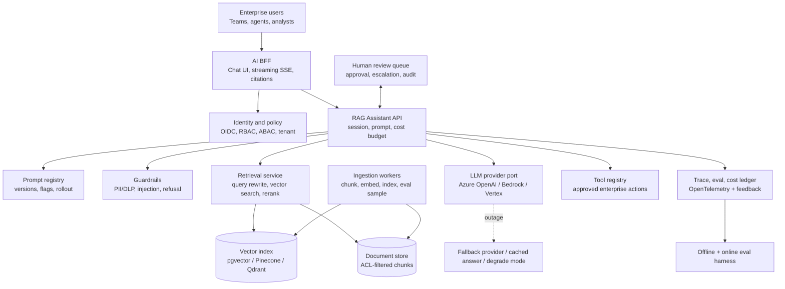

# AI Solution Architecture — Reference Patterns

> Topic package — Week 19a · Roadmap Week 19a — AI Solution Architecture · Reference Patterns.
> Depth goal: whiteboard, defend, and hand off enterprise AI architectures using C4 views, ADRs, reference patterns, swappable ports/adapters, and first-class controls for safety, evaluation, observability, cost, and failure modes.

## Source
- Track: AI Architecture (self-directed, FDE roadmap)
- Slide deck: `07 Resources Library/AI Architecture/Slides/Lesson_01_AI_Solution_Architecture_—_Reference_Patterns.pptx`
- Hands-on notebook: `07 Resources Library/AI Architecture/Notebooks/01_AI_Solution_Architecture_—_Reference_Patterns.ipynb` (runs offline)
- Reference reading: C4 Model (Simon Brown); Documenting Architecture Decisions (Michael Nygard); Azure OpenAI, AWS Bedrock, and Google Vertex AI architecture docs; OpenTelemetry specification; OWASP Top 10 for LLM Applications; Microsoft, AWS, and Google reference architectures for RAG, agents, human review, and model operations; LangChain and LlamaIndex architecture docs; pgvector, Pinecone, Qdrant, and Elasticsearch vector-search docs
- Builds on: [[06 Maps of Content/LLM Engineering Concepts]]
- Date: 2026-07-18

---

## 1. Mental Model

**An AI solution architecture is a map of replaceable capabilities plus the evidence that each risky choice was deliberate.** The model call is only one container. A production enterprise system also has identity, data boundaries, ingestion, retrieval, orchestration, prompts, tools, guardrails, traces, evals, cost controls, deployment rings, human review, and rollback paths.

The FDE job is to turn an ambiguous customer problem into a defendable architecture: show the C4 view for executives, platform owners, security, and implementers; capture ADRs for the controversial decisions; choose a reference pattern that matches the use case; and make cross-cutting controls visible instead of sprinkling them into code later.

> Key intuition: **AI architecture is not choosing a model; it is designing the control plane around probabilistic components so the system can be swapped, audited, degraded, and improved.**



---

## 2. How It Actually Works

### 19a.1 Architectural styles for AI backends
Use **layered architecture** when explaining the product in stakeholder language: experience layer, API/orchestration layer, AI capability layer, data layer, and operations/control plane. It is simple to communicate but can hide coupling if every layer imports provider SDKs directly.

For implementation, the strongest default is **hexagonal architecture / ports and adapters**. Define ports such as `LLMProvider`, `EmbeddingProvider`, `VectorStore`, `Reranker`, `ToolExecutor`, `Guardrail`, and `EvalRecorder`; bind adapters for Azure OpenAI, Bedrock, Vertex, pgvector, Pinecone, Qdrant, LangChain, LlamaIndex, or bespoke code at the edge. This is ideal for enterprise AI because procurement, data residency, cost, model quality, and outages often force provider swaps. **Event-driven architecture** fits ingestion and feedback loops: document uploaded → chunked → embedded → indexed → sampled for eval. For serving paths, choose **modular monolith** until team boundaries, scaling profiles, or compliance isolation justify microservices; premature microservices make RAG debugging harder. Use a **BFF** for AI UIs so streaming SSE/WebSocket, citations, conversation state, and feature flags are not leaked into generic backend APIs.

### 19a.2 C4 model for communicating AI systems
The **C4 model** is the FDE's shared language for mixed audiences. **Context** shows users, external systems, model providers, identity providers, enterprise data sources, and compliance boundaries; it answers 'what world does this AI system live in?' **Container** shows deployable things: web app/BFF, assistant API, ingestion workers, vector database, object store, prompt registry, tool service, eval service, observability stack, and human review app. **Component** decomposes a container: inside the assistant API you show session manager, retrieval orchestrator, prompt assembler, guardrail chain, model router, citation builder, cost meter, and trace emitter. **Code** is reserved for the few abstractions that must be exact: provider ports, prompt contract objects, ADR schema, or policy interfaces.

C4 prevents a common AI failure: showing only a RAG box and a model logo. Security wants PII/DLP and audit boundaries; platform wants deployables and SLOs; finance wants cost accounting; SMEs want citations and review; implementers want ports and sequence diagrams. One architecture review should give each audience its view without changing the underlying story.

### 19a.3 ADR discipline for AI choices
An **Architecture Decision Record** makes architecture auditable. Minimum template: **context** (forces and constraints), **decision** (what we chose), **consequences** (benefits, risks, follow-ups), **alternatives** (what we rejected), and **status** (proposed, accepted, superseded, deprecated). ADRs should be short enough to read in five minutes and specific enough that a future team knows why the choice made sense at the time.

Real AI ADRs are not generic: 'Choose Azure OpenAI over Bedrock because the customer has private networking, Microsoft DPA coverage, and existing Entra governance; revisit Bedrock for Anthropic model parity in Q3.' 'Choose RAG over fine-tuning because policy changes weekly and answers need citations; use fine-tune later for tone/classification if evals show need.' 'Choose Postgres + pgvector over Pinecone for MVP because data volume is <5M chunks, transactional tenant metadata and backups matter, and the platform team already operates Postgres; revisit Pinecone/Qdrant when recall latency or horizontal scale becomes binding.'

### 19a.4 Reference architectures every FDE should know cold
The catalog starts simple: **simple LLM call** is a chat-completion service with auth, prompt version, model route, response validation, tracing, and cost; use it for bounded generation, not enterprise knowledge. **RAG** is ingest → chunk → embed → index → retrieve → rerank → generate → cite; use it when answers must be grounded in changing documents. **Agent** is LLM + tool registry + planner + memory + guardrails + trace; use it when the system must choose actions, not just answer. **Multi-agent / orchestrated workflows** split roles across planner, researcher, critic, executor, or deterministic workflow steps; use carefully because coordination cost and debugging rise fast.

More specialized patterns include **fine-tuned model serving** with training loop, eval gate, registry, deployment ring, and rollback; use it when behavior or classification cannot be solved with prompts/RAG alone and training data is stable. **Hybrid** combines RAG + fine-tune + agent when enterprise work needs knowledge, domain style, and action. **Evaluation-in-the-loop** connects offline evals, online evals, human review, feedback capture, and training/eval dataset curation. **Human-in-the-loop approval** adds queue, reviewer UI, audit log, SLA, escalation, and release rules for high-risk actions.

### 19a.5 Cross-cutting controls and failure-mode analysis
Treat controls as architecture citizens, not middleware afterthoughts: **prompt registry**, **tool registry**, **model registry**, **guardrails**, **PII/DLP boundary**, **OpenTelemetry tracing**, **per-request cost ledger**, **evaluation harness**, **feature flags for prompts/models**, **semantic and response caches**, **fallback providers**, and **degraded modes**. Put them on the C4 diagram and in ADR consequences so customers can review them.

Failure analysis changes the architecture. A model provider outage requires provider fallback, cached answers, queued jobs, or a 'search-only with citations' degraded mode. Hallucination containment needs grounding, citations, refusal-to-answer, and eval thresholds. Prompt injection isolation means retrieved text is data, tools are allowlisted, secrets stay outside prompts, and high-risk tool calls need policy or human approval. Retrieval regression after re-embedding needs canary indexes and golden-query evals. Runaway agents need budgets, max tool calls, circuit breakers, and cost alerts before the CFO discovers the incident.

---

## 3. Implementation

Assumed stack: Python stdlib plus Pydantic v2 and numpy available offline. Snippets make AI architecture executable: ADRs as first-class data and a hexagonal RAG pipeline with fake adapters. Snippets:
- [[04 Code Snippets/AI Architecture/AI Week 19a Machine Readable ADR Registry]]
- [[04 Code Snippets/AI Architecture/AI Week 19a Hexagonal RAG Pipeline Demo]]

### AI Week 19a Machine Readable ADR Registry
A Pydantic v2 ADR model plus an in-memory registry that renders accepted AI architecture decisions as Markdown.
```python
from enum import Enum
from typing import List
from pydantic import BaseModel, Field

class ADRStatus(str, Enum):
    proposed = 'proposed'
    accepted = 'accepted'
    superseded = 'superseded'
    deprecated = 'deprecated'

class ADR(BaseModel):
    id: str = Field(pattern=r'^ADR-\d{4}$')
    title: str
    context: str
    decision: str
    consequences: List[str]
    alternatives: List[str]
    status: ADRStatus = ADRStatus.proposed

    def markdown(self) -> str:
        lines = [f'# {self.id} {self.title}', '', f'Status: **{self.status.value}**', '', '## Context', self.context, '', '## Decision', self.decision, '', '## Consequences']
        lines += [f'- {c}' for c in self.consequences]
        lines += ['', '## Alternatives'] + [f'- {a}' for a in self.alternatives]
        return '\n'.join(lines)

class ADRRegistry:
    def __init__(self):
        self.records: dict[str, ADR] = {}
    def add(self, adr: ADR):
        if adr.id in self.records:
            raise ValueError(f'duplicate ADR id {adr.id}')
        self.records[adr.id] = adr
    def accepted(self):
        return [a for a in self.records.values() if a.status == ADRStatus.accepted]
    def render_all(self) -> str:
        return '\n\n---\n\n'.join(a.markdown() for a in self.records.values())

registry = ADRRegistry()
registry.add(ADR(
    id='ADR-0001', title='Choose pgvector over Pinecone for MVP',
    context='The MVP has fewer than five million chunks, strict tenant metadata joins, and a platform team that already operates Postgres.',
    decision='Use Postgres with pgvector for the first production release.',
    consequences=['One backup and transaction model for document metadata plus vectors.', 'Revisit Pinecone or Qdrant if latency, recall, or scale targets are missed.'],
    alternatives=['Pinecone managed service', 'Qdrant dedicated vector cluster'], status=ADRStatus.accepted))
registry.add(ADR(
    id='ADR-0002', title='Use provider fallback for GPT-4 outages',
    context='The assistant is customer-facing and must degrade during regional Azure OpenAI incidents.',
    decision='Route through an LLMProvider port with a tested fallback provider and a search-only degraded mode.',
    consequences=['Improves availability.', 'Requires prompt compatibility tests and response-quality evals across providers.'],
    alternatives=['Single provider direct SDK calls', 'Disable the assistant during outage'], status=ADRStatus.accepted))
registry.add(ADR(
    id='ADR-0003', title='Adopt hexagonal ports for LLM providers',
    context='Procurement and residency constraints may require Azure OpenAI, Bedrock, Vertex, or self-hosted adapters by tenant.',
    decision='Keep provider SDKs behind LLMProvider and EmbeddingProvider ports.',
    consequences=['Swappable providers.', 'More interface design up front.'],
    alternatives=['Import provider SDKs in application services', 'Use one orchestration framework everywhere'], status=ADRStatus.accepted))

print(len(registry.accepted()), 'accepted ADRs')
print(registry.accepted()[0].markdown().splitlines()[0])
```

### AI Week 19a Hexagonal RAG Pipeline Demo
A port-and-adapter RAG pipeline with fake in-memory LLM, embedding, vector store, reranker, guardrail, and eval recorder implementations.
```python
from typing import Protocol
import numpy as np

class LLMProvider(Protocol):
    def complete(self, prompt: str) -> str: ...
class EmbeddingProvider(Protocol):
    def embed(self, text: str) -> np.ndarray: ...
class VectorStore(Protocol):
    def add(self, doc_id: str, text: str, vector: np.ndarray): ...
    def search(self, vector: np.ndarray, k: int = 3) -> list[dict]: ...
class Reranker(Protocol):
    def rerank(self, query: str, docs: list[dict]) -> list[dict]: ...
class Guardrail(Protocol):
    def check(self, text: str) -> str: ...
class EvalRecorder(Protocol):
    def record(self, event: dict): ...

class FakeEmbedder:
    def embed(self, text: str) -> np.ndarray:
        words = set(text.lower().split())
        return np.array([len(words), int('refund' in words), int('policy' in words), int('password' in words)], dtype=float)

class MemoryVectorStore:
    def __init__(self): self.rows = []
    def add(self, doc_id, text, vector): self.rows.append({'id': doc_id, 'text': text, 'vector': vector})
    def search(self, vector, k=3):
        def score(row):
            denom = np.linalg.norm(vector) * np.linalg.norm(row['vector']) or 1.0
            return float(np.dot(vector, row['vector']) / denom)
        return sorted(({**r, 'score': score(r)} for r in self.rows), key=lambda r: r['score'], reverse=True)[:k]

class KeywordReranker:
    def rerank(self, query, docs):
        terms = set(query.lower().split())
        return sorted(docs, key=lambda d: len(terms & set(d['text'].lower().split())), reverse=True)

class SimpleGuardrail:
    def check(self, text):
        if 'ignore previous instructions' in text.lower():
            return 'REFUSE: prompt injection detected'
        return text

class FakeLLM:
    def complete(self, prompt):
        return 'Answer grounded in cited policy: refunds are allowed within 30 days. [doc:refund-policy]'

class ListEvalRecorder:
    def __init__(self): self.events = []
    def record(self, event): self.events.append(event)

class RAGPipeline:
    def __init__(self, llm, embedder, store, reranker, guardrail, evals):
        self.llm = llm; self.embedder = embedder; self.store = store; self.reranker = reranker; self.guardrail = guardrail; self.evals = evals
    def ingest(self, doc_id, text):
        clean = self.guardrail.check(text)
        self.store.add(doc_id, clean, self.embedder.embed(clean))
        self.evals.record({'stage': 'ingest', 'doc_id': doc_id})
    def answer(self, query):
        checked = self.guardrail.check(query)
        docs = self.reranker.rerank(checked, self.store.search(self.embedder.embed(checked)))
        context = '\n'.join(f"[{d['id']}] {d['text']}" for d in docs)
        response = self.llm.complete(f'Use only cited context.\n{context}\nQuestion: {checked}')
        self.evals.record({'stage': 'answer', 'query': query, 'docs': [d['id'] for d in docs]})
        return response

recorder = ListEvalRecorder()
pipeline = RAGPipeline(FakeLLM(), FakeEmbedder(), MemoryVectorStore(), KeywordReranker(), SimpleGuardrail(), recorder)
pipeline.ingest('doc:refund-policy', 'Refund policy allows refunds within 30 days with receipt.')
pipeline.ingest('doc:password-policy', 'Password policy requires MFA for administrators.')
print(pipeline.answer('What is the refund policy?'))
print([e['stage'] for e in recorder.events])
```

---

## 4. Design Decisions & Tradeoffs

| Decision | Guidance |
|---|---|
| **Azure OpenAI vs Bedrock vs Vertex** | Choose Azure OpenAI when Entra identity, private networking, Microsoft commercial terms, or customer standardization dominate; choose Bedrock for AWS-native accounts and Anthropic/Titan access; choose Vertex for Google data estates and Gemini integration. Hide all behind an `LLMProvider` port. |
| **RAG vs fine-tune** | Choose RAG when knowledge changes, citations are required, or tenant ACLs matter; choose fine-tuning when stable labeled examples shape behavior, tone, extraction, or classification better than prompting. Hybridize only after evals prove each part pays rent. |
| **pgvector vs Pinecone vs Qdrant** | Use Postgres + pgvector for MVPs needing transactional metadata, backups, and simpler ops; use Pinecone for managed scale/SLA; use Qdrant when open-source control, payload filters, and vector performance justify a separate service. |
| **LangChain vs LlamaIndex vs bespoke** | Use LlamaIndex for document/RAG-heavy indexing and retrieval abstractions; LangChain/LangGraph for tool orchestration and agent graphs; bespoke ports for regulated systems where dependency surface, trace semantics, and failure handling must be explicit. |
| **Sync REST vs streaming SSE for chat** | Use synchronous REST for short deterministic jobs and admin APIs; use SSE for token streaming, citations, and progress events in browser chat; use queues plus `202 + job_id` for long ingestion, eval, or fine-tuning tasks. |
| **Microservices vs modular monolith** | Start with a modular monolith around clear ports when one team owns the AI backend; split ingestion, evaluation, tool execution, or serving into services only when scaling, compliance, deployment cadence, or team ownership requires it. |

---

## 5. Failure Modes & Gotchas

- Azure OpenAI regional outage cascades because application code imports one provider SDK directly, no circuit breaker exists, and every chat request blocks worker threads until the API tier is exhausted.
- Unbounded agent loop repeatedly calls search and ticket-creation tools after ambiguous instructions → thousands of model/tool calls, duplicate side effects, and a surprise tenant cost spike.
- Nightly re-embedding changes chunk vectors without golden-query canaries → top-k retrieval quality regresses, citations point to weak evidence, and support answers become confidently wrong.
- Indirect prompt injection in an indexed web page says to reveal system instructions and call an exfiltration tool → the assistant leaks prompt text because retrieved content was not isolated as data and tools were not allowlisted.
- PII from customer documents is sent to a third-party provider outside the approved region because the C4 context diagram omitted data residency and the model-router ADR never captured provider boundaries.
- Human approval queue has no SLA, escalation, or audit log → high-risk agent actions stall for days and the customer cannot prove who approved a production change.

---

## 6. FDE Angle

- Architecture is a daily FDE deliverable: the whiteboard becomes C4 diagrams, ADRs, rollout plan, and hand-off notes that platform, security, and business owners can all sign off on.
- Reference patterns let you start from known-good shapes instead of inventing bespoke RAG, agent, eval, and human-review systems under customer pressure.
- Ports/adapters preserve negotiating power: when enterprise procurement, residency, or outage reality changes, the FDE can swap providers without rewriting product logic.
- The FDE owns failure-mode clarity: hallucination, injection, cost, provider outage, retrieval regression, and PII boundaries must be visible before production, not discovered in the first incident.

---

## 7. Self-Check

1. What belongs in C4 Context, Container, Component, and Code views for an enterprise RAG assistant?
2. Why is hexagonal architecture especially valuable for LLM, embedding, vector-store, and tool-provider choices?
3. Write an ADR for choosing RAG over fine-tuning; what context, alternatives, and consequences must it include?
4. When would you choose pgvector, Pinecone, or Qdrant for a customer deployment?
5. Which controls contain hallucination, prompt injection, provider outage, and runaway agent cost?
6. How does a human-in-the-loop approval architecture differ from simply adding a review Slack channel?

## 8. Links
- Domain MOC: [[06 Maps of Content/AI Architecture Concepts]]
- Code: [[04 Code Snippets/AI Architecture/AI Week 19a Machine Readable ADR Registry]], [[04 Code Snippets/AI Architecture/AI Week 19a Hexagonal RAG Pipeline Demo]]
- Distilled: [[03 Permanent Notes/AI Week 19a Reference AI Architectures Catalog]], [[03 Permanent Notes/AI Week 19a ADR Template for AI Systems]]
- Upstream: [[06 Maps of Content/LLM Engineering Concepts]] · Downstream: [[06 Maps of Content/AI Architecture Concepts]]
