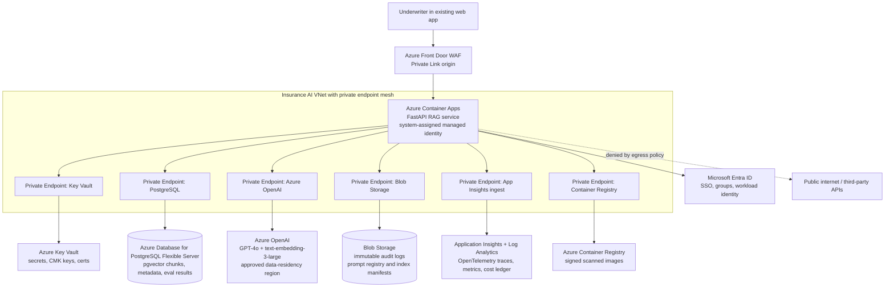

# Cloud Architecture & Deployment — Applied

> Topic package — Week 20b · Roadmap Week 20b — Cloud Architecture & Deployment · Applied.
> Depth goal: turn the Week 19b insurance-underwriter AI assistant architecture into a deployable Azure production package: topology, Bicep/IaC parameters, identity and data-boundary controls, cost model, CI/CD workflow, and prompt-model-index release strategy with rollback drills.

## Source
- Track: AI Architecture (self-directed, FDE roadmap)
- Slide deck: `07 Resources Library/AI Architecture/Slides/Lesson_04_Cloud_Architecture_&_Deployment_—_Applied.pptx`
- Hands-on notebook: `07 Resources Library/AI Architecture/Notebooks/04_Cloud_Architecture_&_Deployment_—_Applied.ipynb` (runs offline)
- Reference reading: Azure Container Apps, Azure OpenAI, Azure Database for PostgreSQL Flexible Server, pgvector, Azure Private Link, Azure Front Door, Azure Key Vault, Managed Identity, Microsoft Entra ID, Azure Container Registry, Application Insights, Log Analytics, Azure pricing pages, GitHub Actions deployment docs, Microsoft Cloud Adoption Framework, Azure Well-Architected Framework
- Builds on: [[02 Literature Notes/AI Architecture/AI Solution Architecture — Applied]]
- Date: 2026-07-18

---

## 1. Mental Model

**A cloud architecture is not deployable until every line on the diagram has an Azure resource, identity, network path, cost owner, release lane, and rollback story.** Week 19b produced the insurance-underwriter assistant architecture: 50 underwriters to start, 40k policy documents, 15 years of memos, 3 regulatory feeds, Azure-only processing, auditability, and no third-party data leakage. Week 20b turns that drawing into production artifacts a platform team can run.

The FDE shift is from solution architecture to delivery architecture. The boxes become Azure Container Apps revisions, Azure OpenAI deployments, PostgreSQL Flexible Server with pgvector, Blob audit containers, Key Vault policies, Entra ID groups, Application Insights traces, private endpoints, ACR images, Bicep modules, GitHub Actions environments, and budget alerts. Compliance changes the topology: the quick public-endpoint prototype becomes a private endpoint mesh with egress lockdown and explicit data-boundary evidence.

> Key intuition: **deployment is where architecture promises become testable claims** — private means a DNS resolution path, auditable means immutable events with trace ids, and rollback means the exact prompt/model/index axis that can be reverted without undoing unrelated safe changes.



---

## 2. How It Actually Works

### 20b.1 From architecture to target Azure deployment topology
Carry forward the Week 19b design, but pin every deployable component. The FastAPI RAG service runs in **Azure Container Apps** because the workload is request-driven, modest at baseline, and can scale-to-zero outside underwriting hours while still supporting revisions and traffic splitting. Images live in **Azure Container Registry** with vulnerability scanning. The model provider is **Azure OpenAI** in the customer's approved data-residency region, with `gpt-4o` for answer generation and `text-embedding-3-large` for embeddings. Retrieval uses **Azure Database for PostgreSQL Flexible Server** with `pgvector`, which remains defensible for roughly 400k chunks plus metadata joins. Audit and prompt/index manifests live in **Azure Blob Storage** with immutability policies. **Azure Key Vault** holds secrets, CMK keys, and certificates. **Microsoft Entra ID** handles SSO and group-based authorization; the Container App uses managed identity. **Application Insights** receives OpenTelemetry traces and custom groundedness/cost metrics. **Azure Front Door Premium** gives WAF and controlled edge entry.

The compliance-driven upgrade is networking. A quick pilot might call Azure OpenAI, Postgres, Blob, and Key Vault over public endpoints with IP restrictions. That is simpler, but it makes data-boundary evidence weaker and leaves the RAG service with broad public egress. Production uses **Private Endpoints / Private Link** for Azure OpenAI, Postgres, Blob, Key Vault, ACR, and telemetry ingestion where supported; private DNS zones make `*.openai.azure.com`, `*.postgres.database.azure.com`, and storage names resolve to private IPs from the Container Apps environment VNet. Outbound NSG/firewall policy denies arbitrary internet. The architecture claim becomes provable: underwriter prompts, retrieved memo excerpts, embeddings, and audit records remain inside the customer's Azure tenant and approved regions.

### 20b.2 IaC: Bicep versus Terraform for this customer
Recommendation: **Bicep** for this customer. They are already Microsoft-native, want hand-off to an Azure platform team, and likely have Azure Policy, management groups, Private Link patterns, and RBAC conventions expressed in ARM/Bicep modules. Bicep reduces translation friction: the platform team can review native resource types, use existing Azure Verified Modules, and align with subscription landing-zone patterns. **Terraform remains defensible** if the customer has a multi-cloud platform team, a mature remote-state process, or wants the same module interface across Azure, AWS, and GCP. The ADR should say exactly that: Bicep now, revisit Terraform if cross-cloud governance becomes the dominant constraint.

Bicep structure: one module per resource family (`containerapp.bicep`, `openai.bicep`, `postgres.bicep`, `private-endpoints.bicep`, `observability.bicep`) and one parameter file per environment (`dev.bicepparam`, `staging.bicepparam`, `prod.bicepparam`). For Terraform the equivalent would be remote state in Azure Storage with state locking, one workspace or state file per environment, and variables for model deployment names, index names, prompt-registry blob URL, SKUs, and allowed egress. For Bicep, deployment state lives in ARM; operational configuration still must be parameterized: `promptRegistryBlobUrl`, `vectorIndexName`, `chatModelDeployment`, `embeddingModelDeployment`, `allowedRegions`, `minReplicas`, `maxReplicas`, and `logSamplingRate`. AI config is never hard-coded into the image; it is environment-specific release metadata.

### 20b.3 Secrets, identity, and data-boundary controls
The Container App gets a **system-assigned managed identity**. That identity is granted least-privilege Key Vault access (`Key Vault Secrets User` or narrowly scoped data-plane permissions), Postgres login via Microsoft Entra authentication where feasible, Blob data contributor only on the audit/prompt containers it needs, and pull permission on ACR. No database passwords, model keys, or signing secrets are baked into the image or committed to GitHub Actions variables. Runtime reads secrets from Key Vault; if a secret is required as an environment variable for a legacy client, the IaC should create a Key Vault reference rather than a literal value.

Data-boundary controls are explicit. Azure OpenAI is reached through Private Link; public network access is disabled where the service supports it. Container Apps egress is locked down to private endpoints, Azure Monitor, and approved internal services. Blob and Postgres can use **customer-managed keys** if the customer's compliance policy requires key ownership and rotation evidence. Azure OpenAI request/response logging should be disabled or configured for zero/limited retention where available; if the customer opts into abuse monitoring, document the retention and reviewer boundary. A boundary table belongs in the hand-off: user identity and group claims cross Entra; policy snippets and memos cross from Postgres to the prompt; prompt and answer cross to Azure OpenAI; trace ids and metrics cross to App Insights; full prompt, retrieved chunk ids, answer, model, prompt version, index version, user, and policy decision are written to Blob audit. Nothing crosses to third-party providers.

### 20b.4 Cost planning at deploy scale
Use Week 19b's arithmetic and make the bill concrete. Baseline is 50 underwriters × 40 questions/day × 22 business days = 44k queries/month. Each query averages 1.5k prompt tokens and 800 response tokens, so Standard GPT-4o at illustrative prices of $2.50/M input and $10/M output is about $517/month before caching. The corpus is 40k docs × 10 chunks × 1536 dimensions: about 2.46 GB raw vectors, commonly 10-30 GB once metadata, HNSW/IVFFlat indexes, WAL, and bloat are included.

| Scale | Monthly shape | Approx Azure bill |
|---|---:|---:|
| Baseline: 50 users | 44k queries; Standard Azure OpenAI; Container Apps 1-3 replicas; Postgres Flexible Server GP 2 vCore; 50-100 GB Blob/audit; 20 GB Log Analytics | **$1.3k-$2.2k/mo**: model ~$517, Container Apps ~$100-$250, Postgres ~$250-$450, Blob <$50, Front Door ~$100-$250, App Insights/Log Analytics ~$200-$700 |
| Growth: 200 users | 176k queries; evaluate PTU; 2-8 replicas; Postgres GP 4 vCore; 80+ GB logs | **$4k-$8k/mo**: Standard model ~$2.1k or PTU commitment if concurrency/latency requires it; logs can rival model cost |
| Enterprise: 500 users | 440k queries; likely PTU for latency and quota; 4-16 replicas; Postgres GP 8 vCore or memory optimized; strict log sampling | **$10k-$20k+/mo** depending on PTU count, retention, and eval traffic |

Savings plays are architectural, not spreadsheet tricks. A 25% approved-answer or semantic cache hit rate cuts GPT-4o generation spend roughly 25% for repeated precedent questions. PTU starts to make sense around 200+ users when predictable latency, quota, and committed throughput are worth the hourly commitment; Standard remains cheaper for bursty pilot traffic. Sampling verbose traces, excluding raw prompts from Log Analytics, and keeping full audit in cheaper Blob can cut observability spend by 50-80%. Budget alerts should be per environment and per cost driver: model tokens, PTU hours, Container Apps replicas, Postgres, and Log Analytics GB/day.

### 20b.5 Deploy pipeline and release strategy
The pipeline has three gates. On pull request: run unit tests, `ruff`, and an eval regression against a golden set of policy, memo, and regulatory questions. On merge to `main`: build the image, scan it, push to ACR, deploy a new **staging Container App revision**, run online smoke tests against staging with fake or approved non-sensitive fixtures, and publish release metadata. On manual approval: promote to production by traffic splitting 10% → 50% → 100%, watching p95 latency, error rate, groundedness, citation coverage, refusal rate, and cost/query. A failing canary automatically rolls traffic back to the previous revision.

AI systems need an extra release tuple: **`(prompt_version, model_deployment, index_version)`**. Prompt changes are config releases from the prompt registry and roll back by pointer. Model changes move traffic between Azure OpenAI deployments such as `gpt-4o-prod` and `gpt-4o-2024-11-prod`; rollback preserves prompt and index. Index changes are data releases: build a shadow index, run golden retrieval evals, switch an index alias, and keep the previous index warm until rollback risk passes. The 2am drill: groundedness drops after `prompt-v18` while latency and retrieval are healthy. The monitor marks the prompt axis unhealthy, switches production config back to `prompt-v17` within three minutes, preserves the new model deployment and `index-2026-07-17`, opens an incident with trace ids and failed golden queries, and writes an audit event proving the rollback.

---

## 3. Implementation

Assumed stack: Python stdlib plus numpy and Pydantic v2. Snippets are offline FDE tools for design reviews and release planning; no Azure credentials or network calls are needed.
- [[04 Code Snippets/AI Architecture/AI Week 20b Azure Deployment Topology Cost Estimator]]
- [[04 Code Snippets/AI Architecture/AI Week 20b Prompt Model Index Release Orchestrator]]

### AI Week 20b Azure Deployment Topology Cost Estimator
Pydantic v2 model tree for the insurance-underwriter Azure deployment plus a representative monthly line-item cost estimator for Baseline, Growth, and Enterprise scale.
```python
from __future__ import annotations
from typing import Literal
from pydantic import BaseModel, Field

# Representative unit prices from Azure pricing pages; verify in-region at deploy time.
PRICES = {
    'gpt4o_input_per_mtok': 2.50,
    'gpt4o_output_per_mtok': 10.00,
    'embedding_3_large_per_mtok': 0.13,
    'containerapp_replica_month': 75.0,
    'postgres_gp_2vc_month': 320.0,
    'postgres_gp_4vc_month': 620.0,
    'postgres_gp_8vc_month': 1240.0,
    'blob_hot_gb_month': 0.018,
    'frontdoor_month': 165.0,
    'log_analytics_ingest_gb': 2.76,
    'private_endpoint_month': 7.30,
    'ptu_month': 6000.0,
}

class Service(BaseModel):
    name: str
    sku: str
    replicas: int = 1
    private_endpoint: bool = True

class Workload(BaseModel):
    label: str
    users: int
    questions_per_user_day: int = 40
    business_days_per_month: int = 22
    prompt_tokens: int = 1500
    response_tokens: int = 800
    cache_hit_rate: float = Field(default=0.0, ge=0.0, le=0.95)
    use_ptu: bool = False
    log_gb_per_day: float = 1.0

class DeploymentTopology(BaseModel):
    name: str
    region: str
    services: list[Service]
    docs: int = 40_000
    chunks_per_doc: int = 10
    embedding_dims: int = 1536
    avg_chunk_tokens: int = 800
    blob_gb: float = 100.0
    private_networking: bool = True
    public_egress_allowed: bool = False
    prompt_registry_blob_url: str
    vector_index_name: str
    chat_model_deployment: str
    embedding_model_deployment: str

    def estimate_monthly_cost(self, workload: Workload) -> dict:
        queries_month = workload.users * workload.questions_per_user_day * workload.business_days_per_month
        billable_queries = queries_month * (1.0 - workload.cache_hit_rate)
        input_mtok = billable_queries * workload.prompt_tokens / 1_000_000
        output_mtok = billable_queries * workload.response_tokens / 1_000_000
        chunks = self.docs * self.chunks_per_doc
        embed_mtok = chunks * self.avg_chunk_tokens / 1_000_000
        vector_gb_raw = chunks * self.embedding_dims * 4 / 1_000_000_000

        postgres_key = 'postgres_gp_2vc_month'
        if workload.users >= 500:
            postgres_key = 'postgres_gp_8vc_month'
        elif workload.users >= 200:
            postgres_key = 'postgres_gp_4vc_month'

        avg_replicas = 2 if workload.users < 200 else 5 if workload.users < 500 else 10
        private_endpoints = sum(1 for s in self.services if s.private_endpoint)
        model_cost = PRICES['ptu_month'] if workload.use_ptu else (
            input_mtok * PRICES['gpt4o_input_per_mtok'] + output_mtok * PRICES['gpt4o_output_per_mtok']
        )
        line_items = {
            'Azure OpenAI generation or PTU': model_cost,
            'One-time corpus embedding amortized': embed_mtok * PRICES['embedding_3_large_per_mtok'] / 12,
            'Container Apps compute': avg_replicas * PRICES['containerapp_replica_month'],
            'PostgreSQL Flexible Server pgvector': PRICES[postgres_key],
            'Blob Storage audit and prompt registry': self.blob_gb * PRICES['blob_hot_gb_month'],
            'Azure Front Door Premium estimate': PRICES['frontdoor_month'],
            'Log Analytics ingest': workload.log_gb_per_day * 30 * PRICES['log_analytics_ingest_gb'],
            'Private Endpoints': private_endpoints * PRICES['private_endpoint_month'],
        }
        return {
            'workload': workload.label,
            'queries_month': int(queries_month),
            'billable_queries_after_cache': int(billable_queries),
            'raw_vector_gb': round(vector_gb_raw, 2),
            'line_items': {k: round(v, 2) for k, v in line_items.items()},
            'total': round(sum(line_items.values()), 2),
            'network_isolation_ok': self.private_networking and not self.public_egress_allowed,
        }

def insurance_topology() -> DeploymentTopology:
    return DeploymentTopology(
        name='insurance-underwriter-rag', region='eastus2',
        services=[
            Service(name='rag-api', sku='Azure Container Apps consumption'),
            Service(name='aoai', sku='Azure OpenAI gpt-4o + text-embedding-3-large'),
            Service(name='postgres', sku='Flexible Server General Purpose + pgvector'),
            Service(name='audit-blob', sku='StorageV2 hot immutable'),
            Service(name='key-vault', sku='standard'),
            Service(name='app-insights', sku='workspace-based'),
            Service(name='acr', sku='Premium'),
        ],
        prompt_registry_blob_url='https://stpromptprod.blob.core.windows.net/prompts/registry.json',
        vector_index_name='underwriting-index-2026-07-17',
        chat_model_deployment='gpt-4o-prod',
        embedding_model_deployment='text-embedding-3-large-prod',
    )

topology = insurance_topology()
scenarios = [
    Workload(label='Baseline', users=50, cache_hit_rate=0.10, log_gb_per_day=1.5),
    Workload(label='Growth', users=200, cache_hit_rate=0.20, use_ptu=True, log_gb_per_day=4.0),
    Workload(label='Enterprise', users=500, cache_hit_rate=0.25, use_ptu=True, log_gb_per_day=8.0),
]
for scenario in scenarios:
    report = topology.estimate_monthly_cost(scenario)
    print()
    print(f"{report['workload']} total=${report['total']:,.2f} queries={report['queries_month']:,} isolation={report['network_isolation_ok']}")
    for name, cost in report['line_items'].items():
        print(f"  {name:42s} ${cost:,.2f}")
```

### AI Week 20b Prompt Model Index Release Orchestrator
Deterministic release planner for independent prompt, model, and index changes with canary promotion stages and per-axis rollback plans.
```python
from dataclasses import dataclass
from typing import Literal

Axis = Literal['prompt', 'model', 'index']
Decision = Literal['PROMOTE', 'HOLD', 'ROLLBACK']

@dataclass(frozen=True)
class VersionTuple:
    prompt: str
    model: str
    index: str

@dataclass(frozen=True)
class Metrics:
    latency_p95_ms: int
    error_rate: float
    groundedness_score: float
    cost_per_query: float

@dataclass(frozen=True)
class Guardrails:
    max_latency_p95_ms: int = 8500
    max_error_rate: float = 0.02
    min_groundedness_score: float = 0.86
    max_cost_per_query: float = 0.08

@dataclass(frozen=True)
class StageResult:
    traffic_percent: int
    decision: Decision
    reasons: list[str]

@dataclass(frozen=True)
class ReleasePlan:
    current: VersionTuple
    proposed: VersionTuple
    changed_axes: list[Axis]
    stages: list[StageResult]
    rollback_plan: dict[Axis, str]

def changed_axes(current: VersionTuple, proposed: VersionTuple) -> list[Axis]:
    return [axis for axis in ('prompt', 'model', 'index') if getattr(current, axis) != getattr(proposed, axis)]

def judge(metrics: Metrics, guardrails: Guardrails) -> tuple[Decision, list[str]]:
    reasons = []
    if metrics.latency_p95_ms > guardrails.max_latency_p95_ms:
        reasons.append(f'latency {metrics.latency_p95_ms}>{guardrails.max_latency_p95_ms}')
    if metrics.error_rate > guardrails.max_error_rate:
        reasons.append(f'error_rate {metrics.error_rate:.3f}>{guardrails.max_error_rate:.3f}')
    if metrics.groundedness_score < guardrails.min_groundedness_score:
        reasons.append(f'groundedness {metrics.groundedness_score:.2f}<{guardrails.min_groundedness_score:.2f}')
    if metrics.cost_per_query > guardrails.max_cost_per_query:
        reasons.append(f'cost {metrics.cost_per_query:.3f}>{guardrails.max_cost_per_query:.3f}')
    return ('ROLLBACK' if reasons else 'PROMOTE'), reasons or ['all guardrails passed']

def infer_axes_to_rollback(axes: list[Axis], reasons: list[str]) -> list[Axis]:
    if any('groundedness' in r for r in reasons) and 'prompt' in axes:
        return ['prompt']
    if any('latency' in r or 'cost' in r for r in reasons) and 'model' in axes:
        return ['model']
    if any('groundedness' in r for r in reasons) and 'index' in axes:
        return ['index']
    return axes

def orchestrate_release(current: VersionTuple, proposed_changes: dict[str, str], canary_metrics: list[Metrics], guardrails: Guardrails) -> ReleasePlan:
    proposed = VersionTuple(
        prompt=proposed_changes.get('prompt', current.prompt),
        model=proposed_changes.get('model', current.model),
        index=proposed_changes.get('index', current.index),
    )
    axes = changed_axes(current, proposed)
    stages = []
    rollback_axes: set[Axis] = set()
    for pct, metrics in zip((10, 50, 100), canary_metrics):
        decision, reasons = judge(metrics, guardrails)
        stages.append(StageResult(pct, decision, reasons))
        if decision == 'ROLLBACK':
            rollback_axes.update(infer_axes_to_rollback(axes, reasons))
            break
    rollback_plan = {}
    for axis in axes:
        if axis in rollback_axes:
            rollback_plan[axis] = f'rollback {axis} to {getattr(current, axis)}; preserve other axes if healthy'
        else:
            rollback_plan[axis] = f'keep {getattr(proposed, axis)}; no rollback triggered for {axis}'
    return ReleasePlan(current, proposed, axes, stages, rollback_plan)

def print_plan(name: str, plan: ReleasePlan):
    print()
    print(f"{name}: changed={plan.changed_axes} proposed={plan.proposed}")
    for stage in plan.stages:
        print(f"  {stage.traffic_percent:3d}% {stage.decision:8s} reasons={stage.reasons}")
    for axis, action in plan.rollback_plan.items():
        print(f"  {axis}: {action}")

current = VersionTuple(prompt='prompt-v17', model='gpt-4o-prod', index='index-2026-07-17')
guards = Guardrails()
healthy = [Metrics(6200, 0.006, 0.91, 0.031), Metrics(6500, 0.007, 0.90, 0.032), Metrics(6800, 0.008, 0.90, 0.033)]
prompt_bad = [Metrics(6100, 0.006, 0.80, 0.031)]
model_slow = [Metrics(9400, 0.006, 0.90, 0.041)]
print_plan('healthy release', orchestrate_release(current, {'prompt': 'prompt-v18'}, healthy, guards))
print_plan('prompt groundedness regression', orchestrate_release(current, {'prompt': 'prompt-v18', 'model': 'gpt-4o-prod', 'index': 'index-2026-07-17'}, prompt_bad, guards))
print_plan('model latency regression', orchestrate_release(current, {'model': 'gpt-4o-2024-11-prod'}, model_slow, guards))
```

---

## 4. Design Decisions & Tradeoffs

| Decision | Guidance |
|---|---|
| **Container Apps versus AKS** | Use Azure Container Apps for the request-driven FastAPI RAG service because revisions, scale-to-zero, KEDA-style autoscale, and lower ops burden fit the underwriter workload; revisit AKS when sidecars, custom networking, GPU workloads, or platform standardization require it. |
| **Bicep versus Terraform** | Choose Bicep for a Microsoft-native hand-off to the customer's Azure platform team; choose Terraform if their control plane is multi-cloud and remote-state workflows are already standardized. |
| **Standard Azure OpenAI versus PTU** | Use Standard for pilot/baseline cost efficiency; move to PTU around growth scale when quota, latency predictability, and committed throughput matter more than burst-only pricing. |
| **Public endpoints versus Private Link** | Prototype with public endpoints only if data is synthetic; production uses Private Endpoints, private DNS, and egress lockdown to prove prompts and retrieved documents do not traverse arbitrary internet paths. |
| **Prompt/model/index release lanes** | Version and roll back prompt, model deployment, and vector index independently so a bad prompt does not force a model rollback and a slow model does not invalidate a good index rebuild. |
| **Audit location versus telemetry location** | Store full prompt, chunks, answers, and policy decisions in immutable Blob audit logs; send sampled metrics and safe attributes to Log Analytics so observability cost and PII exposure stay controlled. |

---

## 5. Failure Modes & Gotchas

- Private-endpoint DNS misconfigured so `*.openai.azure.com` still resolves public from the Container Apps environment; the security review fails because traffic path evidence contradicts the diagram.
- Container App managed identity exists but lacks Key Vault data-plane access; the first production revision starts, cannot read signing or database secrets, and returns 500s until RBAC propagation and startup probes are fixed.
- Azure OpenAI PTU is purchased or deployed in the wrong region; latency and data-residency assumptions break, and the team pays for capacity the production app cannot legally use.
- Index rebuild writes directly into the live pgvector tables; locks, bloat, or bad embeddings take down retrieval instead of switching a tested shadow index alias.
- Verbose traces with prompts and retrieved snippets go to Log Analytics at full volume; log-ingest cost dwarfs model cost and creates avoidable PII review scope.
- Prompt text is inlined in application code; a bad prompt release requires an image rollback, making it impossible to preserve the safe model and index while reverting only prompt behavior.

---

## 6. FDE Angle

- Deployment discipline converts customer trust into evidence: private DNS, RBAC assignments, immutable audit events, and release metadata can be shown to security and compliance.
- Cost predictability is a customer outcome; the FDE explains Standard versus PTU, cache savings, and log sampling before finance discovers the bill.
- Independent prompt/model/index lanes let the team say, and prove, 'we rolled back the bad prompt within three minutes without undoing the new model deployment.'
- A hand-off-ready package is more valuable than a clever prototype: topology, Bicep parameters, pipeline gates, runbooks, budgets, and rollback drills make the platform team successful.

---

## 7. Self-Check

1. Why does this customer need Private Link and egress lockdown instead of the simpler public-endpoint Azure OpenAI deployment?
2. What IaC parameters must stay environment-specific for prompt registry, model deployment, and vector index releases?
3. Which identity reads Key Vault secrets at runtime, and why should secrets not appear in the image or GitHub Actions logs?
4. At what scale would you consider PTU, and what non-cost reasons might justify it before pure break-even?
5. How do you roll back a groundedness regression from a prompt update without rolling back the model or index?
6. Why can Log Analytics cost and PII scope become a production incident in an AI deployment?

## 8. Links
- Domain MOC: [[06 Maps of Content/AI Architecture Concepts]]
- Code: [[04 Code Snippets/AI Architecture/AI Week 20b Azure Deployment Topology Cost Estimator]], [[04 Code Snippets/AI Architecture/AI Week 20b Prompt Model Index Release Orchestrator]]
- Distilled: [[03 Permanent Notes/AI Week 20b Azure Enterprise AI Deployment Reference]], [[03 Permanent Notes/AI Week 20b Prompt Model Index Release Discipline]]
- Upstream: [[02 Literature Notes/AI Architecture/AI Solution Architecture — Applied]] · Downstream: [[06 Maps of Content/AI Architecture Concepts]]
