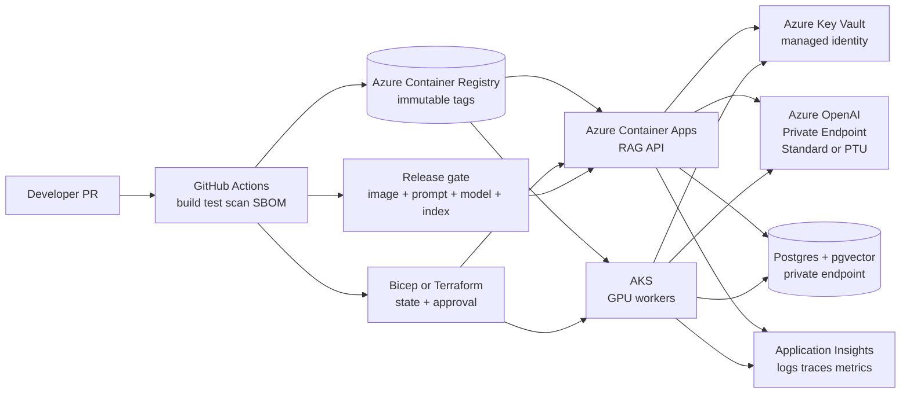

# Cloud Architecture & Deployment — Reference Patterns

> Topic package — Week 20a · Roadmap Week 20a — Cloud Architecture & Deployment · Reference Patterns.
> Depth goal: deploy enterprise AI systems with defensible cloud platform choices, Azure-first reference patterns, container/Kubernetes production hygiene, Infrastructure as Code, secret boundaries, quota/capacity planning, and release gates that version image, prompt, model, and vector index independently.

## Source
- Track: AI Architecture (self-directed, FDE roadmap)
- Slide deck: `07 Resources Library/AI Architecture/Slides/Lesson_03_Cloud_Architecture_&_Deployment_—_Reference_Patterns.pptx`
- Hands-on notebook: `07 Resources Library/AI Architecture/Notebooks/03_Cloud_Architecture_&_Deployment_—_Reference_Patterns.ipynb` (runs offline)
- Reference reading: Azure AI Foundry, Azure OpenAI Service, Azure Container Apps, Azure App Service, AKS, ACR, Key Vault, Managed Identity, Bicep, and GitHub Actions for Azure docs; AWS Bedrock, EKS/ECS/Lambda, ECR, Secrets Manager, IAM Roles for Service Accounts docs; Google Vertex AI Model Garden, Cloud Run/GKE, Artifact Registry, Secret Manager docs; Kubernetes, Helm, OCI image, SBOM, SLSA, Terraform, OpenTelemetry documentation
- Builds on: [[02 Literature Notes/AI Architecture/AI Solution Architecture — Reference Patterns]]
- Date: 2026-07-18

---

## 1. Mental Model

**A cloud AI architecture is a capacity, residency, identity, and rollout contract around probabilistic software.** The production question is not simply which model to call. It is which approved region can hold data, how traffic reaches the model over private paths, how quota is reserved, what compute owns latency and cold start, where secrets rotate, and how prompt/model/index changes roll forward and back.

For an FDE, deployment design is customer-facing architecture. A director will ask why Azure OpenAI Standard is enough for a pilot, when PTUs are justified, why Container Apps beats AKS for the first RAG API, how Key Vault avoids static secrets, and what happens if a canary improves latency but drops groundedness. Your answer must name real services, real constraints, and operational exit ramps.

> Key intuition: **deploy AI as a versioned control plane, not as a container pointed at a model endpoint.** Production readiness comes from private connectivity, quota plans, validated manifests, probes, workload identity, IaC state, scans, and release gates that understand image + prompt + model + index as separate moving parts.



---

## 2. How It Actually Works

### 20a.1 Cloud AI platform landscape
Treat **Azure AI Foundry / Azure OpenAI Service** as the default for this roadmap because many enterprise customers already standardize on Entra ID, Azure Policy, Private Link, Purview, Microsoft commercial terms, and Azure landing zones. Azure AI Foundry is the broader project, prompt/eval/agent/model-catalog experience; Azure OpenAI Service is the managed endpoint for OpenAI models. The concrete capacity choice is **Standard** pay-as-you-go versus **Provisioned Throughput Units (PTUs)**. Standard is flexible but quota- and noisy-neighbor-sensitive; PTU reserves model capacity for predictable throughput and lower variance. Public ballpark: PTUs can be in the low tens of dollars per PTU-hour depending on model, region, and commitment, so 100 PTUs can become thousands per day if idle; always verify current pricing.

Compare alternatives honestly. **AWS Bedrock** offers Anthropic Claude, Amazon Titan, Cohere, Meta, Mistral, and others with on-demand and **Provisioned Throughput**, VPC endpoints, and Bedrock Guardrails. **Google Vertex AI** offers Gemini plus third-party/open models through **Vertex AI Model Garden**, strong BigQuery/Dataplex fit, and endpoint deployment controls. Across all three, compare model catalog and evals, region availability, data-residency guarantees, private networking, content filtering, PTU/provisioned capacity versus pay-as-you-go, quota escalation path, customer/BYO-key options, audit logs, and whether procurement already has the right DPA and security approval.

### 20a.2 Compute options for AI workloads
Choose compute by traffic shape and operational maturity. **VMs** give maximum control for bespoke GPU experiments, legacy drivers, or appliances, but require image hardening, patching, autoscale, and observability. **Azure App Service** is the fastest production path for a simple FastAPI or .NET RAG API: deployment slots, managed TLS, VNet integration, autoscale, and always-warm instances. It does not scale to zero and is not the place for custom GPU node pools.

**Azure Container Apps** is often the FDE default for early AI microservices: container-native, revisions, ingress, KEDA/Dapr, managed environment networking, and scale-to-zero for spiky services. Expect cold starts from seconds to tens of seconds depending on image size and min replicas; keep one replica warm for chat APIs. **AKS** is justified for sidecars, service mesh, custom ingress, GPU node pools, daemonsets, private cluster policy, or many services sharing platform patterns. **Functions/Lambda** fit event-driven ingestion — blob uploaded, queue message, scheduled eval — but cold starts, package limits, execution limits, and VNet complexity make them poor for latency-sensitive chat. Watch egress: moving chunks, embeddings, logs, or model calls across regions/clouds can quietly dominate cost and violate residency.

### 20a.3 Containers and Kubernetes essentials for AI
Container discipline is supply-chain discipline. Use multi-stage builds, pinned base image versions/digests, slim runtime layers, `.dockerignore`, non-root users, dependency lockfiles, SBOM generation, and vulnerability scanning in ACR/ECR/Artifact Registry. Never bake API keys, `.env`, tenant data, or unclear-license model weights into image layers; `docker history` and registry retention can preserve secrets after deletion.

Know Kubernetes primitives cold: `Deployment` rolls pods; `Service` gives stable discovery; `Ingress` or Gateway exposes HTTP; `ConfigMap` stores non-secret config; `Secret` stores references but still needs encryption/RBAC; `HPA` scales on CPU or custom metrics; requests drive scheduling; limits cap runaway containers; liveness probes restart broken processes; readiness probes remove warming pods from traffic; `PodDisruptionBudget` protects availability during node upgrades. A FastAPI RAG service needs readiness on `/readyz` only after pgvector/model dependencies are reachable. GPU node pools require quota in the exact region/SKU family — Azure NCasT4_v3 for T4, NC A100 v4 for A100, ND H100 v5 for H100-class workloads — plus taints, tolerations, and VRAM-aware bin packing.

### 20a.4 Infrastructure as Code, secrets, and environments
Infrastructure must be reproducible before it is production. **Terraform** is strong for multi-cloud teams with remote state and locking in Azure Storage, S3+DynamoDB, or Terraform Cloud. **Bicep** is idiomatic for Azure-first shops: ARM-native modules, fast Azure feature coverage, and fewer provider impedance mismatches. **Pulumi** and **CDK** appeal when platform code wants TypeScript/Python abstractions, but they can hide simple cloud primitives behind application logic. Pick one and enforce reviews, plan output, policy checks, and drift detection.

Use one state/workspace/stack per environment: dev, staging, prod, and optional ephemeral preview. Split config from secrets: region, SKU, replica count, and model deployment names are config; API keys, DB passwords, signing keys, and connection strings are secrets. Store secrets in **Azure Key Vault**, AWS Secrets Manager, Google Secret Manager, or Vault; rotate them; log access; prefer workload identity — managed identity / AKS workload identity, AWS IRSA, GCP Workload Identity — over static credentials in CI or pods. Enterprise AI also needs per-environment quotas: dev uses Standard and small DBs, staging mirrors topology at lower scale, prod reserves PTU/provisioned throughput only when SLOs and utilization justify it.

### 20a.5 Deployment pipelines and release strategies for AI systems
A production pipeline builds more than an image. GitHub Actions or Azure DevOps should run tests, dependency audit, container build, SBOM, vulnerability scan, signed immutable tag push to ACR/ECR/Artifact Registry, IaC plan, environment approval, deployment, smoke tests, and post-deploy telemetry checks. Use OIDC federation from CI to cloud so GitHub never stores long-lived cloud credentials. For Azure Container Apps, a real flow uses a service matrix, `azure/login`, `docker/build-push-action`, push to ACR, and `az containerapp update` or revision traffic weights.

AI releases are not just blue/green containers. You release a tuple: **image version + prompt version + model deployment/version + vector index version**. Any one can regress independently. Blue/green can use App Service slots, Container Apps revisions, or ingress traffic split; canary should gate on p95 latency, error rate, cost/request, safety refusals, and groundedness/citation evals. Rollback drills must prove you can revert image, prompt, model route, vector index, and fine-tuned adapter. For indexes, build `index_vNext` beside `index_current`, run golden-query evals, shadow-read if needed, atomically flip an alias/table/view, and retain the old index until rollback confidence expires.

---

## 3. Implementation

Assumed stack: Python stdlib plus Pydantic v2 available offline. Snippets turn deployment discipline into executable checks: validated manifests before apply and canary promotion logic that understands AI quality gates. Snippets:
- [[04 Code Snippets/AI Architecture/AI Week 20a Cloud Deployment Manifest Validator]]
- [[04 Code Snippets/AI Architecture/AI Week 20a Canary Release Evaluator]]

### AI Week 20a Cloud Deployment Manifest Validator
A Pydantic v2 Azure Container Apps-style manifest validator that rejects unsafe secrets, impossible replica bounds, malformed memory values, and invalid probe paths before apply.
```python
import re
from pydantic import BaseModel, ConfigDict, Field, ValidationError, field_validator, model_validator

MEMORY_RE = re.compile(r'^(128|256|512)Mi$|^[1-9][0-9]*Gi$')

class Probe(BaseModel):
    model_config = ConfigDict(extra='forbid')
    path: str
    initial_delay_seconds: int = Field(default=5, ge=0, le=120)
    period_seconds: int = Field(default=10, ge=1, le=60)
    @field_validator('path')
    @classmethod
    def valid_path(cls, value):
        if not value.startswith('/') or ' ' in value or '?' in value:
            raise ValueError('probe path must be an absolute path without spaces or query string')
        return value

class ScaleRule(BaseModel):
    model_config = ConfigDict(extra='forbid')
    name: str
    type: str
    metadata: dict[str, str] = Field(default_factory=dict)

class DeploymentManifest(BaseModel):
    model_config = ConfigDict(extra='forbid')
    name: str = Field(pattern=r'^[a-z][a-z0-9-]{2,40}$')
    image: str
    tag: str
    cpu: float = Field(gt=0, le=4)
    memory: str
    replicas: int = Field(ge=0, le=50)
    min_replicas: int = Field(alias='minReplicas', ge=0, le=50)
    max_replicas: int = Field(alias='maxReplicas', ge=1, le=100)
    ingress: bool = True
    env: dict[str, str] = Field(default_factory=dict)
    secret_refs: dict[str, str] = Field(default_factory=dict, alias='secretRefs')
    liveness: Probe
    readiness: Probe
    scale_rules: list[ScaleRule] = Field(default_factory=list, alias='scaleRules')
    @field_validator('memory')
    @classmethod
    def memory_shape(cls, value):
        if not MEMORY_RE.match(value):
            raise ValueError('memory must look like 256Mi, 512Mi, 1Gi, 2Gi, ...')
        return value
    @model_validator(mode='after')
    def cross_checks(self):
        if self.min_replicas > self.max_replicas:
            raise ValueError('minReplicas must be <= maxReplicas')
        if self.replicas and not (self.min_replicas <= self.replicas <= self.max_replicas):
            raise ValueError('replicas must be between minReplicas and maxReplicas')
        suspicious = ('KEY', 'SECRET', 'TOKEN', 'PASSWORD', 'CONNECTION_STRING')
        for key, value in self.env.items():
            if any(word in key.upper() for word in suspicious) or value.lower().startswith(('sk-', 'eyj', 'postgres://')):
                raise ValueError(f'{key} belongs in secretRefs, not env')
        for name, ref in self.secret_refs.items():
            if not ref.startswith('keyvault:') or '=' in ref:
                raise ValueError(f'secretRef {name} must reference keyvault:<secret-name>')
        return self

good = {'name':'rag-api-prod','image':'acr.azurecr.io/rag-api','tag':'2026.07.18.shaabc','cpu':1.0,'memory':'2Gi','replicas':2,'minReplicas':1,'maxReplicas':10,'ingress':True,'env':{'ENVIRONMENT':'prod','PROMPT_VERSION':'rag-v12'},'secretRefs':{'AZURE_OPENAI_KEY':'keyvault:aoai-key','DB_PASSWORD':'keyvault:pg-password'},'liveness':{'path':'/healthz'},'readiness':{'path':'/readyz'},'scaleRules':[{'name':'http','type':'http','metadata':{'concurrentRequests':'50'}}]}
print('accepted:', DeploymentManifest.model_validate(good).name)
for label, patch in [('raw secret in env', {'env': {'AZURE_OPENAI_KEY': 'sk-live-secret'}}), ('min > max', {'minReplicas': 8, 'maxReplicas': 3, 'replicas': 4}), ('bad probe path', {'readiness': {'path': 'ready now'}})]:
    try:
        DeploymentManifest.model_validate({**good, **patch})
    except ValidationError as exc:
        print('rejected', label, '->', exc.errors()[0]['msg'])
```

### AI Week 20a Canary Release Evaluator
A deterministic gate comparing baseline and canary latency, error rate, and groundedness to return PROMOTE, HOLD, or ROLLBACK with reasons.
```python
from dataclasses import dataclass
from enum import Enum

class Decision(str, Enum):
    PROMOTE = 'PROMOTE'
    HOLD = 'HOLD'
    ROLLBACK = 'ROLLBACK'

@dataclass(frozen=True)
class Metrics:
    p95_latency_ms: float
    error_rate: float
    groundedness: float

@dataclass(frozen=True)
class RolloutConfig:
    traffic_percent: int
    max_latency_regression_pct: float = 20.0
    max_error_rate_abs: float = 0.02
    max_error_rate_delta: float = 0.01
    min_groundedness: float = 0.86
    rollback_groundedness_drop: float = 0.05

def evaluate_canary(baseline: Metrics, canary: Metrics, cfg: RolloutConfig):
    reasons = []
    latency_delta = ((canary.p95_latency_ms - baseline.p95_latency_ms) / baseline.p95_latency_ms) * 100
    error_delta = canary.error_rate - baseline.error_rate
    groundedness_drop = baseline.groundedness - canary.groundedness
    if groundedness_drop >= cfg.rollback_groundedness_drop or canary.groundedness < cfg.min_groundedness - 0.03:
        return Decision.ROLLBACK, [f'groundedness dropped {groundedness_drop:.3f} to {canary.groundedness:.3f}']
    if canary.error_rate > cfg.max_error_rate_abs + 0.02:
        return Decision.ROLLBACK, [f'error rate {canary.error_rate:.3%} is unsafe']
    if latency_delta > cfg.max_latency_regression_pct:
        reasons.append(f'p95 latency regression {latency_delta:.1f}% exceeds {cfg.max_latency_regression_pct:.1f}%')
    if error_delta > cfg.max_error_rate_delta or canary.error_rate > cfg.max_error_rate_abs:
        reasons.append(f'error-rate delta {error_delta:.3%} or absolute {canary.error_rate:.3%} exceeds guardrail')
    if canary.groundedness < cfg.min_groundedness:
        reasons.append(f'groundedness {canary.groundedness:.3f} below floor {cfg.min_groundedness:.3f}')
    return (Decision.HOLD, reasons) if reasons else (Decision.PROMOTE, [f'{cfg.traffic_percent}% canary within guardrails'])

baseline = Metrics(900, 0.008, 0.91)
config = RolloutConfig(traffic_percent=10)
for name, metrics in {'healthy canary': Metrics(880, 0.007, 0.915), 'latency regression': Metrics(1180, 0.009, 0.905), 'groundedness drop': Metrics(870, 0.007, 0.82)}.items():
    decision, reasons = evaluate_canary(baseline, metrics, config)
    print(name, '->', decision.value, '|', '; '.join(reasons))
```

---

## 4. Design Decisions & Tradeoffs

| Decision | Guidance |
|---|---|
| **Azure OpenAI Standard vs PTU** | Use Standard for pilots and variable traffic; defend PTU only when SLOs, quota ceilings, and steady volume justify reserved capacity. Alert on idle PTU burn because committed capacity can cost thousands per day. |
| **Azure OpenAI vs Bedrock vs Vertex** | Choose Azure OpenAI for Microsoft-standard enterprises needing Entra, Private Link, region governance, and Azure landing-zone integration; Bedrock for AWS-native customers; Vertex for Google data estates and Gemini/BigQuery integration. |
| **App Service vs Container Apps vs AKS** | Use App Service for the simplest always-warm RAG API, Container Apps for containerized scale-to-zero microservices, and AKS only when sidecars, service mesh, custom GPU nodes, network policy, or platform standardization pays for Kubernetes complexity. |
| **Terraform vs Bicep** | Use Bicep when the customer is Azure-first and wants ARM-native modules; use Terraform when the platform team already runs multi-cloud state, policy, and modules. Require remote locked state either way. |
| **Static secrets vs workload identity** | Reject static cloud keys in GitHub Actions, container env, and images. Use OIDC federation for CI plus managed identity / AKS workload identity / IRSA for runtime with Key Vault or Secrets Manager references. |
| **Container canary vs AI canary** | Traffic-split the container, but promote only the image + prompt + model + index tuple. A green HTTP health check is insufficient if groundedness, citation quality, or cost/request regresses. |

---

## 5. Failure Modes & Gotchas

- A developer bakes an Azure OpenAI key into a Docker layer; `docker history` and registry retention preserve the secret after source deletion, forcing key rotation and incident review.
- A rolling AKS deployment lacks a readiness probe, so warming FastAPI pods receive traffic before model and pgvector dependencies are reachable; p95 spikes and users see intermittent 503s.
- HPA scales on CPU for an I/O-bound RAG service, oscillating replicas during model latency spikes; cold pods amplify latency and trigger a retry storm.
- GPU quota for the target Azure region/SKU is not approved before launch; AKS scale-up for embedding workers remains pending while the customer waits on a quota ticket.
- An unpinned Python or base-image tag changes under `latest`, breaking cryptography or glibc compatibility in CI the morning of a customer release.
- Preview environments, old vector indexes, unattached disks, public IPs, and idle PTU/provisioned-throughput reservations are orphaned after demos, creating a five-figure monthly cloud bill.

---

## 6. FDE Angle

- Cloud deployment discipline makes LLM systems acceptable to enterprise platform and security teams: private endpoints, managed identities, approved regions, and audit logs are part of the solution.
- AI cost management is architectural: Standard vs PTU, Bedrock provisioned throughput, Vertex endpoint sizing, min replicas, GPU quotas, and index rebuilds all affect the business case.
- Prompt/model/index versioning must ride with deployment so a customer can roll back a bad answer-quality release even when the container image is healthy.
- Data residency is defended in the diagram: user traffic, vector data, logs, and Azure OpenAI private endpoint stay in approved regions with no accidental cross-region egress.

---

## 7. Self-Check

1. When would you recommend Azure OpenAI PTU over Standard, and what cost/utilization evidence would you require?
2. Why might Container Apps be a better first deployment target than AKS for a small enterprise RAG API, and when does that answer flip?
3. What must a production Dockerfile and registry process prove before a customer security review?
4. How do readiness probes, resource requests, HPA metrics, and PodDisruptionBudgets interact during a Kubernetes rollout?
5. What belongs in Key Vault or Secrets Manager versus normal environment configuration?
6. Why must an AI canary gate on prompt, model, and vector-index versions instead of only container image and HTTP health?

## 8. Links
- Domain MOC: [[06 Maps of Content/AI Architecture Concepts]]
- Code: [[04 Code Snippets/AI Architecture/AI Week 20a Cloud Deployment Manifest Validator]], [[04 Code Snippets/AI Architecture/AI Week 20a Canary Release Evaluator]]
- Distilled: [[03 Permanent Notes/AI Week 20a Cloud AI Platform Decision Guide]], [[03 Permanent Notes/AI Week 20a Container and Kubernetes Cheat Sheet for AI Services]]
- Upstream: [[02 Literature Notes/AI Architecture/AI Solution Architecture — Reference Patterns]] · Downstream: [[06 Maps of Content/AI Architecture Concepts]]
