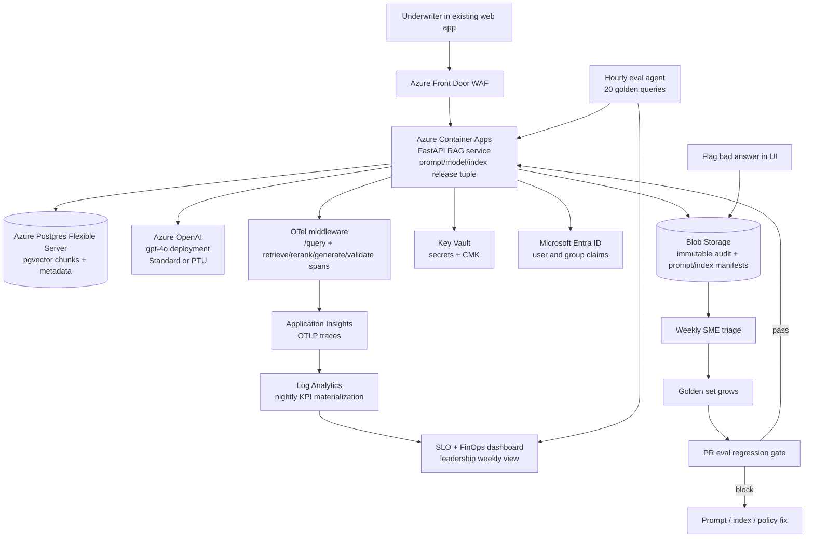

# LLMOps, Monitoring, Cost & Reliability — Applied

> Topic package — Week 22b · Roadmap Week 22b — LLMOps, Monitoring, Cost & Reliability · Applied.
> Depth goal: operate the Week 20b Azure deployment as a real customer system: negotiate AI-specific SLOs, instrument Container Apps and Azure OpenAI with safe telemetry, control Standard/PTU cost and quota, detect query/corpus/model drift, and run incidents through customer-facing FDE runbooks that improve the golden set after every failure.

## Source
- Track: AI Architecture (self-directed, FDE roadmap)
- Slide deck: `07 Resources Library/AI Architecture/Slides/Lesson_06_LLMOps,_Monitoring,_Cost_&_Reliability_—_Applied.pptx`
- Hands-on notebook: `07 Resources Library/AI Architecture/Notebooks/06_LLMOps,_Monitoring,_Cost_&_Reliability_—_Applied.ipynb` (runs offline)
- Reference reading: OpenTelemetry specification and Python SDK; Azure Monitor Application Insights and Log Analytics docs; Azure OpenAI quotas, PTU, Standard deployments, model-version, pricing, and content filtering docs; Azure Container Apps revisions and traffic-splitting docs; Azure Database for PostgreSQL Flexible Server pgvector docs; Azure Blob immutability docs; Azure Key Vault and Microsoft Entra ID docs; SRE Workbook error budgets and alerting; OWASP Top 10 for LLM Applications; FinOps Foundation allocation and unit-economics guidance
- Builds on: [[02 Literature Notes/AI Architecture/Cloud Architecture & Deployment — Applied]]
- Date: 2026-07-18

---

## 1. Mental Model

**Week 22b is the point where the insurance-underwriter assistant stops being a deployment and becomes an operated product.** Week 19b chose the architecture; Week 20b deployed it on Azure Container Apps, Azure OpenAI, Postgres pgvector, Blob audit, Key Vault, Entra ID, and App Insights with prompt/model/index rollback lanes. The applied LLMOps job is to prove, every week, that the assistant is available, fast enough, grounded, safe, affordable, and correctable.

For this customer, trust is not a vibe. It is a contract: 99.5% availability, p95 answer latency at or below 6 seconds, groundedness at least 92% on the underwriting golden set, refusal rate no higher than 8%, hallucination rate no higher than 1%, cost per answered question no higher than $0.08, and tool-call success at least 98%. Every production answer carries the release tuple `(prompt_version, model_deployment, index_version)`, safe span attributes, audit ids, and a rollback path.

> Key intuition: **LLMOps is the customer-trust control layer for enterprise AI** — SLO contract → telemetry → eval canaries → budget guardrails → incident runbook → golden-set correction loop.



---

## 2. How It Actually Works

### 22b.1 The customer-facing SLO contract
The FDE runs an SLO workshop with the director of underwriting, compliance, platform engineering, and finance. The conversation is concrete: if the assistant is unavailable for half a day, underwriting reverts to manual search but does not stop binding business, so **availability ≥ 99.5%** is acceptable for the first production phase. If answers take longer than a human's first search pass, trust erodes, so **p95 answer latency ≤ 6s** for the `/query` path becomes the executive latency SLO. Compliance will not tolerate unsupported guidance, so **groundedness ≥ 92%** on the underwriting golden set and **hallucination rate ≤ 1%** are stricter than a generic chatbot. Refusals protect the firm, but too many refusals make the tool useless, so **refusal rate ≤ 8%**. Finance sets **cost-per-answered-question ≤ $0.08** because baseline traffic is 50 underwriters × 40 questions/day and a budget envelope near $3/user/day. Tool-based metadata lookups into Policy Admin and claims precedent must succeed **≥ 98%** or the assistant returns stale or partial context.

The error budget is customer-facing. Availability has roughly 3.6 hours/month of budget at 99.5%. Quality budgets are reported as missed golden-set cases, hallucinated answers, and refusal overages, not just uptime minutes. If a budget is burned by a bad prompt, model snapshot, index build, or provider outage, the next release window is frozen for feature work and used for correction until the budget recovers. Monthly reporting shows: SLO table, trend line, error-budget remaining, top incidents, cost by tenant/user/feature/prompt version, and corrective actions added to the eval set. Leadership's weekly dashboard is one page: green/yellow/red SLO cards on top; latency and groundedness trend; top three cost drivers; active incident/risk list; release tuple currently in production.

### 22b.2 Instrumentation plan on the deployed topology
The Week 20b deployment already has Azure Container Apps, Azure OpenAI, Postgres pgvector, Blob audit, Key Vault, Entra ID, App Insights, private endpoints, and axis-aware prompt/model/index release metadata. Week 22b instruments that path. FastAPI middleware creates a root OpenTelemetry span for every `/query`. Child spans wrap `retrieve`, `rerank`, `generate`, and `validate`, plus tool calls to Policy Admin and claims precedent where applicable. The app exports OTLP to Application Insights; App Insights is connected to Log Analytics for queryable traces and metrics. Full prompts and retrieved text do **not** go to telemetry; full audit evidence remains in immutable Blob with retention and access controls.

Required span attributes are exactly the AI operations contract: `ai.model`, `ai.prompt.version`, `ai.index.version`, `ai.retrieved.count`, `ai.retrieved.doc_ids` using hashed ids only, `ai.tokens.prompt`, `ai.tokens.completion`, `ai.cost.usd`, `ai.grounded.score`, `ai.tenant`, and `ai.user_hash`. The tracer boundary is the PII redaction boundary: raw underwriter names, emails, submission ids, policy text, memo text, and user questions are not span attributes. Tenant is a stable internal tenant code; user is salted hash; document ids are one-way hashed. A nightly Log Analytics saved query materializes AI KPIs — groundedness, cost by tenant/user/feature/prompt version, refusal rate, hallucination count, and tool success — into the operations dashboard backed by Cosmos DB or saved KQL views. A lightweight eval agent replays 20 golden queries hourly through the same Container App route with synthetic identities and pushes the scores to the same dashboard, so online user symptoms and controlled canaries are visible side by side.

### 22b.3 Cost, quota, and budget in practice
Baseline math uses the customer's actual launch population: **50 underwriters × 40 questions/day × 22 workdays = 44,000 questions/month**. The applied week uses a larger observed average than Week 19b because prompt revisions added retrieved context: about **2,500 total tokens/query**. At illustrative GPT-4o pricing of $2.50/M input and $10/M output, a 1,900 input + 600 output split costs about **$0.01075/query**, or **$473/month** for pure generation before evals, embeddings, logs, and infrastructure. The operating budget is intentionally higher: **$3/user/day → $150/day → $3,300/month** baseline envelope, leaving room for eval canaries, retries, non-prod, App Insights, Postgres, Blob audit, Container Apps, and Front Door.

PTU versus Standard is not a magic break-even; it is a utilization and latency variance decision. If a small PTU commitment is roughly $6,000/month, pure Standard generation at $0.01075/query would need about **558k answered questions/month** to break even on token dollars alone. The baseline 44k/month stays Standard. At **200 users**, traffic is 176k queries/month; Standard generation after a 20% semantic-cache hit rate is about 141k billable queries, roughly $1.5k token spend, still below PTU on dollars. But PTU can be justified when the underwriter workday creates concurrency spikes and p95 variance matters more than average cost; a small PTU commitment flattens tail latency during 9am-3pm underwriting peaks and avoids quota fights with other Azure OpenAI workloads.

Semantic cache assumptions are tenant-scoped and conservative: **18-25%** hit rate for repeated precedent and policy-interpretation questions, with TTLs and prompt-version invalidation. At 22% hit rate, baseline GPT-4o generation drops from about $473 to $369/month, but the bigger win is smoothing latency and reducing quota pressure. When the CFO sees an Azure OpenAI spike, the FinOps dashboard slices by tenant, feature, prompt version, model deployment, and token type. In the worked incident, no tenant misbehaved: `prompt-v21` expanded retrieval context from 5 to 12 chunks, raising prompt tokens by 65%. The correction is a prompt/index fix plus a cost regression gate, not a blame email to the highest-volume team.

### 22b.4 Drift, evaluation regression, and the feedback loop
This customer has three live drift sources. **Query drift** appears after a regulatory change: underwriters suddenly ask about a new state filing pattern, and old golden questions no longer represent the workload. Detect it with an embedding-drift statistic on a rolling window of hashed/redacted query embeddings, clustered by tenant and product line. **Corpus drift** happens because 500 new policy documents are ingested weekly; even if all chunks embed correctly, retrieval behavior can change when near-duplicate policy language crowds out older authoritative sections. Detect it with nightly eval replay, retrieval recall/citation coverage, and shadow-index comparisons before alias promotion. **Silent model drift** happens when Azure updates or routes a GPT-4o snapshot and groundedness drops two points overnight. Detect it with hourly canaries and pin model deployments or canary snapshots where the service supports it.

The correction loop is an FDE-owned operating ritual: a bad answer is flagged in the UI; the system writes an immutable Blob audit record with trace id, release tuple, hashed retrieved doc ids, answer, policy decision, and redacted user context; weekly SME triage labels the failure; the case is added to the golden set; the fix is a prompt, index, guardrail, or retrieval-filter PR; CI runs regression. The gate is explicit: a prompt PR runs the golden set, compares baseline to candidate, and **blocks merge if groundedness delta < -1 percentage point or cost delta > +10%**. Two improved examples do not excuse one regulated question regressing below the threshold. This is how production failures become permanent tests instead of tribal memory.

### 22b.5 Incident response and the on-call runbook
Incident one: at 2am the hourly canary detects a groundedness drop after an Azure GPT-4o snapshot swap. The SLI that fires is canary groundedness below 92% or a negative delta greater than 1pp against baseline. Runbook: acknowledge page; confirm App Insights traces and eval agent health; compare release tuple; roll traffic to the previous model deployment where possible or previous prompt version if model rollback is unavailable; preserve the healthy index; open an Azure provider case with failed query ids; monitor the next canary; tell the customer by 8am what was detected, mitigated, and being verified. Correction: add the failed canary examples to the golden set and pin or isolate model deployments more aggressively.

Incident two: runaway cost spike. The SLI is cost/query or daily Azure OpenAI spend breaching budget, often with prompt-token p95 jumping. Runbook: slice dashboard by tenant, prompt version, feature, and retrieved chunk count; identify whether this is tenant behavior, prompt expansion, agent loop, or provider retry storm; apply per-tenant rate limit or feature throttle if needed; roll back prompt/model/index axis if a release caused it; engage the customer's business owner with numbers, not accusations. Correction: add a cost regression case, reduce context window, tighten top-k/rerank, and add alerting on retrieval-context token p95.

Incident three: suspected prompt injection. The SLI is a safety flag spike or an audit report where the answer exposes internal system-prompt content. Runbook: capture the trace and Blob audit record; block similar patterns with a guardrail rule and retrieval sanitization; revoke any exposed secret if one appeared; escalate to security and compliance; pause affected prompt version or tenant route if needed; communicate impact and containment to the customer. Correction: add the attack to the red-team/golden set, improve delimiters and instruction precedence, and update the postmortem with detection, mitigation, and prevention owners.

---

## 3. Implementation

Assumed stack: Python stdlib plus numpy and Pydantic v2. The snippets are offline tools an FDE can use in the customer operating meeting and on-call rotation; no Azure credentials or network calls are needed. Snippets:
- [[04 Code Snippets/AI Architecture/AI Week 22b Underwriter SLO Dashboard Evaluator]]
- [[04 Code Snippets/AI Architecture/AI Week 22b AI Incident Response Classifier and Runbook Selector]]

### AI Week 22b Underwriter SLO Dashboard Evaluator
Pydantic v2 SLO contract and deterministic weekly-report evaluator for availability, p95 latency, groundedness, refusal, hallucination, cost, tool success, error budget, cost tenants, and drift indicators.
```python
from __future__ import annotations
from collections import defaultdict
from statistics import mean
from typing import Literal
from pydantic import BaseModel, ConfigDict, Field

Status = Literal['PASS', 'AT_RISK', 'BREACH']

class CustomerSLOContract(BaseModel):
    model_config = ConfigDict(extra='forbid')
    availability: float = Field(0.995, ge=0, le=1)
    p95_latency_s: float = Field(6.0, gt=0)
    groundedness: float = Field(0.92, ge=0, le=1)
    refusal_rate: float = Field(0.08, ge=0, le=1)
    hallucination_rate: float = Field(0.01, ge=0, le=1)
    cost_per_query_usd: float = Field(0.08, gt=0)
    tool_call_success: float = Field(0.98, ge=0, le=1)
    monthly_availability_error_budget_min: float = 216.0  # 99.5% ~= 3.6 hours/month

class RequestRecord(BaseModel):
    tenant: str
    latency_s: float
    answered: bool = True
    grounded_score: float
    refused: bool = False
    hallucinated: bool = False
    cost_usd: float
    tool_ok: bool = True
    query_embedding_shift: float = 0.0
    available: bool = True

class SLOResult(BaseModel):
    observed: float
    target: float
    status: Status
    delta: float

class PeriodReport(BaseModel):
    slo_results: dict[str, SLOResult]
    error_budget_remaining_pct: float
    top_cost_tenants: list[tuple[str, float]]
    top_drift_indicator: str
    markdown: str

def p95(values: list[float]) -> float:
    values = sorted(values)
    if not values:
        return 0.0
    index = int(round(0.95 * (len(values) - 1)))
    return values[index]

def classify_good(observed: float, target: float, higher_is_better: bool) -> Status:
    margin = observed - target if higher_is_better else target - observed
    if margin >= 0:
        return 'PASS'
    tolerance = abs(target) * 0.05
    return 'AT_RISK' if margin >= -tolerance else 'BREACH'

def evaluate_period(records: list[RequestRecord], contract: CustomerSLOContract = CustomerSLOContract()) -> PeriodReport:
    total = len(records)
    availability = sum(r.available for r in records) / total
    answered = [r for r in records if r.answered]
    latency = p95([r.latency_s for r in answered])
    grounded = mean([r.grounded_score for r in answered])
    refusal_rate = sum(r.refused for r in records) / total
    hallucination_rate = sum(r.hallucinated for r in records) / total
    cost = mean([r.cost_usd for r in answered])
    tool_success = sum(r.tool_ok for r in records) / total
    observed = {
        'availability': (availability, contract.availability, True),
        'p95_latency_s': (latency, contract.p95_latency_s, False),
        'groundedness': (grounded, contract.groundedness, True),
        'refusal_rate': (refusal_rate, contract.refusal_rate, False),
        'hallucination_rate': (hallucination_rate, contract.hallucination_rate, False),
        'cost_per_query_usd': (cost, contract.cost_per_query_usd, False),
        'tool_call_success': (tool_success, contract.tool_call_success, True),
    }
    results = {name: SLOResult(observed=round(v, 4), target=t, status=classify_good(v, t, hib), delta=round(v - t, 4)) for name, (v, t, hib) in observed.items()}
    downtime_min = (1 - availability) * contract.monthly_availability_error_budget_min / (1 - contract.availability)
    remaining = max(0.0, 100.0 * (1 - downtime_min / contract.monthly_availability_error_budget_min))
    by_tenant = defaultdict(float)
    drift_by_tenant = defaultdict(list)
    for r in records:
        by_tenant[r.tenant] += r.cost_usd
        drift_by_tenant[r.tenant].append(r.query_embedding_shift)
    top_cost = sorted(by_tenant.items(), key=lambda kv: kv[1], reverse=True)[:3]
    drift_scores = {tenant: mean(vals) for tenant, vals in drift_by_tenant.items()}
    drift_tenant, drift_value = max(drift_scores.items(), key=lambda kv: kv[1])
    lines = ['# Weekly Underwriter AI SLO Report', '', '| SLO | Observed | Target | Status | Delta |', '|---|---:|---:|---|---:|']
    for name, result in results.items():
        lines.append(f"| {name} | {result.observed:.4f} | {result.target:.4f} | {result.status} | {result.delta:+.4f} |")
    lines += ['', f'Error budget remaining: **{remaining:.1f}%**', '', 'Top cost tenants:']
    lines += [f'- {tenant}: ${amount:.2f}' for tenant, amount in top_cost]
    lines.append(f'Top drift indicator: {drift_tenant} rolling query shift {drift_value:.3f}')
    return PeriodReport(slo_results=results, error_budget_remaining_pct=round(remaining, 1), top_cost_tenants=[(t, round(c, 2)) for t, c in top_cost], top_drift_indicator=f'{drift_tenant}:{drift_value:.3f}', markdown='\n'.join(lines))

records = [RequestRecord(tenant=f'tenant-{i%4}', latency_s=4.2 + (i%9)*0.18, grounded_score=0.93 - (0.03 if i in {7, 31} else 0), refused=i%17==0, hallucinated=i==31, cost_usd=0.045 + (0.04 if i%13==0 else 0), tool_ok=i%29!=0, query_embedding_shift=0.10 + (0.25 if i%11==0 else 0)) for i in range(50)]
report = evaluate_period(records)
print(report.markdown)
```

### AI Week 22b AI Incident Response Classifier and Runbook Selector
Rule-driven Pydantic incident classifier that maps alerts to first SLI check, rollback axis, customer message, and post-incident correction for the underwriter assistant.
```python
from typing import Literal
from pydantic import BaseModel, ConfigDict, Field

SignalType = Literal['groundedness_drop','cost_spike','latency_regression','safety_flag_spike','provider_5xx_burst','injection_pattern_detected']
Axis = Literal['prompt','model','index','tenant_limit','provider_route','guardrail']

class AlertPayload(BaseModel):
    model_config = ConfigDict(extra='forbid')
    signal_type: SignalType
    magnitude: float
    tenant: str
    model: str
    prompt_version: str

class Runbook(BaseModel):
    incident: str
    sli_to_check_first: str
    rollback_axis: Axis
    steps: list[str]
    customer_message_template: str
    post_incident_correction: str

def select_runbook(alert: AlertPayload) -> Runbook:
    common = ['Acknowledge page and open incident channel', 'Attach App Insights trace links and current prompt/model/index tuple']
    if alert.signal_type == 'groundedness_drop':
        return Runbook(
            incident='Groundedness regression canary', rollback_axis='model', sli_to_check_first='Hourly golden-set groundedness and canary-vs-baseline delta',
            steps=common + ['Confirm eval agent is healthy', 'Compare Azure OpenAI deployment and prompt version to last green canary', 'Rollback model deployment if changed; otherwise rollback prompt pointer', 'Monitor next canary before closing mitigation'],
            customer_message_template='We detected a quality regression in controlled canaries for {tenant}, mitigated by reverting the model/prompt lane, and are validating the next canary before user traffic is expanded.',
            post_incident_correction='Add failed canary items to the golden set and pin or isolate the model deployment where supported.')
    if alert.signal_type == 'cost_spike':
        return Runbook(
            incident='Runaway retrieval-context or agent cost', rollback_axis='tenant_limit', sli_to_check_first='Cost/query, prompt-token p95, retrieved.count p95 by tenant and prompt version',
            steps=common + ['Slice spend by tenant, feature, prompt version, model, and token type', 'Apply temporary per-tenant rate limit or feature throttle', 'Rollback prompt/index if retrieval context expanded after release', 'Review query pattern with customer owner'],
            customer_message_template='We see a spend anomaly isolated to {tenant}; service remains available while we apply a temporary budget guard and review the usage pattern with your team.',
            post_incident_correction='Add cost regression tests and an alert on retrieval-context token p95; tune top-k/rerank/prompt context.')
    if alert.signal_type == 'injection_pattern_detected':
        return Runbook(
            incident='Suspected prompt injection', rollback_axis='guardrail', sli_to_check_first='Safety flag spike and audit report of system-prompt leakage',
            steps=common + ['Capture Blob audit record and trace id', 'Block similar pattern with guardrail rule', 'Escalate to security and compliance', 'Pause affected prompt version or tenant route if needed'],
            customer_message_template='We detected a suspected prompt-injection pattern for {tenant}, contained similar prompts, preserved audit evidence, and escalated to security for impact review.',
            post_incident_correction='Add the attack to red-team and golden evals; strengthen delimiters, instruction precedence, and retrieval sanitization.')
    if alert.signal_type == 'latency_regression':
        axis = 'model' if alert.magnitude > 1.5 else 'index'
        return Runbook(incident='Latency regression', rollback_axis=axis, sli_to_check_first='p95 /query latency by model, index, tenant, and provider status', steps=common + ['Check Azure OpenAI latency and Postgres retrieval latency', f'Rollback {axis} axis if regression aligns with release', 'Scale Container Apps or switch PTU/Standard route if saturation is confirmed'], customer_message_template='We are mitigating a latency regression affecting {tenant}; answers remain controlled by the same audit and quality gates.', post_incident_correction='Add latency replay case and capacity threshold to release gate.')
    if alert.signal_type == 'provider_5xx_burst':
        return Runbook(incident='Azure OpenAI provider 5xx burst', rollback_axis='provider_route', sli_to_check_first='Provider 5xx rate and Retry-After compliance', steps=common + ['Enable circuit breaker', 'Reduce concurrency and respect Retry-After', 'Fail to cached-answer/human-review mode for high-risk questions'], customer_message_template='Azure OpenAI is returning elevated transient errors; we have reduced retry pressure and enabled fallback operating mode for {tenant}.', post_incident_correction='Tune retry budget and provider outage drill.')
    return Runbook(incident='Safety flag spike', rollback_axis='guardrail', sli_to_check_first='Unsafe completion rate and refusal correctness', steps=common + ['Raise refusal threshold', 'Review flagged samples', 'Escalate if regulated content was exposed'], customer_message_template='We are investigating elevated safety flags for {tenant} and have tightened temporary guardrails.', post_incident_correction='Refresh safety eval set and policy labels.')

scenarios = [
    AlertPayload(signal_type='groundedness_drop', magnitude=0.025, tenant='commercial-lines', model='gpt-4o-prod', prompt_version='prompt-v21'),
    AlertPayload(signal_type='cost_spike', magnitude=4.0, tenant='west-region', model='gpt-4o-prod', prompt_version='prompt-v21'),
    AlertPayload(signal_type='injection_pattern_detected', magnitude=1.0, tenant='commercial-lines', model='gpt-4o-prod', prompt_version='prompt-v21'),
]
for alert in scenarios:
    rb = select_runbook(alert)
    print('\n##', rb.incident)
    print('first SLI:', rb.sli_to_check_first)
    print('rollback axis:', rb.rollback_axis)
    for step in rb.steps:
        print('-', step)
    print('customer:', rb.customer_message_template.format(tenant=alert.tenant))
    print('correction:', rb.post_incident_correction)
```

---

## 4. Design Decisions & Tradeoffs

| Decision | Guidance |
|---|---|
| **SLO targets with business owners** | Negotiate SLOs from workflow risk: underwriting can tolerate brief downtime but not unsupported guidance, so quality and hallucination targets are stricter than generic web-app metrics. |
| **Telemetry boundary** | Send safe attributes to App Insights and KQL; keep raw prompts, answers, and retrieved text in immutable Blob audit with access controls and retention policy. |
| **Standard versus PTU** | Keep Standard at 50 users; evaluate small PTU around 200 users for quota and p95 stability, not because pure token dollars already break even. |
| **Cache policy** | Use tenant-scoped semantic cache only for low-risk, freshness-tolerant answers; invalidate on prompt/index/policy change and never share cached answers across tenants. |
| **Drift detection cadence** | Use hourly canaries for model/prompt regressions, nightly corpus evals for retrieval drift, and rolling embedding statistics for query drift. |
| **Incident rollback axis** | Rollback prompt, model, index, guardrail, or tenant limit independently so one bad axis does not undo healthy deployment work from Week 20b. |

---

## 5. Failure Modes & Gotchas

- A silent Azure GPT-4o snapshot change at 2am drops groundedness two points; uptime is green, but the FDE must rollback or route around the model lane before underwriters start work.
- A cost blowup is initially blamed on the highest-volume tenant; the real cause is a prompt tweak that raised retrieval-context tokens across all tenants.
- On-call is woken by a groundedness alert caused by stale golden-set labels after a regulatory change, proving eval freshness is itself an operational dependency.
- Retrieval quality drift alerts too late because citation coverage was averaged over a week, hiding a bad shadow-index alias promoted on Monday morning.
- Verbose traces accidentally include policy excerpts in Log Analytics; observability spend spikes and compliance scope expands beyond the intended Blob audit boundary.
- A prompt-injection report is treated as a one-off bad answer instead of a security incident; no guardrail is added and similar patterns keep leaking internal instruction text.

---

## 6. FDE Angle

- LLMOps is the customer trust layer: it turns a demo into a hand-offable service with measurable quality, cost, safety, and rollback evidence.
- The FDE owns the customer conversation when an AI SLO burns budget; platform teams can fix infrastructure, but the customer needs business impact, mitigation, and prevention in plain language.
- Per-tenant and per-prompt cost attribution lets finance see unit economics before the Azure OpenAI bill becomes a political incident.
- Every bad production answer should become an eval artifact, a pipeline gate, or a runbook correction; otherwise the same failure will reappear in front of the customer.

---

## 7. Self-Check

1. Why is groundedness an SLO and not just an offline evaluation metric for this insurance customer?
2. Which exact OpenTelemetry span attributes are safe to export, and which data stays only in Blob audit?
3. At 50 users versus 200 users, what justifies Standard or PTU for Azure OpenAI?
4. How do query drift, corpus drift, and silent model drift differ in detection and mitigation?
5. What does the eval regression gate block when a prompt improves two examples but regresses one regulated case?
6. For the three incidents, which SLI fires first and which rollback axis should the FDE try first?

## 8. Links
- Domain MOC: [[06 Maps of Content/AI Architecture Concepts]]
- Code: [[04 Code Snippets/AI Architecture/AI Week 22b Underwriter SLO Dashboard Evaluator]], [[04 Code Snippets/AI Architecture/AI Week 22b AI Incident Response Classifier and Runbook Selector]]
- Distilled: [[03 Permanent Notes/AI Week 22b Customer SLO Contract for Enterprise AI]], [[03 Permanent Notes/AI Week 22b Enterprise AI On-Call Runbook Bundle]]
- Upstream: [[02 Literature Notes/AI Architecture/Cloud Architecture & Deployment — Applied]] · Reference sibling: [[02 Literature Notes/AI Architecture/LLMOps, Monitoring, Cost & Reliability — Reference Patterns]] · Downstream: [[06 Maps of Content/AI Architecture Concepts]]
