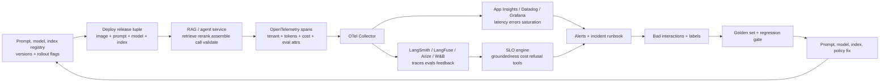

# LLMOps, Monitoring, Cost & Reliability — Reference Patterns

> Topic package — Week 22a · Roadmap Week 22a — LLMOps, Monitoring, Cost & Reliability · Reference Patterns.
> Depth goal: operate LLM-backed enterprise products with SRE-grade reliability and AI-specific controls: prompt/model/index registries, OpenTelemetry traces across RAG, eval-backed SLOs, cost and quota budgets, provider fallback, drift detection, and post-incident correction loops that improve the system after every bad interaction.

## Source
- Track: AI Architecture (self-directed, FDE roadmap)
- Slide deck: `07 Resources Library/AI Architecture/Slides/Lesson_05_LLMOps,_Monitoring,_Cost_&_Reliability_—_Reference_Patterns.pptx`
- Hands-on notebook: `07 Resources Library/AI Architecture/Notebooks/05_LLMOps,_Monitoring,_Cost_&_Reliability_—_Reference_Patterns.ipynb` (runs offline)
- Reference reading: OpenTelemetry specification and semantic conventions; Azure OpenAI Service quotas, TPM/RPM, PTU, Retry-After, and pricing docs; Azure Monitor/Application Insights docs; AWS Bedrock and Google Vertex AI operations docs; LangSmith, LangFuse, Arize Phoenix, WhyLabs, and Weights & Biases documentation; Datadog and Grafana observability docs; OWASP Top 10 for LLM Applications; SRE error budget and alerting literature
- Builds on: [[02 Literature Notes/AI Architecture/Cloud Architecture & Deployment — Reference Patterns]]
- Date: 2026-07-18

---

## 1. Mental Model

**LLMOps is classical SRE plus a control loop for probabilistic, versioned behavior.** Uptime, p95 latency, saturation, retries, and error budgets still matter. LLM systems add artifacts that change answer quality without a code deploy: prompt templates, model deployments, embedding models, chunking logic, rerankers, vector indexes, tool schemas, safety policies, and golden datasets.

The production question is no longer only 'is the service up?' It is 'is the answer grounded, safe, affordable, attributable, and rollbackable for this tenant?' A green Kubernetes deployment can still be a failed AI release if groundedness drops five points, cost/request doubles, or a silent provider model update changes tool-call behavior.

> Key intuition: **treat LLM behavior as an observable, budgeted, versioned production surface.** The FDE loop is registry → deploy → trace → evaluate → alert → capture feedback → fix prompt/model/index → redeploy with proof.



---

## 2. How It Actually Works

### 22a.1 The LLMOps discipline vs classical SRE
Classical SRE asks whether the service is available, fast enough, safe to change, and inside its error budget. LLMOps keeps those questions and adds artifacts whose behavior can drift without application code changing: prompt versions, model deployments, embedding models, chunking policies, vector indexes, rerankers, tool schemas, safety filters, and eval datasets. These artifacts need registries, owners, versions, rollout rings, and rollback paths just like container images.

The standard MLOps loop is **data → train → deploy → monitor → retrain**. LLMOps extends it for systems that often use hosted foundation models and retrieval: **prompt/index/model registry → deploy → measure traces and costs → run offline/online evals → collect feedback → tune prompt, retriever, fine-tune, or policy → redeploy**. Hallucination, groundedness, faithfulness, refusal correctness, and tool-call success become first-class SLOs, not post-hoc QA notes. Cost/request also becomes a KPI because token spend varies by prompt, retrieved context, output length, model route, retries, and agent loops; CPU is comparatively predictable. A production AI release gate should block if golden-set quality regresses, even when uptime and latency are green.

### 22a.2 Observability for LLM systems
Trace the request at the RAG pipeline level: `rag.query` root span with children for retrieval, rerank, prompt assembly, model call, tool calls, output validation, safety filtering, and feedback recording. OpenTelemetry is the common substrate; App Insights, Datadog, and Grafana explain infra symptoms while LangSmith, LangFuse, Arize Phoenix, WhyLabs, and Weights & Biases explain AI behavior. Useful span attributes include `ai.prompt_hash`, `ai.prompt_version`, `ai.model_deployment`, `ai.embedding_model`, `ai.index_version`, `ai.retrieved_doc_ids`, `ai.tokens.prompt`, `ai.tokens.completion`, `ai.cost_usd`, `ai.groundedness_score`, `ai.safety_flags`, `tenant.id`, and `feature.name`.

Sampling must be deliberate. Capture 100% of provider errors, validation failures, eval failures, prompt-injection detections, PII-policy blocks, and expensive outliers; sample perhaps 5-10% of healthy traffic, always after dropping or hashing PII. In multi-tenant enterprise systems, per-tenant tracing is non-negotiable: a bad index for one business unit should not look like global quality drift. Correlate AI metrics with infra metrics: a p95 spike may be provider saturation, while a groundedness drop may be a prompt/index/model change with no CPU signal.

### 22a.3 SLOs and SLIs for LLM-backed products
Keep normal service SLIs: availability, 5xx rate, p95/p99 latency, queue age, provider error rate, and saturation. Then add AI-specific SLIs: groundedness ≥ 0.88 on the golden set, faithfulness ≥ 0.90, hallucination rate < 2%, refusal correctness ≥ 0.95, unsafe completion rate < 0.1%, tool-call success ≥ 0.97, citation coverage ≥ 0.95 for RAG answers, and cost/request ≤ a product-specific threshold such as $0.02 for GPT-4o-mini paths or $0.20 for GPT-4o analyst workflows. Typical latency expectations: embedding calls around 100-300 ms, gpt-4o-mini around 500 ms-1 s for short outputs, and GPT-4o around 2-4 s p95 depending on output length and region.

Error budgets apply to quality. If a prompt release drops groundedness from 0.91 to 0.86, it burns budget even when uptime remains 99.9%. Alert on trends and statistically meaningful windows, not single-answer spikes, because LLM quality is naturally noisy. Define the golden dataset from real tenant workflows: top questions, high-risk edge cases, known prior incidents, adversarial injection examples, and fresh corpus changes. Keep it fresh with SME review and production sampling; stale labels create label rot and make a drifting system look safe.

### 22a.4 Cost, token, and rate-limit management
Token attribution is an architecture requirement. Track prompt tokens, completion tokens, embedding tokens, rerank calls, retries, cache hits, and cost by user, tenant, feature, model, prompt version, and route. This enables chargeback per business unit and lets the customer see that one agent workflow or 10% of users may drive 60% of spend. Use representative pricing in design reviews and verify current price cards before committing: GPT-4o has historically been in the few dollars per million input tokens and about ten dollars per million output tokens; gpt-4o-mini is far cheaper. Azure OpenAI capacity is constrained by **TPM** and **RPM** quotas; **PTU** utilization should be watched because reserved capacity that is idle still burns money.

Budget guards belong on the client and server: per-request max tokens, max tool calls, per-user daily budgets, per-tenant monthly caps, feature-level budgets, and model downgrade policies. Semantic caching can reduce spend by embedding the query and reusing a response above a similarity threshold, but it risks staleness, privacy leaks across tenants, and cache poisoning after prompt injection. Prompt compression and retrieval tuning trade context size against answer quality; fewer chunks lower cost but may harm groundedness. On budget exhaustion, degrade deliberately: cheaper model, shorter answer, search-only response, queued batch job, or denial with an auditable budget reason.

### 22a.5 Reliability, drift, and incident response
Provider calls need retry discipline from Week 04+ and circuit breakers from earlier reliability work. Retry 429s only after respecting `Retry-After`; retry 5xx and transient network failures with exponential backoff and jitter; never let every web worker retry at once. Put circuit breakers around model providers, vector stores, rerankers, and tools. Dual-provider fallback, such as Azure OpenAI GPT-4o primary to Bedrock Claude fallback, improves availability but is not plug-and-play: token counting, prompt behavior, safety filters, streaming shape, tool-call schema, and refusal style differ. Normalize through provider ports and test prompts against both.

Drift appears in multiple places: embedding-space drift in incoming queries, retrieval quality drift after corpus updates or re-chunking, prompt behavior drift after edits, and model-version drift when a provider silently updates a deployment. Eval regression tests in CI should block deploys if golden-set score falls beyond tolerance. AI incident response needs named runbooks: mass hallucination outbreak, prompt injection incident, retrieval poisoning, runaway agent cost, provider outage, and PII leak. The post-incident correction loop is mandatory: capture bad interactions, redact safely, add them to the eval set, fix prompt/model/index/policy, verify no regression, and document rollback and customer impact.

---

## 3. Implementation

Assumed stack: Python stdlib plus Pydantic v2 and OpenTelemetry SDK available offline. Snippets make LLMOps observable and enforceable: a local RAG trace with cost accounting and a budget/SLO guard for request admission. Snippets:
- [[04 Code Snippets/AI Architecture/AI Week 22a LLM Request Tracer With Cost Accounting]]
- [[04 Code Snippets/AI Architecture/AI Week 22a SLO and Cost Budget Guard]]

### AI Week 22a LLM Request Tracer With Cost Accounting
An offline OpenTelemetry RAG trace with child spans for retrieval, rerank, prompt assembly, model call, validation, token counts, cost, and groundedness flags.
```python
import hashlib
from dataclasses import dataclass
from opentelemetry import trace
from opentelemetry.sdk.trace import TracerProvider
from opentelemetry.sdk.trace.export import SimpleSpanProcessor
from opentelemetry.sdk.trace.export.in_memory_span_exporter import InMemorySpanExporter

MODEL_PRICES_PER_1K = {
    'gpt-4o-prod': {'prompt': 0.0050, 'completion': 0.0150},
    'gpt-4o-mini-prod': {'prompt': 0.00015, 'completion': 0.00060},
}

exporter = InMemorySpanExporter()
provider = TracerProvider()
provider.add_span_processor(SimpleSpanProcessor(exporter))
trace.set_tracer_provider(provider)
tracer = trace.get_tracer('ai-week-22a-llmops')

@dataclass(frozen=True)
class QueryScenario:
    tenant: str
    query: str
    model: str
    docs: list[str]
    prompt_tokens: int
    completion_tokens: int
    groundedness: float
    safety_flags: list[str]

def prompt_hash(text: str) -> str:
    return hashlib.sha256(text.encode()).hexdigest()[:12]

def request_cost(model: str, prompt_tokens: int, completion_tokens: int) -> float:
    price = MODEL_PRICES_PER_1K[model]
    return (prompt_tokens / 1000 * price['prompt']) + (completion_tokens / 1000 * price['completion'])

def traced_rag_query(s: QueryScenario):
    prompt = f'Answer with citations only. Tenant={s.tenant}. Question={s.query}. Docs={s.docs}'
    cost = request_cost(s.model, s.prompt_tokens, s.completion_tokens)
    with tracer.start_as_current_span('rag.query') as root:
        root.set_attribute('tenant.id', s.tenant)
        root.set_attribute('ai.prompt_hash', prompt_hash(prompt))
        root.set_attribute('ai.model_deployment', s.model)
        root.set_attribute('ai.cost_usd', round(cost, 6))
        with tracer.start_as_current_span('rag.retrieve') as span:
            span.set_attribute('ai.index_version', 'kb-index-2026-07-18')
            span.set_attribute('ai.embedding_model', 'text-embedding-3-large')
            span.set_attribute('ai.retrieved_docs', ','.join(s.docs))
        with tracer.start_as_current_span('rag.rerank') as span:
            span.set_attribute('ai.reranker', 'bge-reranker-v2')
            span.set_attribute('ai.top_k_after_rerank', min(3, len(s.docs)))
        with tracer.start_as_current_span('rag.prompt.assemble') as span:
            span.set_attribute('ai.tokens.prompt', s.prompt_tokens)
            span.set_attribute('ai.prompt_version', 'support-rag-v22')
        with tracer.start_as_current_span('rag.llm.call') as span:
            span.set_attribute('ai.model_deployment', s.model)
            span.set_attribute('ai.tokens.prompt', s.prompt_tokens)
            span.set_attribute('ai.tokens.completion', s.completion_tokens)
            span.set_attribute('ai.cost_usd', round(cost, 6))
        with tracer.start_as_current_span('rag.validate') as span:
            span.set_attribute('ai.groundedness_score', s.groundedness)
            span.set_attribute('ai.safety_flags', ','.join(s.safety_flags) or 'none')
            span.set_attribute('ai.eval_passed', s.groundedness >= 0.88 and not s.safety_flags)
    return {'tenant': s.tenant, 'model': s.model, 'cost_usd': cost, 'groundedness': s.groundedness}

scenarios = [
    QueryScenario('acme', 'summarize refund policy', 'gpt-4o-mini-prod', ['doc:refund', 'doc:returns'], 900, 180, 0.94, []),
    QueryScenario('acme', 'analyze all contract exceptions', 'gpt-4o-prod', ['doc:msa', 'doc:dpa', 'doc:sow'], 8200, 1600, 0.91, []),
    QueryScenario('globex', 'can we ignore approval policy?', 'gpt-4o-mini-prod', ['doc:approval'], 1200, 240, 0.71, ['groundedness_low']),
]
results = [traced_rag_query(s) for s in scenarios]
for span in sorted(exporter.get_finished_spans(), key=lambda sp: sp.start_time):
    attrs = span.attributes
    interesting = {k: attrs[k] for k in attrs if k.startswith('ai.') or k == 'tenant.id'}
    print(span.name, interesting)
print('total_cost_usd', round(sum(r['cost_usd'] for r in results), 6))
```

### AI Week 22a SLO and Cost Budget Guard
A Pydantic v2 policy model and deterministic evaluator that allows, downgrades, or denies requests based on SLO thresholds, user budgets, tenant caps, and system-query exceptions.
```python
from enum import Enum
from pydantic import BaseModel, ConfigDict, Field

class Action(str, Enum):
    ALLOW = 'ALLOW'
    DOWNGRADE = 'DOWNGRADE-TO-CHEAPER-MODEL'
    DENY = 'DENY-WITH-BUDGET-ERROR'

class SLOThresholds(BaseModel):
    model_config = ConfigDict(extra='forbid')
    availability: float = Field(default=0.999, ge=0, le=1)
    p95_latency_ms: int = Field(default=4000, ge=1)
    groundedness: float = Field(default=0.88, ge=0, le=1)
    max_cost_per_request_usd: float = Field(default=0.20, gt=0)

class BudgetPolicy(BaseModel):
    model_config = ConfigDict(extra='forbid')
    per_user_daily_budget_usd: float = Field(default=2.00, gt=0)
    per_tenant_monthly_cap_usd: float = Field(default=100.00, gt=0)
    fallback_model: str = 'gpt-4o-mini-prod'
    downgrade_when_user_remaining_below_usd: float = 0.25

class RequestContext(BaseModel):
    user_id: str
    tenant_id: str
    feature: str
    model: str
    estimated_cost_usd: float
    is_system_query: bool = False

def evaluate_request(ctx: RequestContext, user_spend_today: dict[str, float], tenant_spend_month: dict[str, float], policy: BudgetPolicy):
    if ctx.is_system_query:
        return Action.ALLOW, ctx.model, 'system query'
    tenant_after = tenant_spend_month.get(ctx.tenant_id, 0.0) + ctx.estimated_cost_usd
    if tenant_after > policy.per_tenant_monthly_cap_usd:
        return Action.DENY, None, f'tenant monthly cap exceeded: {tenant_after:.2f}'
    user_after = user_spend_today.get(ctx.user_id, 0.0) + ctx.estimated_cost_usd
    remaining = policy.per_user_daily_budget_usd - user_after
    if user_after > policy.per_user_daily_budget_usd:
        if ctx.model != policy.fallback_model:
            return Action.DOWNGRADE, policy.fallback_model, f'user daily budget would exceed by {abs(remaining):.2f}'
        return Action.DENY, None, f'user daily cap exceeded: {user_after:.2f}'
    if remaining < policy.downgrade_when_user_remaining_below_usd and ctx.model != policy.fallback_model:
        return Action.DOWNGRADE, policy.fallback_model, f'user budget nearly exhausted: {remaining:.2f} remaining'
    return Action.ALLOW, ctx.model, f'budget ok: {remaining:.2f} user budget remaining'

slo = SLOThresholds()
policy = BudgetPolicy()
user_spend = {'heavy': 1.82}
tenant_spend = {'over-cap': 100.05, 'acme': 73.20}
scenarios = [
    RequestContext(user_id='fresh', tenant_id='acme', feature='chat', model='gpt-4o-prod', estimated_cost_usd=0.08),
    RequestContext(user_id='heavy', tenant_id='acme', feature='analysis', model='gpt-4o-prod', estimated_cost_usd=0.15),
    RequestContext(user_id='u3', tenant_id='over-cap', feature='chat', model='gpt-4o-mini-prod', estimated_cost_usd=0.01),
    RequestContext(user_id='monitor', tenant_id='over-cap', feature='health-check', model='gpt-4o-prod', estimated_cost_usd=0.50, is_system_query=True),
]
for ctx in scenarios:
    action, model, reason = evaluate_request(ctx, user_spend, tenant_spend, policy)
    print(ctx.user_id, '->', action.value, model, '|', reason)
print('slo_floor_groundedness', slo.groundedness, 'p95_ms', slo.p95_latency_ms)
```

---

## 4. Design Decisions & Tradeoffs

| Decision | Guidance |
|---|---|
| **Trace sampling policy** | Capture 100% of errors, eval failures, safety flags, prompt-injection detections, PII blocks, and high-cost outliers; sample only healthy traffic and drop/hash PII before export. |
| **Quality SLO vs uptime SLO** | Keep availability and p95 latency SLOs, but promote releases only when groundedness, faithfulness, refusal, tool success, and cost/request stay inside budget. |
| **Golden dataset ownership** | Build the golden set from real workflows, incident examples, high-risk edge cases, and fresh corpus changes; assign SME review so labels do not rot. |
| **Standard quota vs PTU** | Use Azure OpenAI Standard TPM/RPM for variable traffic; use PTU only when p95 variance, quota ceilings, and steady utilization justify reserved spend. |
| **Semantic cache vs fresh generation** | Cache only tenant-scoped, low-risk, freshness-tolerant answers with similarity and age thresholds; never share cache across tenants or cache unsafe/injected outputs. |
| **Single provider vs fallback** | Fallback improves availability only when provider ports normalize token counting, tool schemas, streaming, safety behavior, and eval results across Azure OpenAI, Bedrock, or Vertex. |

---

## 5. Failure Modes & Gotchas

- A silent provider model-version bump changes citation behavior overnight and groundedness drops five points while uptime, CPU, and HTTP error rate remain green.
- A semantic cache stores an answer produced after prompt injection; similar future questions receive the poisoned response until cache keys and safety invalidation are redesigned.
- A runaway agent loops over search and ticket tools, retries after 429s, and burns $10k in a night before tenant-level cost budgets are added.
- Verbose prompt and retrieved-context logs are shipped at 100% sampling; log-ingest cost dwarfs model cost and sensitive snippets appear in the observability backend.
- A drift detector alerts too late because the golden set still reflects last quarter's corpus; new policy documents changed expected answers but labels were never refreshed.
- During an Azure OpenAI provider incident, every app replica retries 429 and 5xx responses immediately instead of respecting Retry-After with jitter, amplifying the outage into a retry storm.

---

## 6. FDE Angle

- LLMOps discipline turns customer trust into evidence: every answer can be traced to prompt version, model deployment, index version, retrieved documents, cost, and eval outcome.
- Per-tenant token and cost attribution enables enterprise chargeback by business unit and prevents one pilot team from silently consuming the whole AI budget.
- A credible FDE incident story is specific: we detected groundedness regression, rolled back prompt/index/model within 15 minutes, and added the failure to the eval suite.
- Cost predictability is a feature: TPM/RPM quotas, PTU utilization, semantic cache policy, fallback models, and budget denials must be explainable to finance and platform owners.

---

## 7. Self-Check

1. What artifacts besides code must be versioned and rolled back in an LLM-backed product?
2. Which OpenTelemetry spans and attributes would you require for a production RAG request?
3. How can a prompt regression burn an error budget even if availability and latency stay green?
4. When is semantic caching safe, and what privacy or poisoning risks must be controlled?
5. How do Azure OpenAI TPM/RPM quotas and PTU utilization affect production architecture?
6. What steps belong in the post-incident correction loop after a hallucination or prompt-injection incident?

## 8. Links
- Domain MOC: [[06 Maps of Content/AI Architecture Concepts]]
- Code: [[04 Code Snippets/AI Architecture/AI Week 22a LLM Request Tracer With Cost Accounting]], [[04 Code Snippets/AI Architecture/AI Week 22a SLO and Cost Budget Guard]]
- Distilled: [[03 Permanent Notes/AI Week 22a LLM Observability Attribute Reference]], [[03 Permanent Notes/AI Week 22a AI SLO Design Guide]]
- Upstream: [[02 Literature Notes/AI Architecture/Cloud Architecture & Deployment — Reference Patterns]] · Downstream: [[06 Maps of Content/AI Architecture Concepts]]
