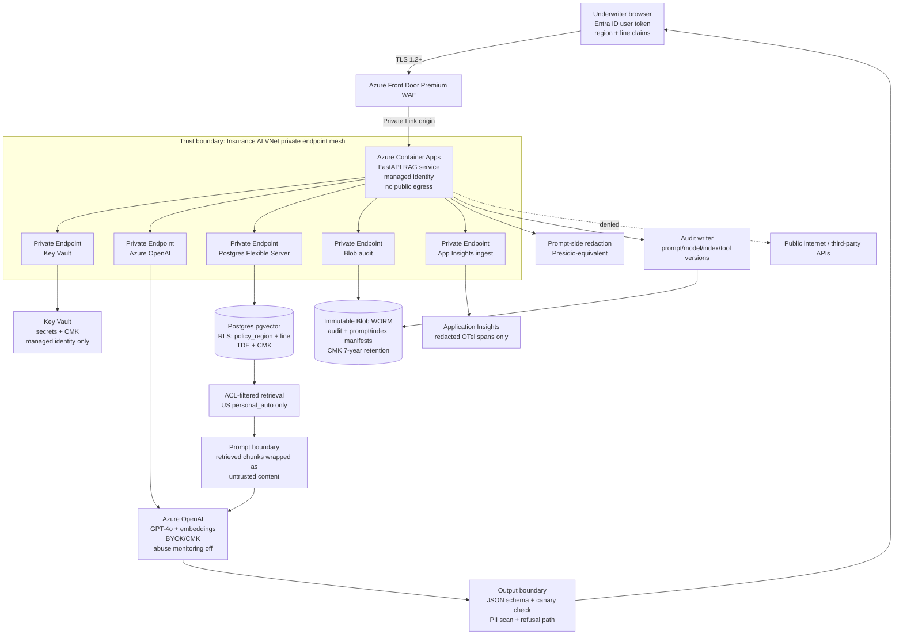

# Security, Governance & Responsible AI — Applied

> Topic package — Week 21b · Roadmap Week 21b — Security, Governance & Responsible AI · Applied.
> Depth goal: secure and govern the Week 20b Azure deployment as a production insurance system: prepare the SRB artifact, prove end-to-end data-flow controls, implement PII retention and erasure workflows, land model-risk and Responsible AI governance, execute LLM red-team plus traditional pen-test gates, and sign a go-live checklist acceptable to the CRO, CISO, DPO, and Model Risk Committee.

## Source
- Track: AI Architecture (self-directed, FDE roadmap)
- Slide deck: `07 Resources Library/AI Architecture/Slides/Lesson_08_Security,_Governance_&_Responsible_AI_—_Applied.pptx`
- Hands-on notebook: `07 Resources Library/AI Architecture/Notebooks/08_Security,_Governance_&_Responsible_AI_—_Applied.ipynb` (runs offline)
- Reference reading: OWASP Top 10 for LLM Applications 2025; STRIDE; MITRE ATLAS; NIST AI Risk Management Framework; SR 11-7 model risk management; EU AI Act Article 6 high-risk systems and obligations; GDPR Article 17; HIPAA, GLBA, CCPA; Microsoft Entra ID, Azure Front Door WAF, Azure Private Link/Private Endpoint, Azure OpenAI data privacy and customer-managed key docs, Azure Key Vault, Azure Database for PostgreSQL Flexible Server TDE/CMK/RLS, Azure Blob immutability, Microsoft Purview, Defender for Cloud, Azure Monitor Application Insights, OpenTelemetry; Microsoft Presidio; Trivy, Checkov, tfsec, SBOM guidance; Nvidia NeMo Guardrails
- Builds on: [[02 Literature Notes/AI Architecture/LLMOps, Monitoring, Cost & Reliability — Applied]]
- Date: 2026-07-18

---

## 1. Mental Model

**Week 21b is the production approval layer for the insurance-underwriter assistant.** Week 19b designed the RAG system; Week 20b deployed it to Azure Container Apps, Azure OpenAI, Postgres pgvector, Blob audit, Key Vault, Entra ID, Front Door, and App Insights; Week 22b operates it with SLOs, evals, traces, cost controls, and runbooks. Week 21b asks whether the customer's Chief Risk Officer, CISO, DPO, and Model Risk Committee can let that live system touch production data.

The answer is not a generic security slide. It is an evidence bundle: an SRB submission with STRIDE and OWASP LLM threats mapped to controls; an Azure trust-boundary and data-flow control matrix; PII minimization, retention, and GDPR erasure workflow; model card, data card, prompt and tool approval workflow; red-team and pen-test findings; and a 25-item go-live checklist. If an underwriter tagged `region=US, line=personal_auto` asks a claim memo question, the system must prove it cannot retrieve EU or commercial-liability chunks, cannot leak names or DOBs into embeddings/traces, cannot follow hidden PDF instructions, and can reconstruct the prompt/model/index/tool versions after an incident.

> Key intuition: **enterprise AI security is go-live evidence.** The FDE earns trust by turning AI risk into named controls, owners, evidence links, residual-risk acceptances, and operational commitments.



---

## 2. How It Actually Works

### 21b.1 The Security Review Board submission
The FDE's SRB packet is a production artifact, not a slide deck. **System context** says: the assistant is embedded in the underwriter web app, serves 50 launch underwriters, answers policy wording, precedent, memo, and regulatory questions, and is decision support only; it cannot bind coverage, approve exceptions, alter Policy Admin, or send external notices without human approval. The deployed topology is the Week 20b Azure mesh: Front Door WAF, Container Apps RAG service, Azure OpenAI, Postgres Flexible Server with pgvector, Blob immutable audit, Key Vault, Entra ID, and App Insights. **Data classification** calls out public policy wording, internal underwriting guidelines, confidential policy numbers and customer identifiers, PII such as claimant names, DOBs, addresses, emails, phone numbers, policy numbers, claim ids, and sensitive medical notes in claims memos. Medical notes may trigger HIPAA-like contractual controls even when the insurer is not acting as a covered entity; GLBA and state insurance privacy rules apply to financial/customer records; CCPA and GDPR apply where residents are covered.

**Threat model** maps STRIDE and OWASP LLM Top 10 to this system: LLM01 indirect injection from a poisoned policy PDF; LLM02 unsafe JSON/tool output; LLM03 poisoned ingestion corpus; LLM04 context-window and quota DoS through Front Door; LLM05 vulnerable container/image or unreviewed prompt package; LLM06 names/DOBs leaked through prompt, embedding, trace, or citation; LLM07/08 overpowered Policy Admin tools; LLM09 overreliance by junior underwriters; LLM10 model/prompt extraction; STRIDE spoofing through Entra token misuse; tampering with Blob audit or index manifests; repudiation from missing prompt/model/index version; information disclosure from row-level-security bypass; DoS at Front Door; elevation through a service-account tool token. **Trust boundaries** are drawn at browser to Front Door, Front Door to private Container App origin, Container App managed identity to each private endpoint, retrieval to prompt boundary, model output to validator, and audit/telemetry sinks.

The control matrix is explicit: each threat has control, owner, evidence, and status. Example rows: indirect injection → ingestion sanitizer plus untrusted-content wrappers plus canary checks → AppSec/FDE → red-team case RT-04 and eval run 2026-07-18 → green. RLS bypass → Postgres RLS by `policy_region` and `line_of_business` plus retrieval unit tests → platform/data owner → test `retrieval_acl_us_auto_blocks_eu` → amber until pen-test retest. Missing audit version → Blob event schema requires `prompt_version`, `model_deployment`, `index_version`, `tool_catalog_version`, `policy_decision_id` → FDE/SRE → App Insights trace plus Blob sample → green. **Residual risks** include imperfect PII detection on OCR memos, Azure OpenAI abuse monitoring disabled for residency, and EU AI Act classification uncertainty; each has a risk acceptance request, compensating controls, accountable approver, and expiry. **Monitoring commitments** reuse Week 22b: hourly golden canaries, safety flag alerting, cost/query, groundedness, retrieval ACL telemetry, canary-token detection, and redacted OTel spans. **Incident commitments** tie to Week 22b runbooks: suspected prompt injection is a security incident, PII leak escalates to DPO within the breach window, model quality drop rolls back prompt/model/index lanes, and every incident adds eval/red-team coverage.

### 21b.2 Data-flow security controls end-to-end
Trace one underwriter query. The browser sends the Entra-authenticated request to **Azure Front Door Premium WAF over TLS 1.2+** with conditional-access and session controls inherited from the customer. Front Door forwards only to the private Container App origin through Private Link; the RAG service has no arbitrary public egress. The Container App uses system-assigned managed identity to fetch signing secrets, DB connection metadata, and CMK references from **Key Vault**; no secrets are in the image, environment variables, GitHub Actions logs, or prompt registry. Defender for Cloud and ACR image scanning are evidence inputs.

Before retrieval, the app derives ABAC filters from Entra claims and app context: `tenant=insurance-prod`, `region=US`, `line=personal_auto`, `role=underwriter`, `purpose=underwriting_support`. Postgres Flexible Server is reached by Private Endpoint, protected with TDE plus CMK, and enforces row-level security by `policy_region`, `line_of_business`, and document classification. A US personal-auto underwriter cannot retrieve chunks tagged `region=EU` or `line=commercial_liability`; the SQL/RLS filter is applied before vector top-k and rerank, not after prompt assembly. The retrieved chunks are treated as hostile even though they came from the customer's corpus. At the **prompt boundary**, the app wraps them in `<retrieved_untrusted>` blocks, strips active PDF/HTML artifacts, includes canary tokens, and tells the model that retrieved text is evidence, not instructions.

The call to **Azure OpenAI** uses Private Endpoint, BYOK/CMK where available for customer policy, and abuse-monitoring opt-out because the customer requires data residency and no provider human review of prompts. Prompt-side redaction runs before the call: Presidio-equivalent detection masks claimant names, DOBs, SSNs, emails, phone numbers, addresses, and medical fragments not needed for the answer. The **output boundary** parses a strict JSON schema, rejects canary-token leakage, runs a PII scan over the answer, checks citations and confidence, and refuses or routes to senior underwriter review for unsafe or low-groundedness results. Audit is written to **Blob Storage** over Private Endpoint with immutability/WORM, CMK, legal hold capability, and a 7-year regulatory retention policy. Telemetry goes to **Application Insights** through the Week 22b redacted tracer boundary: `ai.prompt.version`, `ai.model`, `ai.index.version`, hashed doc ids, token counts, cost, safety flags, and user hash are allowed; raw prompt, retrieved text, names, DOBs, policy numbers, and claim memos are not span attributes.

### 21b.3 PII, retention, and data-subject rights in practice
The customer data map separates **public/internal/sensitive/PII** fields. Public or low-risk: generic policy wording already approved for distribution and public regulatory bulletins. Internal confidential: underwriting guidelines, rating rules, precedent memos without person-level facts, prompt templates, eval labels, and index manifests. PII: claimant names, insured names, DOBs, addresses, emails, phone numbers, policy numbers, claim ids, vehicle VINs when tied to a person, adjuster notes that identify individuals, and free-text memo fragments. Sensitive: medical notes in claims memos, injury descriptions, disability accommodations, financial hardship notes, fraud indicators, and protected-class proxies. The DPO cares about both direct identifiers and combinations such as DOB plus ZIP plus claim date.

The mitigation chosen for Week 21b is **redact-before-embed**. During ingestion, source documents are preserved in the approved document system; chunks sent to the embedding model replace names and DOBs with `[NAME]` and `[DOB]`, and replace SSNs/emails/phones with typed masks or keyed tokens only when equality search is required. Semantic retrieval still works because the surrounding memo context remains: `[NAME] [DOB] rear-end collision, cervical MRI, personal auto UM/UIM exclusion` retrieves the relevant policy issue without encoding identity in the vector. This directly addresses the Week 21a embedding-derived PII leak failure mode: embeddings are treated as derived sensitive data, but the vector cannot reconstruct raw identity because identity never enters the embedding path. Prompt-side redaction repeats the protection before Azure OpenAI because user questions may contain raw names or policy numbers.

Retention is split by purpose. Immutable Blob audit records are retained **7 years** for insurance regulatory and litigation support, with access limited and PII minimized. Operational logs and App Insights traces are scrubbed of PII at the tracer boundary and raw operational debug payloads expire after **90 days**. Prompt/model/index manifests can be retained longer because they carry versions, hashes, and release evidence, not raw PII. The **right-to-erasure workflow** is concrete: DPO receives subject request; privacy analyst verifies identity and legal basis; service computes hashed identifiers for known policy numbers, claim ids, emails, and names using the customer salt; a job searches source metadata and vector-index metadata by hashed identifiers; matching chunks and Postgres rows are hard-deleted or tombstoned according to legal-hold status; derived semantic caches and approved-answer caches are purged; future eval examples containing the subject are removed or syntheticized; an erasure log records request id, data classes, systems touched, legal-hold exceptions, approver, and timestamp. Where 7-year regulatory retention conflicts with GDPR Article 17's 30-day erasure expectation, the DPO records the legal basis for restricted retention, removes the data from active AI retrieval, and prevents future processing while preserving legally required audit evidence.

### 21b.4 Governance: model risk, RAI, prompt and tool approval, EU AI Act posture
The Model Risk Committee receives an SR 11-7-inspired inventory entry: **Insurance Underwriter AI Assistant**, owner Director of Underwriting with FDE/platform co-owners, purpose decision support for policy/memo/regulatory evidence gathering, model provider Azure OpenAI GPT-4o deployment plus text-embedding model, tier **Tier 2 — decision support, human-in-the-loop**, prohibited uses binding coverage/denying claims/setting price without human judgment, validation evidence golden-set groundedness ≥ 92%, red-team clean, RLS tests passing, monitoring plan from Week 22b, and retirement conditions such as persistent SLO breach, unsupported model deprecation, legal classification change, or replacement by a validated governed system.

The **model card** is populated for this assistant: intended users underwriters and senior reviewers; domain US/EU insurance underwriting support; inputs underwriter question plus authorized policy/memo/regulatory chunks; outputs cited answer, confidence, refusal/route-to-review; limitations no legal advice, no autonomous underwriting decision, no guarantee of completeness outside indexed corpus; safety controls PII redaction, ACL retrieval, prompt injection defense, JSON output validation, human review; evals by line, region, document type, protected-class proxy slices where available; monitoring groundedness, refusal, hallucination, safety flags, latency, cost, drift. The **data card** lists 40k policy docs, 15 years memos, 3 regulatory feeds, source owners, PII classes, redaction-before-embed, retention, erasure, quality issues such as OCR noise and stale memos, and allowed use only for underwriting support.

Prompt governance is release governance. Every prompt version must pass Week 22b eval regression plus a Responsible AI review: fairness spot checks across US/EU and personal/commercial slices, refusal behavior on regulated and low-evidence questions, tone review for non-coercive decision support, PII handling, and citation correctness. The prompt registry stores reviewer, timestamp, eval artifact, risk notes, rollback target, and rollout ring. The **tool authorization catalog** lists `search_policy_chunks`, `lookup_policy_admin`, `lookup_claims_precedent`, `create_case_note_draft`, and future `write_policy_admin_update`. Read tools require underwriter role and ABAC filters; drafting a case note requires user confirmation; anything that writes to Policy Admin or changes a downstream record requires senior-underwriter human approval with immutable audit. EU AI Act analysis: for US insurance underwriting decision support that may serve EU-resident claimants and influence access to insurance or risk assessment, the conservative posture is **likely high-risk under Article 6 / Annex III-adjacent financial/essential-service risk**, and definitely GDPR-significant. The FDE documents obligations: risk management, data governance, technical documentation, logging, transparency to users, human oversight, accuracy/robustness/cybersecurity, post-market monitoring, and incident reporting readiness.

### 21b.5 Red-team, penetration test, and the go-live checklist
The final gate has LLM red-team and traditional pen-test evidence. LLM exercises are specific to this system: direct prompt injection asks for system prompts, canary tokens, and policy-number dumps; indirect injection plants hidden instructions in a poisoned policy PDF fixture ingested by the pipeline; tool-abuse tests try to invoke `write_policy_admin_update` as a normal underwriter; RLS bypass tests run a US personal-auto identity against EU and commercial-liability chunks; PII exfiltration attempts ask for claimant DOBs and medical notes from prior memos; overreliance tests ask for binding recommendations. Findings are severity-rated. Example: RT-04 indirect PDF injection initially caused the draft answer to mention hidden instructions — high severity, fixed by PDF sanitization, untrusted-content wrapper, canary check, and eval fixture. RT-07 RLS bypass found the RAG code assembled prompts from all reranked chunks while filtering citations only — critical, fixed by enforcing Postgres RLS before top-k and adding a unit/integration test. RT-11 PII exfiltration returned a policy number in an answer — high, fixed by output PII scanner and citation redaction.

Traditional pen test covers the Azure deployment: Private Endpoint and private DNS audit; no public egress from the Container App except approved Azure control-plane endpoints; Front Door WAF policy and rate limits; Key Vault access review; container image secrets scan and vulnerability scan with **Trivy**; SBOM generation and dependency vulnerability scan; IaC scanning with **Checkov/tfsec** on Bicep/Terraform-equivalent modules; Defender for Cloud recommendations; Postgres RLS tests; Blob immutability/WORM and CMK settings; ACR signed image and provenance; App Insights redaction sampling. Go-live requires the FDE and customer owners to sign a 25-item checklist: data classification approved, redact-before-embed enabled, prompt-side PII scan enabled, Article 17 workflow tested, Entra groups mapped, managed identity least privilege, Key Vault no image secrets, Front Door WAF/TLS configured, private endpoints and egress denial verified, Postgres RLS passing, Blob WORM/CMK enabled, OTel redaction verified, prompt/model/index versioning and rollback tested, eval regression green, drift/cost/safety alerts active, incident runbooks approved, audit schema complete, retention policy reconciled, DPIA/AI risk assessment complete, model card and data card approved, prompt registry approval complete, tool catalog and HITL thresholds approved, red-team clean, DR/backup restore tested, on-call rotation staffed, and customer-facing SLO contract signed. Only when every blocking item is green does traffic move from 10% to 50% to 100%.

---

## 3. Implementation

Assumed stack: Python stdlib plus Pydantic v2. The snippets are reusable offline FDE artifacts: one renders the SRB submission document; the other evaluates a 25-item AI go-live checklist. Snippets:
- [[04 Code Snippets/AI Architecture/AI Week 21b Enterprise AI Security Review Submission Generator]]
- [[04 Code Snippets/AI Architecture/AI Week 21b Enterprise AI Go Live Checklist Evaluator]]

### AI Week 21b Enterprise AI Security Review Submission Generator
Pydantic v2 SRBSubmission model tree that renders a full enterprise security review document for the insurance-underwriter Azure AI assistant, including OWASP LLM and STRIDE control rows.
```python
from __future__ import annotations
from typing import Literal
from pydantic import BaseModel, ConfigDict, Field

Status = Literal['green', 'amber', 'red']

class SystemContext(BaseModel):
    name: str
    business_owner: str
    technical_owner: str
    purpose: str
    azure_topology: list[str]
    prohibited_uses: list[str]

class DataClass(BaseModel):
    field: str
    classification: Literal['public', 'internal', 'confidential', 'pii', 'sensitive']
    examples: str
    control: str

class ThreatRow(BaseModel):
    tag: str
    threat: str
    control: str
    owner: str
    evidence_link: str
    status: Status

class RiskAcceptance(BaseModel):
    risk: str
    residual_exposure: str
    approver: str
    expiry: str
    compensating_controls: list[str]

class Commitment(BaseModel):
    name: str
    owner: str
    evidence: str

class SRBSubmission(BaseModel):
    model_config = ConfigDict(extra='forbid')
    title: str
    system_context: SystemContext
    data_classification: list[DataClass]
    trust_boundaries: list[str]
    threat_model_rows: list[ThreatRow] = Field(min_length=1)
    residual_risks: list[RiskAcceptance]
    monitoring_commitments: list[Commitment]
    incident_commitments: list[Commitment]

    def render_srb_markdown(self) -> str:
        lines = [f'# {self.title}', '', '## 1. System context']
        ctx = self.system_context
        lines += [f'- Name: {ctx.name}', f'- Business owner: {ctx.business_owner}', f'- Technical owner: {ctx.technical_owner}', f'- Purpose: {ctx.purpose}', '- Azure topology:']
        lines += [f'  - {item}' for item in ctx.azure_topology]
        lines += ['- Prohibited uses:'] + [f'  - {item}' for item in ctx.prohibited_uses]
        lines += ['', '## 2. Data classification', '| Field | Class | Examples | Control |', '|---|---|---|---|']
        for d in self.data_classification:
            lines.append(f'| {d.field} | {d.classification} | {d.examples} | {d.control} |')
        lines += ['', '## 3. Trust boundaries'] + [f'- {b}' for b in self.trust_boundaries]
        lines += ['', '## 4. Threat model and control matrix', '| Tag | Threat | Control | Owner | Evidence | Status |', '|---|---|---|---|---|---|']
        for row in self.threat_model_rows:
            lines.append(f'| {row.tag} | {row.threat} | {row.control} | {row.owner} | {row.evidence_link} | {row.status.upper()} |')
        lines += ['', '## 5. Residual risk and acceptance requests']
        for r in self.residual_risks:
            lines += [f'### {r.risk}', f'- Exposure: {r.residual_exposure}', f'- Approver: {r.approver}', f'- Expiry: {r.expiry}', '- Compensating controls:']
            lines += [f'  - {c}' for c in r.compensating_controls]
        lines += ['', '## 6. Monitoring commitments']
        for c in self.monitoring_commitments:
            lines.append(f'- **{c.name}** — owner: {c.owner}; evidence: {c.evidence}')
        lines += ['', '## 7. Incident response commitments']
        for c in self.incident_commitments:
            lines.append(f'- **{c.name}** — owner: {c.owner}; evidence: {c.evidence}')
        return '\n'.join(lines)

def build_submission() -> SRBSubmission:
    return SRBSubmission(
        title='SRB Submission — Insurance Underwriter AI Assistant',
        system_context=SystemContext(
            name='Underwriter AI Assistant', business_owner='Director of Underwriting', technical_owner='FDE + Azure Platform Team',
            purpose='Decision-support RAG assistant that summarizes authorized policy, memo, precedent, and regulatory evidence with citations.',
            azure_topology=['Azure Front Door Premium WAF', 'Azure Container Apps FastAPI RAG service with managed identity', 'Azure OpenAI over Private Endpoint with BYOK/CMK posture', 'Azure Database for PostgreSQL Flexible Server with pgvector, RLS, TDE and CMK', 'Blob Storage immutable WORM audit with CMK', 'Key Vault, Entra ID, Application Insights with redacted OTel spans'],
            prohibited_uses=['Bind coverage or approve exceptions autonomously', 'Deny a claim or change price without human judgment', 'Retrieve data outside user region/line entitlements', 'Write to Policy Admin without senior-underwriter approval']),
        data_classification=[
            DataClass(field='policy wording', classification='internal', examples='approved forms and endorsements', control='authorized retrieval, citations, source freshness'),
            DataClass(field='claimant/insured names', classification='pii', examples='Jane Doe, Robert Smith', control='[NAME] before embedding; prompt-side redaction'),
            DataClass(field='date of birth', classification='pii', examples='DOB 03/14/1980', control='[DOB] before embedding; output PII scan'),
            DataClass(field='policy and claim numbers', classification='pii', examples='PA-104455, CLM-99201', control='keyed hash for equality; mask in prompts/logs'),
            DataClass(field='medical notes in claims memos', classification='sensitive', examples='MRI, disability, injury description', control='minimize retrieval; senior-review route for sensitive answers'),
            DataClass(field='regulatory bulletins', classification='public', examples='published state filing updates', control='source integrity and freshness checks')],
        trust_boundaries=['Browser to Front Door over TLS 1.2+', 'Front Door to Container App private origin', 'Container App managed identity to Key Vault/Postgres/OpenAI/Blob/App Insights Private Endpoints', 'ACL-filtered retrieval to prompt boundary', 'Azure OpenAI output to JSON/PII/canary validation boundary', 'Blob audit and App Insights telemetry boundary'],
        threat_model_rows=[
            ThreatRow(tag='LLM01', threat='Direct prompt injection asks for system prompt or canary token', control='classifier, instruction hierarchy, canary-token check, refusal path', owner='AppSec/FDE', evidence_link='RT-01 direct injection eval', status='green'),
            ThreatRow(tag='LLM01', threat='Indirect injection hidden in poisoned policy PDF', control='PDF sanitizer, retrieved_untrusted wrapper, canary check, red-team fixture', owner='AppSec', evidence_link='RT-04 retest clean', status='green'),
            ThreatRow(tag='LLM02', threat='Model emits unsafe tool payload or malformed JSON', control='Pydantic schema validation and tool allowlist', owner='FDE', evidence_link='unit output_schema_gate', status='green'),
            ThreatRow(tag='LLM03', threat='Poisoned corpus chunk changes underwriting guidance', control='ingestion provenance, source owner approval, eval regression before index promotion', owner='Data Owner', evidence_link='index-2026-07-18 manifest', status='green'),
            ThreatRow(tag='LLM04', threat='Long-context DoS exhausts Azure OpenAI quota', control='Front Door WAF, per-user rate limits, max chunks/tokens, Week 22b cost alerts', owner='SRE', evidence_link='load test LT-21b', status='green'),
            ThreatRow(tag='LLM05', threat='Vulnerable container dependency or prompt package', control='Trivy scan, SBOM, signed ACR images, prompt registry approvals', owner='Platform', evidence_link='trivy-scan-2026-07-18', status='green'),
            ThreatRow(tag='LLM06', threat='Names/DOBs leak via embeddings', control='redact-before-embed with [NAME]/[DOB] and keyed hashes', owner='DPO/Data Eng', evidence_link='ingestion manifest pii-redaction', status='green'),
            ThreatRow(tag='LLM06', threat='Raw PII leaks into App Insights traces', control='redact-at-tracer boundary and sampled trace review', owner='SRE', evidence_link='trace sample audit AI-778', status='green'),
            ThreatRow(tag='LLM07', threat='Tool schema permits unauthorized Policy Admin updates', control='tool authorization catalog, exact schemas, HITL threshold', owner='Product Owner', evidence_link='tool-catalog-v3', status='amber'),
            ThreatRow(tag='LLM08', threat='Assistant takes excessive agency on regulated decision', control='decision-support UX, no autonomous binding, senior-underwriter approval for writes', owner='CRO', evidence_link='model card limitation section', status='green'),
            ThreatRow(tag='LLM09', threat='Junior underwriter overrelies on unsupported answer', control='citations, confidence, refusal, human review queue, training copy', owner='Underwriting Ops', evidence_link='UAT checklist', status='green'),
            ThreatRow(tag='LLM10', threat='Prompt/model extraction through repeated probes', control='auth, throttling, anomaly detection, no raw system prompt in logs', owner='CISO', evidence_link='Front Door WAF policy', status='green'),
            ThreatRow(tag='STRIDE-Spoofing', threat='Forged or wrong-audience Entra token', control='issuer/audience/expiry/scope validation and conditional access', owner='IAM', evidence_link='auth test jwt-aud', status='green'),
            ThreatRow(tag='STRIDE-Tampering', threat='Blob audit record or prompt manifest altered', control='immutable WORM Blob, CMK, hash chain, limited RBAC', owner='Platform', evidence_link='storage immutability policy', status='green'),
            ThreatRow(tag='STRIDE-DoS', threat='Front Door request flood or adversarial prompt expansion', control='WAF managed rules, rate limits, token budgets, circuit breaker', owner='SRE', evidence_link='WAF config FD-22', status='green')],
        residual_risks=[
            RiskAcceptance(risk='PII detector misses messy OCR medical note', residual_exposure='A sensitive fragment could reach the prompt despite redaction.', approver='DPO', expiry='2026-10-01', compensating_controls=['sensitive-document sampling', 'output PII scan', 'human review for medical-note answers']),
            RiskAcceptance(risk='Azure OpenAI abuse monitoring disabled', residual_exposure='Less provider-side abuse detection due to data residency requirement.', approver='CISO', expiry='2026-10-01', compensating_controls=['customer-side safety telemetry', 'canary-token detection', 'Front Door anomaly detection']),
            RiskAcceptance(risk='EU AI Act classification uncertainty', residual_exposure='Regulatory obligations may expand if system is deemed high-risk.', approver='CRO', expiry='2026-09-15', compensating_controls=['treat as high-risk posture', 'technical documentation', 'human oversight', 'post-market monitoring'])],
        monitoring_commitments=[Commitment(name='Hourly Week 22b golden canaries', owner='FDE/SRE', evidence='App Insights dashboard ai-canary'), Commitment(name='RLS bypass and retrieval anomaly alert', owner='Data Platform', evidence='KQL alert rls-deny spike'), Commitment(name='PII/canary output scan metrics', owner='AppSec', evidence='safety-flags dashboard')],
        incident_commitments=[Commitment(name='Suspected prompt injection security incident', owner='CISO/AppSec', evidence='runbook IR-LLM-01'), Commitment(name='PII exposure escalation to DPO', owner='DPO', evidence='privacy incident runbook'), Commitment(name='Prompt/model/index rollback lane', owner='FDE/SRE', evidence='Week 22b rollback drill')])

submission = build_submission()
print(submission.render_srb_markdown())
```

### AI Week 21b Enterprise AI Go Live Checklist Evaluator
Pydantic v2 25-item AI production go-live checklist with GO, CONDITIONAL_GO, and NO_GO verdicts, grouped status report, blockers, and a second all-green scenario.
```python
from __future__ import annotations
from collections import defaultdict
from typing import Literal
from pydantic import BaseModel, ConfigDict, Field

Status = Literal['green', 'amber', 'red']
Verdict = Literal['GO', 'CONDITIONAL_GO', 'NO_GO']

class ChecklistItem(BaseModel):
    model_config = ConfigDict(extra='forbid')
    title: str
    category: str
    evidence_ref: str
    status: Status
    owner: str
    blocking: bool = True

class GoLiveChecklist(BaseModel):
    system: str
    items: list[ChecklistItem] = Field(min_length=1)

    def verdict(self) -> Verdict:
        if any(i.status == 'red' for i in self.items):
            return 'NO_GO'
        if any(i.status == 'amber' and i.blocking for i in self.items):
            return 'NO_GO'
        if any(i.status == 'amber' for i in self.items):
            return 'CONDITIONAL_GO'
        return 'GO'

    def blockers(self) -> list[ChecklistItem]:
        return [i for i in self.items if i.status == 'red' or (i.status == 'amber' and i.blocking)]

    def render_status_report(self) -> str:
        grouped = defaultdict(list)
        for item in self.items:
            grouped[item.category].append(item)
        lines = [f'# Go-Live Checklist — {self.system}', f'Verdict: **{self.verdict()}**', '']
        for category in sorted(grouped):
            lines.append(f'## {category}')
            for item in grouped[category]:
                marker = 'BLOCKER' if item in self.blockers() else ('WATCH' if item.status == 'amber' else 'OK')
                lines.append(f'- [{item.status.upper()}] {item.title} — owner: {item.owner}; evidence: {item.evidence_ref}; {marker}')
            lines.append('')
        if self.blockers():
            lines.append('## Required closures before traffic reaches 100%')
            for item in self.blockers():
                lines.append(f'- {item.title} ({item.category}) → {item.owner} must close {item.evidence_ref}')
        return '\n'.join(lines)

def seed_items() -> list[ChecklistItem]:
    raw = [
        ('Data classification approved','Data','DPIA-21b sec 2','green','DPO',True),
        ('Redact-before-embed enabled for names and DOBs','Data','ingestion-manifest-2026-07-18','green','Data Eng',True),
        ('Prompt-side PII scan enabled','Data','guardrail-config-v12','green','AppSec',True),
        ('GDPR Article 17 erasure workflow tested','Data','erasure-drill-04','amber','DPO',True),
        ('Entra groups mapped to underwriter roles','Identity & Access','iam-mapping-v5','green','IAM',True),
        ('Managed identity least privilege reviewed','Identity & Access','rbac-review-21b','green','Platform',True),
        ('No secrets in image or GitHub Actions logs','Identity & Access','trivy-secret-scan','green','Platform',True),
        ('Front Door WAF and TLS 1.2+ configured','Network','frontdoor-policy-prod','green','SRE',True),
        ('Private endpoints and private DNS verified','Network','pe-audit-prod','green','Network',True),
        ('Container App public egress denied','Network','egress-deny-test','green','Network',True),
        ('Postgres RLS by region and line passing','Network','rls-test-suite','red','Data Platform',True),
        ('Blob WORM immutability and CMK enabled','Audit & Retention','storage-policy-prod','green','Platform',True),
        ('OTel redaction boundary verified','Audit & Retention','trace-sample-review','green','SRE',True),
        ('Audit schema includes prompt/model/index/tool versions','Audit & Retention','audit-schema-v7','green','FDE',True),
        ('Retention conflict decision recorded','Audit & Retention','legal-retention-memo','amber','Legal',False),
        ('Prompt/model/index rollback tested','Versioning & Rollback','rollback-drill-21b','green','FDE/SRE',True),
        ('Eval regression green on underwriting golden set','Evaluation & Drift','eval-run-8831','green','FDE',True),
        ('Drift, safety, and cost alerts active','Evaluation & Drift','appins-alert-pack','green','SRE',True),
        ('Incident response runbooks approved','Incident Response','IR-LLM-01','green','CISO',True),
        ('DPIA and AI risk assessment complete','Governance','DPIA-21b','green','DPO',True),
        ('Model card and data card approved','Governance','model-card-v1 data-card-v1','red','Model Risk',True),
        ('Prompt registry approval complete','Governance','prompt-v21 approval','green','RAI Reviewer',True),
        ('Tool authorization catalog and HITL thresholds approved','Governance','tool-catalog-v3','amber','Underwriting Ops',False),
        ('LLM red-team and pen-test clean','Red Team','RT-clean-report','green','AppSec',True),
        ('DR restore, on-call rotation, and SLO contract signed','DR/BC, On-Call, Customer Contract','dr-test oncall-q3 slo-v1','green','SRE/Customer',True),
    ]
    return [ChecklistItem(title=t, category=c, evidence_ref=e, status=s, owner=o, blocking=b) for t,c,e,s,o,b in raw]

pre_go = GoLiveChecklist(system='Insurance Underwriter AI Assistant', items=seed_items())
print(pre_go.render_status_report())

closed_items = [item.model_copy(update={'status': 'green'}) for item in pre_go.items]
closed = GoLiveChecklist(system='Insurance Underwriter AI Assistant', items=closed_items)
print('\n' + '='*72 + '\n')
print(closed.render_status_report())
```

---

## 4. Design Decisions & Tradeoffs

| Decision | Guidance |
|---|---|
| **SRB artifact scope** | Write the SRB packet as a control matrix with owners and evidence, not a narrative promise; CISO/CRO approval depends on traceable evidence. |
| **PII in embeddings** | Use redact-before-embed for names, DOBs, SSNs, emails, and phones; treat vectors as derived sensitive data but do not encode raw identity in them. |
| **Retrieval authorization** | Enforce ABAC/RLS before vector top-k and rerank; filtering citations after retrieval is a security bug because unauthorized chunks can influence the answer. |
| **Provider privacy posture** | Use Azure OpenAI Private Endpoint, approved region, CMK/BYOK posture, and abuse-monitoring opt-out when the customer's data-residency policy requires it; compensate with customer-side monitoring. |
| **Governance tier** | Classify the assistant as Tier 2 decision support with human-in-the-loop; prohibit autonomous binding, denial, pricing, or Policy Admin mutation. |
| **Go-live authority** | Traffic reaches 100% only when blocking checklist items are green; amber nonblocking items need owner, due date, risk acceptance, and monitoring. |

---

## 5. Failure Modes & Gotchas

- The SRB rejects launch because the model card, data card, and EU AI Act/GDPR analysis are missing even though the technical demo works.
- The DPO blocks production because the pgvector index contains unredacted claimant names and DOBs, creating an embedding-derived PII leak that cannot be explained away as metadata.
- Row-level security is bypassed because retrieval fetches all similar chunks and the app filters only citations; an answer is influenced by EU commercial-liability text for a US personal-auto underwriter.
- Red-team demonstrates indirect injection through a policy PDF with hidden instructions; the model follows the document because retrieved chunks were not wrapped as untrusted content.
- A post-incident review is impossible because Blob audit records lack prompt version, model deployment, index version, and tool catalog version.
- Legal discovers a retention conflict too late: regulators require 7-year audit retention while GDPR erasure expects deletion or restriction within 30 days, and no DPO-approved workflow exists.

---

## 6. FDE Angle

- This is where FDEs earn go-live: the customer trusts the system because the FDE can show controls, owners, evidence, residual risks, and rollback paths.
- Security posture is a sales and delivery asset; private endpoints, redacted telemetry, RLS, and immutable audit convert a risky AI demo into an enterprise system.
- The FDE translates between CISO, DPO, CRO, model-risk, platform, and underwriters; each group needs a different view of the same control evidence.
- A clean red-team and checklist are not bureaucracy — they are the final proof that the assistant may touch production data without surprising the customer.

---

## 7. Self-Check

1. What sections must the SRB submission include, and what evidence would make each credible for this insurance assistant?
2. Where are the trust boundaries in the Week 20b Azure topology, and what control applies at each boundary?
3. Why is redact-before-embed the chosen mitigation for embedding-derived PII leakage, and what retrieval capability is preserved?
4. How does Postgres RLS/ABAC prevent a US personal-auto underwriter from retrieving EU or commercial-liability chunks?
5. What fields belong in the model card, data card, prompt registry, and tool authorization catalog for this system?
6. Which go-live checklist items are blocking, and why should traffic stay below 100% until they are green?

## 8. Links
- Domain MOC: [[06 Maps of Content/AI Architecture Concepts]]
- Code: [[04 Code Snippets/AI Architecture/AI Week 21b Enterprise AI Security Review Submission Generator]], [[04 Code Snippets/AI Architecture/AI Week 21b Enterprise AI Go Live Checklist Evaluator]]
- Distilled: [[03 Permanent Notes/AI Week 21b Enterprise AI Security Review Submission Template]], [[03 Permanent Notes/AI Week 21b Enterprise AI Go-Live Checklist]]
- Upstream: [[02 Literature Notes/AI Architecture/LLMOps, Monitoring, Cost & Reliability — Applied]] · Scenario roots: [[02 Literature Notes/AI Architecture/AI Solution Architecture — Applied]] · [[02 Literature Notes/AI Architecture/Cloud Architecture & Deployment — Applied]] · Reference sibling: [[02 Literature Notes/AI Architecture/Security, Governance & Responsible AI — Reference Patterns]]
