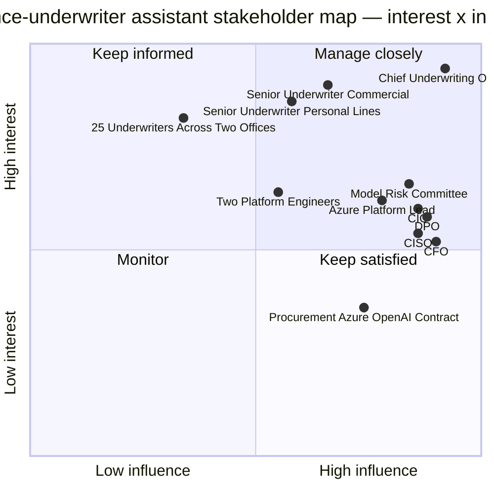

# Customer Discovery & Stakeholder Communication — Applied

> Topic package — Week 23b · Roadmap Week 23b — Customer Discovery & Stakeholder Communication · Applied.
> Depth goal: practice production-depth FDE discovery and communication on the insurance-underwriter AI assistant: stakeholder interviews, discovery brief, requirement translation, MVP tradeoff negotiation, CFO/CUO/CIO executive summary, eval-backed demo narrative, steering cadence, risk conversations, SRB re-plan, and go-live handoff artifacts.

## Source
- Track: FDE Delivery (self-directed, FDE roadmap)
- Slide deck: `07 Resources Library/FDE Delivery/Slides/Lesson_02_Customer_Discovery_&_Stakeholder_Communication_—_Applied.pptx`
- Hands-on notebook: `07 Resources Library/FDE Delivery/Notebooks/02_Customer_Discovery_&_Stakeholder_Communication_—_Applied.ipynb` (runs offline)
- Reference reading: Palantir Forward Deployed Engineering public talks; Teresa Torres Continuous Discovery Habits; Barbara Minto The Pyramid Principle; Jobs-To-Be-Done; SMART goals; INVEST stories; MoSCoW; RICE scoring; stakeholder Interest by Influence mapping; Gary Klein pre-mortems; enterprise AI model-risk, responsible AI, SRE, FinOps, and Azure OpenAI operating guidance
- Builds on: [[02 Literature Notes/FDE Delivery/Customer Discovery & Stakeholder Communication — Reference Patterns]]
- Date: 2026-07-18

---

## 1. Mental Model

**Week 23b rewinds the insurance-underwriter assistant to the work before the architecture diagram existed.** Week 19b designed the RAG architecture, Week 20b deployed it on Azure, Week 21b secured and governed it, and Week 22b operated it. Week 23b shows why that same technical system became fundable, buildable, governable, and adopted: the FDE converted a vague executive ask into a business metric, a signed MVP, an eval contract, a risk rhythm, and no-surprise stakeholder communication.

The original sentence was not a requirement: *we want an AI assistant for underwriters*. The FDE's job was to discover that the actual business goal was reducing median time-to-quote for complex commercial policies from 4 hours to 90 minutes, because underwriters were spending roughly 60% of their day searching 15 years of memos, 40k policy documents, and 3 regulatory feeds. Everything downstream — Azure-only private endpoints, BYOK posture, Tier 2 human-in-the-loop model-risk classification, groundedness ≥ 92%, Standard-vs-PTU cost decisions, and the 25-item go-live checklist — traces back to conversations in the first two weeks.

> Key intuition: **FDE discovery is delivery architecture for humans** — it turns ambiguity into named stakeholders, measurable outcomes, explicit noes, risk owners, exec decisions, and an engagement cadence that keeps the customer from being surprised.



---

## 2. How It Actually Works

### 23b.1 The initial ask and the first two weeks of discovery
The first meeting began with the Chief Underwriting Officer saying, **we want an AI assistant for underwriters**. The FDE did not accept that as scope. Week 1 produced a stakeholder map and interview plan: CUO as executive sponsor; two senior underwriters as domain SMEs, one personal lines and one commercial; 25 end users across two offices; CISO, DPO, and Azure platform lead for data/security; two platform engineers who owned the Azure landing zone; procurement for the Azure OpenAI contract; plus CFO/CIO as budget and operating-model approvers. The FDE ran one deep interview per stakeholder group and kept a decision log from day one.

The CUO interview used business-first questions: **What metric must improve for this to be worth funding? What happens if nothing changes in six months? Which line of business has the most pain? What must not become autonomous? What decision will the board ask you to defend?** Those questions surfaced the real goal: not AI adoption, but reducing median time-to-quote for complex commercial policies from **4 hours to 90 minutes** within six months of go-live without increasing regulatory exposure. The CUO also named the political constraint: junior underwriters could receive decision support, but final underwriting judgment had to remain human-owned.

The senior-underwriter interviews turned the problem from a slogan into workflow evidence. The personal-lines SME said fast cases were already fine; edge cases became slow when policy effective dates and state filings disagreed. The commercial SME walked through a real Tuesday: search 15 years of underwriting memos, then 40k policy documents, then three regulatory feeds, then ask a senior reviewer whether a precedent was still valid. The FDE counted the work: around **60% of the day was search and cross-reference, not judgment**. End users added adoption requirements: citations must show policy version, regulatory source, and memo date; the assistant must say when evidence is insufficient; and it must live inside the existing underwriter app.

A 30-minute DPO conversation changed the architecture months before anyone wrote code. The FDE asked: **Can prompts, embeddings, traces, or retrieved excerpts leave the insurer's approved Azure region? Can provider staff review prompts? Which fields are PII or sensitive? What retention and erasure rules apply?** The DPO's answer was the non-negotiable constraint later seen in Week 20b: **no data leakage to third parties**. That drove Azure-only processing, Private Link, BYOK/CMK posture, redacted telemetry, and immutable Blob audit. Procurement then confirmed Azure OpenAI contract timing was a dependency, not paperwork.

### 23b.2 The discovery brief and requirements translation
At the end of week 2 the FDE delivered a written **DiscoveryBrief**, not a vibes summary. Business problem: complex commercial underwriting quotes are delayed because evidence is scattered across policy documents, memos, Policy Admin effective dates, claims precedents, and regulatory feeds. JTBD: *When I am underwriting a complex commercial policy, I want to find trusted policy, precedent, and regulatory evidence with citations, so I can quote faster while preserving human judgment and auditability.* SMART criteria: reduce median time-to-quote from 4h to 90m within six months; achieve groundedness ≥ 92% on the 200-question underwriter golden set before launch and maintain it in production; keep p95 answer latency ≤ 6s for supported queries; keep baseline run cost inside the $3,300/month envelope from Week 22b; and capture complete audit evidence for 100% of production answers. Constraints: Azure-only, approved region data residency, no third-party data leakage, Guidewire PolicyCenter integration, six-month timeline, and **$850k initial budget ceiling**.

The stakeholder map was translated into Interest × Influence: CUO and commercial SME were Manage Closely; CISO/DPO/CIO/Azure platform lead were Keep Satisfied or Manage Closely depending on review gate; 25 underwriters were Keep Informed but high adoption impact; procurement was Keep Satisfied; CFO needed a BLUF budget case. The pre-mortem named three red risks early: hallucination causes a bad underwriting recommendation with reputational and regulatory impact; model provider outage halts a workflow if the assistant becomes too central; slow adoption occurs because underwriters distrust AI or fear replacement.

Requirements became epics rather than a feature wish list. Example epics: 1) underwriters can query policy history with grounded citations; 2) underwriters can search 15 years of memos by jurisdiction, product, and effective date; 3) the assistant cross-references three regulatory feeds with source freshness; 4) Guidewire policy context pre-fills retrieval filters; 5) low-groundedness or regulated questions route to senior review; 6) every answer writes immutable audit; 7) SMEs curate and own the golden set; 8) prompt/model/index releases are evaluated and rollbackable; 9) latency, cost, refusal, and groundedness SLOs are visible; 10) platform team can operate the system after FDE handoff.

PBIs included functional and evaluation acceptance criteria. For the epic **underwriters can query policy history with grounded citations**, PBI: *Given a natural-language question about a policy, return an answer grounded in retrieved chunks with inline citations*; acceptance: citations include source id, effective date, and excerpt; groundedness ≥ 92% on the 200-question golden set; unsupported questions refuse or route to review. For **audit**, PBI: write prompt version, model deployment, index version, retrieved chunk ids, user hash, policy context, answer, refusal/route decision, latency, and cost to immutable Blob for 100% of requests. For **latency/cost**, PBI: p95 answer latency ≤ 6s at 50-user baseline and cost/query ≤ $0.08 with a budget alert before the $3,300/month envelope is at risk. Non-functional stories were first-class backlog items, not acceptance footnotes.

### 23b.3 The MVP scope negotiation
The customer arrived at the scoping workshop with 14 desired v1 features: policy Q&A, memo precedent search, regulatory cross-reference, Guidewire context, citation export, audit log, SME feedback, golden-set evals, refusal/review queue, underwriter training analytics, semantic cache, automatic underwriting decisions, real-time broker email drafting, and cross-line portfolio analytics. The FDE put each through **RICE-for-AI**: Reach × Business Value × AI Confidence divided by Effort. AI confidence mattered because probabilistic features with weak labels can burn the whole six-month timebox.

A few workshop rows made the tradeoff visible: policy-history Q&A scored `(25 users × 10 value × .86 confidence) / 28 effort = 7.68`; grounded citation export scored `(25 × 9 × .90) / 16 = 12.66`; automatic underwriting decisions scored `(8 × 10 × .35) / 40 = 0.70`; golden-set eval framework scored `(25 × 9 × .92) / 18 = 11.50`; semantic cache scored `(25 × 6 × .82) / 14 = 8.79`; broker email drafting scored `(10 × 5 × .55) / 24 = 1.15`. Must-haves still mattered — audit and eval were included even when not flashy because go-live depended on them.

The FDE then presented exactly three options. **Option A Complete Vision**: $1.2M, 9 months, 12-14 features, high hallucination risk on automatic decisions, broker email drafting, portfolio analytics, and broad exception handling. **Option B Balanced MVP**: $780k, 6 months, 8 features plus eval framework; defer three hallucination-risky features to v2 while collecting data during v1. **Option C Foundation Only**: $480k, 4 months, retrieval plus citations only; safe but closer to enterprise search than an AI assistant. The customer chose Option B because it fit the six-month timeline, stayed under the $850k ceiling, funded the eval/control layer, and still moved the time-to-quote metric.

The contentious no was **automatic underwriting decisions**. The FDE said: *I do not recommend this in v1. The business goal is faster evidence gathering, not autonomous binding. With current labels, model confidence, and governance posture, automatic decisions would move the system from decision support into a higher-risk model category, expand SRB evidence, and threaten the six-month plan. My recommendation is decision support: cited evidence, confidence, refusal, and senior-review routing; meanwhile we collect underwriter decisions to evaluate future automation.* That no directly shaped Week 19b's human-review architecture, Week 21b's **Tier 2 human-in-the-loop** model-risk classification, and Week 22b's SLOs for groundedness/refusal rather than autonomous decision accuracy.

### 23b.4 The executive summary that got the budget approved
The FDE's one-page executive summary used BLUF and Pyramid Principle. **BLUF:** *An AI-powered underwriting assistant will reduce median time-to-quote for complex commercial policies from 4h to 90min within 6 months, at a total delivery cost of $780k and monthly run cost of $3,300 at baseline scale, with measurable groundedness and audit controls that satisfy the DPO and the Model Risk Committee.*

**Situation:** complex commercial underwriters spend about 60% of their day searching 40k policy documents, 15 years of memos, and three regulatory feeds. Quote turnaround for complex policies is typically 4 hours, creating broker friction and senior-underwriter bottlenecks. **Complication:** leadership wants AI, but uncontrolled automation would create hallucination, data leakage, and model-risk exposure. The DPO requires Azure-only processing and no third-party data leakage; the Model Risk Committee requires human-in-the-loop controls. **Question:** can the insurer reduce quote cycle time without increasing underwriting or privacy risk? **Answer:** approve Option B Balanced MVP. It delivers policy/memo/regulatory grounded Q&A, Guidewire context, citations, audit, review queue, SME feedback, eval framework, and operating dashboard. Reject Option A because it costs $1.2M, takes 9 months, and includes high-risk autonomous features before evidence exists. Reject Option C because $480k/4 months under-delivers the business case and becomes a search product, not the workflow assistant leadership requested.

The CUO socialized a three-slide board outline. Slide 1 **Business Case**: 4h → 90m target, complex commercial cohort, faster broker response, adoption cohort of 25 then 50 underwriters. Slide 2 **Solution & Approach**: cited decision-support assistant embedded in existing app; Azure-only; human-in-the-loop; six-month Option B; eval framework owned with SMEs. Slide 3 **Risks & Guardrails**: hallucination mitigated by citations/refusal/golden set; data leakage mitigated by Azure Private Link/BYOK/redacted telemetry; cost governed by Standard Azure OpenAI baseline and budget alerts.

The go/no-go demo used a story arc, not a chatbot trick. Setup: an underwriter's real Tuesday involved six hours of search-and-cross-reference across document store, Guidewire, regulatory feeds, and chat. Confrontation: the assistant answered the same policy question in 45 seconds with cited policy sections, memo date, regulatory bulletin, and a refusal on unsupported sub-questions. Resolution: the FDE showed eval numbers beside the answer — groundedness **≥ 92%** on the golden set, p95 latency within target, cost/query within budget, audit log demoed live. The CFO approved because the demo connected to dollars, timeline, risk, and evidence — not because the generated text sounded impressive.

### 23b.5 The engagement rhythm and the risk conversations
After approval, stakeholder communication became an operating system. Every week the FDE ran a 30-minute steering call with the CUO using a five-slide pattern: burn-up chart against the six-month plan; this week/next week; top three risks; top three decisions needed; one demo clip with eval numbers. Every two weeks the FDE ran a 60-minute working session with the underwriter SMEs: workflow feedback, prompt review, and golden-set curation. The SMEs **owned** the golden set with the FDE; it was not an engineering-only artifact. Monthly, the FDE ran a 45-minute risk committee update: risk register, incident log, control-effectiveness evidence, and SRB readiness. That feed became Week 21b's SRB submission and 25-item go-live checklist.

Three hard conversations kept the engagement out of the ditch. **Week 8:** a commercial SME complained that the assistant refused a legitimate question. The FDE did not hand-wave it as model weirdness. They pulled the refusal-threshold eval, showed that lowering the threshold improved valid-answer coverage but raised hallucination rate, chose a defensible threshold change with the eval team, added the case to the golden set, and emailed the CUO the same day: what changed, why, measured risk impact, and owner. **Week 14:** Azure OpenAI PTU cost came in 30% above forecast. The FDE reran the Week 22b PTU-vs-Standard break-even, recommended staying Standard until roughly 200-user scale, sent the CFO a three-paragraph memo with revised annualized budget and triggers for PTU revisit. No surprise, no drama. **Week 19:** SRB feedback required additional red-team evidence before production go-live. The FDE re-scoped the final three weeks: added red-team closure and go-live checklist evidence, moved a nice-to-have training analytics feature to v2, and told the CUO exactly what changed, the impact on business benefit, and the recommendation.

At go-live the FDE delivered an **engagement wrap** one-pager. It named owners: platform lead owns Azure resources and runbooks; product owner owns roadmap and adoption; CUO owns business metric; underwriter SMEs own golden-set review; CISO/DPO own control reviews; FDE exits after hypercare. It linked runbooks from Week 22b, SRB evidence and checklist from Week 21b, the SLO contract, prompt/model/index rollback procedure, cost dashboard, decision log, risk register, and v2 roadmap. This closing loop is why the customer can operate the system after the FDE leaves instead of inheriting a brilliant but orphaned prototype.

---

## 3. Implementation

Assumed stack: Python stdlib plus Pydantic v2. The snippets are offline FDE artifacts for the same insurance-underwriter engagement; they render executive-ready markdown without network calls. Snippets:
- [[04 Code Snippets/FDE Delivery/FDE Week 23b Insurance Discovery Brief and MVP Scope Package]]
- [[04 Code Snippets/FDE Delivery/FDE Week 23b Steering Rhythm and Risk Conversation Dashboard]]

### FDE Week 23b Insurance Discovery Brief and MVP Scope Package
Pydantic v2 model tree for the populated insurance-underwriter DiscoveryBrief, 14 scored feature candidates, and three-option scope proposal, rendering a CFO/CUO/CIO markdown package.
```python
from __future__ import annotations
from enum import Enum
from typing import Literal
from pydantic import BaseModel, ConfigDict, Field

class Influence(str, Enum): low='low'; high='high'
class Interest(str, Enum): low='low'; high='high'

class Stakeholder(BaseModel):
    model_config = ConfigDict(extra='forbid')
    name: str; role: str; interest: Interest; influence: Influence; concern: str
    @property
    def quadrant(self):
        if self.interest == Interest.high and self.influence == Influence.high: return 'Manage Closely'
        if self.interest == Interest.low and self.influence == Influence.high: return 'Keep Satisfied'
        if self.interest == Interest.high and self.influence == Influence.low: return 'Keep Informed'
        return 'Monitor'

class SuccessCriterion(BaseModel):
    statement: str; metric: str; baseline: str; target: str; timeframe: str; measurement: str

class Constraint(BaseModel):
    category: Literal['technical','regulatory','timeline','budget','integration']
    statement: str

class PremortemRisk(BaseModel):
    risk: str; likelihood: Literal['low','medium','high']; impact: Literal['low','medium','high']; mitigation: str; owner: str

class DiscoveryBrief(BaseModel):
    model_config = ConfigDict(extra='forbid')
    customer: str; vague_ask: str; business_problem: str; jtbd: str; current_pain: str
    stakeholders: list[Stakeholder]; success_criteria: list[SuccessCriterion]
    constraints: list[Constraint]; risks: list[PremortemRisk]; must_not_do: list[str]

class FeatureCandidate(BaseModel):
    model_config = ConfigDict(extra='forbid')
    feature_id: str; name: str; category: str
    business_value: int = Field(ge=1, le=10)
    ai_confidence: float = Field(ge=0, le=1)
    reach: int = Field(gt=0)
    effort_days: int = Field(gt=0)
    must_have: bool = False
    dependencies: list[str] = Field(default_factory=list)
    @property
    def rice_ai(self): return round((self.reach * self.business_value * self.ai_confidence) / self.effort_days, 2)

class ScopeOption(BaseModel):
    name: str; cost_usd: int; timeline_months: float; feature_ids: list[str]; risk_summary: str; recommendation: str

class EngagementPackage(BaseModel):
    brief: DiscoveryBrief; features: list[FeatureCandidate]; options: list[ScopeOption]
    def render_engagement_package_markdown(self) -> str:
        by_id = {f.feature_id: f for f in self.features}
        lines = [f'# Engagement package — {self.brief.customer}', '', '## 1-page discovery brief', f'**Initial ask:** {self.brief.vague_ask}', f'**Business problem:** {self.brief.business_problem}', f'**JTBD:** {self.brief.jtbd}', f'**Current pain:** {self.brief.current_pain}', '', '### SMART success criteria']
        for c in self.brief.success_criteria:
            lines.append(f'- {c.statement} Metric={c.metric}; baseline={c.baseline}; target={c.target}; timeframe={c.timeframe}; measurement={c.measurement}')
        lines += ['', '### Stakeholders']
        for s in self.brief.stakeholders:
            lines.append(f'- {s.name} ({s.role}) — {s.quadrant}; concern: {s.concern}')
        lines += ['', '### Constraints'] + [f'- {c.category}: {c.statement}' for c in self.brief.constraints]
        lines += ['', '### Pre-mortem risks'] + [f'- {r.risk} [{r.likelihood}/{r.impact}] owner={r.owner}; mitigation={r.mitigation}' for r in self.brief.risks]
        lines += ['', '## 3-option MVP scope proposal', '| Feature | Category | BV | Conf | Reach | Effort | RICE-AI | Must | Dependencies |', '|---|---|---:|---:|---:|---:|---:|---|---|']
        for f in sorted(self.features, key=lambda x: (x.must_have, x.rice_ai), reverse=True):
            lines.append(f'| {f.name} | {f.category} | {f.business_value} | {f.ai_confidence:.2f} | {f.reach} | {f.effort_days} | {f.rice_ai:.2f} | {f.must_have} | {", ".join(f.dependencies) or "—"} |')
        for o in self.options:
            feats = [by_id[i].name for i in o.feature_ids]
            lines += [f'\n### {o.name}', f'- Cost: ${o.cost_usd:,}; timeline: {o.timeline_months:g} months', f'- Features: {", ".join(feats)}', f'- Risk summary: {o.risk_summary}', f'- Recommendation: {o.recommendation}']
        lines += ['', '## Eval-criteria sketch', '- Golden set: 200 SME-owned underwriter questions across personal/commercial, jurisdictions, policy versions, memos, and regulatory feeds.', '- Groundedness: >= 92% before launch and monitored weekly.', '- Hallucination: <= 1%; unsupported questions refuse or route to review.', '- Latency/cost: p95 <= 6s; cost/query <= $0.08; baseline run envelope $3,300/month.', '- Audit: 100% of answers log prompt/model/index versions, citations, policy context, decision path, latency, and cost.']
        return '\n'.join(lines)

def seed_package() -> EngagementPackage:
    brief = DiscoveryBrief(
        customer='Mid-sized insurance carrier — commercial underwriting',
        vague_ask='We want an AI assistant for underwriters.',
        business_problem='Complex commercial policies take a median 4 hours to quote because underwriters spend most of the workflow searching policy docs, memos, and regulatory feeds; target is 90 minutes within 6 months of go-live.',
        jtbd='When I am underwriting a complex commercial policy, I want trusted policy, precedent, and regulatory evidence with citations, so I can quote faster while preserving human judgment and auditability.',
        current_pain='Senior SMEs estimated 60% of the day is search across 15 years of underwriting memos, 40k policy documents, Guidewire context, claims precedents, and 3 regulatory feeds.',
        stakeholders=[Stakeholder(name='Chief Underwriting Officer', role='exec sponsor', interest='high', influence='high', concern='4h to 90m business case'), Stakeholder(name='Senior Underwriter — Personal Lines', role='domain SME', interest='high', influence='high', concern='policy version and state filing nuance'), Stakeholder(name='Senior Underwriter — Commercial', role='domain SME', interest='high', influence='high', concern='complex commercial precedent quality'), Stakeholder(name='25 Underwriters in two offices', role='end users', interest='high', influence='low', concern='trust, citations, workflow fit'), Stakeholder(name='CISO', role='security', interest='low', influence='high', concern='private endpoint and incident evidence'), Stakeholder(name='DPO', role='privacy', interest='low', influence='high', concern='no third-party leakage and retention'), Stakeholder(name='Azure Platform Lead', role='platform owner', interest='high', influence='high', concern='landing-zone handoff'), Stakeholder(name='Procurement', role='Azure OpenAI contract', interest='low', influence='high', concern='contract timing')],
        success_criteria=[SuccessCriterion(statement='Reduce median time-to-quote for complex commercial policies.', metric='median workflow time', baseline='4 hours', target='90 minutes', timeframe='within 6 months of go-live', measurement='workflow instrumentation'), SuccessCriterion(statement='Maintain grounded answers.', metric='golden-set groundedness', baseline='no measured baseline', target='>= 92%', timeframe='before launch and weekly after', measurement='SME-owned 200-question eval'), SuccessCriterion(statement='Keep answer latency usable.', metric='p95 /query latency', baseline='manual first search often >10 minutes', target='<= 6 seconds', timeframe='production SLO', measurement='OpenTelemetry/App Insights'), SuccessCriterion(statement='Stay inside operating envelope.', metric='monthly baseline run cost', baseline='new workload', target='<=$3,300/month', timeframe='50-user baseline', measurement='FinOps dashboard'), SuccessCriterion(statement='Preserve auditability.', metric='answers with complete audit record', baseline='manual copy-paste notes inconsistent', target='100%', timeframe='from pilot go-live', measurement='immutable Blob audit sampling')],
        constraints=[Constraint(category='technical', statement='Azure-only processing with private endpoints where supported'), Constraint(category='regulatory', statement='Data residency in approved region and no third-party data leakage'), Constraint(category='integration', statement='Guidewire PolicyCenter context must filter retrieval'), Constraint(category='timeline', statement='6-month delivery timeline'), Constraint(category='budget', statement='$850k initial budget ceiling')],
        risks=[PremortemRisk(risk='Hallucination causes a bad underwriting recommendation', likelihood='medium', impact='high', mitigation='decision support only, citations, groundedness gate, senior-review route', owner='CUO/FDE'), PremortemRisk(risk='Model provider outage halts workflow', likelihood='medium', impact='medium', mitigation='manual fallback, cached approved answers, outage runbook', owner='Platform Lead'), PremortemRisk(risk='Underwriters distrust AI and adoption stalls', likelihood='medium', impact='high', mitigation='SME-owned golden set, in-app citations, working sessions, training', owner='Commercial SME')],
        must_not_do=['Bind coverage autonomously', 'Approve exceptions without human judgment', 'Leak prompts or retrieved text to third parties', 'Bypass Guidewire policy context', 'Ship without SRB approval'])
    features = [
        FeatureCandidate(feature_id='policy_qa', name='Policy history Q&A with citations', category='core', business_value=10, ai_confidence=.86, reach=25, effort_days=28, must_have=True),
        FeatureCandidate(feature_id='memo_search', name='15-year memo precedent search', category='core', business_value=9, ai_confidence=.82, reach=25, effort_days=24, must_have=True),
        FeatureCandidate(feature_id='reg_feeds', name='Regulatory feed cross-reference', category='core', business_value=8, ai_confidence=.78, reach=20, effort_days=22),
        FeatureCandidate(feature_id='guidewire', name='Guidewire policy context filters', category='integration', business_value=9, ai_confidence=.80, reach=25, effort_days=20, must_have=True, dependencies=['Guidewire API access']),
        FeatureCandidate(feature_id='citation_export', name='Cited audit-note export', category='workflow', business_value=9, ai_confidence=.90, reach=25, effort_days=16),
        FeatureCandidate(feature_id='audit', name='Immutable audit log', category='governance', business_value=8, ai_confidence=.88, reach=25, effort_days=18, must_have=True),
        FeatureCandidate(feature_id='feedback', name='SME and underwriter feedback capture', category='eval', business_value=7, ai_confidence=.90, reach=25, effort_days=12),
        FeatureCandidate(feature_id='evals', name='Golden-set eval framework', category='eval', business_value=9, ai_confidence=.92, reach=25, effort_days=18, must_have=True),
        FeatureCandidate(feature_id='review_queue', name='Refusal and senior-review queue', category='risk', business_value=8, ai_confidence=.84, reach=20, effort_days=16, must_have=True),
        FeatureCandidate(feature_id='training_analytics', name='Underwriter training analytics', category='adoption', business_value=5, ai_confidence=.76, reach=12, effort_days=14),
        FeatureCandidate(feature_id='semantic_cache', name='Tenant-scoped semantic cache', category='ops', business_value=6, ai_confidence=.82, reach=25, effort_days=14),
        FeatureCandidate(feature_id='auto_decisions', name='Automatic underwriting decisions', category='autonomy', business_value=10, ai_confidence=.35, reach=8, effort_days=40, dependencies=['validated labels','model-risk approval']),
        FeatureCandidate(feature_id='broker_email', name='Real-time broker email drafting', category='workflow', business_value=5, ai_confidence=.55, reach=10, effort_days=24, dependencies=['legal-approved templates']),
        FeatureCandidate(feature_id='portfolio_analytics', name='Cross-line portfolio analytics', category='analytics', business_value=6, ai_confidence=.50, reach=8, effort_days=30, dependencies=['warehouse access'])]
    options = [ScopeOption(name='Option A — Complete Vision', cost_usd=1_200_000, timeline_months=9, feature_ids=[f.feature_id for f in features if f.feature_id != 'portfolio_analytics'], risk_summary='High delivery and hallucination risk; includes autonomy-adjacent features before evidence exists.', recommendation='Reject for v1; use as vision backlog.'), ScopeOption(name='Option B — Balanced MVP', cost_usd=780_000, timeline_months=6, feature_ids=['policy_qa','memo_search','reg_feeds','guidewire','citation_export','audit','feedback','evals','review_queue','semantic_cache'], risk_summary='Fits timebox; defers automatic decisions, broker email drafting, and portfolio analytics while collecting data for v2.', recommendation='Approve.'), ScopeOption(name='Option C — Foundation Only', cost_usd=480_000, timeline_months=4, feature_ids=['policy_qa','memo_search','citation_export','audit','evals'], risk_summary='Lowest risk, but mostly search plus citations; weaker business-case path to 90-minute quote target.', recommendation='Keep as fallback if budget is cut.')]
    return EngagementPackage(brief=brief, features=features, options=options)

print(seed_package().render_engagement_package_markdown())
```

### FDE Week 23b Steering Rhythm and Risk Conversation Dashboard
Pydantic v2 live engagement dashboard for week 8 and week 19, rendering the weekly five-slide steering pack, risk register, decision log, stakeholder cadence, and calm hard-conversation messaging.
```python
from __future__ import annotations
from typing import Literal
from pydantic import BaseModel, ConfigDict, Field

Status = Literal['green','yellow','red']

class SprintStatus(BaseModel):
    week: int; goals: list[str]; delivered: list[str]; blockers: list[str]; burnup_done: int; burnup_total: int

class RiskItem(BaseModel):
    risk: str; likelihood: Literal['low','medium','high']; impact: Literal['low','medium','high']; mitigation: str; owner: str; status: Status; review_date: str
    @property
    def severity(self):
        score = {'low':1,'medium':2,'high':3}[self.likelihood] * {'low':1,'medium':2,'high':3}[self.impact]
        return score

class Decision(BaseModel):
    date: str; what: str; who: str; rationale: str

class CommsCadence(BaseModel):
    stakeholder: str; cadence: str; last_update: str; status: Status; note: str

class EngagementDashboard(BaseModel):
    model_config = ConfigDict(extra='forbid')
    title: str; sprint: SprintStatus; risks: list[RiskItem]; decisions: list[Decision]; comms: list[CommsCadence]; demo_highlight: str; exec_message: str
    def top_risks(self): return sorted(self.risks, key=lambda r: (r.status == 'red', r.status == 'yellow', r.severity), reverse=True)[:3]
    def render_weekly_exec_slide_pack(self) -> str:
        pct = self.sprint.burnup_done / self.sprint.burnup_total * 100
        lines = [f'# Weekly steering pack — {self.title} — week {self.sprint.week}', '', '## Slide 1 — Burn-up narrative', f'- Scope complete: {self.sprint.burnup_done}/{self.sprint.burnup_total} delivery units ({pct:.0f}%).', f'- Exec message: {self.exec_message}', '', '## Slide 2 — This week / next week', '**Goals**:']
        lines += [f'- {g}' for g in self.sprint.goals]
        lines += ['**Delivered**:'] + [f'- {d}' for d in self.sprint.delivered]
        lines += ['**Blockers**:'] + ([f'- {b}' for b in self.sprint.blockers] or ['- none'])
        lines += ['', '## Slide 3 — Top 3 risks']
        for r in self.top_risks(): lines.append(f'- [{r.status.upper()}] {r.risk} — owner={r.owner}; mitigation={r.mitigation}; review={r.review_date}')
        lines += ['', '## Slide 4 — Top decisions needed']
        for d in self.decisions[-5:]: lines.append(f'- {d.date}: {d.what} — {d.who}; rationale: {d.rationale}')
        lines += ['', '## Slide 5 — Demo highlight', f'- {self.demo_highlight}', '', '## Cadence health']
        for c in self.comms: lines.append(f'- [{c.status.upper()}] {c.stakeholder} ({c.cadence}) last={c.last_update}: {c.note}')
        return '\n'.join(lines)

def dashboard_week8() -> EngagementDashboard:
    return EngagementDashboard(title='Insurance Underwriter AI Assistant', sprint=SprintStatus(week=8, goals=['Close refusal-threshold tuning with eval team','Finish Guidewire-context retrieval filters','Prepare week-9 SME golden-set review'], delivered=['Valid-question refusal case reproduced and added to golden set','Threshold adjusted after showing hallucination-rate impact','PTU cost forecast reviewed against Standard baseline'], blockers=['Awaiting final procurement confirmation for Azure OpenAI production quota'], burnup_done=31, burnup_total=92), risks=[RiskItem(risk='Refusal threshold blocks legitimate underwriting questions', likelihood='medium', impact='medium', mitigation='Tune threshold with golden-set slices and same-day CUO note', owner='FDE + eval lead', status='yellow', review_date='week 9'), RiskItem(risk='Azure OpenAI PTU estimate 30% over forecast', likelihood='medium', impact='medium', mitigation='Stay Standard until 200-user trigger; CFO memo sent', owner='FDE + platform lead', status='yellow', review_date='week 10'), RiskItem(risk='Hallucination causes unsupported recommendation', likelihood='medium', impact='high', mitigation='Citations, refusal path, senior-review queue, golden-set gate', owner='Commercial SME', status='yellow', review_date='weekly'), RiskItem(risk='DPO rejects data-boundary evidence', likelihood='low', impact='high', mitigation='Private endpoint design review and redacted telemetry sample', owner='DPO/platform lead', status='green', review_date='week 12'), RiskItem(risk='SME labeling bottleneck slows evals', likelihood='medium', impact='medium', mitigation='Biweekly working session and 20-question batches', owner='SME leads', status='green', review_date='weekly')], decisions=[Decision(date='week 7', what='Keep automatic underwriting decisions out of v1', who='CUO + FDE', rationale='Preserve Tier 2 decision-support posture'), Decision(date='week 8', what='Lower refusal threshold for commercial exception questions', who='FDE + eval lead + SME', rationale='Improves valid-answer rate with hallucination still under 1% on slice'), Decision(date='week 8', what='Remain on Standard Azure OpenAI for pilot', who='FDE recommendation to CFO', rationale='PTU not economical until 200-user scale or p95 variance requires it')], comms=[CommsCadence(stakeholder='CUO', cadence='weekly steering', last_update='today', status='green', note='Refusal tradeoff communicated same day'), CommsCadence(stakeholder='Underwriter SMEs', cadence='biweekly working session', last_update='2 days ago', status='green', note='Golden-set ownership active'), CommsCadence(stakeholder='CFO', cadence='budget exception memo as needed', last_update='today', status='green', note='PTU/Standard memo sent'), CommsCadence(stakeholder='DPO/CISO', cadence='monthly risk committee', last_update='3 weeks ago', status='yellow', note='next evidence review due')], demo_highlight='Commercial policy question answered in 52 seconds with policy, memo, and regulatory citations; refusal example shows improved valid-answer behavior and updated eval numbers.', exec_message='We made a measured refusal-threshold adjustment and contained the PTU cost surprise with a Standard-until-scale recommendation; no change to timeline or business case.')

def dashboard_week19() -> EngagementDashboard:
    d = dashboard_week8().model_copy(deep=True)
    d.sprint = SprintStatus(week=19, goals=['Close SRB red-team evidence gap','Complete 25-item go-live checklist blockers','Move training analytics to v2 backlog'], delivered=['SRB feedback received and triaged','Red-team plan added to final three weeks','Nice-to-have scope moved without changing core business benefit'], blockers=['Production go-live waits for added red-team evidence and checklist closure'], burnup_done=76, burnup_total=92)
    d.risks.append(RiskItem(risk='SRB requires additional red-team evidence before go-live', likelihood='high', impact='high', mitigation='Re-scope final 3 weeks to red-team closure; defer training analytics to v2', owner='FDE + CISO + AppSec', status='red', review_date='weekly until go-live'))
    d.decisions.append(Decision(date='week 19', what='Re-plan final three weeks for SRB evidence', who='CUO + CISO + FDE', rationale='Protect go-live approval and preserve core time-to-quote benefit'))
    d.comms = [CommsCadence(stakeholder='CUO', cadence='weekly steering', last_update='today', status='green', note='Re-plan explained: what changes, impact, recommendation'), CommsCadence(stakeholder='CISO/SRB', cadence='weekly until approval', last_update='today', status='green', note='Evidence owner map agreed'), CommsCadence(stakeholder='Underwriter SMEs', cadence='biweekly working session', last_update='1 week ago', status='green', note='Training analytics moved to v2; golden set unaffected'), CommsCadence(stakeholder='CFO', cadence='monthly budget', last_update='1 week ago', status='green', note='No budget increase; scope swap only')]
    d.demo_highlight = 'Go-live readiness demo shows audit trail, groundedness >= 92%, and red-team evidence checklist; training analytics explicitly labeled v2.'
    d.exec_message = 'SRB feedback changes the last three weeks of work, not the core business benefit: we will close red-team evidence before production and defer one nice-to-have to v2.'
    return d

print(dashboard_week8().render_weekly_exec_slide_pack())
print('\n' + '='*80 + '\n')
print(dashboard_week19().render_weekly_exec_slide_pack())
```

---

## 4. Design Decisions & Tradeoffs

| Decision | Guidance |
|---|---|
| **Lead with the business metric** | Make time-to-quote the north star; AI, RAG, Azure, and evals are supporting evidence, not the reason to fund the engagement. |
| **Use SMEs as eval owners** | The golden set must be co-owned by underwriters and the FDE so quality is a customer trust artifact rather than an engineering score. |
| **Say no to autonomy in v1** | Keep automatic underwriting decisions out of scope; decision support preserves Tier 2 model-risk posture and the six-month timeline. |
| **Present three options** | Use Complete Vision, Balanced MVP, and Foundation Only so executives choose a tradeoff instead of rubber-stamping a hidden FDE decision. |
| **Communicate risk in rhythm** | Weekly steering, biweekly SME sessions, and monthly risk committee updates prevent SRB, cost, and adoption surprises. |
| **Handoff starts in discovery** | Name platform, product, risk, SME, and executive owners early so go-live ends with an operating model, not an orphaned prototype. |

---

## 5. Failure Modes & Gotchas

- A technically perfect RAG assistant ships but solves the wrong problem because the FDE accepted 'we want AI' and never discovered the 4h-to-90m time-to-quote metric.
- Scope creeps from unspoken yeses to every SME request; by month four the MVP contains 14 features, no eval framework, and no credible six-month path.
- The exec sponsor is surprised at go-live by SRB findings because risk committee updates were treated as compliance paperwork rather than a monthly delivery cadence.
- The risk register is neglected until week 20, so hallucination, cost, adoption, and provider-outage mitigations have no owners when leadership asks.
- The demo shows a shiny answer but no groundedness, latency, cost, or audit numbers; the CFO rejects the budget because the value and risk evidence are invisible.
- No engagement-wrap handoff exists, so after the FDE leaves the customer's platform and product teams cannot operate prompts, evals, SLOs, incidents, or v2 scope.

---

## 6. FDE Angle

- Discovery and communication are force multipliers: the same Azure RAG architecture succeeds when tied to the right metric, owner map, eval contract, and risk rhythm.
- An FDE's no is a delivery tool; refusing automatic decisions in v1 protected timeline, model-risk tier, customer trust, and adoption.
- Executive summaries, demos, and steering packs must contain numbers — time saved, groundedness, latency, cost, audit completeness — or they are theater.
- The engagement is not done at deployment; it is done when the customer has owners, runbooks, SLOs, risk register, roadmap, and confidence to operate without the FDE.

---

## 7. Self-Check

1. Which discovery questions turned 'we want an AI assistant' into the 4h-to-90m time-to-quote business problem?
2. How did the DPO conversation in week 1 drive the Week 20b private-endpoint and BYOK architecture?
3. What is the difference between a functional acceptance criterion and an evaluation acceptance criterion for the policy-history Q&A epic?
4. Why did automatic underwriting decisions belong outside v1, and how did that decision connect to Week 21b's Tier 2 classification?
5. What belongs in the weekly five-slide steering pack, and why does each slide prevent customer surprises?
6. How should an FDE communicate a week-19 SRB re-plan without making it sound like failure?

## 8. Links
- Domain MOC: [[06 Maps of Content/FDE Delivery Concepts]]
- Code: [[04 Code Snippets/FDE Delivery/FDE Week 23b Insurance Discovery Brief and MVP Scope Package]], [[04 Code Snippets/FDE Delivery/FDE Week 23b Steering Rhythm and Risk Conversation Dashboard]]
- Distilled: [[03 Permanent Notes/FDE Week 23b Enterprise AI Engagement Playbook]], [[03 Permanent Notes/FDE Week 23b Hard Conversation Templates for AI Engagements]]
- Upstream: [[02 Literature Notes/FDE Delivery/Customer Discovery & Stakeholder Communication — Reference Patterns]] · Scenario roots: [[02 Literature Notes/AI Architecture/AI Solution Architecture — Applied]] · [[02 Literature Notes/AI Architecture/Cloud Architecture & Deployment — Applied]] · [[02 Literature Notes/AI Architecture/Security, Governance & Responsible AI — Applied]] · [[02 Literature Notes/AI Architecture/LLMOps, Monitoring, Cost & Reliability — Applied]] · Downstream: [[06 Maps of Content/FDE Delivery Concepts]]
