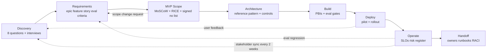

# Customer Discovery & Stakeholder Communication — Reference Patterns

> Topic package — Week 23a · Roadmap Week 23a — Customer Discovery & Stakeholder Communication · Reference Patterns.
> Depth goal: run enterprise AI discovery like an FDE: translate vague business asks into actionable briefs, JTBD statements, epics, stories, AI evaluation criteria, MVP scopes, executive tradeoff narratives, stakeholder maps, RACI ownership, and risk registers that customers can approve and engineering can execute.

## Source
- Track: FDE Delivery (self-directed, FDE roadmap)
- Slide deck: `07 Resources Library/FDE Delivery/Slides/Lesson_01_Customer_Discovery_&_Stakeholder_Communication_—_Reference_Patterns.pptx`
- Hands-on notebook: `07 Resources Library/FDE Delivery/Notebooks/01_Customer_Discovery_&_Stakeholder_Communication_—_Reference_Patterns.ipynb` (runs offline)
- Reference reading: Palantir Forward Deployed Engineering public talks and hiring materials; Teresa Torres Continuous Discovery Habits; Marty Cagan product discovery writing; Barbara Minto The Pyramid Principle; Jobs-To-Be-Done literature from Clayton Christensen and Bob Moesta; Scrum Guide, INVEST story criteria, SMART goals, MoSCoW prioritization, RICE scoring, RACI matrices, pre-mortem practice from Gary Klein, stakeholder Interest by Influence mapping, McKinsey-style executive communication and BLUF writing guidance
- Builds on: [[06 Maps of Content/AI Architecture Concepts]]
- Date: 2026-07-18

---

## 1. Mental Model

**FDE delivery starts before architecture: it starts when a vague executive ask becomes a shared operating contract.** A customer says, 'we need AI for coding,' 'we need copilots,' or 'we need automation.' The FDE's first job is not to draw boxes or pick a model. It is to discover the business problem, current workflow, users, data, constraints, risks, non-negotiables, and success metric until the ask is precise enough to defend.

This craft is product discovery plus management consulting plus delivery engineering. The artifact is not only code; it is the brief, workshop design, epic map, acceptance criteria, MVP scope, executive one-pager, risk register, RACI, and stakeholder sync rhythm. These documents become executable constraints for engineering and decision tools for executives.

> Key intuition: **a strong FDE turns uncertainty into commitments without pretending uncertainty disappeared.** Every proposal should name the metric, owner, eval threshold, risk, tradeoff, and next decision.



---

## 2. How It Actually Works

### 23a.1 The FDE discovery framework: from vague ask to actionable brief
The FDE discovery framework is a forcing function for ambiguity. Before drawing architecture, answer eight questions in writing: **What business problem are we solving? Who is the user? What is the current workflow? Where is the data? What does success look like? What are the constraints? What are the risks? What must not break?** If any answer is vague, the project is still in discovery, not solutioning.

Run layered interviews instead of one giant meeting. Use **30 minutes with the executive sponsor** for business framing, budget, deadline, and political stakes. Use **60 minutes with the domain SME** to map workflow details, exceptions, vocabulary, and judgment calls. Use **45 minutes with end users** to find friction, workarounds, trust boundaries, and adoption blockers. Use **30 minutes with data/security** to locate sources, permissions, PHI/PII, retention, and compliance constraints. Use **30 minutes with existing engineering** to discover integration surfaces, owner capacity, deployment paths, and systems that must not break.

Frame the user need with **Jobs-To-Be-Done**: 'When I am [situation], I want to [motivation], so I can [expected outcome].' Then use **5 Whys** to get past the surface ask. 'We need an AI assistant' becomes 'Why?' until it becomes 'medical coders spend 22 minutes on complex encounters and denial rework costs $1.8M per quarter.' That sentence is actionable; 'AI assistant' is not.

### 23a.2 Requirement translation: business ask to epic to story to acceptance criteria
Discovery output must become deliverables engineering can execute and executives can approve. Start with epic statements that name the business outcome, not the technology: 'Reduce complex encounter coding time and coding-related denials for ambulatory specialty clinics' beats 'Build a GPT coding chatbot.' Features then describe capabilities that move that outcome: retrieve relevant payer rules, suggest ICD-10 and CPT candidates, explain evidence, and route uncertain cases to review.

Stories should satisfy **INVEST**: independent enough to schedule, negotiable in implementation, valuable to a user or risk owner, estimable, small enough for a sprint, and testable. Acceptance criteria need two sides: **functional** behavior and **observable** evidence. 'Given a complex encounter note, the assistant returns candidate codes with citations' is functional. 'The trace records prompt version, retrieved guideline ids, coder decision, and latency' is observable.

For AI systems, non-functional requirements are first-class stories: latency, cost, groundedness, audit, data residency, accessibility, and security. The FDE-specific twist is **evaluation-criteria stories**. 'The assistant answers coder policy questions with groundedness at least 92% on the golden set' is not QA decoration; it is an acceptance criterion. Definition of done for an AI PBI: functional workflow works, eval score meets threshold, prompt is registered, audit is logged, cost per call is within budget, and release notes explain known limitations.

### 23a.3 MVP scoping, tradeoff communication, and the no conversation
The hardest FDE work is often telling a customer director, clearly and respectfully, what will not fit in the MVP. Use **MoSCoW** to classify Must, Should, Could, and Won't, but annotate each item with real cost: data dependency, integration owner, eval burden, security review, and user training. Then use **RICE** adapted for AI: Reach times Impact times AI Confidence divided by Effort. Confidence deserves heavy attention because probabilistic features with weak data can consume the whole pilot.

Run a scoping workshop that ends with a signed MVP scope. Begin with the business metric, review constraints, score candidate features, confirm must-haves, and explicitly read the Won't list. The useful tradeoff frame is Cost, Quality, Time, and Scope. Executives can usually move one or two; they cannot maximize all four.

Use the **3 options pattern**. Never present one option, because that makes the FDE look like the decision maker. Never present five or more, because that pushes analysis work upward. Present three: aggressive, recommended, and safe. Say no with an alternative: 'We cannot ingest real-time claims data by v1 because the CDC pipeline does not exist; we can start with nightly batch ingestion which delivers 90% of the value at 20% of the effort.' This preserves trust because the no is tied to a delivery path, not personal preference.

### 23a.4 Executive communication: summaries, one-pagers, and demo storytelling
Executive writing uses **BLUF: Bottom Line Up Front**. Start with the recommendation, metric, risk, and ask. Every paragraph must pass the **So what?** test: if it does not change a decision, remove or move it to an appendix. Use Barbara Minto's **Pyramid Principle**: Situation, Complication, Question, Answer. Situation: coding volume and denial pressure are rising. Complication: current manual research is slow and inconsistent. Question: can an AI assistant reduce time and denials without increasing compliance risk? Answer: yes, with a scoped MVP tied to groundedness, audit, and human review.

A one-pager should work at two speeds. A CTO should extract the decision, architecture risk, security posture, and ask in 90 seconds. A director should read for five minutes and understand workflow impact, timeline, owner, metric, and next meeting.

Demo storytelling is a three-act arc. **Setup**: show the problem in the user's world. **Confrontation**: show the current pain and the AI system's response. **Resolution**: show the measurable business outcome. Avoid the cool-tech trap: a clever agent trace may impress engineers but lose the executive if no business number moves. Show evaluation numbers alongside every demo. A demo without eval numbers is a magic trick, not a proposal.

### 23a.5 Risk communication, stakeholder mapping, and closing the loop
Stakeholder alignment is a system, not a vibe. Map stakeholders on **Interest by Influence**: Manage Closely, Keep Satisfied, Keep Informed, and Monitor. Sponsors, security, data owners, end users, platform teams, and legal often sit in different quadrants and need different messages. Use **RACI** for AI delivery: who is Responsible, Accountable, Consulted, and Informed for prompt changes, model changes, eval regressions, data-source changes, incident response, and production rollout.

Maintain a risk register with risk, likelihood, impact, mitigation, owner, status, and review date. AI-specific risks include model provider outage, groundedness regression, cost blowup, data-boundary violation, prompt change without review, SME label bottleneck, regulatory change, and integration-owner unavailability. Communicate risk to executives with three colors, one number, and one sentence per risk. Green/yellow/red, expected impact, and the ask.

Run a **pre-mortem** as a formal FDE ritual: imagine the project failed in 12 months and ask why. Then convert the answers into mitigations and owners. Close the loop every two weeks: what was delivered, what was learned, what changes, and what escalates. The customer never gets surprised; surprise is what happens when risk communication is treated as a slide instead of an operating cadence.

---

## 3. Implementation

Assumed stack: Python stdlib plus Pydantic v2 and numpy available offline. The snippets make FDE craft executable: discovery briefs become validated data models, and scope workshops become deterministic tradeoff outputs. Snippets:
- [[04 Code Snippets/FDE Delivery/FDE Week 23a Discovery Brief Generator]]
- [[04 Code Snippets/FDE Delivery/FDE Week 23a MVP Scope and Tradeoff Evaluator]]

### FDE Week 23a Discovery Brief Generator
A Pydantic v2 discovery-brief model tree that validates SMART success criteria and JTBD shape, then renders a full markdown brief for a healthcare medical-coding assistant scenario.
```python
import re
from enum import Enum
from typing import Literal
from pydantic import BaseModel, ConfigDict, Field, field_validator, model_validator

class Influence(str, Enum):
    low = 'low'
    high = 'high'
class Interest(str, Enum):
    low = 'low'
    high = 'high'

class Stakeholder(BaseModel):
    model_config = ConfigDict(extra='forbid')
    name: str
    role: str
    interest: Interest
    influence: Influence
    concern: str
    @property
    def quadrant(self):
        if self.interest == Interest.high and self.influence == Influence.high: return 'Manage Closely'
        if self.interest == Interest.low and self.influence == Influence.high: return 'Keep Satisfied'
        if self.interest == Interest.high and self.influence == Influence.low: return 'Keep Informed'
        return 'Monitor'

class SuccessCriterion(BaseModel):
    model_config = ConfigDict(extra='forbid')
    statement: str
    metric: str
    target: str
    timeframe: str
    @model_validator(mode='after')
    def smart_enough(self):
        target_has_number = bool(re.search(r'\d', self.target))
        timeframe_has_time = bool(re.search(r'\b(day|week|month|quarter|q[1-4]|year|pilot|by)\b', self.timeframe.lower()))
        if not (self.metric.strip() and target_has_number and timeframe_has_time):
            raise ValueError('success criteria must include metric, numeric target, and timeframe')
        return self

class Constraints(BaseModel):
    model_config = ConfigDict(extra='forbid')
    technical: list[str]
    regulatory: list[str]
    budget: list[str]
    timeline: list[str]

class Risk(BaseModel):
    model_config = ConfigDict(extra='forbid')
    risk: str
    likelihood: Literal['low','medium','high']
    impact: Literal['low','medium','high']
    mitigation: str
    owner: str

class DiscoveryBrief(BaseModel):
    model_config = ConfigDict(extra='forbid')
    customer: str
    vague_ask: str
    business_problem: str
    user: str
    current_workflow: str
    data_locations: list[str]
    success_criteria: list[SuccessCriterion]
    constraints: Constraints
    risks: list[Risk]
    must_not_break: list[str]
    jtbd: str
    stakeholders: list[Stakeholder]
    five_whys: list[str]

    @field_validator('jtbd')
    @classmethod
    def jtbd_shape(cls, v):
        if not re.match(r'^When .+, I want to .+, so I can .+\.?$', v.strip()):
            raise ValueError('JTBD must match: When..., I want to..., so I can...')
        return v

    @model_validator(mode='after')
    def eight_questions_present(self):
        required = [self.business_problem, self.user, self.current_workflow, ','.join(self.data_locations), ','.join(self.must_not_break)]
        if any(not x.strip() for x in required) or not self.success_criteria or not self.constraints or not self.risks:
            raise ValueError('brief must answer all eight discovery questions')
        return self

    def render_brief_markdown(self):
        lines = [f'# Discovery Brief: {self.customer}', '', f'**Vague ask:** {self.vague_ask}', '', '## Eight discovery answers']
        rows = [
            ('Business problem', self.business_problem), ('User', self.user), ('Current workflow', self.current_workflow),
            ('Data', '; '.join(self.data_locations)), ('Success', '; '.join(c.statement for c in self.success_criteria)),
            ('Constraints', 'Tech: ' + '; '.join(self.constraints.technical) + ' | Regulatory: ' + '; '.join(self.constraints.regulatory) + ' | Budget: ' + '; '.join(self.constraints.budget) + ' | Timeline: ' + '; '.join(self.constraints.timeline)),
            ('Risks', '; '.join(r.risk for r in self.risks)), ('Must not break', '; '.join(self.must_not_break)),
        ]
        lines += [f'- **{k}:** {v}' for k, v in rows]
        lines += ['', '## JTBD', self.jtbd, '', '## Stakeholder map']
        lines += [f'- {s.name} ({s.role}) — {s.quadrant}; concern: {s.concern}' for s in self.stakeholders]
        lines += ['', '## Pre-mortem risks']
        lines += [f'- {r.risk} [{r.likelihood}/{r.impact}] owner={r.owner}; mitigation={r.mitigation}' for r in self.risks]
        lines += ['', '## Five Whys trail'] + [f'{i+1}. {why}' for i, why in enumerate(self.five_whys)]
        return '\n'.join(lines)

brief = DiscoveryBrief(
    customer='Northstar Health Provider Network',
    vague_ask='We want an AI assistant for medical coding.',
    business_problem='Complex ambulatory encounters take too long to code and coding-related denials are increasing, delaying revenue and creating rework.',
    user='Certified medical coders working specialty clinic encounters after physician documentation is complete.',
    current_workflow='Coders read encounter notes, search payer guidance and coding manuals, choose ICD-10 and CPT codes, add modifiers, and route ambiguous cases to a lead coder.',
    data_locations=['EHR encounter notes in Epic export tables', 'payer policy PDFs in SharePoint', 'historical coded claims in the billing warehouse', 'denial reason codes in revenue-cycle reports'],
    success_criteria=[
        SuccessCriterion(statement='Reduce average coding research time for complex encounters.', metric='average minutes per complex encounter', target='from 18 minutes to 11 minutes', timeframe='within 10-week pilot'),
        SuccessCriterion(statement='Reduce coding-related denial rate for pilot specialties.', metric='coding-related denial rate', target='from 7.5% to 6.0%', timeframe='by end of quarter'),
        SuccessCriterion(statement='Maintain grounded recommendations.', metric='golden-set groundedness', target='>= 92%', timeframe='before pilot go-live'),
    ],
    constraints=Constraints(
        technical=['EHR writeback is out of scope for v1', 'assistant must cite source guideline ids', 'nightly batch extract is available; real-time CDC is not'],
        regulatory=['HIPAA PHI boundary', 'audit trail required for suggestions and user decisions'],
        budget=['pilot budget caps implementation at 55 engineering days', 'cost per assistant call must stay below $0.08 average'],
        timeline=['scope sign-off in 2 weeks', 'pilot demo in 8 weeks']
    ),
    risks=[
        Risk(risk='Groundedness regression on rare specialty cases', likelihood='medium', impact='high', mitigation='SME-labeled golden set and human review for low confidence', owner='coding SME lead'),
        Risk(risk='PHI leakage into traces or eval exports', likelihood='low', impact='high', mitigation='redacted tracing and approved eval data handling', owner='security architect'),
        Risk(risk='Payer policy PDFs are stale or conflicting', likelihood='medium', impact='medium', mitigation='document freshness owner and citation timestamp in UI', owner='revenue-cycle director'),
    ],
    must_not_break=['existing coder sign-off workflow', 'auditability of final submitted codes', 'PHI access controls', 'monthly revenue-cycle reporting'],
    jtbd='When I am coding a complex specialty encounter, I want to see grounded code candidates with evidence, so I can finish accurately with less research and fewer denials.',
    stakeholders=[
        Stakeholder(name='VP Revenue Cycle', role='executive sponsor', interest='high', influence='high', concern='denials and cash acceleration'),
        Stakeholder(name='Coding Operations Manager', role='domain SME', interest='high', influence='high', concern='coder adoption and policy accuracy'),
        Stakeholder(name='Senior Medical Coder', role='end user', interest='high', influence='low', concern='trust, speed, and override workflow'),
        Stakeholder(name='Security Architect', role='data/security', interest='low', influence='high', concern='HIPAA, logging, access boundaries'),
        Stakeholder(name='EHR Integration Lead', role='engineering owner', interest='low', influence='high', concern='batch export capacity and no EHR writeback in v1'),
    ],
    five_whys=[
        'Why AI assistant? Coders spend too much time researching ambiguous encounters.',
        'Why is research slow? Guidance is split across payer PDFs, EHR notes, and tribal SME knowledge.',
        'Why does it matter financially? Slow and inconsistent coding increases denial rework and days in A/R.',
        'Why not automate final coding? Compliance requires human coder accountability for submitted codes.',
        'Why pilot now? Specialty clinics have high denial concentration and available historical claims for evaluation.'
    ]
)
print(brief.render_brief_markdown())
```

### FDE Week 23a MVP Scope and Tradeoff Evaluator
A deterministic scoping-workshop tool that scores AI features with confidence-weighted RICE, partitions MoSCoW scope under a timebox, and prints three executive options.
```python
from typing import Literal
from pydantic import BaseModel, ConfigDict, Field

REACH = {'low': 1, 'medium': 2, 'high': 3, 'enterprise': 5}

class FeatureCandidate(BaseModel):
    model_config = ConfigDict(extra='forbid')
    name: str
    description: str
    business_value_score: int = Field(ge=1, le=10)
    ai_confidence: float = Field(ge=0, le=1)
    effort_days: int = Field(gt=0)
    reach: Literal['low','medium','high','enterprise']
    must_have_reason_or_null: str | None = None
    dependencies: list[str] = Field(default_factory=list)

    @property
    def score(self):
        return (self.business_value_score * self.ai_confidence * REACH[self.reach]) / self.effort_days


def score_and_partition(candidates, timebox_days):
    ordered = sorted(candidates, key=lambda c: (c.must_have_reason_or_null is not None, c.score), reverse=True)
    must = [c for c in ordered if c.must_have_reason_or_null]
    remaining = [c for c in ordered if not c.must_have_reason_or_null]

    used = sum(c.effort_days for c in must)
    should, could, wont = [], [], []
    for c in remaining:
        if used + c.effort_days <= timebox_days and c.ai_confidence >= 0.65:
            should.append(c); used += c.effort_days
        elif c.ai_confidence >= 0.55 and c.effort_days <= 8:
            could.append(c)
        else:
            wont.append(c)

    aggressive = must + should + could[:3]
    balanced = must + should
    safe = must + [c for c in should if c.ai_confidence >= 0.80 and not c.dependencies]

    def option(label, features, rationale):
        days = sum(f.effort_days for f in features)
        risky = [f.name for f in features if f.ai_confidence < 0.70]
        return {
            'label': label,
            'days': days,
            'delta_days': days - timebox_days,
            'features': [f.name for f in features],
            'rationale': rationale,
            'tradeoff': f"{days} days ({days - timebox_days:+d} vs timebox); AI-risky inclusions: {risky or 'none'}"
        }

    return {
        'MoSCoW': {'Must': must, 'Should': should, 'Could': could, "Won't": wont},
        'options': [
            option('Option A — aggressive scope', aggressive, 'Maximizes visible capability but accepts over-budget delivery and thinner AI-confidence hedges.'),
            option('Option B — recommended balanced scope', balanced, 'Fits the timebox while delivering the core metric: faster grounded code research with auditability.'),
            option('Option C — safe scope', safe, 'Under-runs budget and protects trust by deferring data- or model-risky features until eval evidence improves.'),
        ]
    }

candidates = [
    FeatureCandidate(name='Encounter note summarization', description='Summarize relevant diagnoses, procedures, and ambiguity from EHR notes.', business_value_score=8, ai_confidence=0.82, effort_days=7, reach='high', must_have_reason_or_null='Core coder workflow starts from note comprehension.'),
    FeatureCandidate(name='ICD-10 and CPT candidate suggestions', description='Return candidate codes with explanations and confidence.', business_value_score=10, ai_confidence=0.74, effort_days=12, reach='high', must_have_reason_or_null='The MVP must recommend code candidates.'),
    FeatureCandidate(name='Guideline citation retrieval', description='Cite payer policy and coding guideline evidence for every suggestion.', business_value_score=9, ai_confidence=0.86, effort_days=9, reach='high', must_have_reason_or_null='Grounding and trust require citations.'),
    FeatureCandidate(name='Coder feedback capture', description='Capture accepted, rejected, and edited suggestions for eval growth.', business_value_score=7, ai_confidence=0.90, effort_days=5, reach='high'),
    FeatureCandidate(name='Golden-set eval harness', description='Score groundedness and top-code recall on SME-labeled cases.', business_value_score=9, ai_confidence=0.88, effort_days=6, reach='medium', must_have_reason_or_null='AI acceptance criteria need eval evidence.'),
    FeatureCandidate(name='Audit log and trace export', description='Record prompt, model, sources, user decision, and cost per request.', business_value_score=8, ai_confidence=0.84, effort_days=6, reach='enterprise'),
    FeatureCandidate(name='Nightly batch claims ingestion', description='Load prior coded claims and denial outcomes nightly.', business_value_score=7, ai_confidence=0.78, effort_days=8, reach='medium'),
    FeatureCandidate(name='Real-time EHR writeback', description='Write final codes back into EHR coding module.', business_value_score=8, ai_confidence=0.40, effort_days=18, reach='high', dependencies=['EHR vendor approval','writeback API access']),
    FeatureCandidate(name='Denial risk prediction', description='Predict denial probability for proposed code sets.', business_value_score=7, ai_confidence=0.52, effort_days=10, reach='medium', dependencies=['labeled denial training data']),
    FeatureCandidate(name='Voice dictation workflow', description='Let coders dictate corrections and notes.', business_value_score=4, ai_confidence=0.70, effort_days=7, reach='low'),
]

result = score_and_partition(candidates, timebox_days=55)
for bucket, feats in result['MoSCoW'].items():
    print('\n' + bucket)
    for f in feats:
        print(f"- {f.name}: score={f.score:.2f}, effort={f.effort_days}d, confidence={f.ai_confidence:.2f}")
print('\nEXECUTIVE 3 OPTIONS')
for opt in result['options']:
    print(f"\n{opt['label']}")
    print('features:', ', '.join(opt['features']))
    print('rationale:', opt['rationale'])
    print('tradeoff:', opt['tradeoff'])
```

---

## 4. Design Decisions & Tradeoffs

| Decision | Guidance |
|---|---|
| **Discovery duration: 2 weeks vs 6 weeks** | Use two weeks when an MVP decision is urgent and enough data owners are available; use four to six weeks when workflow variance, regulatory review, or data access is unknown. Never let discovery end without a written brief and decision log. |
| **Synchronous workshops vs async documents** | Use synchronous workshops to resolve ambiguity, conflict, and prioritization; use async briefs for pre-reading, decisions, and traceability. Workshops create alignment, documents preserve it. |
| **MoSCoW vs RICE scoring** | Use MoSCoW first to separate non-negotiables from nice-to-haves; use confidence-weighted RICE when comparing optional AI features inside a fixed timebox. |
| **Business metric vs technical metric in the deck** | Lead with business metric and show technical metrics as proof. Groundedness, latency, and cost are essential, but executives need to see time saved, denial rate reduced, risk lowered, or revenue accelerated. |
| **Include eval numbers in executive demos** | Always include eval numbers and known limitations. If the system is not ready for metrics, call the meeting a prototype review, not an executive proposal. |
| **Say no now vs absorb scope creep** | Say no early with a credible alternative and revisit trigger. Absorbing unscoped features protects the meeting mood but usually destroys the pilot timeline and FDE credibility. |

---

## 5. Failure Modes & Gotchas

- A technically elegant assistant ships to the wrong business problem because discovery accepted 'we need AI' at face value and never uncovered the denial-rate metric executives cared about.
- MVP scope creeps every workshop because the FDE never says a clear no, never maintains a Won't list, and never ties tradeoffs to timebox and data dependencies.
- The executive sponsor loses interest because demos show clever retrieval and agent traces but never show coding time saved, denial-rate movement, cost per call, or eval confidence.
- A risk register is created only after a PHI logging incident, so owners, mitigations, and executive escalation paths are invented under pressure.
- No RACI exists for prompt changes; a well-meaning SME edits production instructions, groundedness regresses, and engineering cannot identify who was accountable.
- The demo impresses engineers with model behavior but the executive rejects the proposal because there is no BLUF, no three options, no business number, and no decision ask.

---

## 6. FDE Angle

- Discovery and communication separate an FDE from a strong AI engineer: the model call is table stakes; the signed problem, metric, scope, risk, and owner map make delivery possible.
- The FDE earns trust by making ambiguity visible, not by pretending every requirement is known. Unknowns become assumptions, eval criteria, risks, and revisit triggers.
- Executive communication is a production skill: BLUF, Pyramid Principle, three options, and demo metrics turn technical work into customer decisions.
- Stakeholder cadence is part of the system. Every two weeks the FDE closes the loop so scope, risk, and sponsor expectations do not drift silently.

---

## 7. Self-Check

1. What are the eight questions an FDE must answer before drawing architecture, and which stakeholder interview answers each one best?
2. How do you translate a vague AI ask into an epic, feature, PBI, and two-sided acceptance criteria?
3. Why do AI PBIs need evaluation-criteria stories and what belongs in their definition of done?
4. How would you explain a no to a director while preserving momentum and offering an alternative?
5. What belongs in a 90-second executive one-pager for an enterprise AI MVP?
6. How do stakeholder mapping, RACI, risk registers, pre-mortems, and biweekly loop-closing prevent customer surprises?

## 8. Links
- Domain MOC: [[06 Maps of Content/FDE Delivery Concepts]]
- Code: [[04 Code Snippets/FDE Delivery/FDE Week 23a Discovery Brief Generator]], [[04 Code Snippets/FDE Delivery/FDE Week 23a MVP Scope and Tradeoff Evaluator]]
- Distilled: [[03 Permanent Notes/FDE Week 23a Discovery Question Bank]], [[03 Permanent Notes/FDE Week 23a Executive Communication Playbook]]
- Upstream: [[06 Maps of Content/AI Architecture Concepts]] · Downstream: [[06 Maps of Content/FDE Delivery Concepts]]
