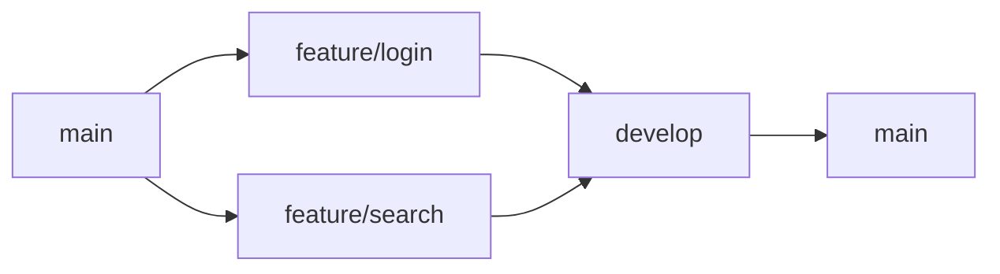

## Source
- Track: Git Workflow (self-directed, reference guide)
- Reference reading: Pro Git Book by Scott Chacon; Git documentation; Atlassian Git Tutorial; GitHub Flow Guide
- Date: 2026-07-29

---

## 1. Mental Model

**Branch management is the act of organizing parallel work streams while maintaining a clean, traceable history.** Branches enable multiple developers to work simultaneously without stepping on each other's commits. The mental model is a tree where each branch is a parallel timeline that can diverge and reconverge. Good branch management balances isolation (for safety) with integration (for collaboration).

> Key intuition: **branches are cheap pointers to commits, not copies of code** — creating a branch is instantaneous, but merging requires reconciliation.



## 2. Core Concepts

### Branch Types
- **main/master**: Production-ready code, protected branch
- **develop**: Integration branch for features, pre-production
- **feature/**: Short-lived branches for specific features
- **hotfix/**: Urgent fixes to production
- **release/**: Preparation for production release

### Branch Naming Conventions
```
feature/description
bugfix/description
hotfix/description
release/version
```

## 3. Essential Commands

### Create Branch
```bash
# Create new branch from current commit
git branch feature/new-feature

# Create and switch to new branch
git checkout -b feature/new-feature

# Create branch from specific commit
git branch feature/new-feature abc1234

# Create branch from remote branch
git checkout -b feature/new-feature origin/feature/new-feature
```

**When to use:** Starting new work that should be isolated from main/develop.

### Switch Branches
```bash
# Switch to existing branch
git checkout feature/new-feature

# Switch to previous branch
git checkout -

# Switch and discard local changes (force)
git checkout -f feature/new-feature

# Switch with uncommitted changes using stash
git stash
git checkout other-branch
git stash pop
```

**When to use:** Moving between different work streams. Use `-f` only when you're certain local changes should be discarded.

### List Branches
```bash
# List all local branches
git branch

# List all branches (local and remote)
git branch -a

# List branches with latest commit info
git branch -v

# List branches sorted by last commit date
git branch --sort=-committerdate
```

**When to use:** Understanding branch landscape and identifying stale branches.

### Delete Branches
```bash
# Delete local branch (must not be current branch)
git branch feature/old-feature

# Force delete branch (even if unmerged)
git branch -D feature/old-feature

# Delete remote branch
git push origin --delete feature/old-feature

# Or use this syntax (more intuitive)
git push origin :feature/old-feature
```

**When to use:** Cleaning up completed features. Use `-D` cautiously—only when you're certain the work won't be needed.

### Rename Branch
```bash
# Rename current branch
git branch -m new-name

# Rename specific branch
git branch -m old-name new-name

# Rename remote branch (requires push + delete)
git branch -m old-name new-name
git push origin :old-name
git push origin new-name
```

**When to use:** Fixing typos in branch names or following naming conventions.

### Track Remote Branches
```bash
# Set upstream tracking for current branch
git branch --set-upstream-to=origin/develop

# Create branch with upstream tracking
git checkout -b feature/new-feature origin/develop

# Show upstream tracking for all branches
git branch -vv
```

**When to use:** Ensuring `git push` and `git pull` work without specifying remote/branch.

## 4. Common Workflows

### Feature Branch Workflow
```bash
# 1. Start from develop
git checkout develop
git pull origin develop

# 2. Create feature branch
git checkout -b feature/user-authentication

# 3. Work and commit
# ... make changes ...
git add .
git commit -m "Add user authentication"

# 4. Push to remote
git push -u origin feature/user-authentication

# 5. Create PR and merge to develop
# (via GitHub/GitLab UI)
```

### Hotfix Workflow
```bash
# 1. Start from main (production)
git checkout main
git pull origin main

# 2. Create hotfix branch
git checkout -b hotfix/critical-bug

# 3. Fix and commit
# ... make fix ...
git add .
git commit -m "Fix critical security issue"

# 4. Merge to main AND develop
git checkout main
git merge hotfix/critical-bug
git push origin main

git checkout develop
git merge hotfix/critical-bug
git push origin develop

# 5. Delete hotfix branch
git branch -d hotfix/critical-bug
```

## 5. Best Practices

- **Keep branches short-lived**: Long-lived branches increase merge conflict risk
- **Protect main/develop**: Require PRs and reviews before merging
- **Delete merged branches**: Keep branch list clean and manageable
- **Use descriptive names**: Branch names should tell the story
- **One feature per branch**: Avoid mixing unrelated changes
- **Rebase before merging**: Keep history linear and clean

## 6. Common Pitfalls

### Working on Wrong Branch
```bash
# Check current branch
git branch --show-current

# If on wrong branch, stash and switch
git stash
git checkout correct-branch
git stash pop
```

### Detached HEAD State
```bash
# Happens when checking out a commit directly
# Create a branch to save work
git checkout -b rescue-branch
```

### Lost Commits on Wrong Branch
```bash
# If you committed on wrong branch
git checkout correct-branch
git cherry-pick wrong-branch
```

### Branch Already Exists Remotely
```bash
# If local branch conflicts with remote
git checkout correct-branch
git branch -m local-branch
git checkout -b correct-branch origin/correct-branch
```
