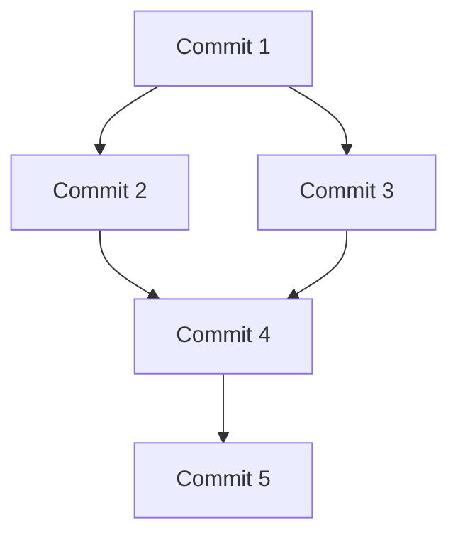

## Source
- Track: Git Workflow (self-directed, reference guide)
- Reference reading: Pro Git Book by Scott Chacon; Git documentation; Atlassian Git Tutorial; GitHub Flow Guide
- Date: 2026-07-29

---

## 1. Mental Model

**Change inspection is the act of understanding what happened, when it happened, and who made it happen.** The mental model is a timeline where each commit is a snapshot with metadata (author, date, message). Effective change inspection enables debugging, code review, and historical understanding without reading every line of code.

> Key intuition: **Git's history is a directed acyclic graph (DAG), not a straight line** — inspection commands help you navigate this graph to find relevant changes.



## 2. Core Concepts

### Commit History
- **Linear history**: Straight line of commits (ideal for main branches)
- **Branching history**: Multiple parallel lines (feature branches)
- **Merged history**: Branches that reconverge (merge commits)

### Diff Types
- **Working directory vs staging**: Changes you haven't staged
- **Staging vs HEAD**: Changes you've staged but not committed
- **HEAD vs another branch**: Differences between branches
- **Commit vs commit**: Differences between specific commits

### Inspection Targets
- **Files**: What changed in specific files
- **Commits**: What changed in specific commits
- **Branches**: What changed between branches
- **Ranges**: What changed in a commit range

## 3. Essential Commands

### View Commit History
```bash
# Show commit history with full details
git log

# Show commit history with one line per commit
git log --oneline

# Show commit history with graph visualization
git log --graph --oneline --all

# Show last N commits
git log -n 10

# Show commits since specific date
git log --since="2024-01-01"

# Show commits by specific author
git log --author="John Doe"
```

**When to use:** Understanding project history, finding when changes were made, identifying contributors.

### View Commit Details
```bash
# Show commit with full diff
git show <commit-hash>

# Show commit with stats
git show --stat <commit-hash>

# Show specific file in commit
git show <commit-hash>:path/to/file

# Show commit message only
git log --format=%B -n 1 <commit-hash>
```

**When to use:** Understanding what a specific commit changed, reviewing changes before merging.

### View Differences (Diff)
```bash
# Show unstaged changes
git diff

# Show staged changes
git diff --staged

# Show differences between branches
git diff develop feature-branch

# Show differences between commits
git diff abc1234 def5678

# Show diff with statistics
git diff --stat

# Show diff with context lines
git diff -U3

# Show diff in specific file
git diff path/to/file
```

**When to use:** Reviewing your changes before committing, understanding what changed between branches/commits.

### Compare Branches
```bash
# Show commits in feature-branch but not in develop
git log develop..feature-branch --oneline

# Show commits in develop but not in feature-branch
git log feature-branch..develop --oneline

# Show commits reachable from either branch
git log develop...feature-branch --oneline

# Show diff between branches
git diff develop feature-branch

# Show files changed between branches
git diff --name-only develop feature-branch
```

**When to use:** Understanding what will be merged, preparing for code review, identifying conflicts.

### Blame (Annotate)
```bash
# Show who changed each line in file
git blame path/to/file

# Show blame with line numbers
git blame -L 10,20 path/to/file

# Show blame ignoring whitespace
git blame -w path/to/file

# Show blame with commit details
git blame -e path/to/file
```

**When to use:** Finding who introduced a bug, understanding code ownership, historical context.

### Show Commands
```bash
# Show current branch
git branch --show-current

# Show tracked files
git ls-files

# Show untracked files
git ls-files --others

# Show ignored files
git ls-files --others --ignored

# Show repository status
git status

# Show commit graph
git log --graph --decorate --oneline
```

**When to use:** Quick repository state checks, understanding what Git is tracking.

## 4. Common Workflows

### What Changed in Feature Branch
```bash
# See commits that will be merged
git log develop..feature-branch --oneline

# See the actual changes
git diff develop feature-branch

# See files that changed
git diff --name-only develop feature-branch

# See commit authors
git log develop..feature-branch --format="%an" | sort | uniq -c
```

**When to use:** Before creating PR/MR, preparing for code review.

### Find When Bug Was Introduced
```bash
# Binary search through commits
git bisect start
git bisect bad HEAD
git bisect good <known-good-commit>
# Git will checkout commits, test each, mark good/bad
git bisect reset

# Or use blame on specific line
git blame path/to/file
```

**When to use:** Debugging, finding regression points.

### Review Someone's Changes
```bash
# Fetch their branch
git fetch origin feature-branch

# See what they changed
git log HEAD..origin/feature-branch --oneline

# Review the changes
git diff HEAD..origin/feature-branch

# Checkout their branch to test
git checkout origin/feature-branch
```

**When to use:** Code review, understanding teammate's changes.

### Check What You're About to Commit
```bash
# See unstaged changes
git diff

# See staged changes
git diff --staged

# See both
git diff HEAD

# See commit message template
git commit --dry-run
```

**When to use:** Before committing to ensure you're committing the right changes.

## 5. Advanced Inspection

### Search Commit History
```bash
# Search commit messages
git log --grep="fix" --oneline

# Search in commit diffs
git log -S"functionName" --oneline

# Search by author and date
git log --author="John" --since="2024-01-01" --oneline
```

### Filter by File
```bash
# Show history of specific file
git log --follow path/to/file

# Show commits that touched specific file
git log -- path/to/file

# Show diff for specific file across commits
git log -p -- path/to/file
```

### Compare File Across Branches
```bash
# Show file in different branch
git show develop:path/to/file

# Diff file across branches
git diff develop:file.txt feature:file.txt

# Checkout file from another branch
git checkout develop -- path/to/file
```

### View Commit Ranges
```bash
# Show commits between two commits
git log abc1234..def5678

# Show commits excluding merge commits
git log --no-merges

# Show first parent only (mainline)
git log --first-parent
```

## 6. Best Practices

- **Use --oneline for quick scans**: Easier to read than full log output
- **Use --graph for branch visualization**: Understand merge history
- **Blame responsibly**: Use for understanding, not blaming
- **Review diffs before committing**: Catch mistakes early
- **Use commit ranges for PRs**: Show what will be merged
- **Search history effectively**: Use grep and -S for pattern matching

## 7. Common Pitfalls

### Too Much Output
```bash
# Limit output with flags
git log --oneline -n 20
git diff --stat
```

### Confusing Diff Syntax
```bash
# Remember: A..B means commits in B not in A
git log develop..feature-branch

# And A...B means commits in either but not both
git log develop...feature-branch
```

### Blame on Moved Code
```bash
# Use -M to detect moved lines
git blame -M path/to/file

# Use -C to detect copied lines
git blame -C path/to/file
```

### Missing Context in Diffs
```bash
# Add more context lines
git diff -U10
git diff -U5 develop feature-branch
```

## 8. Inspection for Specific Scenarios

### Before Merging
```bash
# Check for merge conflicts
git merge --no-commit --no-ff develop

# See what will merge
git log develop..HEAD --oneline
git diff develop HEAD

# Abort if you don't want to merge
git merge --abort
```

### After Pulling
```bash
# See what you just pulled
git log HEAD@{1}..HEAD --oneline
git diff HEAD@{1} HEAD
```

### Understanding Merge Conflicts
```bash
# See conflict markers
git diff

# See both sides of conflict
git show HEAD:file.txt
git show MERGE_HEAD:file.txt

# Use conflict resolution tools
git mergetool
```
