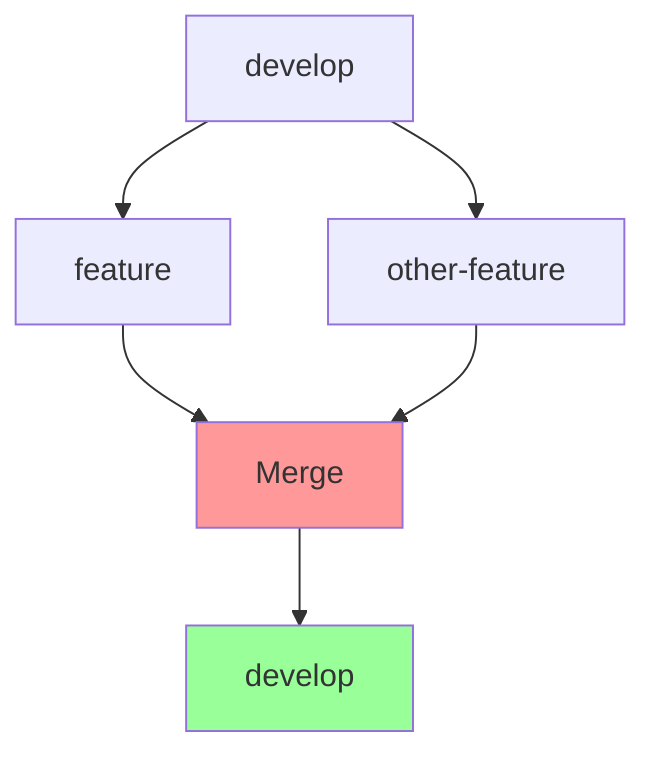

## Source
- Track: Git Workflow (self-directed, reference guide)
- Reference reading: Pro Git Book by Scott Chacon; Git documentation; Atlassian Git Tutorial; GitHub Flow Guide
- Date: 2026-07-29

---

## 1. Mental Model

**Merge and rebase are two different ways to integrate changes from one branch into another.** The mental model is about how you want history to look: merge preserves the true chronological sequence (with merge commits), while rebase rewrites history to appear linear. The choice affects commit history readability, conflict resolution, and collaboration patterns.

> Key intuition: **merge preserves history as it actually happened, rebase rewrites history to appear cleaner** — merge is safer, rebase is prettier.



## 2. Core Concepts

### Merge
- **What it does**: Creates a merge commit combining two histories
- **History**: Preserves true chronological sequence with merge commits
- **Safety**: Non-destructive, preserves original commits
- **Best for**: Shared branches, preserving collaboration history
- **Conflicts**: Resolved once in merge commit

### Rebase
- **What it does**: Rewrites commits to appear as if they were always on target branch
- **History**: Creates linear history, eliminates merge commits
- **Safety**: Destructive (rewrites commit hashes)
- **Best for**: Feature branches before merging, cleaning up local history
- **Conflicts**: Resolved for each rebased commit

### The Golden Rule
**Never rebase commits that exist outside your repository.** Once commits are pushed to a shared branch, rebase becomes dangerous because it rewrites history that others may have based work on.

## 3. Merge Commands

### Basic Merge
```bash
# Merge current branch with another branch
git merge feature-branch

# Merge with specific commit message
git merge feature-branch -m "Merge feature branch"

# Merge without fast-forward (always creates merge commit)
git merge --no-ff feature-branch

# Merge with fast-forward (if possible)
git merge --ff feature-branch
```

**When to use:** Integrating feature branches into develop/main. Use `--no-ff` to preserve branch history.

### Merge Strategies
```bash
# Recursive (default, good for most cases)
git merge -s recursive feature-branch

# Ours (always keep our version)
git merge -s ours feature-branch

# Octopus (merge multiple branches at once)
git merge branch1 branch2 branch3
```

**When to use:** Special conflict resolution scenarios or multi-branch merges.

### Abort Merge
```bash
# Cancel merge if conflicts occur
git merge --abort
```

**When to use:** When you encounter conflicts and want to start over.

## 4. Rebase Commands

### Basic Rebase
```bash
# Rebase current branch onto another branch
git rebase develop

# Rebase with interactive mode
git rebase -i develop

# Rebase specific number of commits
git rebase -i HEAD~3

# Rebase onto specific commit
git rebase abc1234
```

**When to use:** Updating feature branch with latest develop changes before merging. Use `-i` to clean up commit history.

### Interactive Rebase
```bash
# Start interactive rebase for last 3 commits
git rebase -i HEAD~3

# Commands in interactive mode:
# pick = use commit as-is
# reword = edit commit message
# edit = pause to make changes
# squash = combine with previous commit
# fixup = combine with previous (discard message)
# drop = remove commit entirely
```

**When to use:** Cleaning up commit history, squashing related commits, fixing typos in commit messages.

### Continue/Abort Rebase
```bash
# Continue after resolving conflicts
git rebase --continue

# Skip current commit during rebase
git rebase --skip

# Abort rebase (return to original state)
git rebase --abort
```

**When to use:** Managing rebase conflicts or deciding to cancel the rebase.

### Rebase onto
```bash
# Rebase commits from one branch onto another
git rebase --onto develop feature-start feature-end

# Useful for moving feature branch to new base
git rebase --onto new-base old-base feature-branch
```

**When to use:** Moving a feature branch to a different base branch.

## 5. When to Use Which

### Use Merge When
- **Integrating to shared branches** (develop, main)
- **Preserving true collaboration history**
- **Working with team members on same branch**
- **Uncertain about rebase consequences**
- **Merge conflicts are complex** (easier to resolve once)

### Use Rebase When
- **Updating feature branch with develop**
- **Before merging feature branch to develop**
- **Cleaning up local commit history**
- **Squashing related commits**
- **Feature branch is private (not shared)**

### The Typical Workflow
```bash
# 1. Create feature branch from develop
git checkout develop
git pull origin develop
git checkout -b feature/new-feature

# 2. Work and commit
# ... make changes ...
git commit -m "Add feature"

# 3. Before merging, rebase with latest develop
git fetch origin develop
git rebase origin/develop

# 4. Resolve conflicts if any
# ... resolve conflicts ...
git rebase --continue

# 5. Force push (since you rebased)
git push --force-with-lease origin feature/new-feature

# 6. Create PR/MR (will use merge)
# ... via GitHub/GitLab UI ...
```

## 6. Conflict Resolution

### Merge Conflicts
```bash
# Start merge
git merge feature-branch

# Resolve conflicts in files
# ... edit files with conflict markers ...

# Stage resolved files
git add resolved-file.txt

# Complete merge
git commit

# Or abort if you can't resolve
git merge --abort
```

### Rebase Conflicts
```bash
# Start rebase
git rebase develop

# Resolve conflicts for first commit
# ... edit files with conflict markers ...

# Stage resolved files
git add resolved-file.txt

# Continue to next commit
git rebase --continue

# Repeat for each commit with conflicts

# Or abort if you can't resolve
git rebase --abort
```

### Conflict Resolution Strategies
```bash
# Accept our version (current branch)
git checkout --ours path/to/file

# Accept their version (incoming branch)
git checkout --theirs path/to/file

# Use merge tool
git mergetool

# Manual resolution (edit conflict markers)
# <<<<<<< HEAD
# our version
# =======
# their version
# >>>>>>> feature-branch
```

## 7. Best Practices

- **Rebase feature branches, merge shared branches**: Keep feature history clean, preserve shared history
- **Never rebase pushed shared commits**: Rewrites history that others may depend on
- **Use --force-with-lease, not --force**: Prevents overwriting others' work
- **Squash related commits before merging**: Cleaner history for PRs
- **Resolve conflicts thoughtfully**: Understand both sides before choosing
- **Test after rebase**: Ensure functionality is preserved

## 8. Common Pitfalls

### Rebase After Pushing
```bash
# DANGEROUS: Don't do this on shared branches
git rebase develop
git push --force  # Overwrites team's history

# SAFER: Use force-with-lease
git push --force-with-lease  # Fails if others pushed
```

### Complex Rebase Conflicts
```bash
# If rebase conflicts are too complex, abort and merge instead
git rebase --abort
git merge develop
```

### Losing Work During Rebase
```bash
# Always create backup branch before rebase
git branch backup-feature
git rebase develop

# If something goes wrong, restore from backup
git reset --hard backup-feature
```

### Rebase in Wrong Direction
```bash
# Rebase current branch ONTO target
git checkout feature-branch
git rebase develop  # Correct

# NOT: rebase develop onto feature-branch
git checkout develop
git rebase feature-branch  # Usually wrong
```

## 9. Advanced Scenarios

### Squash Commits Before Merge
```bash
# Interactive rebase to squash
git rebase -i HEAD~5

# Change 'pick' to 'squash' for commits to combine
# Save and exit
# Edit combined commit message
# Force push
git push --force-with-lease
```

### Move Feature Branch to New Base
```bash
# Move feature branch from old-base to new-base
git rebase --onto new-base old-base feature-branch
```

### Rebase Specific Commits
```bash
# Rebase only certain commits
git rebase --onto develop abc1234 feature-branch
```

### Cherry-Pick vs Rebase
```bash
# Cherry-pick: Bring single commit to current branch
git cherry-pick abc1234

# Rebase: Bring all commits to new base
git rebase develop
```

## 10. Decision Flowchart

```
Need to integrate changes?
│
├─ Is branch shared with team?
│  └─ YES → Use MERGE
│  └─ NO  → Is it a feature branch?
│           └─ YES → Use REBASE onto develop
│           └─ NO  → Use MERGE
```
