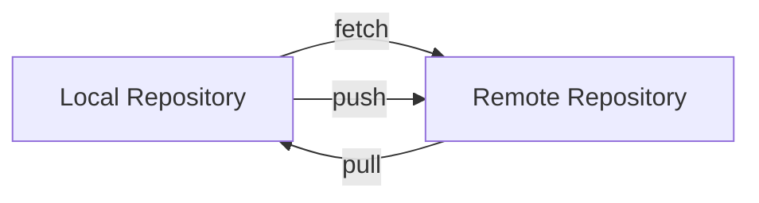

## Source
- Track: Git Workflow (self-directed, reference guide)
- Reference reading: Pro Git Book by Scott Chacon; Git documentation; Atlassian Git Tutorial; GitHub Flow Guide
- Date: 2026-07-29

---

## 1. Mental Model

**Syncing with remote repositories is the act of reconciling local work with team changes while preserving your own contributions.** The mental model is a distributed system where each repository is a complete copy, and syncing is about finding the common ancestor and applying changes in both directions. The key distinction is between fetching (downloading changes) and pulling (fetching + merging).

> Key intuition: **fetch is safe (doesn't modify your work), pull is destructive (modifies your work)** — always fetch first to see what you're getting into.



## 2. Core Concepts

### Remote Repository
- **origin**: Default name for the primary remote repository
- **upstream**: Additional remote for forked repositories
- **Remote tracking branches**: Local references to remote branch states (e.g., `origin/main`)

### Fetch vs Pull
- **fetch**: Downloads remote data without modifying local branches
- **pull**: Fetch + merge/rebase into current branch
- **pull --rebase**: Fetch + rebase instead of merge

### Upstream Tracking
- Local branches can track remote branches
- Enables `git push` and `git pull` without arguments
- Set with `-u` flag or `--set-upstream-to`

## 3. Essential Commands

### Fetch Remote Changes
```bash
# Fetch all remote branches and tags
git fetch origin

# Fetch specific branch
git fetch origin develop

# Fetch all remotes
git fetch --all

# Fetch with prune (delete stale remote tracking branches)
git fetch --prune

# Fetch and show what would be merged
git fetch origin develop
git log HEAD..origin/develop --oneline
```

**When to use:** Before pulling to see what changes are coming. Safer than pull because it doesn't modify your work.

### Pull Remote Changes
```bash
# Pull current branch's upstream
git pull

# Pull specific branch
git pull origin develop

# Pull with rebase (linear history)
git pull --rebase

# Pull with specific strategy
git pull --strategy=recursive -X theirs origin develop
```

**When to use:** When you're ready to integrate remote changes. Use `--rebase` for cleaner history, use strategy options for conflict resolution.

### Push Local Changes
```bash
# Push current branch to upstream
git push

# Push current branch and set upstream
git push -u origin feature/new-feature

# Push to specific remote branch
git push origin feature/new-feature

# Push all branches
git push --all

# Push with force (dangerous)
git push --force

# Push with force lease (safer)
git push --force-with-lease

# Push tags
git push --tags
```

**When to use:** Sharing your work with the team. Never use `--force` on shared branches—use `--force-with-lease` instead.

### Add Remote Repository
```bash
# Add new remote
git remote add upstream https://github.com/original/repo.git

# Add remote with different name
git remote add fork https://github.com/yourname/repo.git

# Show all remotes
git remote -v

# Remove remote
git remote remove upstream
```

**When to use:** Working with forked repositories or multiple remotes.

### Show Remote Information
```bash
# Show all remotes with URLs
git remote -v

# Show remote branches
git branch -r

# Show remote tracking status
git branch -vv

# Show remote HEAD
git remote show origin
```

**When to use:** Understanding your remote configuration and tracking relationships.

### Update Remote URLs
```bash
# Change remote URL
git remote set-url origin https://github.com/newurl/repo.git

# Switch from HTTPS to SSH
git remote set-url origin git@github.com:username/repo.git
```

**When to use:** Repository moved or you want to change authentication method.

## 4. Common Workflows

### Update Develop Branch
```bash
# If you're on develop branch
git checkout develop
git fetch origin develop
git merge origin/develop
git push origin develop

# Or simpler with pull
git checkout develop
git pull origin develop
```

**When to use:** Keeping your local develop branch in sync with the team.

### Update Feature Branch from Develop
```bash
# Option 1: Merge approach (preserves history)
git fetch origin develop
git checkout feature/my-feature
git merge origin/develop

# Option 2: Rebase approach (linear history)
git fetch origin develop
git checkout feature/my-feature
git rebase origin/develop

# Option 3: Interactive rebase (clean up commits)
git fetch origin develop
git checkout feature/my-feature
git rebase -i origin/develop
```

**When to use:** Incorporating latest develop changes into your feature branch before merging.

### Push After Rebase
```bash
# After rebasing, force push is required
git rebase origin/develop
git push --force-with-lease origin feature/my-feature
```

**When to use:** After rewriting history (rebase, squash, amend). Use `--force-with-lease` to prevent overwriting others' work.

### Work with Forked Repository
```bash
# Add original repository as upstream
git remote add upstream https://github.com/original/repo.git

# Fetch upstream changes
git fetch upstream

# Merge upstream changes into your fork
git checkout main
git merge upstream/main

# Push to your fork
git push origin main
```

**When to use:** Contributing to open-source projects via forks.

## 5. Best Practices

- **Always fetch before pulling**: See what's coming before integrating
- **Use --rebase for feature branches**: Keeps history linear and clean
- **Never force push shared branches**: Use --force-with-lease instead
- **Set upstream tracking**: Use -u flag on first push
- **Regularly prune remote branches**: Keep remote tracking clean
- **Pull before pushing**: Avoid unnecessary merge commits

## 6. Common Pitfalls

### Pull Creates Merge Commit
```bash
# If you want linear history instead
git pull --rebase origin develop
```

### Push Rejected (Non-Fast-Forward)
```bash
# Someone pushed changes you don't have
git fetch origin
git rebase origin/develop
git push --force-with-lease
```

### Stale Remote Tracking Branches
```bash
# Clean up deleted remote branches
git fetch --prune
```

### Wrong Remote Configuration
```bash
# Check and fix remotes
git remote -v
git remote set-url origin correct-url
```

### Authentication Issues
```bash
# Switch to SSH authentication
git remote set-url origin git@github.com:username/repo.git
```

## 7. Advanced Scenarios

### Cherry-Pick from Remote
```bash
# Fetch and cherry-pick specific commit
git fetch origin
git cherry-pick origin/develop~3
```

### Sync Multiple Remotes
```bash
# Fetch from all remotes
git fetch --all

# Push to specific remote
git push fork feature/my-feature
```

### Partial Sync (Sparse Checkout)
```bash
# Enable sparse checkout
git config core.sparseCheckout true

# Configure paths to include
echo "path/to/include" >> .git/info/sparse-checkout

# Fetch and checkout
git fetch origin
git checkout origin/main
```
