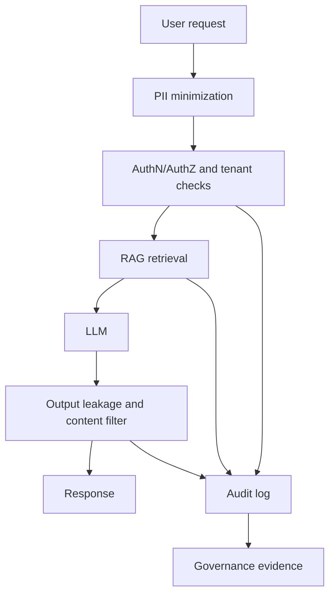

# AI Security & Governance

> Topic package — Domain 9 · Roadmap Week 21.
> Depth goal: design an enterprise LLM security program that maps threats to controls: PII minimization, RAG access control, audit evidence, leakage filters, compliance, responsible-AI review, and a launch risk checklist.

## Source
- Track: LLM Engineering (self-directed, FDE roadmap)
- Slide deck: `07 Resources Library/LLM Engineering/Slides/Lesson_49_AI_Security_and_Governance.pptx`
- Hands-on notebook: `07 Resources Library/LLM Engineering/Notebooks/49_AI_Security_and_Governance.ipynb` (runs offline)
- Reference reading: OWASP LLM Top 10; NIST AI Risk Management Framework; EU AI Act; GDPR; SOC 2 Trust Services Criteria; ISO/IEC 42001 AI management systems
- Builds on: [[02 Literature Notes/LLM Engineering/RAG Evaluation]]
- Date: 2026-07-18

---

## 1. Mental Model

**AI security is not one filter at the edge — it is a layered control system around data, users, tools, model behavior, and evidence.** The model is only one component; failures often happen because private data enters a prompt, the wrong user retrieves the wrong document, generated text leaks secrets, or no audit trail exists when something goes wrong.

Think in layers: classify data before it reaches the model, enforce tenant/RBAC boundaries before retrieval, constrain tools, filter outputs, log security-relevant decisions, and connect those controls to governance frameworks such as OWASP LLM Top 10, NIST AI RMF, GDPR/SOC2, and the EU AI Act.

> Key intuition: **secure the AI workflow, not just the prompt** — every transition from user to retriever to model to tool to output needs a control and an audit event.



---

## 2. How It Actually Works

### 9.1 Threat model with OWASP LLM Top 10
Start with named failure classes: prompt injection, sensitive information disclosure, insecure output handling, excessive agency, vector/database weaknesses, model denial of service, and supply-chain risks. For each production use case, write an abuse story: *who attacks, what asset is targeted, which boundary fails, and what evidence would prove the control worked?* OWASP is the checklist; your architecture is the answer.

### 9.2 PII and data privacy by design
Minimize before you generate. Detect direct identifiers (email, phone, SSN), pseudonymize where possible, avoid logging raw prompts with personal data, and set retention/deletion policies. GDPR-style thinking matters even outside Europe: lawful basis, purpose limitation, data minimization, subject access, and erasure. The safest token is the one never sent to a model provider.

### 9.3 RBAC for RAG
RAG changes access control because retrieval silently injects documents into the prompt. The retriever must enforce the same tenant, role, document-level ACL, region, and time-bound entitlements as the source system *before* the model sees text. Never rely on the LLM to ignore unauthorized context; unauthorized context should not be retrieved.

### 9.4 Audit logging and compliance evidence
Every sensitive decision should leave evidence: user, request id, model/version, retrieved document ids, policy decision, filters applied, tool calls, refusal/escalation, and final disposition. SOC2 and AI governance reviews ask: can you show the control happened? Audit logs convert good intentions into verifiable operations.

### 9.5 Responsible-AI governance
Security overlaps with responsible AI: define intended use, prohibited use, human escalation, evaluation coverage, bias/safety tests, incident response, vendor risk review, and model-change management. NIST AI RMF frames this as govern-map-measure-manage; the EU AI Act adds risk tiers and obligations. A launch checklist should connect technical controls to these governance artifacts.

---

## 3. Implementation

Assumed stack: stdlib. Snippets demonstrate deterministic PII redaction and RAG RBAC audit logging. Snippets:
- [[04 Code Snippets/LLM/Deterministic PII Redaction Gate]]
- [[04 Code Snippets/LLM/RAG RBAC Audit Gate]]

### Deterministic PII Redaction Gate
Regex-detect common identifiers and pseudonymize them before model or log exposure.
```python
import re, hashlib
PII_PATTERNS = {
    "email": re.compile(r"\b[A-Za-z0-9._%+-]+@[A-Za-z0-9.-]+\.[A-Za-z]{2,}\b"),
    "phone": re.compile(r"\b(?:\+?1[-. ]?)?\(?\d{3}\)?[-. ]?\d{3}[-. ]?\d{4}\b"),
    "ssn": re.compile(r"\b\d{3}-\d{2}-\d{4}\b"),
}

def pseudonymize(kind, value):
    digest = hashlib.sha256(value.encode()).hexdigest()[:10]
    return f"<{kind.upper()}:{digest}>"

def redact_pii(text):
    findings = []
    for kind, pat in PII_PATTERNS.items():
        def repl(m):
            findings.append({"type": kind, "value": m.group(0)})
            return pseudonymize(kind, m.group(0))
        text = pat.sub(repl, text)
    return text, findings

sample = "Email jane@corp.com or call 415-555-1212; SSN 123-45-6789."
redacted, findings = redact_pii(sample)
print(redacted)
print([f["type"] for f in findings])
```

### RAG RBAC Audit Gate
Enforce tenant and role boundaries before retrieval and record policy decisions.
```python
from datetime import datetime

class AuditLog:
    def __init__(self):
        self.events = []
    def record(self, user, action, resource, decision, reason):
        self.events.append({
            "ts": datetime.utcnow().isoformat(timespec="seconds") + "Z",
            "user": user, "action": action, "resource": resource,
            "decision": decision, "reason": reason,
        })

def can_retrieve(user, doc, log):
    allowed = user["role"] in doc["roles"] and user["tenant"] == doc["tenant"]
    log.record(user["id"], "retrieve", doc["id"], "allow" if allowed else "deny",
               "tenant+role match" if allowed else "RBAC or tenant boundary failed")
    return allowed

log = AuditLog()
user = {"id":"u7", "role":"analyst", "tenant":"acme"}
docs = [{"id":"policy", "roles":{"analyst"}, "tenant":"acme"},
        {"id":"payroll", "roles":{"hr"}, "tenant":"acme"}]
print([d["id"] for d in docs if can_retrieve(user, d, log)])
print(log.events)
```

---

## 4. Design Decisions & Tradeoffs

| Decision | Guidance |
|---|---|
| **Data minimization** | Redact or pseudonymize before prompts and logs; raw sensitive data requires explicit business need. |
| **Retriever authorization** | Apply RBAC/ABAC and tenant filters before vector search results enter context. |
| **Audit granularity** | Log document ids, policy decisions, model version, and tool calls without storing unnecessary PII. |
| **Provider posture** | Review DPA, retention, training-on-data defaults, region, SOC2/ISO evidence, and incident process. |
| **Human escalation** | Escalate regulated, high-impact, or low-confidence outcomes; do not automate consequential decisions blindly. |
| **Risk acceptance** | Document residual risks and owners; governance is a living register, not a launch checkbox. |

---

## 5. Failure Modes & Gotchas

- Letting unauthorized documents reach the prompt and asking the model not to use them.
- Logging raw prompts/responses that contain PII or secrets.
- Treating SOC2/GDPR as paperwork disconnected from runtime controls.
- No model/version/request trace, making incidents impossible to reconstruct.
- Output filters only, with no input minimization or retrieval authorization.
- No abuse-case testing for prompt injection, data leakage, or excessive agency.

---

## 6. FDE Angle

- FDE clients need a security architecture and a governance story, not just a demo.
- A risk checklist turns vague AI anxiety into concrete controls, owners, and evidence.
- RBAC-for-RAG is a board-level data-leakage control when enterprise documents are involved.
- Deliverable: threat model, risk register, PII/RBAC/audit gates, and compliance evidence map.

---

## 7. Self-Check

1. Name three OWASP LLM risks and the control you would implement for each.
2. Why must RAG enforce authorization before retrieval?
3. What should an audit log capture without creating a new privacy risk?
4. How do NIST AI RMF and EU AI Act change launch governance?
5. What belongs on an enterprise AI risk checklist?

## 8. Links
- Domain MOC: [[06 Maps of Content/LLM Engineering Concepts]]
- Code: [[04 Code Snippets/LLM/Deterministic PII Redaction Gate]], [[04 Code Snippets/LLM/RAG RBAC Audit Gate]]
- Distilled: [[03 Permanent Notes/Secure the AI Workflow Not Just the Prompt]], [[03 Permanent Notes/RAG Authorization Happens Before Retrieval]]
- Upstream: [[02 Literature Notes/LLM Engineering/RAG Evaluation]] · Downstream: [[02 Literature Notes/LLM Engineering/Guardrails and Prompt Injection]]
