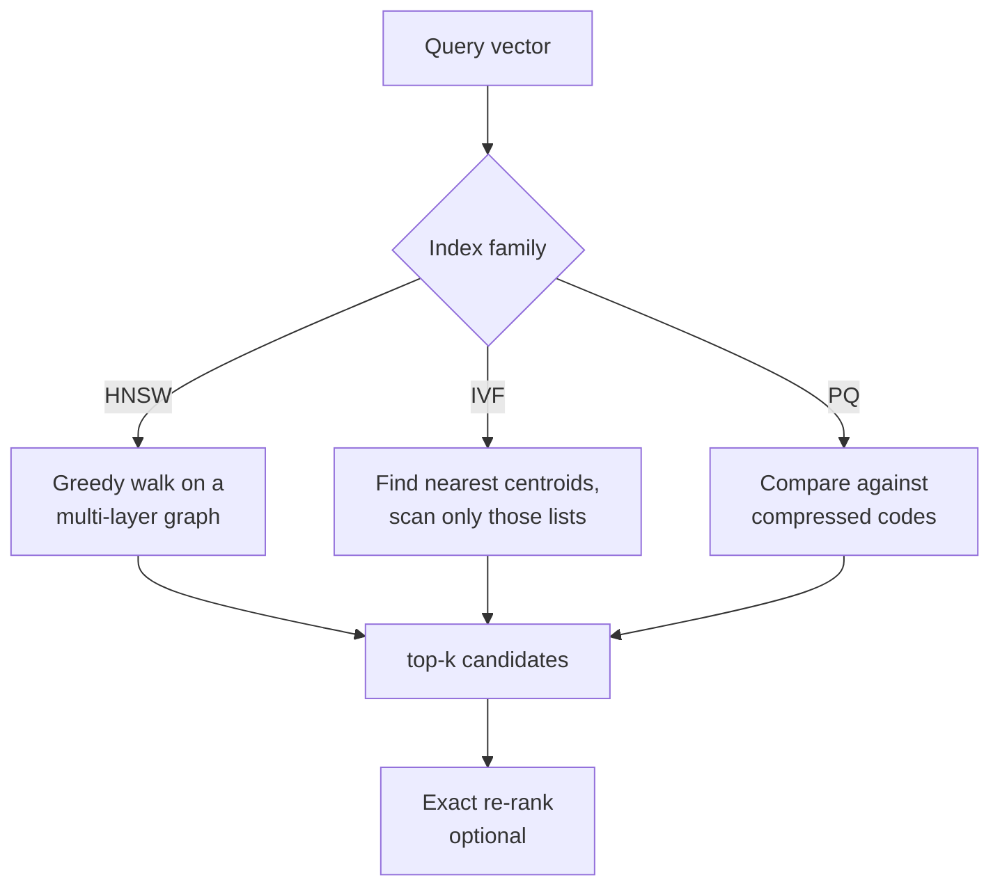

# ANN Index Internals

> Topic package — Domain 1 (Data Representation) · Roadmap Weeks 09/14.
> Depth goal: understand *how* the three ANN index families (HNSW, IVF, PQ) actually work, the knobs that trade recall for latency/memory, and how to pick and tune one for a real workload.

## Source
- Track: LLM Engineering (self-directed, FDE roadmap)
- Slide deck: `07 Resources Library/LLM Engineering/Slides/Lesson_06_ANN_Index_Internals.pptx`
- Hands-on notebook: `07 Resources Library/LLM Engineering/Notebooks/06_ANN_Index_Internals.ipynb` (runs offline)
- Reference reading: Malkov & Yashunin "HNSW" (arXiv:1603.09320); Jégou et al. "Product Quantization for NN Search" (IEEE TPAMI 2011); Johnson et al. "Billion-scale similarity search with GPUs" (FAISS, arXiv:1702.08734); Pinecone HNSW/IVF/PQ guides; FAISS wiki "Guidelines to choose an index"
- Builds on: [[02 Literature Notes/LLM Engineering/Vector Search]]
- Date: 2026-07-18

---

## 1. Mental Model

**An ANN index is a data structure that avoids comparing the query to every vector.** Exact search is `O(N·d)` per query — fine for thousands of vectors, hopeless for millions. Approximate Nearest Neighbor (ANN) indexes accept a small, *tunable* chance of missing a true neighbor in exchange for sub-linear query time and/or a smaller memory footprint.

There are three core ideas, and every production index is one of them or a hybrid:

- **HNSW (graph)** — *navigate* to the answer. Build a navigable small-world graph and greedily walk toward the query. Fast, high recall, memory-hungry. The default for most vector DBs.
- **IVF (clustering / inverted file)** — *prune* the search space. Cluster vectors, only scan the few clusters nearest the query. Cheap memory, needs training, recall depends on how many clusters you probe.
- **PQ (product quantization)** — *compress* the vectors. Replace each vector with a short code so millions fit in RAM and distances are computed via lookup tables. Massive memory savings, lossy.

> Key intuition: the three families attack a different cost. **HNSW spends memory to save time; IVF prunes to save time; PQ compresses to save memory.** Real systems combine them (e.g. FAISS `IVF4096,PQ64`, or HNSW over PQ codes).



---

## 2. How It Actually Works

### 2.1 HNSW — Hierarchical Navigable Small World
A multi-layer graph. The bottom layer contains every vector; each higher layer is a sparse random subset, like the express lanes of a **skip list**. Search starts at the top layer's entry point, greedily hops to the neighbor closest to the query, drops a layer when it can't get closer, and repeats down to layer 0.

- **Build knobs:**
  - `M` — edges per node (graph degree). Higher `M` → better recall, more memory (roughly `~ M·N` links).
  - `efConstruction` — candidate list size while inserting. Higher → better graph quality, slower build.
- **Search knob:**
  - `efSearch` — candidate list size at query time. Higher → higher recall, more latency. This is the primary recall/latency dial.

Query time is roughly `O(log N)` hops. HNSW gives the best recall-at-latency of the three but stores the full vectors **plus** the graph, so it is the most memory-expensive.

$$\text{memory}_{\text{HNSW}} \approx \underbrace{N \cdot d \cdot 4}_{\text{float32 vectors}} + \underbrace{N \cdot M \cdot 2 \cdot 8}_{\text{graph links (bytes)}}$$

### 2.2 IVF — Inverted File Index
Run k-means to learn `nlist` centroids ("Voronoi cells"). Each vector is assigned to its nearest centroid's list. At query time, find the `nprobe` centroids nearest the query and scan **only** those lists.

- **Build knob:** `nlist` — number of clusters. Rule of thumb `nlist ≈ √N` … `4·√N`. Needs a `train()` step on representative data.
- **Search knob:** `nprobe` — how many clusters to scan. `nprobe = 1` is fast but low recall (misses neighbors sitting just across a cell boundary); raising `nprobe` trades latency for recall. `nprobe = nlist` degenerates to exact search.

IVF is memory-light (just the vectors + tiny centroid table) and great when you can afford a training pass. Its weakness is **boundary effects**: true neighbors near a Voronoi edge live in a cell you didn't probe.

### 2.3 PQ — Product Quantization
Split each `d`-dim vector into `m` sub-vectors; run k-means (usually 256 centroids = 1 byte) **per sub-space**. A vector becomes `m` bytes of centroid IDs. Distances are computed with a precomputed query-to-centroid lookup table (Asymmetric Distance Computation), so you never decompress.

- **Knobs:** `m` (number of sub-quantizers → code length) and `nbits` (bits per code, usually 8). A 768-d float32 vector (3072 bytes) → `m=64, nbits=8` = **64 bytes**, a ~48× shrink.
- **Cost:** lossy — distances are approximate, so recall drops. Usually paired with an exact **re-rank** of the top candidates using full vectors, and/or wrapped in IVF (`IVFPQ`) to also prune.

$$\text{bytes per vector}_{\text{PQ}} = m \cdot \frac{\text{nbits}}{8}, \qquad \text{compression} = \frac{4d}{m \cdot \text{nbits}/8}$$

### 2.4 How they combine
- `IVFPQ` — prune with IVF, store PQ codes → billion-scale on one machine (FAISS default for huge corpora).
- `HNSW,PQ` / `HNSWPQ` — graph navigation over compressed codes when HNSW's full-vector memory is too high.
- Most managed DBs (Pinecone, Qdrant, Weaviate, Milvus) default to **HNSW** for < ~10M vectors because it's the easiest to get high recall with minimal tuning.

---

## 3. Implementation

Assumed stack (pin): `faiss-cpu>=1.8`, `numpy`. Snippets:
- [[04 Code Snippets/LLM/HNSW and IVF with FAISS]]
- [[04 Code Snippets/LLM/Tuning ANN Recall vs Latency]]

### 3.1 The three indexes in FAISS
```python
import faiss, numpy as np
d = 768
# HNSW — navigate
hnsw = faiss.IndexHNSWFlat(d, 32)          # M=32
hnsw.hnsw.efConstruction = 200
hnsw.hnsw.efSearch = 64                      # recall/latency dial
hnsw.add(xb)

# IVF — prune (needs training)
quant = faiss.IndexFlatIP(d)
ivf = faiss.IndexIVFFlat(quant, d, 4096)    # nlist=4096
ivf.train(xb); ivf.add(xb)
ivf.nprobe = 16                              # recall/latency dial

# IVFPQ — prune + compress
ivfpq = faiss.IndexIVFPQ(quant, d, 4096, 64, 8)  # m=64, nbits=8
ivfpq.train(xb); ivfpq.add(xb); ivfpq.nprobe = 16
```

### 3.2 Measuring recall against an exact baseline
```python
flat = faiss.IndexFlatIP(d); flat.add(xb)
_, true_ids = flat.search(xq, 10)           # ground truth
_, ann_ids  = hnsw.search(xq, 10)
recall = np.mean([len(set(a) & set(t)) / 10
                  for a, t in zip(ann_ids, true_ids)])
```

### 3.3 Sweeping the recall/latency knob
```python
for ef in (16, 32, 64, 128, 256):
    hnsw.hnsw.efSearch = ef
    # ... time search + compute recall ...  -> plot recall vs latency
```

---

## 4. Design Decisions & Tradeoffs

| Decision | Guidance |
|---|---|
| **Which family** | HNSW for < ~10M vectors and you want high recall with little tuning. IVF(+PQ) when memory-bound or at 100M–1B scale. Flat only for baselines / < ~100k. |
| **HNSW `M`** | 16–48. Higher = better recall + more RAM. 32 is a solid default. |
| **HNSW `efSearch`** | The live recall dial — raise until recall@k plateaus, then stop (latency keeps rising). |
| **IVF `nlist`** | ~√N to 4√N; more cells = finer pruning but each needs enough training points. |
| **IVF `nprobe`** | Start at 1–2% of `nlist`; raise for recall. |
| **PQ `m`** | Larger `m` = better recall, less compression. Must divide `d`. Add an exact re-rank of top candidates. |
| **Memory vs recall** | HNSW = most memory, best recall/latency. IVFPQ = least memory, needs tuning + re-rank. |
| **Updates** | HNSW supports incremental inserts well; IVF/PQ need a representative `train()` and periodic retraining as the distribution drifts. |

---

## 5. Failure Modes & Gotchas

- **Not training IVF/PQ on representative data** → bad centroids → poor recall for the real distribution.
- **`nprobe=1` in production** → fast but silently drops boundary neighbors; recall can be < 0.7.
- **PQ without re-rank** → approximate distances rank the wrong candidate first; always re-score top-N with full vectors when accuracy matters.
- **Treating `efSearch`/`nprobe` as build-time constants** → they're *query-time* dials you can tune live per latency budget.
- **No exact baseline** → you literally cannot compute recall, so you're tuning blind.
- **Underestimating HNSW memory** → the graph links add up; a "128 GB corpus" can OOM once the graph is built.
- **Rebuilding the whole index on every write** → know your DB's incremental-update semantics; IVF may need periodic retrain, not per-write rebuild.
- **`m` doesn't divide `d`** → FAISS errors or silently pads; check dimensions.
- **Comparing indexes at different recall** → always compare latency *at equal recall*, never raw QPS.

---

## 6. FDE Angle

- This is the topic that lets you answer a client's "why is retrieval slow / expensive / missing things?" with a mechanism, not a shrug: it's `efSearch` too low, `nprobe` too low, PQ with no re-rank, or an index that doesn't fit RAM.
- **Cost lever:** switching HNSW → IVFPQ can cut memory ~40× and let a corpus fit on a cheaper node — a real architecture/cost decision.
- **Capacity planning:** be able to estimate index memory from `N`, `d`, `M`/`m` on a whiteboard.
- Deliverable: a documented index choice with a **recall-vs-latency curve** proving the chosen operating point, plus a re-rank stage if PQ is used.

---

## 7. Self-Check

1. Explain HNSW as a skip list — what do the upper layers do and why is search ~`O(log N)`?
2. What do `M`, `efConstruction`, and `efSearch` each control, and which is a query-time dial?
3. Why does IVF miss neighbors, and how does `nprobe` fix it? What's the cost?
4. How many bytes does PQ with `m=64, nbits=8` use per 768-d vector, and why do you re-rank afterward?
5. You have 200M vectors and a tight RAM budget — which index and why?
6. How do you measure and report ANN quality honestly? (Hint: recall@k at equal latency.)

## 8. Links
- Domain MOC: [[06 Maps of Content/LLM Engineering Concepts]]
- Code: [[04 Code Snippets/LLM/HNSW and IVF with FAISS]], [[04 Code Snippets/LLM/Tuning ANN Recall vs Latency]]
- Distilled: [[03 Permanent Notes/HNSW Trades Memory for Fast High-Recall Search]], [[03 Permanent Notes/IVF and PQ Prune and Compress the Search Space]]
- Upstream: [[02 Literature Notes/LLM Engineering/Vector Search]]
