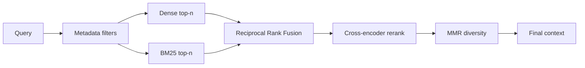

# Advanced Retrieval (hybrid, reranking, MMR)

> Topic package — Domain 4 · Roadmap Weeks 14/18.
> Depth goal: upgrade a baseline vector retriever into a production two-stage retrieval stack using BM25+dense fusion, metadata filters, cross-encoder reranking, and MMR diversity selection.

## Source
- Track: LLM Engineering (self-directed, FDE roadmap)
- Slide deck: `07 Resources Library/LLM Engineering/Slides/Lesson_18_Advanced_Retrieval.pptx`
- Hands-on notebook: `07 Resources Library/LLM Engineering/Notebooks/18_Advanced_Retrieval.ipynb` (runs offline)
- Reference reading: Cormack et al. Reciprocal Rank Fusion; Carbonell & Goldstein Maximal Marginal Relevance; Reimers & Gurevych Sentence-BERT / cross-encoders; Cohere Rerank docs; BGE reranker docs; Pinecone and Weaviate hybrid search docs
- Builds on: [[02 Literature Notes/LLM Engineering/RAG Pipeline Fundamentals]] · [[02 Literature Notes/LLM Engineering/Vector Search]] · [[02 Literature Notes/LLM Engineering/ANN Index Internals]]
- Date: 2026-07-18

---

## 1. Mental Model

**Advanced retrieval is a funnel: cheap broad recall first, expensive precision second, diversity last.** Dense embeddings catch semantic matches; lexical/BM25 catches exact names, IDs, and rare terms; fusion combines them; rerankers read query-document pairs more carefully; MMR prevents the final context from being five copies of the same evidence.

The production question is not 'which retriever is best?' It is 'what sequence of retrieval operations maximizes answerable evidence under latency and context budgets?' The answer is usually two-stage: retrieve many candidates cheaply, rerank fewer candidates expensively, then pack a diverse, filtered context.

> Key intuition: **retrieve for recall, rerank for precision, diversify for context budget.** Dense search alone is rarely the full production answer.



---

## 2. How It Actually Works

### 4.1 Dense vs lexical retrieval
Dense retrieval maps query and chunks into embedding space, so it handles paraphrase and semantic similarity. Lexical retrieval (BM25) rewards exact token overlap, so it excels on part numbers, proper nouns, error codes, and terms the embedding model underweights. Production search often needs both because user questions mix semantic intent with exact constraints.

### 4.2 Reciprocal Rank Fusion
RRF combines ranked lists without assuming comparable scores: $$score(d)=\sum_r rac{1}{k+rank_r(d)}$$. It is robust because it trusts rank positions rather than raw dense/BM25 score scales. Use it to merge dense top-50 and BM25 top-50 before reranking.

### 4.3 Cross-encoder reranking
A bi-encoder embeds query and doc separately for fast retrieval. A **cross-encoder** reads `[query, document]` jointly and outputs a relevance score, making it much more precise but slower. Common pattern: retrieve 50-200 candidates, rerank top 20-50 with Cohere/BGE/cross-encoder, then send 5-10 chunks to the LLM.

### 4.4 MMR for diversity
Maximal Marginal Relevance balances relevance to the query with novelty against already selected chunks: $$MMR=\lambda sim(q,d) - (1-\lambda)\max_{s\in S} sim(d,s)$$. This is critical when top hits are near-duplicates; the LLM needs complementary evidence, not redundant paragraphs.

### 4.5 Filters and two-stage budgets
Metadata filters (tenant, date, product, doc type, language, ACL) should happen before expensive reranking whenever possible. Retrieval budgets are product budgets: candidate count affects recall and latency; reranker count affects precision and cost; final k affects context usage and generation faithfulness.

---

## 3. Implementation

Assumed stack: stdlib + numpy. Snippets show RRF fusion and MMR final selection. Snippets:
- [[04 Code Snippets/LLM/Reciprocal Rank Fusion Retriever]]
- [[04 Code Snippets/LLM/MMR Diversification Selector]]

### Reciprocal Rank Fusion Retriever
Merge dense and lexical ranked lists without score calibration.
```python
def rrf(*ranked_lists, k=60):
    scores = {}
    for ranked in ranked_lists:
        for rank, doc_id in enumerate(ranked, 1):
            scores[doc_id] = scores.get(doc_id, 0.0) + 1.0 / (k + rank)
    return sorted(scores.items(), key=lambda x: x[1], reverse=True)

dense = ["refund_policy", "returns_faq", "shipping"]
bm25 = ["sku_ABC123", "refund_policy", "returns_faq"]
print(rrf(dense, bm25)[:4])
```

### MMR Diversification Selector
Select relevant but non-redundant chunks for the final RAG context.
```python
import numpy as np

def mmr(query_vec, doc_vecs, doc_ids, k=3, lam=0.7):
    selected, remaining = [], list(range(len(doc_ids)))
    sims_q = doc_vecs @ query_vec
    while remaining and len(selected) < k:
        best_i, best_score = None, -1e9
        for i in remaining:
            redundancy = max([float(doc_vecs[i] @ doc_vecs[j]) for j in selected] or [0.0])
            score = lam * float(sims_q[i]) - (1 - lam) * redundancy
            if score > best_score: best_i, best_score = i, score
        selected.append(best_i); remaining.remove(best_i)
    return [doc_ids[i] for i in selected]

rng = np.random.RandomState(1)
vecs = rng.randn(5, 6); vecs /= np.linalg.norm(vecs, axis=1, keepdims=True)
q = rng.randn(6); q /= np.linalg.norm(q)
print(mmr(q, vecs, [f"d{i}" for i in range(5)]))
```

---

## 4. Design Decisions & Tradeoffs

| Decision | Guidance |
|---|---|
| **Hybrid vs dense only** | Use hybrid when exact terms, IDs, names, or sparse domain vocabulary matter. |
| **Fusion method** | RRF is the safest default because it avoids score calibration across retrievers. |
| **Reranker budget** | Rerank tens, not thousands; retrieve broad candidates first, then spend expensive scoring. |
| **MMR lambda** | Higher lambda favors relevance; lower lambda favors diversity. Tune by answer coverage. |
| **Filtering stage** | Apply ACL/tenant/date filters before reranking to avoid leaks and wasted cost. |
| **Final k** | Optimize for sufficient evidence, not maximum chunks; redundancy burns context. |

---

## 5. Failure Modes & Gotchas

- Using dense-only retrieval for exact error codes or SKUs.
- Averaging dense and BM25 raw scores as if they share a scale.
- Reranking too few candidates, so the reranker never sees the right answer.
- Skipping MMR and filling context with near-duplicate chunks.
- Filtering after generation instead of before retrieval.
- Treating reranker score as faithfulness rather than relevance.

---

## 6. FDE Angle

- Hybrid+rerank is the standard upgrade path when a demo RAG system misses obvious documents.
- RRF is easy to explain to stakeholders and robust enough for first production versions.
- MMR is a context-budget tool: it turns five redundant hits into a more complete evidence set.
- The FDE deliverable is a retrieval trace showing dense, lexical, fused, reranked, and final selected evidence.

---

## 7. Self-Check

1. Why do dense and BM25 retrieval complement each other?
2. Write the RRF formula and explain why ranks beat raw scores.
3. What is the difference between a bi-encoder and a cross-encoder?
4. How does MMR trade off relevance and novelty?
5. Where should metadata filters be applied and why?

## 8. Links
- Domain MOC: [[06 Maps of Content/LLM Engineering Concepts]]
- Code: [[04 Code Snippets/LLM/Reciprocal Rank Fusion Retriever]], [[04 Code Snippets/LLM/MMR Diversification Selector]]
- Distilled: [[03 Permanent Notes/Production Retrieval Is a Recall Precision Diversity Funnel]], [[03 Permanent Notes/Reciprocal Rank Fusion Avoids Score Calibration Problems]]
- Upstream: [[02 Literature Notes/LLM Engineering/RAG Pipeline Fundamentals]] · Downstream: [[02 Literature Notes/LLM Engineering/Query Transformation]]
