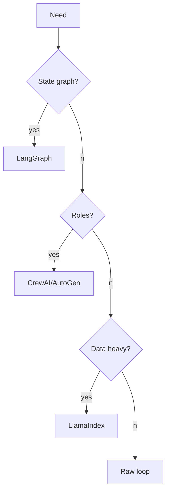

# Agent Framework Literacy

> Topic package — Domain 5 · Roadmap Week 16.
> Depth goal: compare LangGraph, CrewAI, AutoGen, OpenAI Agents SDK, Google ADK, and LlamaIndex agents; choose raw loops vs frameworks.

## Source
- Track: LLM Engineering (self-directed, FDE roadmap)
- Slide deck: `07 Resources Library/LLM Engineering/Slides/Lesson_29_Agent_Framework_Literacy.pptx`
- Hands-on notebook: `07 Resources Library/LLM Engineering/Notebooks/29_Agent_Framework_Literacy.ipynb` (runs offline)
- Reference reading: LangGraph docs; CrewAI docs; AutoGen docs; OpenAI Agents SDK docs; Google ADK docs; LlamaIndex docs
- Builds on: [[02 Literature Notes/LLM Engineering/Structured Generation]] · [[02 Literature Notes/LLM Engineering/Prompt Contracts]] · [[02 Literature Notes/LLM Engineering/Reasoning Prompt Patterns]]
- Date: 2026-07-18

---

## 1. Mental Model

**Framework literacy means matching the framework control model to your workflow before adopting abstractions.** Graph, role, conversation, SDK, and data-agent paradigms shape reliability and lock-in.



---

## 2. How It Actually Works

### 5.1 Graph paradigm
LangGraph makes nodes, edges, state, and checkpoints explicit.

### 5.2 Role/conversation
CrewAI and AutoGen emphasize collaborative agent interaction.

### 5.3 SDKs
OpenAI Agents SDK and Google ADK package tools, handoffs, and app integration.

### 5.4 Data agents
LlamaIndex is strongest when retrieval/data workflows dominate.

### 5.5 Raw loops
Best baseline for small auditable workflows.

---

## 3. Implementation

Assumed stack: stdlib + numpy where useful. Snippets:
- [[04 Code Snippets/LLM/Agent Framework Decision Matrix]]
- [[04 Code Snippets/LLM/Portable Agent State Shape]]

### Agent Framework Decision Matrix
Choose by workflow need
```python
def recommend(needs):
    if needs.get("stateful"): return "LangGraph"
    if needs.get("roles"): return "CrewAI or AutoGen"
    if needs.get("data"): return "LlamaIndex"
    return "raw loop"
print(recommend({"stateful":True}))
```

### Portable Agent State Shape
Keep core state framework-neutral
```python
state={"goal":"answer","messages":[],"tool_trace":[],"budget":{"steps":5},"status":"running"}
print(state.keys())
```

---

## 4. Design Decisions & Tradeoffs

| Decision | Guidance |
|---|---|
| **Raw** | Use for small clear loops. |
| **LangGraph** | Use for state and branching. |
| **CrewAI** | Use for role crews. |
| **AutoGen** | Use for conversational multi-agent. |
| **LlamaIndex** | Use for RAG/data agents. |

---

## 5. Failure Modes & Gotchas

- Picking framework before state machine.
- Framework magic hides failures.
- Multi-agent for simple loop.
- No portability plan.
- Demo mistaken for production.
- No observability.

---

## 6. FDE Angle

- FDEs make the runtime policy explicit rather than relying on model vibes.
- The deliverable includes contracts, traces, tests, and operational limits.
- Stakeholders need to understand both capability and blast radius.
- A small reliable system beats an impressive uncontrolled demo.

---

## 7. Self-Check

1. What is the core abstraction?
2. Where does validation happen?
3. What should be traced?
4. What are the main failure modes?
5. When would you choose the simpler design?

## 8. Links
- Domain MOC: [[06 Maps of Content/LLM Engineering Concepts]]
- Code: [[04 Code Snippets/LLM/Agent Framework Decision Matrix]], [[04 Code Snippets/LLM/Portable Agent State Shape]]
- Distilled: [[03 Permanent Notes/Choose Frameworks by Control Model]], [[03 Permanent Notes/Raw Agent Loops Are a Baseline]]
- Upstream: [[02 Literature Notes/LLM Engineering/Structured Generation]] · [[02 Literature Notes/LLM Engineering/Prompt Contracts]] · [[02 Literature Notes/LLM Engineering/Reasoning Prompt Patterns]] · Downstream: [[02 Literature Notes/LLM Engineering/Agent Reliability and Cost]]
