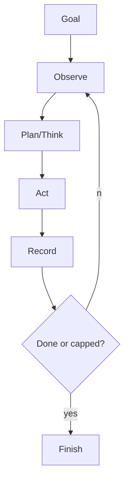

# Agent Loops & Planning

> Topic package — Domain 5 · Roadmap Week 16.
> Depth goal: implement observe-think-act, ReAct, plan-then-execute, task decomposition, and termination with step limits.

## Source
- Track: LLM Engineering (self-directed, FDE roadmap)
- Slide deck: `07 Resources Library/LLM Engineering/Slides/Lesson_25_Agent_Loops_and_Planning.pptx`
- Hands-on notebook: `07 Resources Library/LLM Engineering/Notebooks/25_Agent_Loops_and_Planning.ipynb` (runs offline)
- Reference reading: ReAct (Yao 2210.03629); Plan-and-Solve; BabyAGI patterns
- Builds on: [[02 Literature Notes/LLM Engineering/Structured Generation]] · [[02 Literature Notes/LLM Engineering/Prompt Contracts]] · [[02 Literature Notes/LLM Engineering/Reasoning Prompt Patterns]]
- Date: 2026-07-18

---

## 1. Mental Model

**An agent is a bounded observe-think-act loop with a model policy inside a software runtime.** Planning helps decompose work, but termination conditions make autonomy safe.



---

## 2. How It Actually Works

### 5.1 Observe-think-act
State contains goal, observations, scratchpad, budget, and done status.

### 5.2 ReAct
Interleave reasoning/action/observation when evidence changes the next step.

### 5.3 Plan-then-execute
Create a small checkable plan, execute steps, and re-plan when evidence invalidates it.

### 5.4 Task queues
Useful for independent tasks but risky when ownership is vague.

### 5.5 Termination
Use max steps, timeout, cost budget, no-progress detection, and success predicates.

---

## 3. Implementation

Assumed stack: stdlib + numpy where useful. Snippets:
- [[04 Code Snippets/LLM/Bounded ReAct Loop]]
- [[04 Code Snippets/LLM/Plan Then Execute Agent Skeleton]]

### Bounded ReAct Loop
A capped observe-act loop
```python
def policy(state): return "finish" if state.get("answer") else "lookup"
def run(max_steps=3):
    state={"trace":[]}
    for _ in range(max_steps):
        a=policy(state)
        if a=="finish": break
        state["answer"]="42"; state["trace"].append(a)
    return state
print(run())
```

### Plan Then Execute Agent Skeleton
Plan steps then execute with checks
```python
plan=["search","compute","verify"]
state={"done":[]}
for step in plan:
    state["done"].append(step)
    if step=="verify": state["status"]="done"
print(state)
```

---

## 4. Design Decisions & Tradeoffs

| Decision | Guidance |
|---|---|
| **Pattern** | ReAct for evidence-dependent tasks. |
| **Plans** | Keep steps measurable. |
| **Caps** | Always cap steps/time/cost. |
| **Replanning** | Re-plan when observations conflict. |
| **Trace** | Log actions and observations. |

---

## 5. Failure Modes & Gotchas

- No step cap.
- Vague plans.
- Never re-planning.
- Loop done because model says so only.
- Task queue overkill.
- No trace.

---

## 6. FDE Angle

- FDEs make the runtime policy explicit rather than relying on model vibes.
- The deliverable includes contracts, traces, tests, and operational limits.
- Stakeholders need to understand both capability and blast radius.
- A small reliable system beats an impressive uncontrolled demo.

---

## 7. Self-Check

1. What is the core abstraction?
2. Where does validation happen?
3. What should be traced?
4. What are the main failure modes?
5. When would you choose the simpler design?

## 8. Links
- Domain MOC: [[06 Maps of Content/LLM Engineering Concepts]]
- Code: [[04 Code Snippets/LLM/Bounded ReAct Loop]], [[04 Code Snippets/LLM/Plan Then Execute Agent Skeleton]]
- Distilled: [[03 Permanent Notes/An Agent Is a While Loop With Brakes]], [[03 Permanent Notes/Plans Are Hypotheses Not Commitments]]
- Upstream: [[02 Literature Notes/LLM Engineering/Structured Generation]] · [[02 Literature Notes/LLM Engineering/Prompt Contracts]] · [[02 Literature Notes/LLM Engineering/Reasoning Prompt Patterns]] · Downstream: [[02 Literature Notes/LLM Engineering/Agent Reliability and Cost]]
