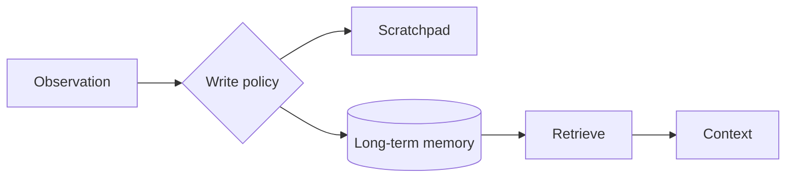

# Agent Memory

> Topic package — Domain 5 · Roadmap Week 16.
> Depth goal: distinguish scratchpad vs durable memory, episodic vs semantic memory, retrieval, summarization, and safe write policies.

## Source
- Track: LLM Engineering (self-directed, FDE roadmap)
- Slide deck: `07 Resources Library/LLM Engineering/Slides/Lesson_26_Agent_Memory.pptx`
- Hands-on notebook: `07 Resources Library/LLM Engineering/Notebooks/26_Agent_Memory.ipynb` (runs offline)
- Reference reading: MemGPT (Packer 2310.08560); Generative Agents (Park 2304.03442); vector retrieval patterns
- Builds on: [[02 Literature Notes/LLM Engineering/Structured Generation]] · [[02 Literature Notes/LLM Engineering/Prompt Contracts]] · [[02 Literature Notes/LLM Engineering/Reasoning Prompt Patterns]]
- Date: 2026-07-18

---

## 1. Mental Model

**Agent memory is a write policy plus a retrieval policy, not merely a vector database.** Short-term scratchpad supports the current run; long-term memory persists facts, preferences, and episodes.



---

## 2. How It Actually Works

### 5.1 Short vs long term
Scratchpad is per-run; durable memory is persisted and retrieved later.

### 5.2 Episodic vs semantic
Episodes record events; semantic facts record stable knowledge or preferences.

### 5.3 Retrieval
Combine similarity, recency, provenance, and filters.

### 5.4 Consolidation
Summarize raw histories into durable facts and mark stale memories.

### 5.5 Write policy
Store useful, safe, consented facts; block secrets and transient chatter.

---

## 3. Implementation

Assumed stack: stdlib + numpy where useful. Snippets:
- [[04 Code Snippets/LLM/Tiny Vector Memory Store]]
- [[04 Code Snippets/LLM/Safe Memory Write Gate]]

### Tiny Vector Memory Store
Deterministic numpy retrieval
```python
import numpy as np
def emb(t):
    v=np.zeros(8)
    for c in t.lower(): v[ord(c)%8]+=1
    return v/(np.linalg.norm(v) or 1)
mem=[("user prefers concise answers",emb("user prefers concise answers"))]
q=emb("preferred style")
print(max((float(q@v),t) for t,v in mem))
```

### Safe Memory Write Gate
Block secrets and low-value memories
```python
def should_write(text):
    low=text.lower()
    if any(s in low for s in ["password","token","ssn"]): return False
    return any(w in low for w in ["prefers","remember","project"])
print([should_write(x) for x in ["prefers tables","password abc","joke"]])
```

---

## 4. Design Decisions & Tradeoffs

| Decision | Guidance |
|---|---|
| **Write** | Only durable safe facts. |
| **Retrieve** | Use similarity plus metadata. |
| **Summarize** | Consolidate old episodes. |
| **Delete** | Support retention and deletion. |
| **Precedence** | Current user instruction beats memory. |

---

## 5. Failure Modes & Gotchas

- Writing every turn.
- Storing secrets.
- Stale memories.
- Similarity-only retrieval.
- No provenance.
- Memory overrides current instruction.

---

## 6. FDE Angle

- FDEs make the runtime policy explicit rather than relying on model vibes.
- The deliverable includes contracts, traces, tests, and operational limits.
- Stakeholders need to understand both capability and blast radius.
- A small reliable system beats an impressive uncontrolled demo.

---

## 7. Self-Check

1. What is the core abstraction?
2. Where does validation happen?
3. What should be traced?
4. What are the main failure modes?
5. When would you choose the simpler design?

## 8. Links
- Domain MOC: [[06 Maps of Content/LLM Engineering Concepts]]
- Code: [[04 Code Snippets/LLM/Tiny Vector Memory Store]], [[04 Code Snippets/LLM/Safe Memory Write Gate]]
- Distilled: [[03 Permanent Notes/Memory Is Policy Not Storage]], [[03 Permanent Notes/Scratchpad State Is Not Durable Memory]]
- Upstream: [[02 Literature Notes/LLM Engineering/Structured Generation]] · [[02 Literature Notes/LLM Engineering/Prompt Contracts]] · [[02 Literature Notes/LLM Engineering/Reasoning Prompt Patterns]] · Downstream: [[02 Literature Notes/LLM Engineering/Agent Reliability and Cost]]
