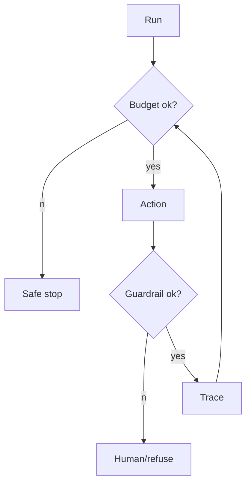

# Agent Reliability & Cost Control

> Topic package — Domain 5 · Roadmap Weeks 16/22.
> Depth goal: implement step caps, timeouts, retries, guardrails, cost budgets, token accounting, caching, human checkpoints, recovery, and observability.

## Source
- Track: LLM Engineering (self-directed, FDE roadmap)
- Slide deck: `07 Resources Library/LLM Engineering/Slides/Lesson_30_Agent_Reliability_and_Cost.pptx`
- Hands-on notebook: `07 Resources Library/LLM Engineering/Notebooks/30_Agent_Reliability_and_Cost.ipynb` (runs offline)
- Reference reading: Production agent patterns; LangSmith tracing docs; Langfuse tracing docs; OpenTelemetry concepts
- Builds on: [[02 Literature Notes/LLM Engineering/Structured Generation]] · [[02 Literature Notes/LLM Engineering/Prompt Contracts]] · [[02 Literature Notes/LLM Engineering/Reasoning Prompt Patterns]]
- Date: 2026-07-18

---

## 1. Mental Model

**Agent reliability is runtime control around a stochastic planner: caps, budgets, retries, guardrails, checkpoints, caching, recovery, and traces.** Prompts help; systems keep users safe.



---

## 2. How It Actually Works

### 5.1 Caps
Max steps, tool calls, wall-clock time, and no-progress stops.

### 5.2 Budgets
Token and dollar budgets per run, user, and tenant.

### 5.3 Retries
Retry transient errors only; bound attempts and use idempotency for writes.

### 5.4 Checkpoints
Humans approve irreversible, costly, or reputation-impacting actions.

### 5.5 Observability
Trace model calls, tool calls, memory retrieval, guardrails, latency, tokens, and cost.

---

## 3. Implementation

Assumed stack: stdlib + numpy where useful. Snippets:
- [[04 Code Snippets/LLM/Budgeted Agent Run Guard]]
- [[04 Code Snippets/LLM/Agent Trace Span Logger]]

### Budgeted Agent Run Guard
Enforce step and token caps
```python
class Budget:
    def __init__(self,steps=3,tokens=100): self.steps=steps; self.tokens=tokens; self.s=0; self.t=0
    def charge(self,n):
        self.s+=1; self.t+=n
        if self.s>self.steps or self.t>self.tokens: raise RuntimeError("budget exceeded")
b=Budget(); b.charge(20); print(b.s,b.t)
```

### Agent Trace Span Logger
Record model and tool spans
```python
trace=[]
def span(kind, **kw): trace.append({"kind":kind, **kw})
span("model", tokens=42, cost=0.001)
span("tool", name="search", ok=True)
print(trace)
```

---

## 4. Design Decisions & Tradeoffs

| Decision | Guidance |
|---|---|
| **Steps** | Set hard caps. |
| **Cost** | Track before calls. |
| **Retries** | Only transient. |
| **Human** | Approve high impact. |
| **Trace** | Span every boundary. |

---

## 5. Failure Modes & Gotchas

- No step cap.
- Retrying permanent failures.
- No idempotency.
- Budget after billing.
- No human checkpoint.
- Traces omit cost.

---

## 6. FDE Angle

- FDEs make the runtime policy explicit rather than relying on model vibes.
- The deliverable includes contracts, traces, tests, and operational limits.
- Stakeholders need to understand both capability and blast radius.
- A small reliable system beats an impressive uncontrolled demo.

---

## 7. Self-Check

1. What is the core abstraction?
2. Where does validation happen?
3. What should be traced?
4. What are the main failure modes?
5. When would you choose the simpler design?

## 8. Links
- Domain MOC: [[06 Maps of Content/LLM Engineering Concepts]]
- Code: [[04 Code Snippets/LLM/Budgeted Agent Run Guard]], [[04 Code Snippets/LLM/Agent Trace Span Logger]]
- Distilled: [[03 Permanent Notes/Agent Reliability Lives in the Runtime]], [[03 Permanent Notes/Every Agent Run Needs a Cost Budget]]
- Upstream: [[02 Literature Notes/LLM Engineering/Structured Generation]] · [[02 Literature Notes/LLM Engineering/Prompt Contracts]] · [[02 Literature Notes/LLM Engineering/Reasoning Prompt Patterns]] · Downstream: [[02 Literature Notes/LLM Engineering/Agent Reliability and Cost]]
