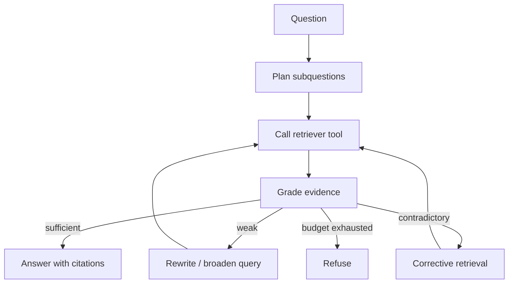

# Agentic RAG

> Topic package — Domain 4 · Roadmap Week 21.
> Depth goal: design an agentic RAG loop where retrieval is an adaptive tool call, not a one-shot preprocessing step, including query planning, evidence grading, corrective retrieval, and stopping conditions.

## Source
- Track: LLM Engineering (self-directed, FDE roadmap)
- Slide deck: `07 Resources Library/LLM Engineering/Slides/Lesson_21_Agentic_RAG.pptx`
- Hands-on notebook: `07 Resources Library/LLM Engineering/Notebooks/21_Agentic_RAG.ipynb` (runs offline)
- Reference reading: Asai et al. Self-RAG (arXiv:2310.11511); Yan et al. Corrective RAG / CRAG (arXiv:2401.15884); LangChain agentic RAG patterns; LlamaIndex agents and query planning docs
- Builds on: [[02 Literature Notes/LLM Engineering/RAG Pipeline Fundamentals]] · [[02 Literature Notes/LLM Engineering/Query Transformation]] · [[02 Literature Notes/LLM Engineering/Prompt Contracts]]
- Date: 2026-07-18

---

## 1. Mental Model

**Agentic RAG moves retrieval from a fixed pre-step into the model's control loop.** Instead of retrieve-once-then-answer, the agent plans what it needs, calls retrieval tools, grades evidence, refines queries, and stops only when the evidence is sufficient or a refusal is warranted.

The benefit is adaptivity: multi-hop questions, ambiguous asks, and weak first-pass retrieval can be repaired. The risk is runaway loops, tool overuse, and self-confirming reasoning. Agentic RAG therefore needs explicit state, budgets, evidence grading, and a final grounding contract.

> Key intuition: **make retrieval a tool the reasoner can call, but make evidence sufficiency a gate the reasoner cannot skip.**



---

## 2. How It Actually Works

### 4.1 Retrieval as a tool
In vanilla RAG, the application retrieves before the LLM sees the prompt. In agentic RAG, the LLM (or controller) can call a retriever tool during reasoning. This supports follow-up searches, source switching, and decomposition, but requires a strict tool API and logs for each call.

### 4.2 Iterative retrieve-reason-retrieve
The loop is: plan what is missing, retrieve, inspect evidence, update the plan, and retrieve again if needed. This is useful for multi-hop questions where the first evidence reveals the next entity or constraint. The loop must track used queries and avoid repeating them.

### 4.3 Self-RAG and evidence critique
Self-RAG-style systems ask the model to critique whether retrieved passages are relevant and whether generation is supported. In production, treat this as a noisy classifier: combine model critique with retrieval scores, citation checks, and deterministic thresholds.

### 4.4 CRAG / corrective retrieval
Corrective RAG adds a retrieval evaluator. If evidence is weak, the system rewrites the query, broadens sources, or falls back to web/alternate indexes. The corrective step is valuable because it prevents low-quality retrieved context from being blindly passed to the generator.

### 4.5 Budgets and stopping
Agentic RAG can explode latency and cost. Define max tool calls, max candidate chunks, max rewrites, and stop conditions: sufficient evidence, contradiction requiring clarification/refusal, or budget exhausted. The final answer still follows the RAG citation/refusal contract.

---

## 3. Implementation

Assumed stack: stdlib + numpy. Snippets implement a deterministic agent loop and a corrective evidence gate. Snippets:
- [[04 Code Snippets/LLM/Iterative Retrieval Agent Loop]]
- [[04 Code Snippets/LLM/Corrective RAG Retrieval Gate]]

### Iterative Retrieval Agent Loop
A small retrieve-grade-rewrite loop with max tool-call budget and cited final answer.
```python
DOCS = {"rag":"RAG retrieves evidence before answering.",
        "hyde":"HyDE rewrites a query into a hypothetical document for retrieval.",
        "crag":"CRAG evaluates retrieval quality and corrects weak searches."}

def retrieve(q):
    q = q.lower()
    return [(k, v) for k, v in DOCS.items() if any(w in v.lower() for w in q.split())]

def agent(question, max_calls=3):
    query = question
    for step in range(max_calls):
        hits = retrieve(query)
        if len(hits) >= 2:
            cites = " ".join(f"[{k}]" for k, _ in hits)
            return f"Answer using evidence {cites}"
        query = query + " RAG retrieval correction"
    return "insufficient_context"

print(agent("How does CRAG improve RAG?"))
```

### Corrective RAG Retrieval Gate
Grade retrieved evidence and choose accept, rewrite, broaden, or refuse.
```python
def retrieval_gate(scores, min_top=0.55, min_hits=2):
    strong = [s for s in scores if s >= min_top]
    if len(strong) >= min_hits: return "accept"
    if scores and max(scores) >= min_top: return "rewrite_query"
    if scores: return "broaden_sources"
    return "refuse"

for scores in [[0.8,0.7,0.2], [0.7,0.3], [0.4,0.3], []]:
    print(scores, "->", retrieval_gate(scores))
```

---

## 4. Design Decisions & Tradeoffs

| Decision | Guidance |
|---|---|
| **Agent vs pipeline** | Use agentic RAG for ambiguous/multi-hop tasks; keep simple QA as fixed RAG for latency and reliability. |
| **Tool API** | Expose narrow retrieval tools with source names, filters, and logged inputs/outputs. |
| **Evidence grading** | Use model critique plus deterministic checks; never rely on self-assessment alone. |
| **Correction action** | Rewrite query for near misses; broaden sources when all scores are weak; refuse when budgets exhaust. |
| **Budgets** | Hard limits on tool calls, rewrites, and chunks are mandatory. |
| **Final answer** | Same citation/refusal contract as RAG; agent reasoning is not evidence. |

---

## 5. Failure Modes & Gotchas

- Letting the agent search indefinitely with no tool-call budget.
- Answering from the agent's chain-of-thought rather than retrieved evidence.
- Repeating the same failed query with minor wording changes.
- Trusting model self-grades without retrieval/citation validation.
- Using agentic RAG for simple FAQ where one-shot retrieval is cheaper and safer.
- Not logging tool calls, making failures impossible to debug.

---

## 6. FDE Angle

- Agentic RAG is useful when a human analyst would naturally search, read, refine, and search again.
- The FDE deliverable is the loop trace: plan, queries, hits, grades, corrections, answer/refusal.
- Budgets turn an impressive demo into a predictable product surface.
- Self-RAG/CRAG concepts are best implemented as gates and controllers, not magic prompts.

---

## 7. Self-Check

1. How is agentic RAG different from one-shot RAG?
2. What should the evidence grader decide?
3. When should corrective retrieval rewrite vs broaden sources?
4. Why are budgets essential?
5. What can the final answer cite?

## 8. Links
- Domain MOC: [[06 Maps of Content/LLM Engineering Concepts]]
- Code: [[04 Code Snippets/LLM/Iterative Retrieval Agent Loop]], [[04 Code Snippets/LLM/Corrective RAG Retrieval Gate]]
- Distilled: [[03 Permanent Notes/Agentic RAG Makes Retrieval an Adaptive Tool Call]], [[03 Permanent Notes/Corrective RAG Is an Evidence Quality Gate]]
- Upstream: [[02 Literature Notes/LLM Engineering/GraphRAG]] · Downstream: [[02 Literature Notes/LLM Engineering/Retrieval Evaluation]]
