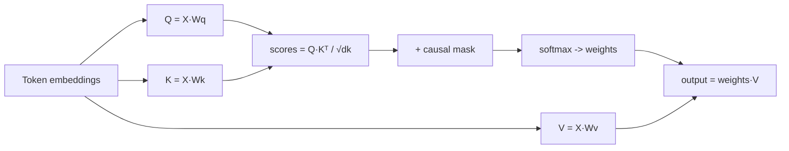

# Attention Deep-Dive

> Topic package — Domain 2 · Roadmap Weeks 08/10.
> Depth goal: derive scaled dot-product attention, understand Q/K/V, multi-head, causal masking, and the KV-cache implication — well enough to implement it in numpy.

## Source
- Track: LLM Engineering (self-directed, FDE roadmap)
- Slide deck: `07 Resources Library/LLM Engineering/Slides/Lesson_07_Attention_Deep-Dive.pptx`
- Hands-on notebook: `07 Resources Library/LLM Engineering/Notebooks/07_Attention_Deep-Dive.ipynb` (runs offline)
- Reference reading: Vaswani et al. 'Attention Is All You Need' (arXiv:1706.03762); Jay Alammar 'The Illustrated Transformer'; Karpathy 'Let's build GPT'; Lilian Weng 'Attention? Attention!'
- Builds on: [[03 Permanent Notes/Transformers Use Attention for Sequence Modeling]]
- Date: 2026-07-18

---

## 1. Mental Model

**Attention lets every token look at every other token and pull in the information it needs.** Instead of processing a sequence strictly left-to-right (RNNs) or through a fixed window (CNNs), attention computes, for each position, a *weighted average of all positions* — where the weights say "how relevant is token j to token i?".

Each token emits three learned projections: a **Query** ("what am I looking for?"), a **Key** ("what do I offer?"), and a **Value** ("what I'll pass on if attended to"). Relevance = query·key; the softmax of those scores becomes the mixing weights over values.

> Key intuition: **attention is content-based soft lookup.** Q·K measures match, softmax turns matches into a probability distribution, and the output is a weighted sum of values. Everything else in a transformer (multi-head, masks, positions) is refinement on this one operation.



---

## 2. How It Actually Works

### 2.1 Scaled dot-product attention
The whole operation is one formula:

$$\text{Attention}(Q,K,V) = \text{softmax}\!\left(\frac{QK^\top}{\sqrt{d_k}}\right)V$$

- `Q,K,V` are matrices of shape `[seq, d_k]` (values `[seq, d_v]`).
- `QKᵀ` is a `[seq, seq]` matrix of pairwise scores.
- Dividing by `√d_k` keeps the dot products from growing with dimension, which would push softmax into saturated (near-one-hot) regions with vanishing gradients.
- softmax normalizes each row to a distribution; multiplying by `V` mixes the values.

### 2.2 Why Q, K, V are separate
If a token used the same vector for matching and for content, it couldn't ask for something different from what it advertises. Separate learned projections let a token *query* for "the subject of this sentence" while *offering* "I am a past-tense verb." The three weight matrices `Wq, Wk, Wv` are what training actually learns.

### 2.3 Multi-head attention
One attention doesn't capture everything: syntax, coreference, and topic all matter. Multi-head attention runs `h` attention operations in parallel on lower-dimensional slices (`d_k = d_model/h`), then concatenates and projects:

$$\text{MHA}(X) = \text{Concat}(\text{head}_1,\dots,\text{head}_h)\,W_O$$

Each head can specialize (one tracks the previous token, another the verb, etc.). Cost is the same as single-head at full width because the dimensions are split.

### 2.4 Causal masking (decoder attention)
In a decoder-only LLM, position `i` must not see future positions `> i` (that would be cheating at next-token prediction). Before softmax, set the upper-triangular scores to `-inf` so their weights become zero. This is the single line that makes a transformer autoregressive.

### 2.5 The KV-cache implication
At generation time, tokens 0..t-1 don't change, so their K and V don't change. Caching them means each new token only computes one new Q against the cached K/V — turning per-step cost from O(t²) to O(t). This is why KV cache dominates inference memory (covered in LLM Efficiency).

---

## 3. Implementation

Assumed stack: `numpy` only — attention is small enough to implement from scratch, which is the best way to understand it. Snippets:
- [[04 Code Snippets/LLM/Scaled Dot-Product Attention in NumPy]]
- [[04 Code Snippets/LLM/Multi-Head Attention in NumPy]]

### Scaled Dot-Product Attention in NumPy
Self-contained scaled dot-product attention with optional causal mask.
```python
import numpy as np

def softmax(x, axis=-1):
    x = x - x.max(axis=axis, keepdims=True)
    e = np.exp(x)
    return e / e.sum(axis=axis, keepdims=True)

def attention(Q, K, V, causal=False):
    dk = Q.shape[-1]
    scores = Q @ K.swapaxes(-1, -2) / np.sqrt(dk)   # [seq, seq]
    if causal:
        seq = scores.shape[-1]
        mask = np.triu(np.ones((seq, seq)), k=1).astype(bool)
        scores = np.where(mask, -1e9, scores)
    weights = softmax(scores, axis=-1)
    return weights @ V, weights

seq, d = 4, 8
rng = np.random.RandomState(0)
Q = K = V = rng.randn(seq, d)
out, w = attention(Q, K, V, causal=True)
print("output:", out.shape, "  row sums (=1):", w.sum(1).round(3))
```

### Multi-Head Attention in NumPy
Splits d_model into h heads, attends per head, concatenates and projects.
```python
import numpy as np
from numpy import ndarray

def softmax(x, axis=-1):
    x = x - x.max(axis=axis, keepdims=True); e = np.exp(x)
    return e / e.sum(axis=axis, keepdims=True)

def mha(X, Wq, Wk, Wv, Wo, h, causal=True):
    seq, d = X.shape; dk = d // h
    Q, K, V = X @ Wq, X @ Wk, X @ Wv
    def split(t): return t.reshape(seq, h, dk).transpose(1, 0, 2)  # [h, seq, dk]
    Q, K, V = split(Q), split(K), split(V)
    scores = Q @ K.transpose(0, 2, 1) / np.sqrt(dk)               # [h, seq, seq]
    if causal:
        m = np.triu(np.ones((seq, seq)), 1).astype(bool)
        scores = np.where(m, -1e9, scores)
    ctx = softmax(scores, -1) @ V                                  # [h, seq, dk]
    ctx = ctx.transpose(1, 0, 2).reshape(seq, d)                  # concat heads
    return ctx @ Wo

rng = np.random.RandomState(0); seq, d, h = 5, 16, 4
X = rng.randn(seq, d)
Wq, Wk, Wv, Wo = (rng.randn(d, d) * 0.1 for _ in range(4))
print("MHA output:", mha(X, Wq, Wk, Wv, Wo, h).shape)
```

---

## 4. Design Decisions & Tradeoffs

| Decision | Guidance |
|---|---|
| **Number of heads** | More heads = more specialized subspaces but smaller d_k each; 8-32 typical. d_model must divide by h. |
| **Scaling by √d_k** | Always — without it, large-dim dot products saturate softmax and kill gradients. |
| **Causal vs bidirectional** | Decoder-only LLMs use causal masks; encoders (BERT-style) attend both directions. |
| **Attention variant** | Vanilla MHA for learning; production uses GQA/MQA + FlashAttention for memory/speed (see LLM Efficiency). |

---

## 5. Failure Modes & Gotchas

- Forgetting the `1/√d_k` scale → saturated softmax, unstable training.
- Wrong mask (off-by-one on the diagonal) → token sees itself-plus-one or leaks the future.
- Softmax over the wrong axis → mixing across the batch instead of the sequence.
- Assuming attention is O(seq) — it's **O(seq²)** in time and memory; long context is expensive.
- Confusing d_model with d_k: per-head dim is d_model/h, not d_model.

---

## 6. FDE Angle

- Attention's O(seq²) cost is *the* reason long-context and RAG chunking economics matter — you can explain the bill.
- KV cache (a direct consequence of attention) is the dominant inference-memory cost; ties to model-serving decisions.
- Being able to whiteboard Q/K/V and the softmax makes you credible when a client asks 'how does the model actually read our documents?'
- Deliverable: explain, from the formula, why context windows have hard limits and what that costs.

---

## 7. Self-Check

1. Write scaled dot-product attention from memory, including shapes.
2. Why divide by √d_k? What breaks without it?
3. Why are Q, K, V separate projections instead of one?
4. What exactly does the causal mask do, and where is it applied?
5. Why is attention O(seq²), and what does the KV cache save at inference?
6. How does multi-head attention keep the same cost as single-head at full width?

## 8. Links
- Domain MOC: [[06 Maps of Content/LLM Engineering Concepts]]
- Code: [[04 Code Snippets/LLM/Scaled Dot-Product Attention in NumPy]], [[04 Code Snippets/LLM/Multi-Head Attention in NumPy]]
- Distilled: [[03 Permanent Notes/Attention Is Content-Based Soft Lookup]], [[03 Permanent Notes/Attention Is Quadratic in Sequence Length]]
- Upstream: foundation notes · Downstream: [[02 Literature Notes/LLM Engineering/Transformer Architecture]]
