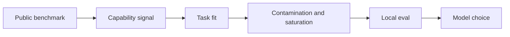

# Benchmark Literacy

> Topic package — Domain 6 · Roadmap Week 17.
> Depth goal: build production-grade LLM evaluation habits: clear datasets, trustworthy metrics, statistical guardrails, and shipping decisions that survive contact with real users.

## Source
- Track: LLM Engineering (self-directed, FDE roadmap)
- Slide deck: `07 Resources Library/LLM Engineering/Slides/Lesson_38_Benchmark_Literacy.pptx`
- Hands-on notebook: `07 Resources Library/LLM Engineering/Notebooks/38_Benchmark_Literacy.ipynb` (runs offline)
- Reference reading: MMLU; GSM8K; HumanEval; MT-Bench; BEIR; MTEB; GPQA; SWE-bench; contamination studies
- Builds on: [[02 Literature Notes/LLM Engineering/Eval Fundamentals]] · [[02 Literature Notes/LLM Engineering/Retrieval Evaluation]]
- Date: 2026-07-18

---

## 1. Mental Model

**Benchmarks are maps, not the territory.** They reveal model capabilities under standardized conditions, but they can be saturated, contaminated, gamed, or irrelevant to your product.

Use public benchmarks to shortlist models, then build task-relevant evals for your own users.

> Key intuition: **leaderboards are scouting reports, not shipping gates.**



---

## 2. How It Actually Works

### 6.1 What benchmarks measure
MMLU covers broad academic knowledge; GSM8K math; HumanEval code; MT-Bench chat; BEIR retrieval; MTEB embeddings; GPQA hard science; SWE-bench software issues.

### 6.2 Contamination
If items or close variants appear in training data, scores overstate generalization. Treat surprising jumps cautiously and prefer private holdouts.

### 6.3 Saturation
Near-ceiling benchmarks stop separating useful differences. Leaderboard optimization can improve public scores without improving your workload.

### 6.4 Task relevance
Match input type, output type, tool use, retrieval, latency, cost, and failure severity. A math benchmark may not predict RAG support quality.

### 6.5 Proper use
Use benchmarks for priors and shortlists; final decisions need local golden evals, safety probes, cost/latency tests, and online confirmation.

---

## 3. Implementation

Assumed stack: stdlib + numpy. The snippets are offline and deterministic so they can run in CI before API-backed evaluation. Snippets:
- [[04 Code Snippets/LLM/Benchmark Contamination Probe]]
- [[04 Code Snippets/LLM/Leaderboard Normalization]]

### Benchmark Contamination Probe
N-gram overlap probe for suspected benchmark memorization in local corpora.
```python
def ngrams(text, n=5):
    w=text.lower().split()
    return {tuple(w[i:i+n]) for i in range(max(0, len(w)-n+1))}
def overlap_probe(item, corpus_docs, n=5):
    target=ngrams(item,n); hits=[]
    for name, doc in corpus_docs.items():
        ov=len(target & ngrams(doc,n))
        if ov: hits.append((name, ov))
    return sorted(hits, key=lambda x:x[1], reverse=True)
print(overlap_probe("solve the refund policy word problem carefully", {"doc":"refund policy word problem carefully appears here"}, n=3))
```

### Leaderboard Normalization
Combine benchmark, cost, and latency into task-fit instead of ranking by one public metric.
```python
def task_fit(row, weights):
    return sum(row[k]*w for k,w in weights.items()) / sum(weights.values())
models={"A":{"bench":0.92,"cost":0.40,"latency":0.50},"B":{"bench":0.86,"cost":0.90,"latency":0.85}}
weights={"bench":2,"cost":1,"latency":1}
print(sorted((task_fit(v, weights), k) for k,v in models.items()))
```

---

## 4. Design Decisions & Tradeoffs

| Decision | Guidance |
|---|---|
| **Dataset boundary** | Write down exactly which population the eval represents and which it excludes. |
| **Metric choice** | Prefer deterministic metrics for mechanical properties; use judges only for semantic qualities that require judgment. |
| **Slicing** | Always inspect business-critical, safety-critical, and historically weak slices. |
| **Calibration** | Compare automated scores against human labels before using them as gates. |
| **Thresholds** | Set pass/block/investigate thresholds before looking at the result. |
| **Artifacts** | Persist inputs, outputs, prompts, model versions, scores, and traces for reproducibility. |

---

## 5. Failure Modes & Gotchas

- Treating a polished demo as evidence of reliability.
- Optimizing a proxy metric after it stops matching user value.
- Reporting only an aggregate score while a critical slice fails.
- Changing prompt, model, data, and scorer at once, making regressions uninterpretable.
- Using a judge without bias audits or human calibration.
- Failing to save per-case artifacts, so failures cannot be debugged.

---

## 6. FDE Angle

- A production eval is a client-facing trust artifact, not internal trivia.
- A clear scorecard lets stakeholders decide whether to ship, hold, or rollback.
- Automated evals reduce manual QA and accelerate iteration.
- Deliverable: versioned dataset, runner, metrics, report, and CI gate.

---

## 7. Self-Check

1. Define the behavior being measured and the evidence required.
2. Explain how the dataset, scorer, baseline, and threshold interact.
3. Name slices that could hide severe regressions behind a good average.
4. Describe how you would calibrate the metric against human judgment.
5. State what artifacts are needed to reproduce a run.
6. Translate a score into a shipping decision.

## 8. Links
- Domain MOC: [[06 Maps of Content/LLM Engineering Concepts]]
- Code: [[04 Code Snippets/LLM/Benchmark Contamination Probe]], [[04 Code Snippets/LLM/Leaderboard Normalization]]
- Distilled: [[03 Permanent Notes/Benchmarks Are Capability Signals Not Shipping Gates]], [[03 Permanent Notes/Leaderboards Mislead When Fit Contamination and Cost Are Ignored]]
- Upstream: [[02 Literature Notes/LLM Engineering/Eval Fundamentals]] · Downstream: [[02 Literature Notes/LLM Engineering/Statistical Rigor in Eval]]
