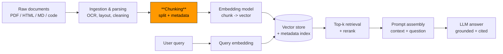
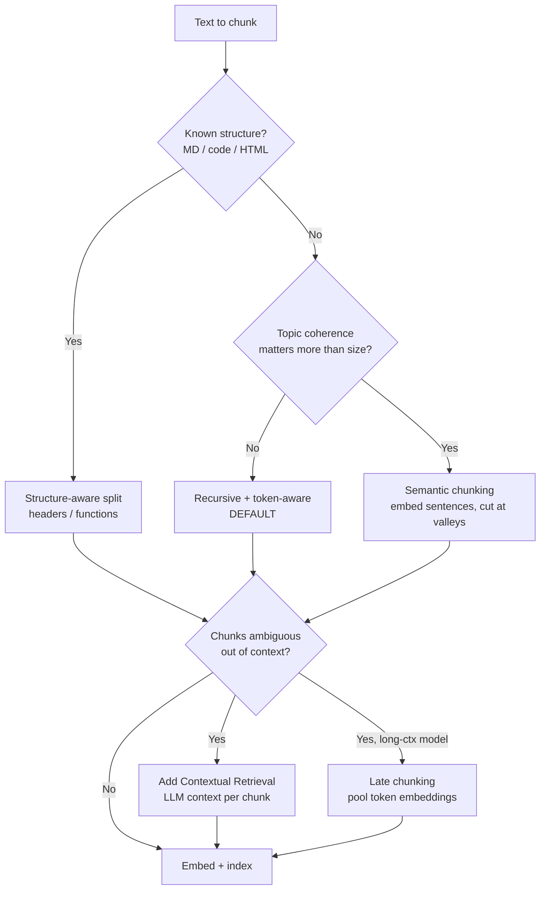

# Chunking Strategies

> Topic package — Domain 1 (Data Representation) · maps to Roadmap Week 13 (RAG System Design) & Week 14 (Retrieval Quality).
> Depth goal: understand *why* chunking decides RAG quality, and be able to implement production chunkers today.

## Source
- Track: LLM Engineering (self-directed, FDE roadmap)
- Slide deck: `07 Resources Library/LLM Engineering/Slides/Lesson_01_Chunking_Strategies.pptx`
- Hands-on notebook: `07 Resources Library/LLM Engineering/Notebooks/01_Chunking_Strategies.ipynb` (runs offline)
- Related lessons: builds on [[02 Literature Notes/Courses/Deep Learning - Lesson 12 Transformer Models for NLP]]
- Reference reading: Anthropic "Contextual Retrieval" (2024, −49%/−67% failed retrievals); Pinecone "Chunking Strategies for LLM Applications" (2025); Jina AI "Late Chunking" (2024); LangChain text-splitter docs; Liu et al. "Lost in the Middle" (arXiv:2307.03172)
- Date: 2026-07-18

---

## 1. Mental Model

**The problem chunking solves:** Retrieval systems search over *pieces* of documents, not whole documents. You embed each piece into a vector, store it, and at query time retrieve the top-k most similar pieces to feed the LLM. **Chunking is the act of cutting source documents into those pieces.**

Why not embed whole documents?
- **Embedding dilution** — a single vector for a 30-page PDF averages away the specific passage that answers the question. One vector cannot represent many distinct ideas well.
- **Context budget** — you can only fit so many tokens into the LLM prompt. You want to inject the *relevant* 500 tokens, not the whole 30 pages.
- **Precision of retrieval** — smaller, topically-focused chunks match a specific query more sharply.

Why not chunk into tiny pieces (e.g., one sentence)?
- **Context loss** — a sentence like "This reduced latency by 40%." is useless without knowing what "this" refers to. The chunk must carry enough surrounding context to stand alone.

**So chunking is a tension:** small enough to be precise and embed cleanly, large enough to be self-contained and meaningful. Everything below is about resolving that tension for real documents.

> Key intuition: **the chunk is the unit of retrieval AND the unit of grounding.** If the answer isn't fully inside a retrieved chunk (plus its neighbors), the LLM cannot ground on it and will either omit it or hallucinate. Bad chunking caps the ceiling of the entire RAG system — no reranker or bigger model fixes it downstream.

### Where chunking sits in the pipeline



Chunking is upstream of everything and downstream of ingestion quality. Its output — the chunk text + metadata — is frozen into the vector store, so a mistake here propagates to every future query until you re-index.

---

## 2. How It Actually Works

### 2.1 The core parameters
- **Chunk size** — measured in **tokens** (not characters), because both the embedding model and the LLM think in tokens. A "500-token" chunk is the meaningful unit; "500 characters" varies wildly by language and content.
- **Chunk overlap** — how many tokens each chunk shares with its neighbor. Overlap prevents an idea that straddles a boundary from being split in half. Typical: 10–20% of chunk size.
- **Boundary respect** — where you are *allowed* to cut. Cutting mid-sentence or mid-code-block destroys meaning. Good splitters cut on natural boundaries (paragraph → sentence → word) in priority order.

### 2.2 The strategy ladder (from naive to advanced)

**(a) Fixed-size / character splitting** — cut every N characters. Simple, fast, and bad: it slices through sentences and words. Use only as a baseline.

**(b) Recursive character splitting** — the workhorse default. Try to split on the largest natural separator first (`\n\n` paragraphs), and only if a piece is still too big, recurse to smaller separators (`\n` lines → `. ` sentences → ` ` words). Respects structure while guaranteeing a max size. This is the sane default for most text.

**(c) Token-aware splitting** — same as recursive, but size is measured with the actual tokenizer (e.g., tiktoken for OpenAI, the model's tokenizer for others) so chunks never exceed the embedding model's input limit and cost is predictable.

**(d) Structure-aware / document-specific splitting** — respect the document's *format*: split Markdown by headers, code by functions/classes, HTML by tags, PDFs by layout blocks. Keeps semantically-coherent units intact and lets you attach structural metadata (which section a chunk came from).

**(e) Semantic chunking** — don't cut at fixed sizes at all. Embed each sentence, then start a new chunk wherever the *embedding similarity between consecutive sentences drops* below a threshold (a topic shift). Produces variable-size, topically-coherent chunks. More expensive (embeds every sentence) and only sometimes worth it.

**(f) Contextual retrieval (Anthropic pattern)** — the highest-ROI recent technique. For each chunk, use an LLM to prepend a short, document-aware context sentence ("This chunk is from the 2023 10-K, Risk Factors section, discussing supply-chain exposure...") *before embedding it*. This restores the context that chunking stripped away, dramatically improving retrieval on chunks that were otherwise ambiguous. Combine with BM25 for best recall.

**(g) Late chunking (Jina pattern)** — invert the order: embed the *whole document* with a long-context embedding model first (so every token's embedding already "sees" the full document), *then* pool token embeddings into per-chunk vectors. Each chunk vector carries global context without an extra LLM call. Requires a long-context embedding model that outputs token-level embeddings.

### 2.3 What "good" looks like
A well-chunked corpus has chunks that: (1) are self-contained enough to answer a question alone, (2) fit comfortably in the embedding model's context, (3) carry metadata (source, section, page) for filtering and citation, and (4) don't fragment atomic units (tables, code blocks, list items).

### 2.4 The math of chunking

**(a) Number of chunks from size + overlap.** For a document of `T` tokens, chunk size `c`, and overlap `o` (with stride `s = c − o`), the chunk count is:

$$N = \left\lceil \frac{T - o}{c - o} \right\rceil = \left\lceil \frac{T - o}{s} \right\rceil$$

This drives **storage and cost**: every chunk is one stored vector and one embedding call. Raising overlap from 0 → 20% of `c` shrinks the stride `s` and multiplies `N` (and cost) by roughly `c / (c − o)`. Example: `T=10000, c=500, o=75 → N = ⌈9925/425⌉ = 24` chunks; at `o=0` it's 20 chunks — a 20% storage increase to buy boundary safety.

**(b) Semantic breakpoint detection.** Embed each sentence `i` into vector $\mathbf{e}_i$. The *dissimilarity* between consecutive sentences uses cosine distance:

$$d_i = 1 - \cos(\mathbf{e}_i, \mathbf{e}_{i+1}) = 1 - \frac{\mathbf{e}_i \cdot \mathbf{e}_{i+1}}{\lVert \mathbf{e}_i \rVert \, \lVert \mathbf{e}_{i+1} \rVert}$$

A **breakpoint** (chunk boundary) is placed wherever `d_i` exceeds a threshold. The "percentile" method sets that threshold at, say, the 95th percentile of all `d_i`:

$$\text{break at } i \iff d_i > \operatorname{percentile}_{95}(\{d_1, \dots, d_{n-1}\})$$

Higher percentile → fewer, larger chunks (only the sharpest topic shifts cut). This is why `breakpoint_threshold_amount` behaves the way it does.

**(c) Late chunking pooling.** A long-context embedding model produces one token embedding $\mathbf{t}_j$ per token. A chunk spanning tokens `[a, b]` gets its vector by **mean-pooling** those token embeddings *after* the transformer has already contextualized them over the whole document:

$$\mathbf{c}_{[a,b]} = \frac{1}{b - a + 1} \sum_{j=a}^{b} \mathbf{t}_j$$

Because each $\mathbf{t}_j$ was computed with full-document attention, $\mathbf{c}_{[a,b]}$ carries global context **without** a per-chunk LLM call — the key efficiency win over contextual retrieval.

**(d) Why size affects retrieval recall.** Treat a chunk's embedding as (roughly) the mean of its sentence embeddings. A chunk covering `k` distinct topics has vector $\bar{\mathbf{e}} = \frac{1}{k}\sum \mathbf{e}_{t}$; its similarity to a query about topic 1 is diluted by a factor ~`1/k` relative to a pure single-topic chunk. **This is embedding dilution made precise:** the more topics you cram into a chunk, the weaker its match to any one of them — the mathematical reason over-large chunks retrieve poorly.

### 2.5 Strategy ladder at a glance



---

## 3. Implementation

Assumed stack (pin these; APIs move): `langchain-text-splitters>=0.3`, `langchain-experimental>=0.3`, `tiktoken>=0.7`, `langchain-openai>=0.2`. See the runnable snippets:
- [[04 Code Snippets/LLM/Recursive and Token-Aware Chunking]]
- [[04 Code Snippets/LLM/Semantic and Contextual Chunking]]
- [[04 Code Snippets/LLM/Semantic Chunking From Scratch]] — the mechanics of §2.4(b), no framework
- [[04 Code Snippets/LLM/Late Chunking with Token Embeddings]] — the pooling of §2.4(c)
- [[04 Code Snippets/LLM/Chunk Size Evaluation Harness]] — pick size/overlap by recall@k, not vibes

### 3.1 The default you should reach for first
Recursive, token-measured, with metadata:

```python
from langchain_text_splitters import RecursiveCharacterTextSplitter

# Measure size in OpenAI tokens so chunks never blow the embedding limit.
splitter = RecursiveCharacterTextSplitter.from_tiktoken_encoder(
    encoding_name="o200k_base",   # gpt-4o / text-embedding-3 family
    chunk_size=500,               # tokens
    chunk_overlap=75,             # ~15% overlap
    separators=["\n\n", "\n", ". ", " ", ""],  # largest -> smallest
)

docs = splitter.create_documents(
    texts=[raw_text],
    metadatas=[{"source": "2023-10k.pdf", "section": "Risk Factors"}],
)
# Each doc.page_content is a chunk; doc.metadata rides along for filtering + citation.
```

### 3.2 Structure-aware for Markdown/code
```python
from langchain_text_splitters import MarkdownHeaderTextSplitter, Language, RecursiveCharacterTextSplitter

# Markdown: split by headers first, keep header path as metadata.
md_splitter = MarkdownHeaderTextSplitter(
    headers_to_split_on=[("#", "h1"), ("##", "h2"), ("###", "h3")]
)
sections = md_splitter.split_text(markdown_text)  # metadata carries h1/h2/h3

# Code: split on language-aware boundaries (functions/classes) so logic stays intact.
code_splitter = RecursiveCharacterTextSplitter.from_language(
    language=Language.PYTHON, chunk_size=800, chunk_overlap=0
)
```

### 3.3 Semantic chunking (when topic boundaries matter more than size)
```python
from langchain_experimental.text_splitter import SemanticChunker
from langchain_openai import OpenAIEmbeddings

semantic = SemanticChunker(
    OpenAIEmbeddings(model="text-embedding-3-small"),
    breakpoint_threshold_type="percentile",  # split at similarity valleys
    breakpoint_threshold_amount=95,
)
chunks = semantic.create_documents([raw_text])
```

### 3.4 Contextual retrieval (the high-ROI upgrade)
```python
CONTEXT_PROMPT = """<document>{doc}</document>
Here is a chunk from the document:
<chunk>{chunk}</chunk>
Give a short (1-2 sentence) context situating this chunk within the overall
document, so it can be understood standalone. Answer only with the context."""

def contextualize(llm, full_doc, chunk):
    ctx = llm.invoke(CONTEXT_PROMPT.format(doc=full_doc, chunk=chunk)).content
    return f"{ctx}\n\n{chunk}"   # embed THIS, not the bare chunk

# Cost control: cache the document prefix (prompt caching) so re-sending the
# full doc per chunk is cheap. This is what makes the pattern affordable.
```

### 3.5 The mechanics from scratch (understand, don't just call)
Libraries hide the algorithm. To truly own it, implement the token-aware split and the semantic breakpoint detector yourself — see [[04 Code Snippets/LLM/Semantic Chunking From Scratch]]. The core loop is only a few lines:

```python
import numpy as np

def cosine_distance(a, b):
    return 1 - np.dot(a, b) / (np.linalg.norm(a) * np.linalg.norm(b))

def semantic_breakpoints(sentence_embeddings, percentile=95):
    # distances between consecutive sentences  (eq. 2.4b)
    d = [cosine_distance(sentence_embeddings[i], sentence_embeddings[i + 1])
         for i in range(len(sentence_embeddings) - 1)]
    threshold = np.percentile(d, percentile)
    # a boundary sits after sentence i whenever the topic "jumps"
    return [i + 1 for i, dist in enumerate(d) if dist > threshold]
```

That single function *is* semantic chunking; everything else is plumbing (sentence splitting, grouping, embedding calls).

---

## 4. Design Decisions & Tradeoffs

| Decision | Guidance |
|---|---|
| **Chunk size** | Start 300–600 tokens for Q&A over prose. Larger (800–1200) for narrative/legal where context spans paragraphs. Smaller (128–256) for fact lookup / dense reference. |
| **Overlap** | 10–20% of chunk size. More overlap = better boundary recall but more storage, cost, and duplicate hits. Zero overlap only for structure-aware splits (code functions) that are already self-contained. |
| **Which strategy** | Recursive+token = default. Structure-aware whenever the format is known (MD/code/HTML). Semantic only if evals show fixed-size is fragmenting topics. Contextual retrieval when chunks are ambiguous out of context (financial/legal/technical docs with lots of pronouns and references). |
| **Where to spend** | Chunking quality > embedding model choice > reranker, in that ROI order for most corpora. Fix chunking before buying a fancier model. |
| **Measure in tokens, always** | Cost, embedding limits, and LLM context are all token-denominated. |

**Cost/latency lens (the FDE reflex):**
- Fixed/recursive: near-free, one pass.
- Semantic: +1 embedding call per sentence at ingestion (one-time, but adds up over millions of docs).
- Contextual: +1 LLM call per chunk at ingestion — the most expensive; use prompt caching on the document prefix and batch. It's an ingestion-time cost, paid once, amortized over all future queries — usually worth it.

---

## 5. Failure Modes & Gotchas

- **Splitting on characters, not tokens** → chunks overflow the embedding model's max input and get silently truncated; the tail of every chunk is lost.
- **Fragmented tables/code** → a table split across two chunks becomes gibberish in both. Detect and keep atomic units whole (or convert tables to Markdown/text first during ingestion).
- **Over-small chunks** → high precision but the answer is spread across 5 chunks and top-k only returns 3. Symptom: retrieval "finds the right area" but answers are incomplete. Fix: larger chunks or higher k, plus overlap.
- **Over-large chunks** → embedding dilution; the chunk matches everything weakly and nothing strongly. Symptom: irrelevant chunks rank surprisingly high.
- **No metadata** → you can't filter by source/section/date, and you can't cite. Attach metadata at chunk time; it's nearly free and essential for enterprise (access control, citations).
- **Chunking scanned PDFs before OCR/layout parsing** → you chunk garbage. Chunking is downstream of ingestion quality (see the Document Ingestion topic). Garbage in, garbage chunks out.
- **Re-chunking without re-indexing** → stale vectors. Any chunking change requires a full re-embed + re-index; version your chunking config.
- **Assuming one strategy for a mixed corpus** → route by document type (PDF vs Markdown vs code) rather than forcing one splitter on everything.

---

## 6. FDE Angle (how this shows up on an engagement)

- When a client's RAG "isn't accurate," **chunking is the first thing to inspect**, before model or prompt changes. Pull 10 failed queries, look at the retrieved chunks — you'll usually see fragmentation or context loss.
- You will be asked "why is ingestion so expensive?" — contextual retrieval's per-chunk LLM call is often the answer. Be ready to explain the one-time-vs-per-query cost tradeoff and prompt caching.
- Chunk **metadata is your access-control and citation story** in enterprise (which department's doc, which section, what date). Design it up front; retrofitting is a re-index.
- A concrete deliverable: a **chunking config** (size, overlap, strategy per doc type) justified by a retrieval-eval number (recall@k), not by vibes. This is exactly the kind of evidence an FDE brings.

---

## 7. Self-Check (prove you're implementation-ready)

1. Why is chunk size measured in tokens, not characters — give two consequences of getting it wrong.
2. Explain to a non-technical stakeholder why chunking, not the model, is limiting answer quality.
3. Implement a token-aware recursive splitter with 15% overlap and per-chunk source metadata from memory.
4. A chunk reads "This cut costs by 40%." and never gets retrieved for "how did the supply-chain change reduce costs?" — diagnose and give two fixes (one cheap, one contextual).
5. When would you choose semantic or contextual chunking over recursive, and what does each cost at ingestion time?
6. Your client changes chunk_size from 400 to 800. What must happen to the existing vector store before queries are valid again?

---

## 8. Links
- Domain MOC: [[06 Maps of Content/LLM Engineering Concepts]]
- Code: [[04 Code Snippets/LLM/Recursive and Token-Aware Chunking]], [[04 Code Snippets/LLM/Semantic and Contextual Chunking]]
- Distilled: [[03 Permanent Notes/Chunking Is the Unit of Retrieval and Grounding]], [[03 Permanent Notes/Contextual Retrieval Restores Lost Chunk Context]]
- Related (upstream): Document Ingestion & Parsing (to be added)
- Related (downstream): Advanced Retrieval, Retrieval Evaluation (to be added)
