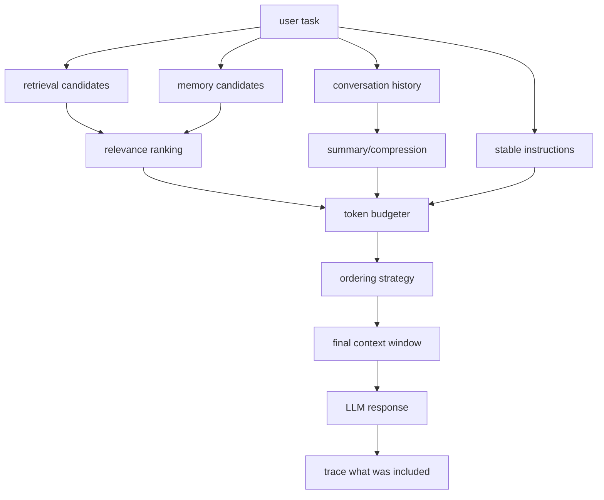

# Context Engineering

> Topic package — Domain 3 · Roadmap Week 15.
> Depth goal: engineer context windows as production inputs: select, order, compress, and budget instructions, conversation state, retrieved evidence, tool results, and memory so the model sees the right information at the right time without drowning in tokens.

## Source
- Track: LLM Engineering (self-directed, FDE roadmap)
- Slide deck: `07 Resources Library/LLM Engineering/Slides/Lesson_16_Context_Engineering.pptx`
- Hands-on notebook: `07 Resources Library/LLM Engineering/Notebooks/16_Context_Engineering.ipynb` (runs offline)
- Reference reading: Liu et al. 'Lost in the Middle' (arXiv:2307.03172); Anthropic long-context and prompt/context guidance; LangChain and LlamaIndex retrieval/context assembly patterns; OpenAI prompt engineering guidance; recent 'context engineering' practice in agent systems
- Builds on: [[02 Literature Notes/LLM Engineering/Reasoning Prompt Patterns]]
- Date: 2026-07-18

---

## 1. Mental Model

**Context engineering is the discipline of deciding what the model is allowed to know right now.** Prompt engineering asks, 'what instruction should I write?' Context engineering asks the bigger production question: which instructions, conversation turns, retrieved documents, tool outputs, memories, schemas, examples, and constraints should be assembled into the finite context window for this call?

The context window is not a hard drive. More tokens can hurt: irrelevant evidence distracts, middle-position facts get ignored, stale memory conflicts with fresh retrieval, and long prompts hide the task. Good context engineering is therefore an optimization problem: maximize relevant signal per token under a budget and an ordering strategy.

> Key intuition: **the model can only reason over the context you assemble — so context assembly is part of the program.** Retrieve less but better, put critical instructions and evidence where attention is strongest, compress aggressively, and treat memory as a source to select from, not a dump to paste.



---

## 2. How It Actually Works

### 3.1 Context is an assembled input, not a bag of text
A production LLM call usually contains stable instructions, task input, prior conversation, retrieved documents, tool results, schema definitions, examples, and memory. Each source has different trust, freshness, and relevance. Context engineering makes those choices explicit: what enters, what is omitted, how it is delimited, and how conflicts are resolved.

### 3.2 Token budgeting is product design
Every context window has a budget. Reserve tokens for the answer and for mandatory instructions before filling with evidence:

$$B_{docs} = B_{window} - B_{system} - B_{task} - B_{history} - B_{answer} - B_{safety}$$

Budgeting is not just cost control; it protects quality. A giant irrelevant context can reduce answer accuracy even if it fits.

### 3.3 Ordering matters: lost in the middle
Liu et al. showed that models often use information near the beginning and end of long contexts better than information buried in the middle. Practical heuristic: put stable instructions first, the current user task last, and the most relevant evidence near boundaries or repeated in a compact synthesis. Do not assume a 200k-token window means all 200k tokens are equally usable.

### 3.4 Retrieval, compression, and relevance filtering
Context assembly is a pipeline: retrieve candidates, filter by relevance, deduplicate, rerank, compress, cite, and then assemble. Compression can be extractive (keep exact spans), abstractive (summarize), or structured (facts table). For high-stakes answers, prefer extractive snippets with citations over lossy summaries.

### 3.5 Memory is not context
Memory is stored state across calls; context is what you include in this call. Treat memory like a database to query, not a transcript to paste. Memory needs freshness, consent, deletion, and conflict rules. A stale user preference should lose to the current instruction; retrieved source-of-record evidence should beat vague memory.

---

## 3. Implementation

Assumed stack: stdlib + numpy — toy context assemblers that rank, budget, compress, and demonstrate lost-in-the-middle risk without external services. Snippets:
- [[04 Code Snippets/LLM/Context Budget Assembler]]
- [[04 Code Snippets/LLM/Lost In The Middle Probe]]

### Context Budget Assembler
Rank context candidates by relevance density and fit them into a fixed token budget.
```python
def token_count(text):
    return len(text.split())

def assemble_context(instructions, task, candidates, budget):
    fixed = token_count(instructions) + token_count(task)
    remaining = budget - fixed
    scored = sorted(candidates, key=lambda c: c["score"] / max(1, token_count(c["text"])), reverse=True)
    chosen = []
    for c in scored:
        n = token_count(c["text"])
        if n <= remaining:
            chosen.append(c); remaining -= n
    body = "\n\n".join(f"[{c['id']}] {c['text']}" for c in chosen)
    return f"{instructions}\n\nEVIDENCE:\n{body}\n\nTASK:\n{task}", chosen

cands = [{"id":"A","score":0.95,"text":"Refunds require receipt ID and payment date."},
         {"id":"B","score":0.40,"text":"Company picnic is Friday with snacks."}]
ctx, chosen = assemble_context("Answer only from evidence.", "How do refunds work?", cands, budget=30)
print([c["id"] for c in chosen])
print(ctx)
```

### Lost In The Middle Probe
Simulate why important evidence buried in the middle of long context is risky.
```python
def position_weight(i, n):
    # Toy U-shaped attention: edges are easier than the middle.
    center = abs((i / max(1, n-1)) - 0.5)
    return 0.5 + center

def score_positions(chunks, keyword):
    n = len(chunks); hits = []
    for i, ch in enumerate(chunks):
        if keyword.lower() in ch.lower():
            hits.append((i, round(position_weight(i, n), 2), ch[:45]))
    return hits

chunks = ["instructions", "irrelevant A", "refund policy: receipt required", "irrelevant B", "user question"]
print(score_positions(chunks, "refund"))
chunks_edge = ["instructions", "refund policy: receipt required", "irrelevant A", "irrelevant B", "user question"]
print(score_positions(chunks_edge, "refund"))
```

---

## 4. Design Decisions & Tradeoffs

| Decision | Guidance |
|---|---|
| **Budget allocation** | Reserve answer and instruction tokens first; spend the remaining budget on highest relevance-density evidence. |
| **Ordering** | Put durable instructions first, current task last, and critical evidence near beginning/end or summarized close to the task. |
| **Compression type** | Use extractive compression for high-stakes grounded answers; abstractive summaries for low-risk context reduction. |
| **Memory inclusion** | Query and select memory; do not paste raw long-term memory. Current user instruction overrides stale memory. |
| **Conflict handling** | State precedence: system rules > current user task > source-of-record retrieval > memory > old chat history. |
| **Traceability** | Log which chunks entered the context so bad answers can be debugged and evals can reproduce context assembly. |

---

## 5. Failure Modes & Gotchas

- Assuming bigger context is always better → irrelevant tokens dilute signal and raise cost.
- Burying the key fact in the middle of a long prompt → lost-in-the-middle failure.
- Mixing untrusted retrieved text with instructions → prompt injection and precedence confusion.
- Summarizing away exact numbers, dates, or legal language → grounded answer becomes unverifiable.
- Pasting all memory into every call → stale/conflicting/private data leaks into unrelated tasks.
- Not tracing included chunks → impossible to debug whether the model or retriever caused the error.

---

## 6. FDE Angle

- Most client RAG failures are context assembly failures, not model failures: wrong chunk, too many chunks, bad order, no refusal.
- A context budget table is a practical stakeholder artifact: instruction/history/retrieval/answer token allocations.
- FDEs can often improve quality faster by reranking and trimming context than by swapping models.
- Deliverable: a reproducible context assembler with chunk traces, budgets, and ordering policy.

---

## 7. Self-Check

1. What is the difference between prompt engineering and context engineering?
2. How would you allocate a 16k token budget among instructions, history, retrieval, and answer?
3. What is lost-in-the-middle and how do you mitigate it?
4. When should you use extractive vs abstractive compression?
5. Why is memory not the same thing as context?
6. What should be logged to debug a bad context-augmented answer?

## 8. Links
- Domain MOC: [[06 Maps of Content/LLM Engineering Concepts]]
- Code: [[04 Code Snippets/LLM/Context Budget Assembler]], [[04 Code Snippets/LLM/Lost In The Middle Probe]]
- Distilled: [[03 Permanent Notes/Context Assembly Is Part of the Program]], [[03 Permanent Notes/Long Context Does Not Mean Useful Context]]
- Upstream: [[02 Literature Notes/LLM Engineering/Reasoning Prompt Patterns]] · Downstream: [[02 Literature Notes/LLM Engineering/RAG Systems]]
