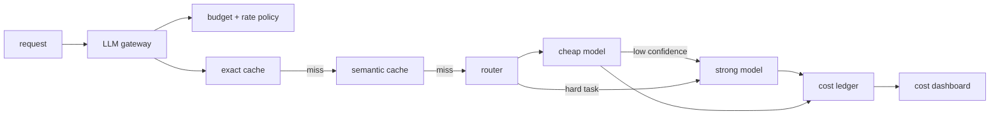

# Cost Architecture (caching, routing, gateway)

> Topic package — Domain 8 · Roadmap Week 22.
> Depth goal: design a cost control plane for LLM applications: measure cost per request, reduce prompt tokens, cache repeated work, route easy tasks to cheaper models, use cascades for confidence, and enforce budgets through a gateway.

## Source
- Track: LLM Engineering (self-directed, FDE roadmap)
- Slide deck: `07 Resources Library/LLM Engineering/Slides/Lesson_47_Cost_Architecture.pptx`
- Hands-on notebook: `07 Resources Library/LLM Engineering/Notebooks/47_Cost_Architecture.ipynb` (runs offline)
- Reference reading: GPTCache; LiteLLM gateway/proxy docs; FrugalGPT: How to Use Large Language Models While Reducing Cost and Improving Performance (Chen et al., arXiv:2305.05176); provider batch API docs; semantic cache and model cascade patterns
- Builds on: [[02 Literature Notes/LLM Engineering/LLM Efficiency]] · [[02 Literature Notes/LLM Engineering/Reasoning Models]]
- Date: 2026-07-18

---

## 1. Mental Model

**LLM cost architecture is yield management: spend strong-model dollars only where they change the outcome.** The bill is not one thing; it is prompt tokens, output tokens, retries, tool calls, embedding calls, evaluation calls, latency-driven overprovisioning, and wasted duplicate work. Cost control is therefore an architecture layer, not a last-minute prompt tweak.

A mature system has a **gateway** that meters usage, enforces budgets, caches exact and semantic repeats, routes by task difficulty, falls back across providers, and records cost per tenant/use case. The cheapest request is one you do not send; the next cheapest is one answered by a small model; the most expensive is a repeated long-context prompt sent to a frontier model because nobody measured it.

> Key intuition: **buy intelligence incrementally.** Cache what repeats, compress what bloats, route what is easy, escalate only when confidence demands it.



---

## 2. How It Actually Works

### 8.1 Meter before optimizing
You cannot optimize a blended monthly bill. Instrument cost per request, tenant, feature, model, prompt version, and route. Include input tokens, output tokens, embeddings, retries, eval calls, and cache misses. Cost dashboards should show p50/p95 cost per request and top cost drivers, not just total spend.

### 8.2 Cache exact and semantic repeats
Exact caches catch identical prompt/template/input combinations. Semantic caches catch paraphrases by embedding the normalized request and retrieving prior answers above a similarity threshold. Exact cache is safer; semantic cache needs TTLs, invalidation by corpus/version, answer provenance, and thresholds to avoid returning stale or wrong answers.

### 8.3 Route by difficulty and value
Model routing sends simple extraction, classification, rewriting, and FAQ tasks to cheap models while reserving strong models for hard reasoning or high-value cases. Routes can be rule-based, classifier-based, confidence-gated, or cascade-based. FrugalGPT-style cascades ask cheaper models first and escalate only when confidence or validation fails.

### 8.4 Reduce tokens deliberately
Prompt-token reduction is architecture work: retrieve fewer/better chunks, summarize conversation state, trim few-shot examples, compress schemas, use smaller context windows, and avoid repeating static instructions. Output-token budgets matter too: ask for concise structured output when downstream code does not need prose.

### 8.5 Centralize policy in a gateway
An LLM gateway (LiteLLM-style) gives one place for provider keys, routing, budgets, retries, fallbacks, logging, model aliases, and per-tenant limits. This avoids every application team reinventing cost controls and creates a single ledger for finance and reliability.

---

## 3. Implementation

Assumed stack: stdlib + numpy — deterministic exact+semantic cache, token/cost ledger, router, and confidence cascade. Snippets:
- [[04 Code Snippets/LLM/Exact and Semantic LLM Cache]]
- [[04 Code Snippets/LLM/Confidence Gated Model Cascade]]

### Exact and Semantic LLM Cache
Combine normalized exact lookup with cosine similarity over toy embeddings.
```python
import numpy as np, re

def norm(text): return re.sub(r"\s+", " ", text.lower()).strip()
def embed(text):
    v = np.zeros(8)
    for ch in norm(text): v[ord(ch) % len(v)] += 1
    return v / (np.linalg.norm(v) + 1e-9)
def cosine(a,b): return float(np.dot(a,b) / ((np.linalg.norm(a)*np.linalg.norm(b)) + 1e-9))

class LLMCache:
    def __init__(self): self.exact, self.semantic = {}, []
    def put(self, prompt, answer):
        self.exact[norm(prompt)] = answer
        self.semantic.append((embed(prompt), answer, prompt))
    def get(self, prompt, threshold=.92):
        key = norm(prompt)
        if key in self.exact: return "exact", self.exact[key]
        scored = [(cosine(embed(prompt), v), ans) for v, ans, _ in self.semantic]
        if scored and max(scored)[0] >= threshold: return "semantic", max(scored)[1]
        return "miss", None

c = LLMCache(); c.put("How do I reset my password?", "Use the reset link.")
print(c.get("how do i reset my password"))
```

### Confidence Gated Model Cascade
Try a cheap model first and escalate to a strong model only when confidence is low.
```python
def cheap_model(task):
    easy = any(w in task.lower() for w in ["classify", "summarize", "extract"])
    return {"model": "cheap", "answer": "draft answer", "confidence": 0.82 if easy else 0.41, "cost": 0.001}

def strong_model(task):
    return {"model": "strong", "answer": "higher confidence answer", "confidence": 0.93, "cost": 0.02}

def cascade(task, threshold=0.75):
    first = cheap_model(task)
    if first["confidence"] >= threshold:
        return first | {"route": "cheap_only"}
    second = strong_model(task)
    second["cost"] += first["cost"]
    return second | {"route": "escalated"}

for task in ["classify ticket sentiment", "solve a multi-step legal reasoning problem"]:
    print(task, "->", cascade(task))
```

---

## 4. Design Decisions & Tradeoffs

| Decision | Guidance |
|---|---|
| **Cache threshold** | Exact cache is safe; semantic cache needs high thresholds, TTLs, and invalidation by corpus/prompt version. |
| **Routing signal** | Start with rules + validation; graduate to learned routers when traffic volume justifies it. |
| **Cascade gate** | Escalate on low confidence, parser failure, policy risk, high user value, or eval-critical intents. |
| **Budget scope** | Enforce budgets by tenant, feature, environment, and model alias, not only global account spend. |
| **Token reduction** | Reduce retrieved chunks and repeated instructions before shrinking useful reasoning context. |
| **Gateway ownership** | Centralize keys, logging, policies, fallbacks, and cost ledger in one LLM gateway. |

---

## 5. Failure Modes & Gotchas

- Optimizing without per-request cost attribution → arguments over anecdotes instead of drivers.
- Semantic cache with loose thresholds → confidently returns the wrong cached answer.
- Caching without prompt/corpus/version keys → stale answers survive data or instruction changes.
- Routing everything to the cheapest model → hidden quality regressions and user escalations.
- Routing everything to the strongest model → margin disappears on easy traffic.
- No gateway → duplicated keys, inconsistent retries, no central budget enforcement.

---

## 6. FDE Angle

- Cost architecture is a client-facing business lever: same product quality at lower gross margin burn.
- A strong FDE can show a before/after cost waterfall: cache hits, routing, token reduction, batch APIs.
- Budget enforcement belongs in architecture, not spreadsheets after the invoice arrives.
- Deliverable: a gateway design with cache policy, router/cascade, model aliases, budget ledger, and eval guardrails.

---

## 7. Self-Check

1. What must be measured before cost optimization is credible?
2. When is semantic caching unsafe, and how do TTL/version keys help?
3. What signals should trigger escalation from cheap to strong models?
4. How does a gateway reduce both cost and operational risk?
5. Name three ways to reduce prompt tokens without harming answer quality.
6. How does FrugalGPT-style cascading differ from static model selection?

## 8. Links
- Domain MOC: [[06 Maps of Content/LLM Engineering Concepts]]
- Code: [[04 Code Snippets/LLM/Exact and Semantic LLM Cache]], [[04 Code Snippets/LLM/Confidence Gated Model Cascade]]
- Distilled: [[03 Permanent Notes/Spend Strong Model Dollars Only Where They Change Outcomes]], [[03 Permanent Notes/The LLM Gateway Is the Cost Control Plane]]
- Upstream: [[02 Literature Notes/LLM Engineering/Inference and Serving]] · Downstream: [[02 Literature Notes/LLM Engineering/Reliability Patterns]]
