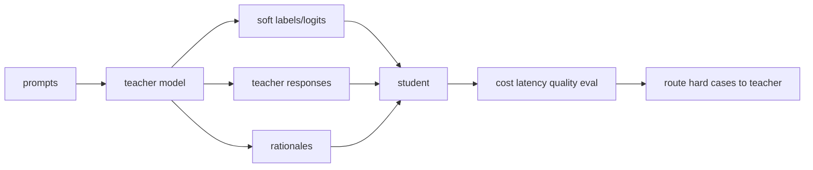

# Distillation & Small-Model Strategies

> Topic package — Domain 7 · Roadmap Week 18.
> Depth goal: implement distillation KL, compare logit/rationale/sequence distillation, and decide when a small model is enough.

## Source
- Track: LLM Engineering (self-directed, FDE roadmap)
- Slide deck: `07 Resources Library/LLM Engineering/Slides/Lesson_42_Distillation_and_Small_Models.pptx`
- Hands-on notebook: `07 Resources Library/LLM Engineering/Notebooks/42_Distillation_and_Small_Models.ipynb` (runs offline)
- Reference reading: Hinton et al. Distilling the Knowledge in a Neural Network (arXiv:1503.02531); Hsieh et al. Distilling Step-by-Step (arXiv:2305.02301); sequence-level knowledge distillation; small language model deployment literature
- Builds on: [[02 Literature Notes/LLM Engineering/Supervised Fine-Tuning]] · [[02 Literature Notes/LLM Engineering/Evaluating LLMs]]
- Date: 2026-07-18

---

## 1. Mental Model

**Distillation is apprenticeship: a small student learns the teacher’s behavior, not just the ground-truth labels.** Teacher probabilities, rationales, or generated sequences provide a richer training signal than one-hot answers.

The product reason is economics: if a smaller model reaches acceptable quality for a narrow workload, it can slash latency and cost.

> Key intuition: **use the big model to manufacture capability, then serve the small model when it is good enough.**



---

## 2. How It Actually Works

### 7.1 Knowledge distillation
A student model learns from a larger teacher through soft targets, logits, rationales, or generated responses. Soft distributions carry information about alternatives, not only the argmax label.

### 7.2 KL objective
Logit distillation often minimizes KL divergence between teacher and student distributions, sometimes with temperature `T` to soften probabilities: `KL(p_teacher^T || p_student^T)`.

### 7.3 Sequence-level distillation
For generative tasks, the teacher produces full target sequences that become SFT data for the student. This is simpler than logit access and works with API teachers.

### 7.4 Distilling step-by-step
Rationales or intermediate explanations can supervise smaller models on reasoning traces, improving sample efficiency when traces are correct and safe to expose.

### 7.5 Small-model strategies
Small models win when latency, cost, privacy, offline deployment, or high-throughput narrow tasks matter. Use routing: small model by default, large model on uncertainty or hard cases.

---

## 3. Implementation

Assumed stack: numpy. Snippets implement KL distillation and a small-model routing policy.
- [[04 Code Snippets/LLM/Distillation KL Between Toy Distributions]]
- [[04 Code Snippets/LLM/Small Model Escalation Router]]

### Distillation KL Between Toy Distributions
Minimize KL from teacher probabilities to student probabilities.
```python
import numpy as np
def softmax(z,T=1):
    z=np.array(z)/T; e=np.exp(z-z.max()); return e/e.sum()
teacher=softmax([4,2,0],T=2); student=softmax([2,1,1],T=2)
kl=float(np.sum(teacher*(np.log(teacher)-np.log(student))))
print(round(kl,4))
```

### Small Model Escalation Router
Route uncertain small-model predictions to a larger teacher.
```python
def route(confidence, risk):
    if risk=="high" or confidence < .72: return "teacher"
    return "student"
for c,r in [(0.9,"low"),(0.6,"low"),(0.8,"high")]: print(c,r,route(c,r))
```

---

## 4. Design Decisions & Tradeoffs

| Decision | Guidance |
|---|---|
| **Teacher signal** | Use logits when available; use sequence outputs when using API teachers. |
| **Temperature** | Higher T reveals dark knowledge among non-argmax classes. |
| **Rationales** | Use only if correct, licensed, and safe to train/serve. |
| **Student size** | Match size to latency and accuracy target. |
| **Routing** | Escalate uncertain or high-risk cases to larger models. |
| **Evaluation** | Measure accuracy per dollar and latency, not accuracy alone. |

---

## 5. Failure Modes & Gotchas

- Student copies teacher hallucinations.
- Synthetic teacher data contaminates evals.
- Over-compressed student fails edge cases.
- Rationales leak hidden or unsafe reasoning.
- Only measuring accuracy ignores latency/cost wins.
- No uncertainty routing forces small model beyond its competence.

---

## 6. FDE Angle

- Distillation turns expensive capability into cheaper repeatable inference.
- Small models can be the correct product even when less capable globally.
- The deliverable is a teacher-data recipe plus student eval and routing thresholds.
- Cost and latency are first-class ML metrics.

---

## 7. Self-Check

1. What information do soft labels contain?
2. Write KL distillation objective.
3. When use sequence-level distillation?
4. Why might rationales help or hurt?
5. When is a small model sufficient?
6. What should trigger escalation?

## 8. Links
- Domain MOC: [[06 Maps of Content/LLM Engineering Concepts]]
- Code: [[04 Code Snippets/LLM/Distillation KL Between Toy Distributions]], [[04 Code Snippets/LLM/Small Model Escalation Router]]
- Distilled: [[03 Permanent Notes/Distillation Converts Expensive Capability Into Cheap Inference]], [[03 Permanent Notes/Small Models Win When the Task Boundary Is Narrow]]
- Upstream: [[02 Literature Notes/LLM Engineering/Preference Optimization]] · Downstream: [[02 Literature Notes/LLM Engineering/Embedding Model Fine-Tuning]]
