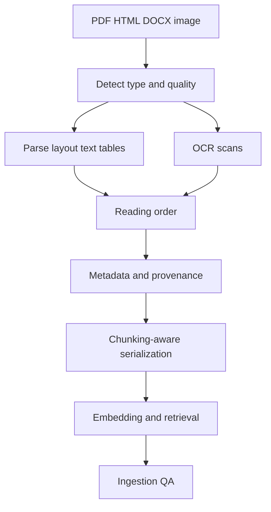

# Document Ingestion & Parsing (PDF/table/OCR)

> Topic package — Domain 10 · Roadmap Weeks 13/20.
> Depth goal: design chunking-aware ingestion pipelines that preserve reading order, layout, tables, OCR confidence, metadata, and provenance so RAG quality is limited by knowledge rather than parsing noise.

## Source
- Track: LLM Engineering (self-directed, FDE roadmap)
- Slide deck: `07 Resources Library/LLM Engineering/Slides/Lesson_51_Document_Ingestion_and_Parsing.pptx`
- Hands-on notebook: `07 Resources Library/LLM Engineering/Notebooks/51_Document_Ingestion_and_Parsing.ipynb` (runs offline)
- Reference reading: unstructured.io documentation; LlamaParse; IBM Docling; Nougat OCR (arXiv:2308.13418); PDF extraction and OCR best practices; table extraction literature
- Builds on: [[02 Literature Notes/LLM Engineering/Chunking Strategies]]
- Date: 2026-07-18

---

## 1. Mental Model

**RAG quality is capped by ingestion quality: if the parser destroys structure, retrieval cannot recover it.** Documents are not plain text; PDFs encode positioned glyphs, HTML encodes hierarchy, DOCX encodes styles, tables encode two-dimensional relationships, and scans require OCR with uncertainty.

The ingestion job is to preserve enough structure for retrieval and grounding: reading order, section hierarchy, table cells, captions, page numbers, metadata, and provenance. Good parsing makes chunks meaningful; bad parsing produces shuffled paragraphs, broken tables, and hallucination-prone context.

> Key intuition: **parse for the downstream chunker and retriever, not for a human-looking text dump.**



---

## 2. How It Actually Works

### 10.1 File-type strategy
PDF, HTML, DOCX, scans, slides, and spreadsheets need different parsers. HTML carries DOM hierarchy; DOCX carries headings/styles; PDFs often only carry coordinates; scanned PDFs need OCR. A production pipeline detects file type, page count, scan ratio, encryption, language, and layout complexity before choosing a parser.

### 10.2 Layout and reading order
PDF extraction often returns text boxes out of human reading order, especially with columns, headers, footers, captions, and sidebars. Reconstruct order using coordinates, page regions, line grouping, and section cues. Reading order errors poison chunks because unrelated text gets embedded together.

### 10.3 Tables and figures
Tables should not be flattened into random text. Preserve rows, columns, headers, units, captions, and page provenance. Common serializations are Markdown tables for LLM readability and JSON/CSV for precise downstream processing. Figures may need captions, OCR, or multimodal embeddings.

### 10.4 OCR and confidence
OCR adds uncertainty: character errors, reading-order mistakes, low-confidence spans, and language/script issues. Store confidence, bounding boxes, page images, and normalization decisions. For critical workflows, route low-confidence pages to human review or higher-quality OCR.

### 10.5 Chunking-aware parsing
Parsing and chunking are coupled. Preserve headings with paragraphs, keep table rows together, avoid splitting definitions from values, attach metadata (doc id, page, section, table id), and evaluate retrieval on answerable questions. Tools such as unstructured.io, LlamaParse, and Docling help, but quality gates still matter.

---

## 3. Implementation

Assumed stack: stdlib. Snippets simulate layout reading-order reconstruction and table serialization. Snippets:
- [[04 Code Snippets/LLM/Layout Reading Order Reconstructor]]
- [[04 Code Snippets/LLM/Table Structure to Markdown]]

### Layout Reading Order Reconstructor
Sort toy layout boxes into human reading order using row grouping and coordinates.
```python
def reading_order(boxes, y_tol=8):
    rows = []
    for b in sorted(boxes, key=lambda x: (x["y0"], x["x0"])):
        placed = False
        for row in rows:
            if abs(row[0]["y0"] - b["y0"]) <= y_tol:
                row.append(b); placed = True; break
        if not placed:
            rows.append([b])
    ordered = []
    for row in rows:
        ordered.extend(sorted(row, key=lambda x: x["x0"]))
    return ordered

boxes = [
    {"text":"Total", "x0":320, "y0":200}, {"text":"Invoice", "x0":40, "y0":40},
    {"text":"Acme", "x0":40, "y0":120}, {"text":"$42", "x0":410, "y0":200},
]
print(" | ".join(b["text"] for b in reading_order(boxes)))
```

### Table Structure to Markdown
Reconstruct table cells into a grid and serialize for LLM-readable chunks.
```python
def reconstruct_table(cells):
    max_r = max(c["row"] for c in cells); max_c = max(c["col"] for c in cells)
    grid = [["" for _ in range(max_c + 1)] for _ in range(max_r + 1)]
    for c in cells:
        grid[c["row"]][c["col"]] = c["text"].strip()
    return grid

def table_to_markdown(grid):
    header = "| " + " | ".join(grid[0]) + " |"
    sep = "| " + " | ".join(["---"] * len(grid[0])) + " |"
    rows = ["| " + " | ".join(r) + " |" for r in grid[1:]]
    return "\n".join([header, sep] + rows)

cells = [{"row":0,"col":0,"text":"Item"},{"row":0,"col":1,"text":"Price"},
         {"row":1,"col":0,"text":"Widget"},{"row":1,"col":1,"text":"$10"}]
print(table_to_markdown(reconstruct_table(cells)))
```

---

## 4. Design Decisions & Tradeoffs

| Decision | Guidance |
|---|---|
| **Parser selection** | Choose per file type and layout complexity; do not use one text extractor for everything. |
| **Serialization** | Use Markdown for LLM-readable tables; JSON/CSV when downstream computation needs precision. |
| **OCR routing** | Record confidence and route low-confidence scans for review or better OCR. |
| **Metadata** | Attach source, page, section, bbox/table id, and parser version to chunks. |
| **Quality gates** | Sample pages, measure empty text, table preservation, reading-order errors, and retrieval hit rate. |
| **Cost tradeoff** | Premium parsers cost more but may save far more by reducing bad RAG answers. |

---

## 5. Failure Modes & Gotchas

- Flattening tables into unreadable token soup.
- Ignoring reading order in multi-column PDFs.
- Dropping page numbers and provenance, making citations impossible.
- Treating OCR output as certain text with no confidence metadata.
- Chunking before preserving headings, sections, and table boundaries.
- No ingestion QA set, so parser regressions silently degrade RAG.

---

## 6. FDE Angle

- Many RAG failures sold as model hallucination are actually ingestion failures.
- Ingestion is a client-visible engineering deliverable: parser choice, QA report, and metadata schema.
- Tables and scanned PDFs are where enterprise RAG complexity becomes real.
- Deliverable: ingestion pipeline with quality metrics and chunking-aware serialization.

---

## 7. Self-Check

1. Why is PDF text extraction harder than HTML extraction?
2. How do reading-order errors affect embeddings and retrieval?
3. When would you serialize a table as Markdown vs JSON?
4. What OCR metadata should be retained?
5. How do parsing and chunking depend on each other?

## 8. Links
- Domain MOC: [[06 Maps of Content/LLM Engineering Concepts]]
- Code: [[04 Code Snippets/LLM/Layout Reading Order Reconstructor]], [[04 Code Snippets/LLM/Table Structure to Markdown]]
- Distilled: [[03 Permanent Notes/RAG Quality Is Capped by Ingestion Quality]], [[03 Permanent Notes/Tables Are Two Dimensional Evidence Not Paragraphs]]
- Upstream: [[02 Literature Notes/LLM Engineering/Chunking Strategies]] · Downstream: [[02 Literature Notes/LLM Engineering/Multimodal AI]]
