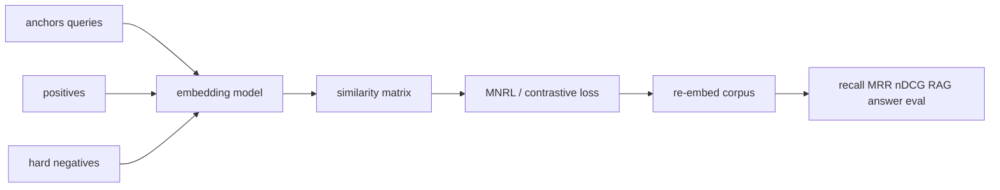

# Embedding-Model Fine-Tuning

> Topic package — Domain 7 · Roadmap Week 18.
> Depth goal: implement in-batch contrastive loss, build triplet data with hard negatives, and evaluate retrieval gains for domain RAG.

## Source
- Track: LLM Engineering (self-directed, FDE roadmap)
- Slide deck: `07 Resources Library/LLM Engineering/Slides/Lesson_43_Embedding_Model_Fine-Tuning.pptx`
- Hands-on notebook: `07 Resources Library/LLM Engineering/Notebooks/43_Embedding_Model_Fine-Tuning.ipynb` (runs offline)
- Reference reading: Sentence-BERT (Reimers and Gurevych, arXiv:1908.10084); SimCSE; sentence-transformers training docs; Multiple Negatives Ranking Loss; contrastive learning literature
- Builds on: [[02 Literature Notes/LLM Engineering/Embeddings]] · [[02 Literature Notes/LLM Engineering/RAG Pipeline Fundamentals]]
- Date: 2026-07-18

---

## 1. Mental Model

**Embedding fine-tuning teaches distance: matching query-document pairs should be near, non-matches should be far.** The model is not generating answers; it is shaping the geometry used by retrieval.

The best training signal is contrastive and domain-specific: anchors, positives, and hard negatives that look plausible but are wrong.

> Key intuition: **a retriever is a ranking model in vector clothing** — tune it with ranking evidence and evaluate ranking metrics.



---

## 2. How It Actually Works

### 7.1 Contrastive objective
Embedding fine-tuning pulls semantically matching pairs together and pushes non-matches apart. The batch often supplies negatives for free: every other positive in the batch is a negative.

### 7.2 Triplets and hard negatives
Triplet data `(anchor, positive, negative)` teaches ranking. Hard negatives are plausible but wrong documents; they create stronger retrievers than random negatives.

### 7.3 MNRL
Multiple Negatives Ranking Loss applies cross-entropy over the similarity matrix so each anchor selects its paired positive among in-batch negatives.

### 7.4 Domain adaptation
Tune embeddings when the off-the-shelf model misses domain vocabulary, abbreviations, product names, legal clauses, code symbols, or local relevance criteria.

### 7.5 Evaluation
Use retrieval metrics such as recall@k, MRR, nDCG, and downstream answer quality. A lower contrastive loss is meaningless if retrieval does not improve.

---

## 3. Implementation

Assumed stack: numpy. Snippets implement MNRL and hard-negative mining.
- [[04 Code Snippets/LLM/In Batch Negative Contrastive Loss]]
- [[04 Code Snippets/LLM/Hard Negative Miner for Retrieval]]

### In Batch Negative Contrastive Loss
Compute MNRL-style cross entropy over a cosine similarity matrix.
```python
import numpy as np
def normalize(x): return x/np.linalg.norm(x,axis=1,keepdims=True)
A=normalize(np.array([[1,0],[0,1],[1,1.]],float)); P=normalize(np.array([[.9,.1],[.1,.9],[.8,.7]],float))
sim=A@P.T; exp=np.exp(sim/.1); prob=exp/exp.sum(1,keepdims=True); loss=-np.log(np.diag(prob)).mean(); print(round(float(loss),3))
```

### Hard Negative Miner for Retrieval
Select the most similar non-positive document as a hard negative.
```python
import numpy as np
scores=np.array([[.9,.7,.2],[.1,.8,.75]])
positives=[0,1]
for i,row in enumerate(scores):
    row=row.copy(); row[positives[i]]=-1
    print("hard negative", int(row.argmax()))
```

---

## 4. Design Decisions & Tradeoffs

| Decision | Guidance |
|---|---|
| **Pair source** | Mine positives from clicks, citations, QA pairs, or expert labels. |
| **Negatives** | Use hard negatives after a random-negative baseline. |
| **Similarity** | Cosine with normalized vectors is the common default. |
| **Batch size** | Larger batches provide more in-batch negatives. |
| **Validation** | Evaluate with frozen corpora and query sets. |
| **RAG impact** | Measure whether retriever gains improve final grounded answers. |

---

## 5. Failure Modes & Gotchas

- Random negatives make the task too easy.
- False negatives push actually relevant documents away.
- Train/test leakage inflates retrieval metrics.
- Optimizing embedding loss without recall gains.
- Changing embedding model without re-indexing vectors.
- Ignoring downstream RAG answer quality.

---

## 6. FDE Angle

- Retriever tuning is often cheaper than fine-tuning the generator.
- Embedding improvements are measurable with recall@k and MRR.
- Hard negative mining is the main practical lever.
- Ship with re-indexing and rollback plans.

---

## 7. Self-Check

1. What are in-batch negatives?
2. Why are hard negatives useful?
3. Write MNRL over a similarity matrix.
4. When tune embeddings for RAG?
5. Why re-index after changing embeddings?
6. Which retrieval metrics matter?

## 8. Links
- Domain MOC: [[06 Maps of Content/LLM Engineering Concepts]]
- Code: [[04 Code Snippets/LLM/In Batch Negative Contrastive Loss]], [[04 Code Snippets/LLM/Hard Negative Miner for Retrieval]]
- Distilled: [[03 Permanent Notes/Embedding Fine Tuning Teaches Retrieval Geometry]], [[03 Permanent Notes/Hard Negatives Make Retrievers Smarter]]
- Upstream: [[02 Literature Notes/LLM Engineering/Embeddings]] · Downstream: [[02 Literature Notes/LLM Engineering/Synthetic Data Generation]]
