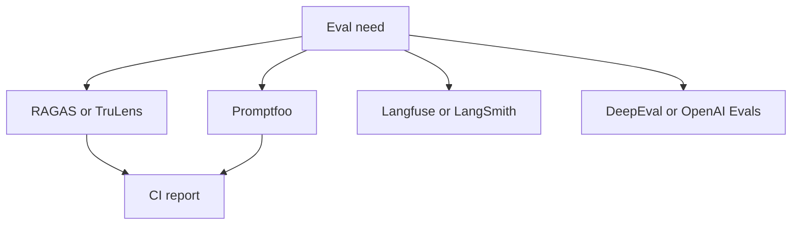

# Eval Framework Literacy (RAGAS, DeepEval, Promptfoo)

> Topic package — Domain 6 · Roadmap Week 17.
> Depth goal: build production-grade LLM evaluation habits: clear datasets, trustworthy metrics, statistical guardrails, and shipping decisions that survive contact with real users.

## Source
- Track: LLM Engineering (self-directed, FDE roadmap)
- Slide deck: `07 Resources Library/LLM Engineering/Slides/Lesson_37_Eval_Framework_Literacy.pptx`
- Hands-on notebook: `07 Resources Library/LLM Engineering/Notebooks/37_Eval_Framework_Literacy.ipynb` (runs offline)
- Reference reading: RAGAS docs; DeepEval docs; Promptfoo docs; Langfuse; TruLens; OpenAI Evals; LangSmith docs
- Builds on: [[02 Literature Notes/LLM Engineering/Eval Fundamentals]] · [[02 Literature Notes/LLM Engineering/Retrieval Evaluation]]
- Date: 2026-07-18

---

## 1. Mental Model

**Eval frameworks are toolboxes, not substitutes for deciding what quality means.** RAGAS emphasizes RAG metrics; DeepEval offers test abstractions; Promptfoo is strong for prompt regression and CI; Langfuse and LangSmith connect traces to evals; TruLens focuses on feedback functions.

Pick the framework that matches your system boundary.

> Key intuition: **frameworks automate plumbing; you still own rubric, dataset, and gate.**



---

## 2. How It Actually Works

### 6.1 Selection criteria
Ask what artifact you evaluate: prompts, RAG answers, traces, agents, datasets, or experiments. Check local runners, CI output, custom metrics, and lock-in.

### 6.2 RAGAS and TruLens
RAGAS provides faithfulness, answer relevance, context precision, and recall. TruLens emphasizes feedback functions over instrumented traces.

### 6.3 DeepEval and OpenAI Evals
DeepEval gives unit-test-like LLM assertions. OpenAI Evals popularized JSONL datasets, eval classes, and repeatable harness patterns.

### 6.4 Promptfoo
Promptfoo fits prompt/model/provider comparison, assertions, red-team plugins, and CI gates close to pull requests.

### 6.5 Langfuse and LangSmith
Trace platforms close the loop from production failures to curated datasets, especially for chains and agents.

---

## 3. Implementation

Assumed stack: stdlib + numpy. The snippets are offline and deterministic so they can run in CI before API-backed evaluation. Snippets:
- [[04 Code Snippets/LLM/Eval Framework Selection Matrix]]
- [[04 Code Snippets/LLM/CI Eval Gate]]

### Eval Framework Selection Matrix
Score frameworks against requirements instead of adopting by hype.
```python
frameworks={"RAGAS":{"rag":3,"ci":2,"traces":1},"Promptfoo":{"rag":1,"ci":3,"traces":1},"Langfuse":{"rag":2,"ci":2,"traces":3}}
def rank(needs):
    rows=[]
    for name,caps in frameworks.items(): rows.append((sum(needs.get(k,0)*caps.get(k,0) for k in needs), name))
    return sorted(rows, reverse=True)
print(rank({"rag":3,"ci":2,"traces":1}))
```

### CI Eval Gate
Framework-agnostic gate that fails builds on metric regressions.
```python
def ci_gate(report, thresholds):
    failures=[]
    for metric, minimum in thresholds.items():
        value=report.get(metric)
        if value is None or value < minimum: failures.append(f"{metric}={value} below {minimum}")
    return {"pass": not failures, "failures": failures}
print(ci_gate({"faithfulness":0.82,"answer_relevance":0.76}, {"faithfulness":0.80,"answer_relevance":0.75}))
```

---

## 4. Design Decisions & Tradeoffs

| Decision | Guidance |
|---|---|
| **Dataset boundary** | Write down exactly which population the eval represents and which it excludes. |
| **Metric choice** | Prefer deterministic metrics for mechanical properties; use judges only for semantic qualities that require judgment. |
| **Slicing** | Always inspect business-critical, safety-critical, and historically weak slices. |
| **Calibration** | Compare automated scores against human labels before using them as gates. |
| **Thresholds** | Set pass/block/investigate thresholds before looking at the result. |
| **Artifacts** | Persist inputs, outputs, prompts, model versions, scores, and traces for reproducibility. |

---

## 5. Failure Modes & Gotchas

- Treating a polished demo as evidence of reliability.
- Optimizing a proxy metric after it stops matching user value.
- Reporting only an aggregate score while a critical slice fails.
- Changing prompt, model, data, and scorer at once, making regressions uninterpretable.
- Using a judge without bias audits or human calibration.
- Failing to save per-case artifacts, so failures cannot be debugged.

---

## 6. FDE Angle

- A production eval is a client-facing trust artifact, not internal trivia.
- A clear scorecard lets stakeholders decide whether to ship, hold, or rollback.
- Automated evals reduce manual QA and accelerate iteration.
- Deliverable: versioned dataset, runner, metrics, report, and CI gate.

---

## 7. Self-Check

1. Define the behavior being measured and the evidence required.
2. Explain how the dataset, scorer, baseline, and threshold interact.
3. Name slices that could hide severe regressions behind a good average.
4. Describe how you would calibrate the metric against human judgment.
5. State what artifacts are needed to reproduce a run.
6. Translate a score into a shipping decision.

## 8. Links
- Domain MOC: [[06 Maps of Content/LLM Engineering Concepts]]
- Code: [[04 Code Snippets/LLM/Eval Framework Selection Matrix]], [[04 Code Snippets/LLM/CI Eval Gate]]
- Distilled: [[03 Permanent Notes/Eval Frameworks Do Plumbing Not Product Judgment]], [[03 Permanent Notes/Choose Eval Tools by System Boundary]]
- Upstream: [[02 Literature Notes/LLM Engineering/Eval Fundamentals]] · Downstream: [[02 Literature Notes/LLM Engineering/Statistical Rigor in Eval]]
