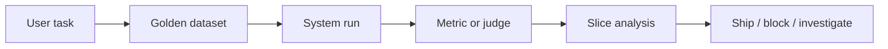

# Eval Fundamentals

> Topic package — Domain 6 · Roadmap Week 17.
> Depth goal: build production-grade LLM evaluation habits: clear datasets, trustworthy metrics, statistical guardrails, and shipping decisions that survive contact with real users.

## Source
- Track: LLM Engineering (self-directed, FDE roadmap)
- Slide deck: `07 Resources Library/LLM Engineering/Slides/Lesson_31_Eval_Fundamentals.pptx`
- Hands-on notebook: `07 Resources Library/LLM Engineering/Notebooks/31_Eval_Fundamentals.ipynb` (runs offline)
- Reference reading: OpenAI Evals; HELM; OpenAI and Anthropic eval guidance; evaluate before you ship
- Builds on: [[02 Literature Notes/LLM Engineering/Prompt Contracts]] · [[02 Literature Notes/LLM Engineering/Retrieval Evaluation]]
- Date: 2026-07-18

---

## 1. Mental Model

**An eval is an executable claim about quality: dataset + scorer + threshold + decision.** A demo shows that a system can work once; an eval harness shows how often it works, for whom, and where it fails.

The core move is to separate the artifact being tested from the measurement system. Golden datasets capture representative tasks and edge cases; offline evals make iteration cheap; online evals confirm user impact.

> Key intuition: **a demo is not proof** — proof starts when the same cases can be rerun, sliced, compared, and gated.



---

## 2. How It Actually Works

### 6.1 What an eval actually is
An eval has four separable pieces: **dataset** cases, **runner** system under test, **scorer** metric/judge/human label, and **decision rule** threshold and escalation. If any piece is implicit, the result is not reproducible.

### 6.2 Offline versus online
Offline evals run on fixed data before shipping; they are cheap, repeatable, and ideal for regression testing. Online evals observe real users through A/B tests, canaries, feedback, and guardrail metrics. You need both.

### 6.3 Reference-based versus reference-free
Reference-based metrics compare to a known answer: exact match, F1, retrieval recall. Reference-free metrics judge properties without a gold answer: groundedness, helpfulness, safety, format validity.

### 6.4 Task metrics versus system metrics
Task metrics answer whether the model did the job. System metrics answer whether the product can operate: latency, cost, refusal rate, tool failure, escalation, and safety triggers.

### 6.5 Building the harness
A harness loads versioned cases, runs the production path, scores deterministically where possible, writes per-case artifacts, summarizes by slice, compares to baseline, and fails CI on thresholds.

---

## 3. Implementation

Assumed stack: stdlib + numpy. The snippets are offline and deterministic so they can run in CI before API-backed evaluation. Snippets:
- [[04 Code Snippets/LLM/Golden Dataset Metric Harness]]
- [[04 Code Snippets/LLM/Eval Slice Gate]]

### Golden Dataset Metric Harness
Minimal reference-based harness with precision, recall, F1, and slice labels.
```python
import numpy as np

def precision_recall_f1(pred, gold):
    pred, gold = set(pred), set(gold)
    tp = len(pred & gold)
    precision = tp / max(1, len(pred))
    recall = tp / max(1, len(gold))
    f1 = 0.0 if precision + recall == 0 else 2 * precision * recall / (precision + recall)
    return precision, recall, f1

def evaluate(rows):
    out = []
    for r in rows:
        p, rec, f1 = precision_recall_f1(r["pred_labels"], r["gold_labels"])
        out.append({"id": r["id"], "slice": r["slice"], "precision": p, "recall": rec, "f1": f1})
    return out

rows = [{"id":"a","slice":"easy","pred_labels":["refund"],"gold_labels":["refund"]},
        {"id":"b","slice":"hard","pred_labels":["refund"],"gold_labels":["escalate"]}]
print(evaluate(rows))
```

### Eval Slice Gate
Convert eval results into an explicit shipping decision with slice thresholds.
```python
from collections import defaultdict

def gate(results, metric="f1", min_overall=0.80, min_slice=0.70):
    overall = sum(r[metric] for r in results) / len(results)
    buckets = defaultdict(list)
    for r in results: buckets[r["slice"]].append(r[metric])
    slices = {k: sum(v)/len(v) for k, v in buckets.items()}
    failures = []
    if overall < min_overall: failures.append(f"overall {overall:.2f} < {min_overall:.2f}")
    failures += [f"slice {k} {v:.2f} < {min_slice:.2f}" for k, v in slices.items() if v < min_slice]
    return {"overall": overall, "slices": slices, "pass": not failures, "failures": failures}

print(gate([{"slice":"easy","f1":1.0},{"slice":"hard","f1":0.5}], min_overall=0.7))
```

---

## 4. Design Decisions & Tradeoffs

| Decision | Guidance |
|---|---|
| **Dataset boundary** | Write down exactly which population the eval represents and which it excludes. |
| **Metric choice** | Prefer deterministic metrics for mechanical properties; use judges only for semantic qualities that require judgment. |
| **Slicing** | Always inspect business-critical, safety-critical, and historically weak slices. |
| **Calibration** | Compare automated scores against human labels before using them as gates. |
| **Thresholds** | Set pass/block/investigate thresholds before looking at the result. |
| **Artifacts** | Persist inputs, outputs, prompts, model versions, scores, and traces for reproducibility. |

---

## 5. Failure Modes & Gotchas

- Treating a polished demo as evidence of reliability.
- Optimizing a proxy metric after it stops matching user value.
- Reporting only an aggregate score while a critical slice fails.
- Changing prompt, model, data, and scorer at once, making regressions uninterpretable.
- Using a judge without bias audits or human calibration.
- Failing to save per-case artifacts, so failures cannot be debugged.

---

## 6. FDE Angle

- A production eval is a client-facing trust artifact, not internal trivia.
- A clear scorecard lets stakeholders decide whether to ship, hold, or rollback.
- Automated evals reduce manual QA and accelerate iteration.
- Deliverable: versioned dataset, runner, metrics, report, and CI gate.

---

## 7. Self-Check

1. Define the behavior being measured and the evidence required.
2. Explain how the dataset, scorer, baseline, and threshold interact.
3. Name slices that could hide severe regressions behind a good average.
4. Describe how you would calibrate the metric against human judgment.
5. State what artifacts are needed to reproduce a run.
6. Translate a score into a shipping decision.

## 8. Links
- Domain MOC: [[06 Maps of Content/LLM Engineering Concepts]]
- Code: [[04 Code Snippets/LLM/Golden Dataset Metric Harness]], [[04 Code Snippets/LLM/Eval Slice Gate]]
- Distilled: [[03 Permanent Notes/A Demo Is Not Proof]], [[03 Permanent Notes/An Eval Harness Is a Product Instrument]]
- Upstream: [[02 Literature Notes/LLM Engineering/Prompt Contracts]] · Downstream: [[02 Literature Notes/LLM Engineering/LLM as a Judge]]
