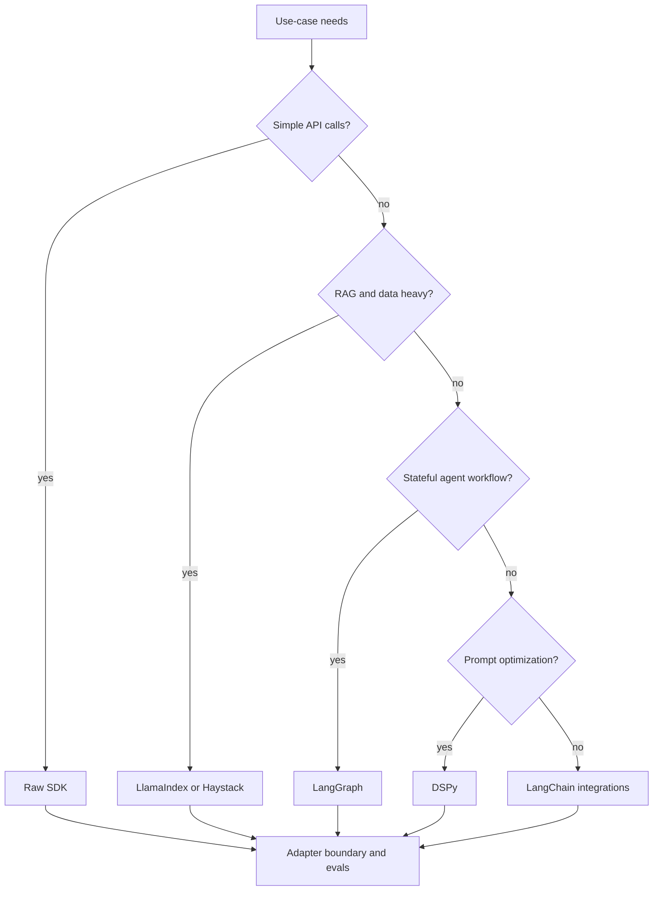

# Framework / Ecosystem Literacy (LangChain vs LlamaIndex vs LangGraph vs DSPy)

> Topic package — Domain 11 · Roadmap Cross-cutting.
> Depth goal: compare the major LLM engineering frameworks, choose the right abstraction for a use case, and manage velocity, lock-in, observability, evaluation, and escape-hatch tradeoffs.

## Source
- Track: LLM Engineering (self-directed, FDE roadmap)
- Slide deck: `07 Resources Library/LLM Engineering/Slides/Lesson_53_Framework_Ecosystem_Literacy.pptx`
- Hands-on notebook: `07 Resources Library/LLM Engineering/Notebooks/53_Framework_Ecosystem_Literacy.ipynb` (runs offline)
- Reference reading: LangChain documentation; LlamaIndex documentation; LangGraph documentation; DSPy documentation; Haystack documentation; vendor SDK docs and production case studies
- Builds on: [[02 Literature Notes/LLM Engineering/Agent Framework Literacy]]
- Date: 2026-07-18

---

## 1. Mental Model

**Framework literacy means knowing which abstraction buys speed without hiding the control surface you need in production.** Raw SDKs are transparent and stable but slow for complex orchestration. LangChain maximizes integrations and prototyping velocity. LlamaIndex specializes in data connectors, indexing, and RAG. LangGraph makes stateful agent workflows explicit. DSPy treats prompts as optimizable programs. Haystack provides search/RAG pipelines with a production-search heritage.

The right answer is not “always use X.” It is a fit decision: data complexity, tool/agent state, evaluation needs, team familiarity, observability, vendor portability, and how painful it would be to drop below the abstraction.

> Key intuition: **frameworks are leverage until they become the thing you are debugging.**



---

## 2. How It Actually Works

### 11.1 Raw SDK baseline
Raw SDKs are ideal for simple chat, embeddings, structured output, and tool calling where you want explicit control over prompts, retries, telemetry, and costs. They minimize dependency risk and lock-in, but you must build connectors, orchestration, memory, evaluation, and tracing yourself.

### 11.2 LangChain
LangChain is the broad integration layer: model providers, tools, retrievers, chains, agents, callbacks, and templates. It is useful for rapid prototypes and heterogeneous integrations. The tradeoff is abstraction churn and debugging through layers unless you keep boundaries clear.

### 11.3 LlamaIndex and Haystack
LlamaIndex is strongest when the hard part is data: connectors, ingestion, indexes, query engines, retrievers, and RAG workflows. Haystack brings pipeline-oriented search/RAG components. Choose these when retrieval architecture matters more than generic agent orchestration.

### 11.4 LangGraph
LangGraph is for stateful, durable, branching agent workflows: multi-step processes, human-in-the-loop, retries, checkpoints, and explicit state transitions. It is closer to workflow engineering than prompt chaining; use it when the flow needs to be inspectable and resumable.

### 11.5 DSPy
DSPy reframes prompting as programming with signatures, modules, optimizers, and metrics. Instead of hand-tuning prompts forever, you specify inputs/outputs and optimize against examples. It shines when you have evaluation data and prompt behavior is a bottleneck.

---

## 3. Implementation

Assumed stack: stdlib. Snippets implement a framework selector and lock-in/velocity scoring model. Snippets:
- [[04 Code Snippets/LLM/LLM Framework Selection Function]]
- [[04 Code Snippets/LLM/Framework Lock In Scorer]]

### LLM Framework Selection Function
Choose a framework based on requirements such as RAG depth, stateful agents, integrations, or prompt optimization.
```python
def choose_framework(needs):
    if needs.get("optimize_prompts"):
        return "DSPy", "programmatic prompt/signature optimization"
    if needs.get("stateful_agent") or needs.get("human_in_loop"):
        return "LangGraph", "explicit state machine for durable agent workflows"
    if needs.get("rag_heavy") or needs.get("many_data_sources"):
        return "LlamaIndex", "data connectors, indexing, retrieval abstractions"
    if needs.get("many_integrations") or needs.get("quick_prototype"):
        return "LangChain", "broad integrations and chains"
    if needs.get("production_minimal"):
        return "Raw SDK", "less abstraction, clearer control surface"
    return "Raw SDK", "start simple; add frameworks when pain is concrete"

cases = [{"rag_heavy": True}, {"stateful_agent": True}, {"production_minimal": True}]
for c in cases:
    print(c, "->", choose_framework(c))
```

### Framework Lock In Scorer
Quantify abstraction tradeoffs using simple weighted criteria for velocity, control, and lock-in.
```python
FRAMEWORK_RISK = {
    "Raw SDK": {"lock_in": 1, "velocity": 2, "control": 5},
    "LangChain": {"lock_in": 3, "velocity": 5, "control": 3},
    "LlamaIndex": {"lock_in": 3, "velocity": 4, "control": 3},
    "LangGraph": {"lock_in": 2, "velocity": 3, "control": 4},
    "DSPy": {"lock_in": 4, "velocity": 3, "control": 4},
}

def score_stack(name, priorities):
    risk = FRAMEWORK_RISK[name]
    return sum(priorities[k] * risk[k] for k in priorities)

priorities = {"velocity": 2, "control": 1, "lock_in": -1}
print(sorted((score_stack(n, priorities), n) for n in FRAMEWORK_RISK)[::-1])
```

---

## 4. Design Decisions & Tradeoffs

| Decision | Guidance |
|---|---|
| **Start point** | Start raw for simple flows; add frameworks when integration/data/state/optimization pain is real. |
| **RAG-heavy** | Prefer LlamaIndex or Haystack when ingestion, indexes, retrievers, and query engines dominate. |
| **Agent state** | Prefer LangGraph when workflows need explicit state, checkpoints, branching, and human review. |
| **Prototype velocity** | LangChain accelerates broad integrations; freeze versions and isolate framework code. |
| **Prompt optimization** | Use DSPy when you have examples/metrics and prompt iteration is the bottleneck. |
| **Escape hatch** | Wrap frameworks behind your own interfaces so you can drop to raw SDKs for critical paths. |

---

## 5. Failure Modes & Gotchas

- Choosing a framework before defining the system boundaries.
- Letting framework abstractions hide prompts, retrieval queries, tool arguments, or telemetry.
- No adapter layer, making migration or debugging expensive.
- Using an agent framework for a deterministic workflow that should be normal code.
- Hand-tuning prompts forever when DSPy-style optimization and evals would help.
- Ignoring version churn and transitive dependencies in production.

---

## 6. FDE Angle

- FDEs must advise clients, not just implement whatever framework is trendy.
- Framework choice affects delivery speed, maintainability, debugging, and hiring.
- The professional answer is a decision memo with tradeoffs, not a slogan.
- Deliverable: capability matrix, stack decision, adapter boundaries, and eval/observability plan.

---

## 7. Self-Check

1. When would you choose raw SDKs over LangChain?
2. What makes LlamaIndex different from LangGraph?
3. When is DSPy a better fit than hand-written prompts?
4. How do you reduce framework lock-in?
5. Why is Haystack relevant in the ecosystem comparison?

## 8. Links
- Domain MOC: [[06 Maps of Content/LLM Engineering Concepts]]
- Code: [[04 Code Snippets/LLM/LLM Framework Selection Function]], [[04 Code Snippets/LLM/Framework Lock In Scorer]]
- Distilled: [[03 Permanent Notes/Frameworks Are Leverage Until They Hide the Control Surface]], [[03 Permanent Notes/Choose LLM Frameworks by the Hard Part of the System]]
- Upstream: [[02 Literature Notes/LLM Engineering/Agent Framework Literacy]] · Downstream: [[02 Literature Notes/LLM Engineering/Prompt Versioning]]
