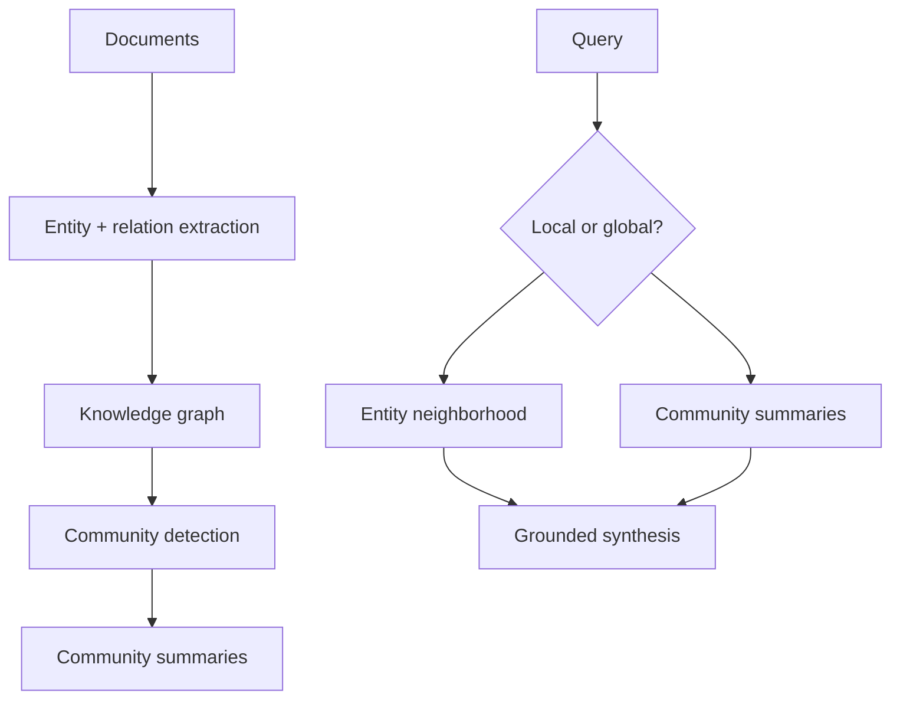

# GraphRAG / Knowledge-Graph RAG

> Topic package — Domain 4 · Roadmap Week 20.
> Depth goal: construct a small knowledge graph from text, retrieve by entities and neighborhoods, summarize communities, and decide when GraphRAG is preferable to pure vector RAG.

## Source
- Track: LLM Engineering (self-directed, FDE roadmap)
- Slide deck: `07 Resources Library/LLM Engineering/Slides/Lesson_20_GraphRAG.pptx`
- Hands-on notebook: `07 Resources Library/LLM Engineering/Notebooks/20_GraphRAG.ipynb` (runs offline)
- Reference reading: Edge et al. From Local to Global: A GraphRAG Approach to Query-Focused Summarization (arXiv:2404.16130); Microsoft GraphRAG docs; Neo4j GraphRAG documentation; knowledge graph extraction literature
- Builds on: [[02 Literature Notes/LLM Engineering/RAG Pipeline Fundamentals]] · [[02 Literature Notes/LLM Engineering/Advanced Retrieval]]
- Date: 2026-07-18

---

## 1. Mental Model

**Vector RAG retrieves similar text; GraphRAG retrieves structured relationships.** It converts documents into entities, relations, claims, and communities so the system can answer questions about connections, neighborhoods, and themes that are not localized in one chunk.

GraphRAG is not a replacement for vector search. It is an additional index over the corpus: entity extraction builds nodes, relation extraction builds edges, community detection creates higher-level summaries, and query mode chooses local neighborhood search or global community synthesis.

> Key intuition: **use vectors for semantic similarity, graphs for relational structure.** GraphRAG shines when the answer lives in connections across documents, not in one nearest chunk.



---

## 2. How It Actually Works

### 4.1 Graph construction
GraphRAG starts by extracting entities (people, orgs, systems, concepts) and relations (uses, owns, causes, depends_on) from chunks. Each node/edge should retain provenance back to source chunks. Extraction quality controls everything downstream; use schemas, canonicalization, and confidence thresholds.

### 4.2 Entity resolution and provenance
Real corpora say `OpenAI`, `Open AI`, and `the vendor`. Entity resolution merges aliases; provenance records where each edge came from. Without provenance, graph answers become uncitable; without resolution, the graph fragments into duplicates.

### 4.3 Communities and summaries
Microsoft GraphRAG popularized community detection plus LLM summaries. Communities group related entities; summaries become high-level retrieval units for broad questions like 'what are the main risks?' This supports global queries that pure nearest-neighbor chunk retrieval often misses.

### 4.4 Local vs global query modes
Local queries start from query entities and traverse neighborhoods for facts about relationships. Global queries search community summaries and aggregate themes across the graph. Many systems combine both with vector retrieval: vectors find relevant text, graph traversal expands relational context.

### 4.5 When graph beats vector RAG
Use GraphRAG when questions ask about relationships, multi-hop dependencies, organizational maps, causal chains, or corpus-level themes. Avoid it for small simple corpora where extraction overhead exceeds benefit. GraphRAG adds pipeline complexity, eval burden, and graph maintenance costs.

---

## 3. Implementation

Assumed stack: stdlib + numpy. Snippets build a tiny graph and query local/global views. Snippets:
- [[04 Code Snippets/LLM/Tiny GraphRAG Index Builder]]
- [[04 Code Snippets/LLM/Local Global GraphRAG Query]]

### Tiny GraphRAG Index Builder
Extract simple entity-relation triples with provenance into an adjacency graph.
```python
from collections import defaultdict

triples = [("RAG", "uses", "retrieval", "doc1"),
           ("GraphRAG", "extends", "RAG", "doc2"),
           ("GraphRAG", "uses", "knowledge graphs", "doc2"),
           ("knowledge graphs", "represent", "relations", "doc3")]

graph = defaultdict(list)
for src, rel, dst, prov in triples:
    graph[src].append({"rel": rel, "dst": dst, "source": prov})

for node, edges in graph.items():
    print(node, "->", edges)
```

### Local Global GraphRAG Query
Choose entity-neighborhood retrieval for local questions and community summaries for global questions.
```python
community = {"rag_methods":"RAG methods combine retrieval indexes with LLM synthesis; GraphRAG adds relations and communities."}
graph = {"GraphRAG":[("extends","RAG","doc2"),("uses","knowledge graphs","doc2")],
         "knowledge graphs":[("represent","relations","doc3")]}

def local(entity):
    return [f"{entity} {rel} {dst} [{src}]" for rel, dst, src in graph.get(entity, [])]

def query(q):
    if "overall" in q or "themes" in q: return community["rag_methods"]
    return "\n".join(local("GraphRAG"))

print(query("How does GraphRAG relate to RAG?"))
```

---

## 4. Design Decisions & Tradeoffs

| Decision | Guidance |
|---|---|
| **Graph schema** | Start with a small relation ontology; unconstrained extraction creates noisy graphs. |
| **Entity resolution** | Canonicalize aliases before community detection or neighborhoods fragment. |
| **Provenance** | Every node/edge/summary should trace back to chunks for citations. |
| **Query mode** | Local for named entities; global for corpus-level themes; combine with vector search when uncertain. |
| **Community summaries** | Regenerate when source graph changes; summaries are derived artifacts. |
| **Adoption threshold** | Use GraphRAG when relation/global questions justify extraction and maintenance cost. |

---

## 5. Failure Modes & Gotchas

- Building a graph with no source provenance, making answers unauditable.
- Letting entity aliases split one real entity into many nodes.
- Using open-ended relation extraction that creates thousands of inconsistent predicates.
- Applying GraphRAG to a tiny FAQ where vector search is enough.
- Answering local factual questions from high-level community summaries only.
- Failing to update summaries after graph changes.

---

## 6. FDE Angle

- GraphRAG is valuable when the stakeholder asks relationship questions: dependencies, ownership, risks, root causes, themes.
- The FDE deliverable is often a graph schema plus an answer trace: entities, edges, communities, source chunks.
- Graph visualizations help explain retrieval failures and build trust.
- Cost/complexity must be justified; not every RAG system needs a knowledge graph.

---

## 7. Self-Check

1. What artifacts does GraphRAG build beyond chunks and vectors?
2. Why is provenance essential for graph edges?
3. Contrast local and global GraphRAG queries.
4. When do community summaries help?
5. Name two cases where vector RAG is simpler and sufficient.

## 8. Links
- Domain MOC: [[06 Maps of Content/LLM Engineering Concepts]]
- Code: [[04 Code Snippets/LLM/Tiny GraphRAG Index Builder]], [[04 Code Snippets/LLM/Local Global GraphRAG Query]]
- Distilled: [[03 Permanent Notes/GraphRAG Adds a Relationship Index to RAG]], [[03 Permanent Notes/GraphRAG Needs Provenance or It Becomes Uncited Claims]]
- Upstream: [[02 Literature Notes/LLM Engineering/Query Transformation]] · Downstream: [[02 Literature Notes/LLM Engineering/Agentic RAG]]
