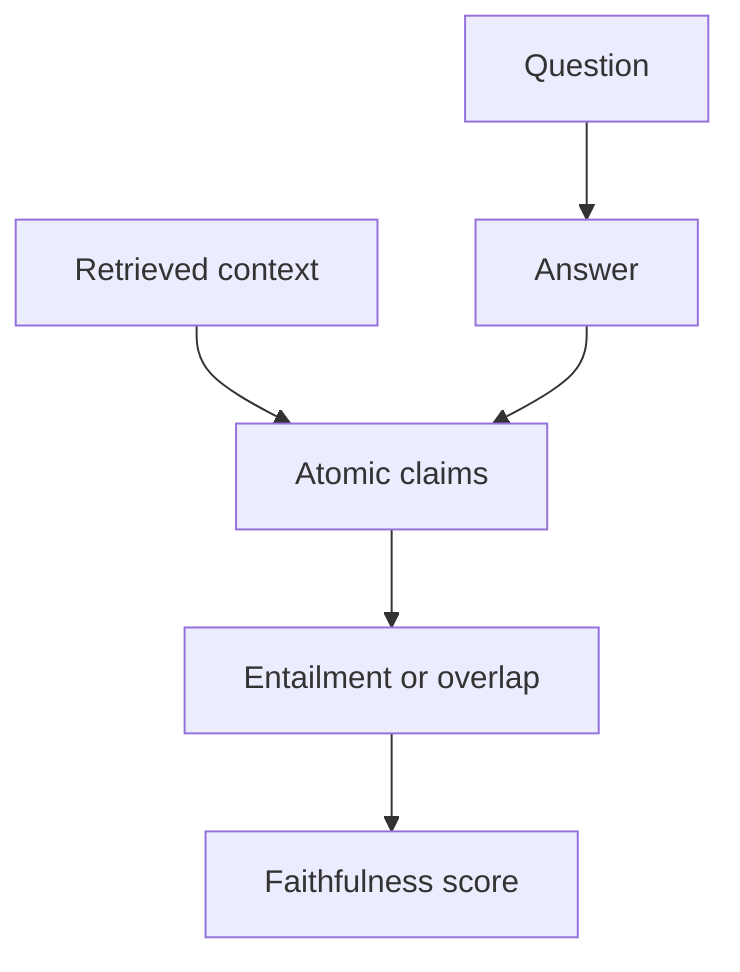

# Groundedness / Faithfulness / Hallucination

> Topic package — Domain 6 · Roadmap Week 17.
> Depth goal: build production-grade LLM evaluation habits: clear datasets, trustworthy metrics, statistical guardrails, and shipping decisions that survive contact with real users.

## Source
- Track: LLM Engineering (self-directed, FDE roadmap)
- Slide deck: `07 Resources Library/LLM Engineering/Slides/Lesson_32_Groundedness_and_Faithfulness.pptx`
- Hands-on notebook: `07 Resources Library/LLM Engineering/Notebooks/32_Groundedness_and_Faithfulness.ipynb` (runs offline)
- Reference reading: RAGAS faithfulness; FactScore; TruLens; SelfCheckGPT; NLI entailment
- Builds on: [[02 Literature Notes/LLM Engineering/Eval Fundamentals]] · [[02 Literature Notes/LLM Engineering/Retrieval Evaluation]]
- Date: 2026-07-18

---

## 1. Mental Model

**Groundedness asks whether each answer claim is supported by provided evidence, not whether the answer sounds plausible.** In RAG, unsupported claims are hallucinations even if true in the world.

Faithfulness is claim-to-context support; answer relevance is question-to-answer usefulness; citation quality is answer-to-source traceability.

> Key intuition: **verify claims against context, not vibes against fluency.**



---

## 2. How It Actually Works

### 6.1 Faithfulness versus relevance
A faithful answer is supported by context; a relevant answer addresses the question. A response can be faithful but useless or relevant but unfaithful, so score both.

### 6.2 Claim-level verification
Split answers into atomic claims and classify each as entailed, contradicted, or not mentioned by retrieved context. FactScore and RAGAS make this decomposition practical.

### 6.3 NLI and overlap proxies
NLI models or judges can estimate entailment, but deterministic lexical overlap, entity support, and contradiction checks are useful offline regression proxies.

### 6.4 Citation checking
Citations must point to spans that actually support the cited claim. Check existence, source id validity, span overlap, and claim coverage.

### 6.5 Hallucination taxonomy
Separate unsupported addition, contradiction, stale fact, missing caveat, and source misattribution because each points to a different fix.

---

## 3. Implementation

Assumed stack: stdlib + numpy. The snippets are offline and deterministic so they can run in CI before API-backed evaluation. Snippets:
- [[04 Code Snippets/LLM/Claim Support Overlap Scorer]]
- [[04 Code Snippets/LLM/Citation Coverage Checker]]

### Claim Support Overlap Scorer
Deterministic claim-to-context support proxy for groundedness regression tests.
```python
import re

def tokens(s): return set(re.findall(r"[a-z0-9]+", s.lower()))
def claim_support(claim, context):
    c, ctx = tokens(claim), tokens(context)
    return len(c & ctx) / max(1, len(c))
def faithfulness(claims, context, threshold=0.6):
    scores = [claim_support(c, context) for c in claims]
    return {"scores": scores, "faithful": sum(s >= threshold for s in scores) / max(1, len(scores))}
print(faithfulness(["refunds allowed within 30 days", "shipping is free"], "refunds are allowed within 30 days with receipt"))
```

### Citation Coverage Checker
Checks whether answer citations cover every claim and point to existing sources.
```python
def citation_coverage(claims, citations, sources):
    ids = set(sources)
    missing = []
    for i, claim in enumerate(claims):
        cited = citations.get(i, [])
        if not cited or not all(c in ids for c in cited): missing.append(claim)
    return {"coverage": 1 - len(missing)/max(1,len(claims)), "missing": missing}
print(citation_coverage(["A","B"], {0:["doc1"], 1:["doc9"]}, {"doc1":"text"}))
```

---

## 4. Design Decisions & Tradeoffs

| Decision | Guidance |
|---|---|
| **Dataset boundary** | Write down exactly which population the eval represents and which it excludes. |
| **Metric choice** | Prefer deterministic metrics for mechanical properties; use judges only for semantic qualities that require judgment. |
| **Slicing** | Always inspect business-critical, safety-critical, and historically weak slices. |
| **Calibration** | Compare automated scores against human labels before using them as gates. |
| **Thresholds** | Set pass/block/investigate thresholds before looking at the result. |
| **Artifacts** | Persist inputs, outputs, prompts, model versions, scores, and traces for reproducibility. |

---

## 5. Failure Modes & Gotchas

- Treating a polished demo as evidence of reliability.
- Optimizing a proxy metric after it stops matching user value.
- Reporting only an aggregate score while a critical slice fails.
- Changing prompt, model, data, and scorer at once, making regressions uninterpretable.
- Using a judge without bias audits or human calibration.
- Failing to save per-case artifacts, so failures cannot be debugged.

---

## 6. FDE Angle

- A production eval is a client-facing trust artifact, not internal trivia.
- A clear scorecard lets stakeholders decide whether to ship, hold, or rollback.
- Automated evals reduce manual QA and accelerate iteration.
- Deliverable: versioned dataset, runner, metrics, report, and CI gate.

---

## 7. Self-Check

1. Define the behavior being measured and the evidence required.
2. Explain how the dataset, scorer, baseline, and threshold interact.
3. Name slices that could hide severe regressions behind a good average.
4. Describe how you would calibrate the metric against human judgment.
5. State what artifacts are needed to reproduce a run.
6. Translate a score into a shipping decision.

## 8. Links
- Domain MOC: [[06 Maps of Content/LLM Engineering Concepts]]
- Code: [[04 Code Snippets/LLM/Claim Support Overlap Scorer]], [[04 Code Snippets/LLM/Citation Coverage Checker]]
- Distilled: [[03 Permanent Notes/Groundedness Is Claim Support Not Fluency]], [[03 Permanent Notes/Faithfulness and Answer Relevance Are Different Metrics]]
- Upstream: [[02 Literature Notes/LLM Engineering/Eval Fundamentals]] · Downstream: [[02 Literature Notes/LLM Engineering/Statistical Rigor in Eval]]
