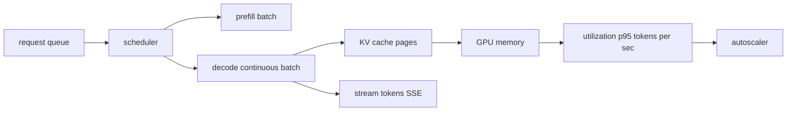

# Inference & Serving (vLLM, TGI, batching, streaming)

> Topic package — Domain 8 · Roadmap Week 22.
> Depth goal: reason about serving throughput, latency, GPU utilization, batching policy, streaming UX, KV-cache pressure, quantization, and autoscaling for self-hosted or managed LLM inference.

## Source
- Track: LLM Engineering (self-directed, FDE roadmap)
- Slide deck: `07 Resources Library/LLM Engineering/Slides/Lesson_46_Inference_and_Serving.pptx`
- Hands-on notebook: `07 Resources Library/LLM Engineering/Notebooks/46_Inference_and_Serving.ipynb` (runs offline)
- Reference reading: vLLM paper: Efficient Memory Management for Large Language Model Serving with PagedAttention (Kwon et al., arXiv:2309.06180); vLLM docs; Hugging Face Text Generation Inference docs; NVIDIA/Triton serving materials; SSE streaming docs
- Builds on: [[02 Literature Notes/LLM Engineering/LLM Efficiency]]
- Date: 2026-07-18

---

## 1. Mental Model

**LLM serving is a queueing and memory-management problem disguised as a model problem.** Once a model is loaded, the hard part is keeping expensive GPUs busy while preserving user-facing latency. Prefill is compute-heavy, decode is memory/KV-cache-heavy, requests have different prompt and output lengths, and each generated token changes the batch.

The winning serving stacks (vLLM, TGI, TensorRT-LLM, managed APIs) combine **continuous batching**, **KV-cache management**, **streaming**, **quantization**, and **autoscaling**. vLLM's PagedAttention treats KV cache like virtual memory pages, reducing fragmentation and enabling high throughput under mixed workloads.

> Key intuition: **a GPU sitting idle is money burning; a user waiting for first token is trust burning.** Serving architecture balances throughput, time-to-first-token, tail latency, and memory headroom.



---

## 2. How It Actually Works

### 8.1 Prefill vs decode
Serving has two different phases. **Prefill** processes the full prompt and builds KV cache; it is parallel and compute-heavy. **Decode** generates one token at a time using the KV cache; it is latency-sensitive and often memory-bandwidth bound. Long prompts stress prefill; many concurrent streams stress decode and KV memory.

### 8.2 Continuous batching
Naive batching waits for a fixed batch to finish together, wasting capacity when requests have variable output lengths. **Continuous batching** inserts new requests as old ones finish at token boundaries, keeping GPU utilization high. The scheduler trades throughput against waiting time: bigger batches improve tokens/sec but can hurt time-to-first-token and p95 latency.

### 8.3 PagedAttention and KV-cache management
vLLM's PagedAttention breaks KV cache into blocks/pages, like an OS memory manager. This reduces fragmentation from variable sequence lengths and lets the server reuse/free blocks efficiently. KV pressure determines maximum concurrency for long context. Once KV memory is exhausted, requests queue or fail.

### 8.4 Streaming and perceived latency
Streaming via Server-Sent Events (SSE) or websockets returns tokens as they are decoded. It does not necessarily reduce total latency, but it improves perceived responsiveness and enables cancellation. Track time-to-first-token separately from total generation latency; users feel TTFT immediately.

### 8.5 Quantization, autoscaling, and right-sizing
Quantized serving can fit larger models or higher concurrency on the same GPU, but quality and kernel support must be validated. Autoscaling should look at queue depth, p95/TTFT, KV-cache utilization, and tokens/sec — not CPU alone. Right-size the model: the cheapest serving win is often using a smaller model for easy traffic.

---

## 3. Implementation

Assumed stack: stdlib + numpy — deterministic simulations for batching, streaming chunks, KV-cache memory, and autoscaling signals. Snippets:
- [[04 Code Snippets/LLM/Continuous Batching Scheduler Simulator]]
- [[04 Code Snippets/LLM/SSE Token Streaming Demo]]

### Continuous Batching Scheduler Simulator
Simulate token-step scheduling where new requests enter as completed ones leave.
```python
from collections import deque

def continuous_batch(requests, max_batch=3):
    queue = deque(dict(id=i, remaining=t) for i, t in requests)
    active, timeline, step = [], [], 0
    while queue or active:
        while queue and len(active) < max_batch:
            active.append(queue.popleft())
        timeline.append((step, [r["id"] for r in active]))
        for r in active: r["remaining"] -= 1
        active = [r for r in active if r["remaining"] > 0]
        step += 1
    return timeline

reqs = [("a", 4), ("b", 2), ("c", 6), ("d", 1), ("e", 3)]
for step, batch in continuous_batch(reqs): print(step, batch)
```

### SSE Token Streaming Demo
Format generated tokens as Server-Sent Event chunks without calling a real model.
```python
import json

def fake_decode(prompt):
    for tok in ["The", " answer", " streams", " token", " by", " token", "."]:
        yield tok

def sse_events(prompt):
    for token in fake_decode(prompt):
        yield "data: " + json.dumps({"token": token}) + "

"
    yield "data: [DONE]

"

for event in sse_events("Explain batching"):
    print(event.strip())
```

---

## 4. Design Decisions & Tradeoffs

| Decision | Guidance |
|---|---|
| **Batch policy** | Use continuous batching for throughput; cap queue wait to protect TTFT and p95. |
| **KV headroom** | Plan concurrency from weights + KV cache, not weights alone; long context changes everything. |
| **Streaming** | Stream for interactive UX and cancellation; measure TTFT separately from total latency. |
| **Quantization** | Validate quality and serving-kernel support before assuming INT4/INT8 wins. |
| **Autoscaling** | Scale on queue depth, KV utilization, TTFT/p95, and tokens/sec, not CPU. |
| **Serving stack** | Use vLLM/TGI unless you have a strong reason to build a scheduler yourself. |

---

## 5. Failure Modes & Gotchas

- Sizing GPUs by model weights only → OOM when KV cache grows with context and concurrency.
- Maximizing throughput while ignoring TTFT → users experience the system as slow.
- Static batches → GPU bubbles when short generations finish early.
- No streaming/cancellation → wasted decode after users navigate away.
- Autoscaling on CPU → GPU queue and KV pressure are invisible.
- Quantizing without eval/kernel benchmarking → lower quality or slower unsupported kernels.

---

## 6. FDE Angle

- Serving is where architecture turns directly into dollars: utilization, latency, and model size drive margin.
- An FDE should be able to explain why vLLM/TGI improves throughput before changing the model.
- Capacity plans must include KV cache, expected prompt/output distributions, and latency SLOs.
- Deliverable: serving design with scheduler, streaming, autoscaling signals, and cost/latency tradeoffs.

---

## 7. Self-Check

1. Why are prefill and decode different bottlenecks?
2. What does continuous batching improve, and what can it hurt?
3. How does PagedAttention reduce KV-cache fragmentation?
4. Why track time-to-first-token separately?
5. Which metrics should drive autoscaling for LLM serving?
6. How does quantization interact with quality and kernel support?

## 8. Links
- Domain MOC: [[06 Maps of Content/LLM Engineering Concepts]]
- Code: [[04 Code Snippets/LLM/Continuous Batching Scheduler Simulator]], [[04 Code Snippets/LLM/SSE Token Streaming Demo]]
- Distilled: [[03 Permanent Notes/LLM Serving Is Queueing Plus KV Cache Management]], [[03 Permanent Notes/Streaming Improves Trust Before It Improves Throughput]]
- Upstream: [[02 Literature Notes/LLM Engineering/LLM Efficiency]] · Downstream: [[02 Literature Notes/LLM Engineering/Cost Architecture]]
