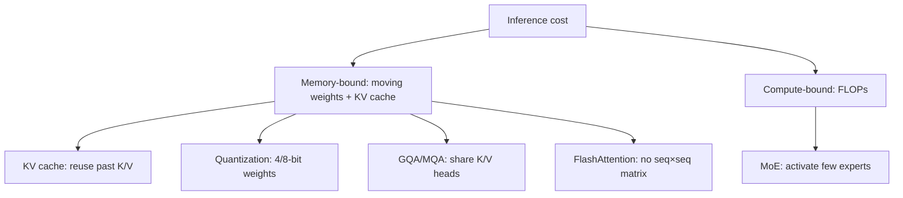

# LLM Efficiency

> Topic package — Domain 2 · Roadmap Week 11.
> Depth goal: understand the techniques that make LLM inference cheap and fast, what each trades off, and how to reason about VRAM and latency for a deployment.

## Source
- Track: LLM Engineering (self-directed, FDE roadmap)
- Slide deck: `07 Resources Library/LLM Engineering/Slides/Lesson_11_LLM_Efficiency.pptx`
- Hands-on notebook: `07 Resources Library/LLM Engineering/Notebooks/11_LLM_Efficiency.ipynb` (runs offline)
- Reference reading: Pope et al. 'Efficiently Scaling Transformer Inference'; Dettmers LLM.int8()/QLoRA; Frantar GPTQ; AWQ; Ainslie GQA (arXiv:2305.13245); Shazeer MQA; Dao FlashAttention (arXiv:2205.14135); Fedus Switch Transformer (MoE)
- Builds on: [[02 Literature Notes/LLM Engineering/Attention Deep-Dive]]
- Date: 2026-07-18

---

## 1. Mental Model

**Inference cost has two enemies — memory and compute — and every efficiency technique attacks one of them.** A deployed LLM is usually *memory-bandwidth bound*: the bottleneck is moving weights and the KV cache in and out of GPU memory, not raw FLOPs. So the big wins come from making things *smaller* (quantization), *reusing* work (KV cache), *reading less* (GQA/MQA, FlashAttention), or *activating less* (MoE).

- **KV cache** — reuse past Keys/Values so each new token is O(seq) not O(seq²). Costs memory.
- **Quantization** — store weights/activations in 8/4 bits instead of 16. ~2-4× smaller, minor quality loss.
- **GQA/MQA** — share K/V heads across query heads → smaller KV cache, faster decode.
- **FlashAttention** — compute attention without materializing the seq×seq matrix → less memory, faster.
- **MoE** — many expert MLPs, route each token to a few → more params, same per-token compute.

> Key intuition: **you're usually memory-bound, so shrink and reuse.** Knowing which lever applies lets you cut cost/latency without retraining.



---

## 2. How It Actually Works

### 2.1 KV cache (the biggest inference-memory cost)
During generation, past tokens' K and V don't change, so cache them. Each new token computes one Query against the cached K/V — turning per-step cost from O(seq²) to O(seq). The cache size is the catch:

$$\text{KV bytes} = 2 \times n_{layers} \times seq \times d_{model} \times \text{bytes} \times batch$$

For long contexts this can exceed the model weights themselves. Shrinking it (GQA, quantized KV) is a major lever.

### 2.2 Quantization
Store weights (and sometimes activations/KV) in fewer bits: FP16 → INT8 (LLM.int8()) or INT4 (GPTQ, AWQ, NF4). Roughly halves or quarters memory and boosts throughput on bandwidth-bound workloads, with small quality loss when done well (per-channel scales, outlier handling). **Post-training quantization** (GPTQ/AWQ) needs no retraining; **QLoRA** fine-tunes on top of a 4-bit base. This is the single most practical lever for fitting a model on cheaper hardware.

### 2.3 GQA / MQA (attention-head sharing)
Multi-Head Attention has one K/V per query head. **Multi-Query Attention (MQA)** uses a *single* shared K/V for all query heads; **Grouped-Query Attention (GQA)** uses a few K/V groups — a middle ground. Both shrink the KV cache and speed up decode with minimal quality loss. LLaMA-2 70B, Mistral, and most modern models use GQA.

### 2.4 FlashAttention
Standard attention materializes the full `seq×seq` score matrix in memory. FlashAttention computes attention in tiles, keeping partial softmax statistics in fast SRAM and never writing the big matrix to HBM. Result: **same math, less memory, ~2-4× faster** for long sequences. It's an implementation optimization — no accuracy tradeoff.

### 2.5 Mixture of Experts (MoE)
Replace the dense MLP with `N` expert MLPs plus a router that sends each token to the top-`k` experts (e.g. 2 of 8). Total parameters balloon (more capacity/knowledge) but **per-token compute stays roughly constant** because only k experts fire. Mixtral, DeepSeek, and others use MoE. Cost: memory to hold all experts, routing complexity, load-balancing.

---

## 3. Implementation

Assumed stack: `numpy` to make the memory math and KV-cache reuse concrete. Snippets:
- [[04 Code Snippets/LLM/KV Cache Memory Estimator]]
- [[04 Code Snippets/LLM/KV Cache Reuse Demo]]

### KV Cache Memory Estimator
Estimate KV-cache size and compare to model weights for a given config.
```python
def kv_cache_gb(n_layers, d_model, seq, batch=1, bytes_per=2, kv_heads=None, n_heads=None):
    # GQA: KV scales with kv_heads/n_heads instead of full d_model
    frac = 1.0 if not (kv_heads and n_heads) else kv_heads / n_heads
    dims = d_model * frac
    total = 2 * n_layers * seq * dims * bytes_per * batch   # 2 = K and V
    return total / 1e9

def weights_gb(n_layers, d_model, vocab, bytes_per=2):
    per = 12 * d_model * d_model
    return (n_layers * per + vocab * d_model) * bytes_per / 1e9

L, d, v = 32, 4096, 32000
print(f"weights (fp16): {weights_gb(L,d,v):.1f} GB")
for seq in (2048, 8192, 32768):
    full = kv_cache_gb(L, d, seq, batch=8)
    gqa  = kv_cache_gb(L, d, seq, batch=8, kv_heads=8, n_heads=32)
    print(f"seq={seq:>6} batch=8  KV(MHA)={full:5.1f}GB  KV(GQA 8/32)={gqa:5.1f}GB")
```

### KV Cache Reuse Demo
Show that caching K/V makes per-step attention O(seq) instead of recomputing O(seq²).
```python
import numpy as np
rng = np.random.RandomState(0)
d = 32
def new_kv(tok): return rng.randn(d), rng.randn(d)   # pretend projections

# Without cache: recompute all K,V every step -> O(t^2) work
def no_cache(tokens):
    work = 0
    for t in range(1, len(tokens)+1):
        for _ in range(t): new_kv(0); work += 1     # rebuild 0..t
    return work

# With cache: only the new token's K,V each step -> O(t)
def with_cache(tokens):
    cache, work = [], 0
    for tok in tokens:
        cache.append(new_kv(tok)); work += 1         # append one
    return work

toks = list(range(200))
print("work no-cache :", no_cache(toks))     # ~ n^2/2
print("work with-cache:", with_cache(toks))  # ~ n
print("speedup ~", no_cache(toks)//with_cache(toks), "x at seq=200")
```

---

## 4. Design Decisions & Tradeoffs

| Decision | Guidance |
|---|---|
| **Fit on smaller GPU** | Quantize (GPTQ/AWQ INT4) first — biggest memory win, minimal quality loss, no retraining. |
| **Long context / big batch** | Use a GQA/MQA model and consider quantized KV cache; KV can dwarf weights. |
| **Latency-critical decode** | GQA + FlashAttention + continuous batching (vLLM); these are additive. |
| **Need max capacity per FLOP** | MoE — more knowledge at constant per-token compute, at the cost of memory. |
| **Quality-sensitive** | Validate quantized model on your eval set; 4-bit sometimes hurts reasoning tasks. |

---

## 5. Failure Modes & Gotchas

- Ignoring KV cache in VRAM planning → OOM at long context even though weights fit.
- Assuming inference is compute-bound → optimizing FLOPs when you're memory-bandwidth bound.
- Aggressive 4-bit quantization without eval → silent quality regression on hard tasks.
- Expecting MoE to be cheaper to *host* — it needs memory for all experts.
- Treating FlashAttention as a quality tradeoff → it's exact, just a faster implementation.
- Forgetting GQA changes the KV-cache size formula (scales with kv_heads, not full d_model).

---

## 6. FDE Angle

- This is the 'why is inference so expensive?' toolkit — you can point to KV cache, precision, or batching and propose a fix.
- Quantization + GQA + vLLM batching routinely cut serving cost several-fold without retraining — a concrete client win.
- VRAM math (weights + KV cache) lets you size hardware and pick between managed APIs and self-hosting.
- Deliverable: a capacity/cost estimate for a deployment, with the efficiency levers you'd apply and their quality risk.

---

## 7. Self-Check

1. Why is LLM inference usually memory-bandwidth bound, not compute bound?
2. Write the KV-cache size formula; when does it exceed the weights?
3. How do MQA and GQA differ, and what do they save?
4. Is FlashAttention a quality tradeoff? Why or why not?
5. How can MoE add parameters without adding per-token compute — and what's the catch?

## 8. Links
- Domain MOC: [[06 Maps of Content/LLM Engineering Concepts]]
- Code: [[04 Code Snippets/LLM/KV Cache Memory Estimator]], [[04 Code Snippets/LLM/KV Cache Reuse Demo]]
- Distilled: [[03 Permanent Notes/LLM Inference Is Usually Memory-Bandwidth Bound]], [[03 Permanent Notes/Quantization and GQA Are the Cheapest Serving Wins]]
- Upstream: [[02 Literature Notes/LLM Engineering/Attention Deep-Dive]] · Downstream: [[02 Literature Notes/LLM Engineering/Reasoning Models]]
