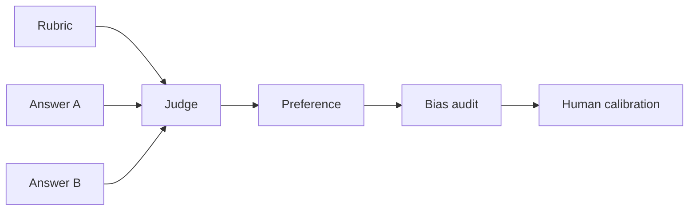

# LLM-as-a-Judge Done Right

> Topic package — Domain 6 · Roadmap Week 17.
> Depth goal: build production-grade LLM evaluation habits: clear datasets, trustworthy metrics, statistical guardrails, and shipping decisions that survive contact with real users.

## Source
- Track: LLM Engineering (self-directed, FDE roadmap)
- Slide deck: `07 Resources Library/LLM Engineering/Slides/Lesson_33_LLM_as_a_Judge.pptx`
- Hands-on notebook: `07 Resources Library/LLM Engineering/Notebooks/33_LLM_as_a_Judge.ipynb` (runs offline)
- Reference reading: Zheng et al. MT-Bench and Chatbot Arena 2306.05685; Liu et al. G-Eval 2303.16634
- Builds on: [[02 Literature Notes/LLM Engineering/Eval Fundamentals]] · [[02 Literature Notes/LLM Engineering/Retrieval Evaluation]]
- Date: 2026-07-18

---

## 1. Mental Model

**An LLM judge is a noisy measuring instrument, not an oracle.** It can scale qualitative evaluation only when the rubric is explicit, outputs are blinded, calibration data exists, and bias is measured.

Pointwise judges assign scores; pairwise judges choose a better answer. Pairwise is often more stable but still vulnerable to position, verbosity, style, and self-preference bias.

> Key intuition: **calibrate, randomize, audit, and never trust one unblinded reading.**



---

## 2. How It Actually Works

### 6.1 Pointwise versus pairwise
Pointwise scoring is easy to aggregate but drifts; pairwise preference is often more reliable for small differences and powers MT-Bench/Chatbot Arena style evaluation.

### 6.2 Rubric design
Define dimensions, anchors, disqualifiers, and examples. Separate correctness, groundedness, safety, and style so the judge does not average incompatible properties.

### 6.3 Biases to audit
Position, verbosity, formatting, and self-preference bias require randomization, answer swapping, length controls, and model diversity.

### 6.4 Calibration against humans
Track agreement, Cohen kappa-like statistics, confusion patterns, and threshold stability on expert-labeled examples.

### 6.5 Judge artifacts
Save judge prompt, rubric version, randomized order, rationale, parsed score, and model version to diagnose judge drift.

---

## 3. Implementation

Assumed stack: stdlib + numpy. The snippets are offline and deterministic so they can run in CI before API-backed evaluation. Snippets:
- [[04 Code Snippets/LLM/Pairwise Judge Calibration Harness]]
- [[04 Code Snippets/LLM/Judge Position Bias Audit]]

### Pairwise Judge Calibration Harness
Compare deterministic simulated judge preferences against human labels.
```python
def simulated_judge(a, b):
    keys = {"supported", "specific", "safe", "concise"}
    sa = sum(k in a.lower() for k in keys); sb = sum(k in b.lower() for k in keys)
    return "A" if sa >= sb else "B"
def accuracy(preds, labels): return sum(p == y for p,y in zip(preds, labels)) / len(labels)
pairs = [("specific supported answer", "vague answer"), ("long unsafe answer", "concise safe answer")]
print(accuracy([simulated_judge(a,b) for a,b in pairs], ["A","B"]))
```

### Judge Position Bias Audit
Swap answer order and count preference patterns that reveal position sensitivity.
```python
def audit_position_bias(judge, pairs):
    biased = 0
    for a,b in pairs:
        if judge(a,b) == judge(b,a): biased += 1
    return biased / max(1, len(pairs))
def always_a(a,b): return "A"
print(audit_position_bias(always_a, [("x","y"),("better","worse")]))
```

---

## 4. Design Decisions & Tradeoffs

| Decision | Guidance |
|---|---|
| **Dataset boundary** | Write down exactly which population the eval represents and which it excludes. |
| **Metric choice** | Prefer deterministic metrics for mechanical properties; use judges only for semantic qualities that require judgment. |
| **Slicing** | Always inspect business-critical, safety-critical, and historically weak slices. |
| **Calibration** | Compare automated scores against human labels before using them as gates. |
| **Thresholds** | Set pass/block/investigate thresholds before looking at the result. |
| **Artifacts** | Persist inputs, outputs, prompts, model versions, scores, and traces for reproducibility. |

---

## 5. Failure Modes & Gotchas

- Treating a polished demo as evidence of reliability.
- Optimizing a proxy metric after it stops matching user value.
- Reporting only an aggregate score while a critical slice fails.
- Changing prompt, model, data, and scorer at once, making regressions uninterpretable.
- Using a judge without bias audits or human calibration.
- Failing to save per-case artifacts, so failures cannot be debugged.

---

## 6. FDE Angle

- A production eval is a client-facing trust artifact, not internal trivia.
- A clear scorecard lets stakeholders decide whether to ship, hold, or rollback.
- Automated evals reduce manual QA and accelerate iteration.
- Deliverable: versioned dataset, runner, metrics, report, and CI gate.

---

## 7. Self-Check

1. Define the behavior being measured and the evidence required.
2. Explain how the dataset, scorer, baseline, and threshold interact.
3. Name slices that could hide severe regressions behind a good average.
4. Describe how you would calibrate the metric against human judgment.
5. State what artifacts are needed to reproduce a run.
6. Translate a score into a shipping decision.

## 8. Links
- Domain MOC: [[06 Maps of Content/LLM Engineering Concepts]]
- Code: [[04 Code Snippets/LLM/Pairwise Judge Calibration Harness]], [[04 Code Snippets/LLM/Judge Position Bias Audit]]
- Distilled: [[03 Permanent Notes/LLM Judges Are Instruments Not Oracles]], [[03 Permanent Notes/Pairwise Judging Needs Bias Audits]]
- Upstream: [[02 Literature Notes/LLM Engineering/Eval Fundamentals]] · Downstream: [[02 Literature Notes/LLM Engineering/Statistical Rigor in Eval]]
