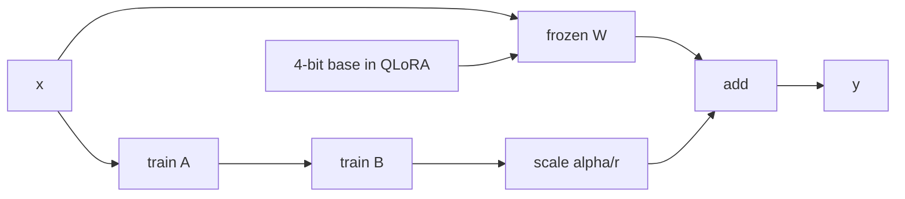

# LoRA / QLoRA / PEFT

> Topic package — Domain 7 · Roadmap Week 18.
> Depth goal: implement LoRA math, choose rank/alpha/target layers, explain QLoRA memory savings, and plan adapter serving.

## Source
- Track: LLM Engineering (self-directed, FDE roadmap)
- Slide deck: `07 Resources Library/LLM Engineering/Slides/Lesson_40_LoRA_QLoRA_PEFT.pptx`
- Hands-on notebook: `07 Resources Library/LLM Engineering/Notebooks/40_LoRA_QLoRA_PEFT.ipynb` (runs offline)
- Reference reading: Hu et al. LoRA (arXiv:2106.09685); Dettmers et al. QLoRA (arXiv:2305.14314); Hugging Face PEFT documentation; bitsandbytes NF4 docs
- Builds on: [[02 Literature Notes/LLM Engineering/Transformer Architecture]] · [[02 Literature Notes/LLM Engineering/Embeddings]] · [[02 Literature Notes/LLM Engineering/Supervised Fine-Tuning]]
- Date: 2026-07-18

---

## 1. Mental Model

**LoRA freezes the big matrix and learns a tiny low-rank patch that steers it.** Instead of updating `W`, train `A` and `B` so the model uses `W + (α/r)BA`.

QLoRA keeps the frozen base in 4-bit quantized form and trains adapters, cutting memory while preserving most fine-tuning quality.

> Key intuition: **fine-tune the direction, not the whole space** — useful task adaptation often lives in a low-dimensional delta.



---

## 2. How It Actually Works

### 7.1 Low-rank update
LoRA freezes a dense matrix `W` and trains `ΔW=(α/r)BA`, where `A` maps into a small rank-r space and `B` maps back. The forward pass is `y=Wx+(α/r)BAx`.

### 7.2 Rank and alpha
Rank controls adapter capacity; alpha controls update scale. More rank increases trainable parameters and overfit risk, so choose with validation curves.

### 7.3 Target modules
Common targets are attention `q_proj` and `v_proj`; larger shifts may also adapt `k/o` and MLP projections. Layer choice is a capacity/latency tradeoff.

### 7.4 QLoRA
QLoRA stores frozen base weights in 4-bit NF4, dequantizes for compute, and trains adapters with optimizer state only for adapter parameters.

### 7.5 Serving adapters
Merge adapters for one task; hot-swap adapters for multiple tenants or domains sharing one base. Version adapters with base checkpoint hashes.

---

## 3. Implementation

Assumed stack: numpy. Snippets implement the LoRA forward pass and parameter accounting.
- [[04 Code Snippets/LLM/LoRA Forward Pass in Numpy]]
- [[04 Code Snippets/LLM/LoRA Parameter Savings Calculator]]

### LoRA Forward Pass in Numpy
Compute `W x + (alpha/r) B A x`.
```python
import numpy as np
rng=np.random.RandomState(0)
W=rng.normal(size=(4,5)); A=rng.normal(scale=.02,size=(2,5)); B=rng.normal(scale=.02,size=(4,2)); x=rng.normal(size=5)
y=W@x+(8/2)*(B@(A@x))
print(np.round(y,3))
```

### LoRA Parameter Savings Calculator
Compare full dense update size with adapter size.
```python
def lora_params(din,dout,r):
    dense=din*dout; adapter=r*(din+dout); return dense,adapter,adapter/dense
for r in [4,8,16,64]:
    print(r, lora_params(4096,4096,r))
```

---

## 4. Design Decisions & Tradeoffs

| Decision | Guidance |
|---|---|
| **Rank** | Start r=8 or 16 and scale only if validation shows under-capacity. |
| **Alpha** | Tune alpha with rank because it changes update magnitude. |
| **Targets** | q/v is cheap; add MLP for larger domain shifts. |
| **QLoRA** | Use when memory is the bottleneck. |
| **Merging** | Merge for one adapter; hot-swap for many. |
| **Metadata** | Record base hash, template, rank, alpha, and target modules. |

---

## 5. Failure Modes & Gotchas

- Training all weights when an adapter would suffice wastes memory.
- High rank on small data overfits.
- Wrong base checkpoint plus adapter silently fails.
- Assuming 4-bit storage removes activation memory needs.
- Targeting too few modules underfits large shifts.
- Serving adapters without routing metadata mixes tenants.

---

## 6. FDE Angle

- PEFT is the practical fine-tuning default under budget constraints.
- Adapters are production artifacts needing versioning and rollback.
- QLoRA can make an otherwise impossible GPU project feasible.
- A good plan includes memory estimate, config, and serving strategy.

---

## 7. Self-Check

1. Write the LoRA equation.
2. What do rank and alpha control?
3. Why does QLoRA save memory?
4. When merge versus hot-swap?
5. What adapter metadata matters?
6. Which layers are common targets?

## 8. Links
- Domain MOC: [[06 Maps of Content/LLM Engineering Concepts]]
- Code: [[04 Code Snippets/LLM/LoRA Forward Pass in Numpy]], [[04 Code Snippets/LLM/LoRA Parameter Savings Calculator]]
- Distilled: [[03 Permanent Notes/LoRA Learns a Low Rank Delta Not a New Model]], [[03 Permanent Notes/Adapters Make Fine Tuning Operationally Modular]]
- Upstream: [[02 Literature Notes/LLM Engineering/Supervised Fine-Tuning]] · Downstream: [[02 Literature Notes/LLM Engineering/Preference Optimization]]
