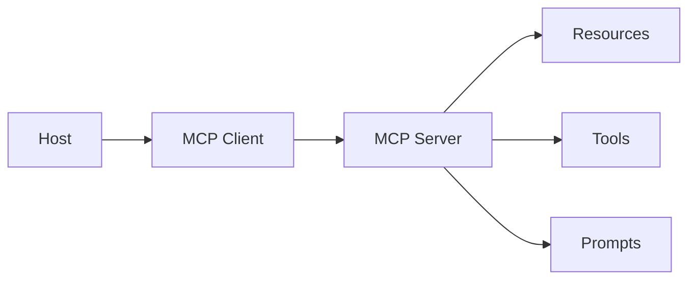

# MCP (Model Context Protocol)

> Topic package — Domain 5 · Roadmap Week 16.
> Depth goal: explain MCP host/client/server architecture, resources/tools/prompts primitives, and why standards matter.

## Source
- Track: LLM Engineering (self-directed, FDE roadmap)
- Slide deck: `07 Resources Library/LLM Engineering/Slides/Lesson_28_Model_Context_Protocol.pptx`
- Hands-on notebook: `07 Resources Library/LLM Engineering/Notebooks/28_Model_Context_Protocol.ipynb` (runs offline)
- Reference reading: Anthropic MCP docs at modelcontextprotocol.io; MCP SDK examples; tool-use architecture patterns
- Builds on: [[02 Literature Notes/LLM Engineering/Structured Generation]] · [[02 Literature Notes/LLM Engineering/Prompt Contracts]] · [[02 Literature Notes/LLM Engineering/Reasoning Prompt Patterns]]
- Date: 2026-07-18

---

## 1. Mental Model

**MCP is a standard protocol for plugging model hosts into external resources, tools, and prompts through servers.** It standardizes context plumbing, not model behavior.



---

## 2. How It Actually Works

### 5.1 Host/client/server
Host owns UX and model loop; clients maintain sessions; servers expose capabilities.

### 5.2 Resources
URI-addressed data such as files, rows, docs, and logs.

### 5.3 Tools
Executable functions with schemas; still need validation and permissions.

### 5.4 Prompts
Reusable templates packaged near data/tools.

### 5.5 Standardization
Avoids custom integration for every host-tool pair.

---

## 3. Implementation

Assumed stack: stdlib + numpy where useful. Snippets:
- [[04 Code Snippets/LLM/Tiny MCP Style Server]]
- [[04 Code Snippets/LLM/MCP Client Call Sketch]]

### Tiny MCP Style Server
Expose resources tools and prompts
```python
class Server:
    resources={"file://note":"hello"}
    tools={"echo":lambda text:text.upper()}
    prompts={"summarize":"Summarize resource"}
    def list(self): return {"resources":list(self.resources),"tools":list(self.tools),"prompts":list(self.prompts)}
print(Server().list())
```

### MCP Client Call Sketch
Invoke a discovered server tool
```python
srv=Server()
def call_tool(name,args):
    if name not in srv.tools: raise ValueError("unknown")
    return srv.tools[name](**args)
print(call_tool("echo", {"text":"mcp"}))
```

---

## 4. Design Decisions & Tradeoffs

| Decision | Guidance |
|---|---|
| **Use MCP** | Reusable external capabilities. |
| **Direct tools** | Simpler for tiny private apps. |
| **Scope** | Least-privilege resources. |
| **Safety** | Protocol is not security. |
| **Version** | Version server capabilities. |

---

## 5. Failure Modes & Gotchas

- Thinking MCP is an agent framework.
- Over-broad resources.
- No permission model.
- No versioning.
- Using MCP when direct function suffices.
- Resource prompt injection.

---

## 6. FDE Angle

- FDEs make the runtime policy explicit rather than relying on model vibes.
- The deliverable includes contracts, traces, tests, and operational limits.
- Stakeholders need to understand both capability and blast radius.
- A small reliable system beats an impressive uncontrolled demo.

---

## 7. Self-Check

1. What is the core abstraction?
2. Where does validation happen?
3. What should be traced?
4. What are the main failure modes?
5. When would you choose the simpler design?

## 8. Links
- Domain MOC: [[06 Maps of Content/LLM Engineering Concepts]]
- Code: [[04 Code Snippets/LLM/Tiny MCP Style Server]], [[04 Code Snippets/LLM/MCP Client Call Sketch]]
- Distilled: [[03 Permanent Notes/MCP Standardizes Context Plumbing]], [[03 Permanent Notes/MCP Servers Package Explicit Capabilities]]
- Upstream: [[02 Literature Notes/LLM Engineering/Structured Generation]] · [[02 Literature Notes/LLM Engineering/Prompt Contracts]] · [[02 Literature Notes/LLM Engineering/Reasoning Prompt Patterns]] · Downstream: [[02 Literature Notes/LLM Engineering/Agent Reliability and Cost]]
