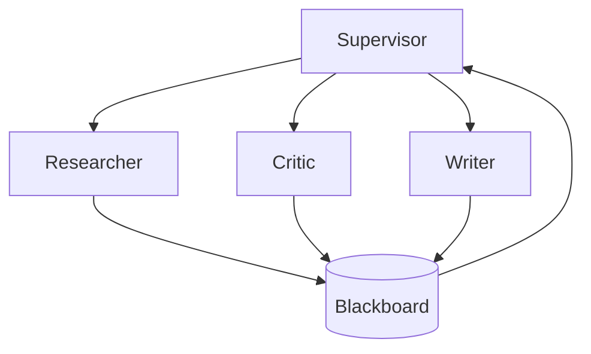

# Multi-Agent Orchestration

> Topic package — Domain 5 · Roadmap Week 16.
> Depth goal: design supervisor-worker, role specialization, handoffs, debate, and blackboard coordination; know when multi-agent hurts.

## Source
- Track: LLM Engineering (self-directed, FDE roadmap)
- Slide deck: `07 Resources Library/LLM Engineering/Slides/Lesson_27_Multi-Agent_Orchestration.pptx`
- Hands-on notebook: `07 Resources Library/LLM Engineering/Notebooks/27_Multi-Agent_Orchestration.ipynb` (runs offline)
- Reference reading: AutoGen (Wu 2308.08155); CrewAI docs; LangGraph multi-agent docs; MetaGPT
- Builds on: [[02 Literature Notes/LLM Engineering/Structured Generation]] · [[02 Literature Notes/LLM Engineering/Prompt Contracts]] · [[02 Literature Notes/LLM Engineering/Reasoning Prompt Patterns]]
- Date: 2026-07-18

---

## 1. Mental Model

**Multi-agent orchestration helps only when role specialization beats coordination overhead.** Supervisors, handoffs, debate, and blackboards coordinate work but add cost and ambiguity.



---

## 2. How It Actually Works

### 5.1 Supervisor-worker
Central routing assigns tasks and decides completion.

### 5.2 Role specialization
Roles need distinct tools, responsibilities, and success criteria.

### 5.3 Handoffs
Transfer ownership with context and acceptance criteria.

### 5.4 Debate
Useful for critique, not a substitute for ground truth.

### 5.5 Blackboard
Shared structured state reduces message spaghetti.

---

## 3. Implementation

Assumed stack: stdlib + numpy where useful. Snippets:
- [[04 Code Snippets/LLM/Supervisor Worker Mini Orchestrator]]
- [[04 Code Snippets/LLM/Multi-Agent Blackboard Store]]

### Supervisor Worker Mini Orchestrator
Dispatch deterministic role workers
```python
def worker(role, task): return f"{role} handled {task}"
trace=[]
for role in ["researcher","critic","writer"]:
    trace.append((role, worker(role,"tools")))
print(trace)
```

### Multi-Agent Blackboard Store
Shared state with provenance
```python
board={"facts":[],"risks":[]}
def post(slot, author, text): board[slot].append({"author":author,"text":text})
post("facts","researcher","schemas matter")
post("risks","critic","coordination cost")
print(board)
```

---

## 4. Design Decisions & Tradeoffs

| Decision | Guidance |
|---|---|
| **Use** | Only for separable roles. |
| **Route** | Centralize ownership. |
| **Handoff** | Include acceptance criteria. |
| **Debate** | Verify with evidence. |
| **State** | Use blackboard schemas. |

---

## 5. Failure Modes & Gotchas

- Agents added for vibes.
- Overlapping roles.
- Circular handoffs.
- Debate without evidence.
- No shared state schema.
- Cost exceeds value.

---

## 6. FDE Angle

- FDEs make the runtime policy explicit rather than relying on model vibes.
- The deliverable includes contracts, traces, tests, and operational limits.
- Stakeholders need to understand both capability and blast radius.
- A small reliable system beats an impressive uncontrolled demo.

---

## 7. Self-Check

1. What is the core abstraction?
2. Where does validation happen?
3. What should be traced?
4. What are the main failure modes?
5. When would you choose the simpler design?

## 8. Links
- Domain MOC: [[06 Maps of Content/LLM Engineering Concepts]]
- Code: [[04 Code Snippets/LLM/Supervisor Worker Mini Orchestrator]], [[04 Code Snippets/LLM/Multi-Agent Blackboard Store]]
- Distilled: [[03 Permanent Notes/Use Multi-Agent Only When Specialization Wins]], [[03 Permanent Notes/Blackboards Turn Agent Chatter Into State]]
- Upstream: [[02 Literature Notes/LLM Engineering/Structured Generation]] · [[02 Literature Notes/LLM Engineering/Prompt Contracts]] · [[02 Literature Notes/LLM Engineering/Reasoning Prompt Patterns]] · Downstream: [[02 Literature Notes/LLM Engineering/Agent Reliability and Cost]]
