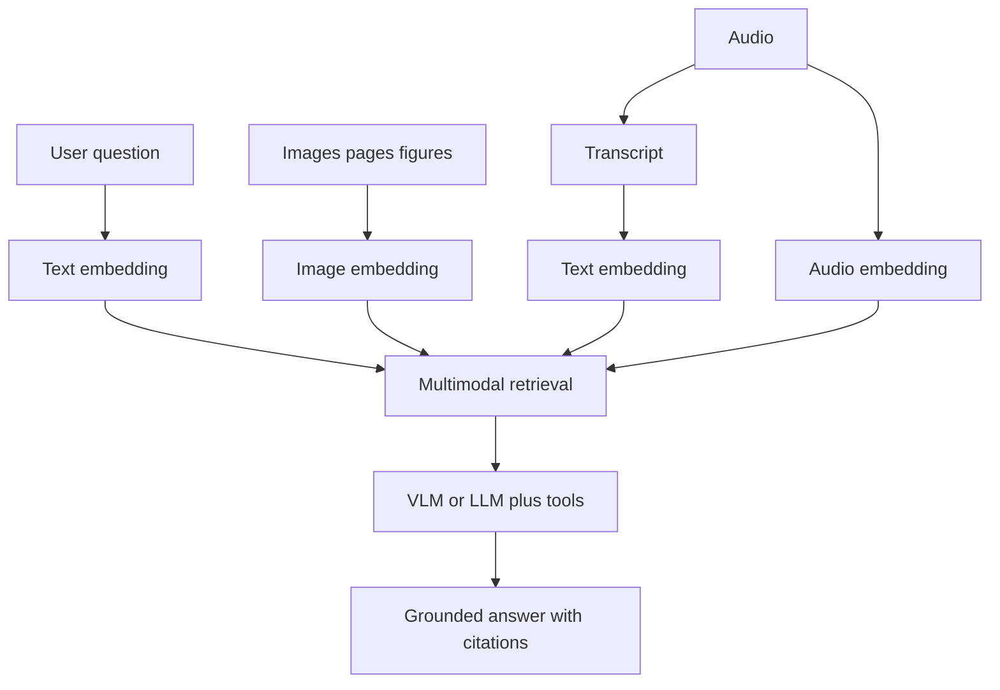

# Multimodal AI (VLMs, image/audio embeddings, multimodal RAG)

> Topic package — Domain 10 · Roadmap Weeks 09/20.
> Depth goal: explain and prototype multimodal systems: CLIP-style alignment, VLM/document VQA, image and audio embeddings, STT/TTS bridges, and multimodal RAG that retrieves evidence across text, images, and transcripts.

## Source
- Track: LLM Engineering (self-directed, FDE roadmap)
- Slide deck: `07 Resources Library/LLM Engineering/Slides/Lesson_52_Multimodal_AI.pptx`
- Hands-on notebook: `07 Resources Library/LLM Engineering/Notebooks/52_Multimodal_AI.ipynb` (runs offline)
- Reference reading: CLIP (Radford et al., arXiv:2103.00020); LLaVA (Liu et al., arXiv:2304.08485); Whisper; GPT-4V-style vision-language model documentation; multimodal RAG papers and system guides
- Builds on: [[02 Literature Notes/LLM Engineering/Embeddings]]
- Date: 2026-07-18

---

## 1. Mental Model

**Multimodal AI turns text, images, audio, and documents into comparable representations so systems can reason over evidence that is not just prose.** CLIP-style models learn an aligned embedding space by pulling matching image-text pairs together and pushing mismatches apart. VLMs add instruction-following and visual reasoning on top of image encoders and language models.

For builders, multimodal usually means three patterns: convert media to text (STT/OCR/captions), embed media directly for retrieval, or ask a VLM to answer using pixels plus text. The architecture depends on latency, cost, evidence requirements, and whether the task needs visual details or only transcripts/captions.

> Key intuition: **multimodal RAG retrieves evidence in the modality where the evidence lives, then grounds the answer in a shared reasoning layer.**



---

## 2. How It Actually Works

### 10.6 CLIP-style contrastive alignment
CLIP trains image and text encoders so matching pairs have high cosine similarity and non-matching pairs have low similarity. This creates a shared embedding space where text can retrieve images and images can retrieve text. The simple math is normalized dot products plus a contrastive loss over batches.

### 10.7 Vision-language models
VLMs such as LLaVA-style systems connect a vision encoder to an LLM instruction-following interface. They can answer questions about images, screenshots, charts, and document pages. GPT-4V-style APIs expose this as image+text input; open systems vary in visual detail, OCR strength, and reasoning reliability.

### 10.8 Audio with STT, TTS, and embeddings
Audio workflows often split into transcription (Whisper-style STT), synthesis (TTS), and audio embeddings for similarity or event detection. For enterprise search, transcripts give cheap text retrieval; audio embeddings help when tone, speaker, music, or acoustic event matters.

### 10.9 Multimodal RAG
A multimodal RAG index may store text chunks, page images, figure crops, captions, OCR, slide thumbnails, and audio transcripts. Retrieval can be late-fusion (rank each modality then merge) or shared-space (one embedding space). Answers need citations that point to pages, frames, timestamps, or image regions.

### 10.10 Failure modes and evaluation
VLMs can misread small text, hallucinate visual details, over-trust captions, and miss spatial relationships. Evaluate with document VQA, chart QA, image retrieval, transcript QA, and human spot checks. Use task-specific thresholds: a legal PDF page needs different accuracy than a creative image search.

---

## 3. Implementation

Assumed stack: numpy. Snippets simulate CLIP-style cosine alignment and multimodal retrieval fusion. Snippets:
- [[04 Code Snippets/LLM/Toy CLIP Cosine Alignment]]
- [[04 Code Snippets/LLM/Multimodal Retrieval Ranker]]

### Toy CLIP Cosine Alignment
Compute cosine similarity between toy image and text vectors to simulate contrastive alignment.
```python
import numpy as np

def normalize(x):
    x = np.asarray(x, dtype=float)
    return x / (np.linalg.norm(x) + 1e-12)

def cosine(a, b):
    return float(np.dot(normalize(a), normalize(b)))

image_vecs = {"dog_photo": [0.9, 0.1, 0.2], "chart": [0.1, 0.9, 0.3]}
text_vecs = {"a dog running": [0.85, 0.05, 0.25], "a revenue chart": [0.05, 0.95, 0.2]}
for img, iv in image_vecs.items():
    best = max(text_vecs, key=lambda t: cosine(iv, text_vecs[t]))
    print(img, "->", best, round(cosine(iv, text_vecs[best]), 3))
```

### Multimodal Retrieval Ranker
Fuse text, image, and audio vector scores with modality weights for multimodal RAG.
```python
import numpy as np

def rank_multimodal(query, items, weights=None):
    weights = weights or {"text": 0.5, "image": 0.5, "audio": 0.0}
    q = {k: np.asarray(v, float) for k, v in query.items()}
    scored = []
    for item in items:
        score = 0.0
        for mod, w in weights.items():
            if mod in q and mod in item:
                a = q[mod] / (np.linalg.norm(q[mod]) + 1e-12)
                b = np.asarray(item[mod], float); b = b / (np.linalg.norm(b) + 1e-12)
                score += w * float(np.dot(a, b))
        scored.append((score, item["id"]))
    return sorted(scored, reverse=True)

items = [{"id":"slide_dog", "text":[.8,.1], "image":[.9,.1]},
         {"id":"slide_sales", "text":[.1,.9], "image":[.2,.8]}]
print(rank_multimodal({"text":[.7,.2], "image":[1,.0]}, items))
```

---

## 4. Design Decisions & Tradeoffs

| Decision | Guidance |
|---|---|
| **Representation** | Use transcripts/captions when text is enough; use image/audio embeddings when modality-specific evidence matters. |
| **Fusion** | Start with late fusion and explicit weights; shared-space retrieval is cleaner but model-dependent. |
| **VLM use** | Use VLMs for visual reasoning, page understanding, screenshots, and document VQA; avoid when captions suffice. |
| **Citations** | Return page, region, timestamp, or frame provenance, not only text chunk ids. |
| **Cost/latency** | Media embeddings and VLM calls are expensive; cache aggressively and precompute indexes. |
| **Evaluation** | Test retrieval and answer quality per modality, including small text, charts, and noisy audio. |

---

## 5. Failure Modes & Gotchas

- Using OCR/captions only when the answer depends on layout or pixels.
- Using VLMs for everything when cheap transcripts would work.
- No provenance for image regions or audio timestamps.
- Assuming CLIP similarity means factual visual reasoning.
- Ignoring accessibility, consent, and privacy in audio/image processing.
- Evaluating only text QA while deploying image or audio retrieval.

---

## 6. FDE Angle

- Multimodal capability differentiates advanced RAG demos from text-only chatbots.
- Clients often have PDFs, slides, screenshots, calls, and diagrams — not clean text corpora.
- The key design call is conversion-to-text versus direct multimodal embedding versus VLM reasoning.
- Deliverable: modality inventory, retrieval architecture, evaluation set, and citation format.

---

## 7. Self-Check

1. What does CLIP-style contrastive alignment learn?
2. When is STT enough versus audio embeddings?
3. How does multimodal RAG cite evidence?
4. What tasks require a VLM rather than captions?
5. Name two multimodal evaluation failure modes.

## 8. Links
- Domain MOC: [[06 Maps of Content/LLM Engineering Concepts]]
- Code: [[04 Code Snippets/LLM/Toy CLIP Cosine Alignment]], [[04 Code Snippets/LLM/Multimodal Retrieval Ranker]]
- Distilled: [[03 Permanent Notes/Multimodal RAG Retrieves Evidence Where It Lives]], [[03 Permanent Notes/CLIP Similarity Is Retrieval Not Visual Truth]]
- Upstream: [[02 Literature Notes/LLM Engineering/Embeddings]] · Downstream: [[02 Literature Notes/LLM Engineering/Document Ingestion and Parsing]]
