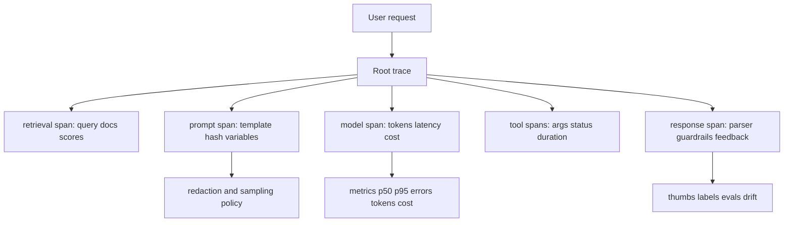

# Observability & Monitoring

> Topic package — Domain 8 · Roadmap Week 22.
> Depth goal: instrument an LLM application end-to-end so prompts, retrieval, model calls, tools, tokens, latency, cost, quality signals, and safety events become measurable without leaking sensitive data.

## Source
- Track: LLM Engineering (self-directed, FDE roadmap)
- Slide deck: `07 Resources Library/LLM Engineering/Slides/Lesson_45_Observability_and_Monitoring.pptx`
- Hands-on notebook: `07 Resources Library/LLM Engineering/Notebooks/45_Observability_and_Monitoring.ipynb` (runs offline)
- Reference reading: LangSmith tracing/evaluation docs; Langfuse observability docs; OpenTelemetry GenAI semantic conventions; Arize Phoenix tracing/evals; OpenLLMetry; provider usage/cost APIs
- Builds on: [[02 Literature Notes/LLM Engineering/RAG Evaluation]] · [[02 Literature Notes/LLM Engineering/Prompt Contracts]]
- Date: 2026-07-18

---

## 1. Mental Model

**LLM observability is flight instrumentation for probabilistic software: every request must leave a trace explaining what the model saw, did, cost, and why it failed.** Traditional monitoring says whether an endpoint is up; LLM monitoring must also answer: which prompt version ran, which chunks were retrieved, how many tokens were spent, whether latency came from retrieval or generation, and whether quality drifted after a model change.

The core object is a **trace**: a tree of spans for ingress, retrieval, reranking, prompt assembly, model calls, tool calls, parsers, validators, and final response. Each span carries model, prompt hash/version, token counts, latency, cost, status, errors, retrieved doc ids, and redacted samples.

> Key intuition: **if you cannot reconstruct the chain of evidence, you cannot debug or improve the system.** Observability turns black-box generations into inspectable production behavior.



---

## 2. How It Actually Works

### 8.1 Trace the whole request graph
Instrument every meaningful operation as a span: request ingress, retrieval, rerank, prompt render, model invocation, tool call, validation, and response. A flat log line cannot explain an agent failure because agent behavior is causal and nested. A trace shows parent-child timing and lets you answer whether the slow part was vector search, a tool timeout, or generation.

### 8.2 Log prompts, completions, tokens, latency, and cost safely
The minimum useful LLM event includes prompt template hash/version, model/provider, input/output token counts, latency, finish reason, status, retry count, and estimated cost. Prompt and completion text are valuable but risky; use sampling, retention limits, redaction, and role-based access. Log templates and variables separately where possible.

### 8.3 Monitor product and system metrics
Dashboards need both service-health and model-health metrics: request volume, error rate, p50/p95/p99 latency, tokens/request, cost/request, cache hit rate, retrieval hit rate, refusal rate, tool failure rate, parser failure rate, and user feedback score. Cost and quality are SLO dimensions alongside availability.

### 8.4 Detect drift with feedback and eval slices
Drift can mean embedding distribution shift, prompt changes, model upgrades, new user intents, stale corpus chunks, degraded retrieval, or changed provider behavior. Track slices by tenant, intent, language, prompt version, model version, and collection. Pair online feedback with offline evals and golden sets.

### 8.5 Make privacy a design constraint
Observability data may combine user messages, retrieved documents, model outputs, tool arguments, and errors. Redact PII before export, store hashes where possible, sample raw payloads, set retention windows, and mark sensitive spans. The goal is debuggability without creating a shadow database of secrets.

---

## 3. Implementation

Assumed stack: stdlib + numpy — a tiny span logger, token/cost accountant, percentile dashboard, and PII-safe event pipeline. Snippets:
- [[04 Code Snippets/LLM/LLM Trace and Cost Ledger]]
- [[04 Code Snippets/LLM/PII Safe LLM Metrics Dashboard]]

### LLM Trace and Cost Ledger
Record nested spans with tokens, latency, errors, and estimated cost.
```python
from dataclasses import dataclass, field
from time import perf_counter

PRICES = {"small": (0.15, 0.60), "strong": (2.50, 10.00)}

@dataclass
class Span:
    name: str
    attrs: dict = field(default_factory=dict)
    children: list = field(default_factory=list)
    start: float = field(default_factory=perf_counter)
    end: float | None = None
    def finish(self, **attrs):
        self.end = perf_counter(); self.attrs.update(attrs); return self
    @property
    def ms(self): return round(((self.end or perf_counter()) - self.start) * 1000, 2)

def cost(model, input_tokens, output_tokens):
    pin, pout = PRICES[model]
    return (input_tokens * pin + output_tokens * pout) / 1_000_000

root = Span("request", {"trace_id": "t-001"})
llm = Span("llm.call", {"model": "small", "prompt_version": "support-v3"})
root.children.append(llm)
llm.finish(input_tokens=820, output_tokens=140, cost_usd=cost("small", 820, 140), status="ok")
root.finish(status="ok")
print(llm.attrs, "latency_ms=", llm.ms)
```

### PII Safe LLM Metrics Dashboard
Compute p50/p95 latency, token usage, cost, and redact sensitive fields before logging.
```python
import re, numpy as np
EMAIL = re.compile(r"[\w.%-]+@[\w.-]+\.[A-Za-z]{2,}")
PHONE = re.compile(r"\d{3}[-.]?\d{3}[-.]?\d{4}")
def redact(text): return PHONE.sub("<PHONE>", EMAIL.sub("<EMAIL>", text))
def summarize(events):
    lat = np.array([e["latency_ms"] for e in events])
    toks = np.array([e["input_tokens"] + e["output_tokens"] for e in events])
    return {"n": len(events), "p50_ms": float(np.percentile(lat, 50)),
            "p95_ms": float(np.percentile(lat, 95)), "error_rate": sum(e["status"] != "ok" for e in events)/len(events),
            "avg_tokens": float(toks.mean()), "total_cost": round(sum(e["cost_usd"] for e in events), 4)}
events = [{"latency_ms": x, "input_tokens": 400+x, "output_tokens": 80, "cost_usd": .001+x/1e7, "status": "ok"} for x in [120,150,180,260,510]]
print(redact("Email me at sri@example.com or 555-123-9999"))
print(summarize(events))
```

---

## 4. Design Decisions & Tradeoffs

| Decision | Guidance |
|---|---|
| **Payload storage** | Store structured metadata by default; sample and redact raw prompts/completions with strict retention. |
| **Trace granularity** | Span every expensive or failure-prone step: retrieval, rerank, prompt, LLM, tool, parser, guardrail. |
| **Metric set** | Track latency, errors, tokens, cost, cache hits, refusals, parser failures, retrieval quality, feedback. |
| **Prompt versions** | Attach prompt/template hash to every call so regressions can be sliced by change. |
| **Feedback loop** | Capture thumbs, edits, escalations, and evaluator labels; join them back to traces. |
| **Vendor choice** | LangSmith/Langfuse/Phoenix are product layers; OpenTelemetry is the portability layer. |

---

## 5. Failure Modes & Gotchas

- Only monitoring HTTP 200s → the service is up while answer quality collapses.
- Logging raw prompts forever → observability becomes an unmanaged PII warehouse.
- No prompt/model version on events → impossible to attribute regressions after a rollout.
- Aggregating averages only → p95/p99 latency and tail failures stay hidden.
- Ignoring retrieved document ids/scores → RAG hallucinations cannot be traced to retrieval.
- Feedback captured outside traces → labels cannot improve prompts, routing, or eval sets.

---

## 6. FDE Angle

- This is the production control plane: traces make LLM applications debug-able, auditable, and optimizable.
- A client deliverable is a dashboard plus trace schema showing latency, cost, quality, and safety slices.
- PII-safe logging is not compliance garnish; it determines whether the org can observe real traffic at all.
- Deliverable: an instrumentation plan with span taxonomy, metrics, retention, redaction, and feedback capture.

---

## 7. Self-Check

1. What attributes belong on every LLM span?
2. Why are p95 latency and cost/request more useful than averages alone?
3. How do you log prompts and completions without creating a PII liability?
4. What is the difference between tracing a RAG call and tracing an agent run?
5. How do feedback and drift detection connect back to traces?
6. When would you prefer OpenTelemetry conventions over a vendor-specific SDK?

## 8. Links
- Domain MOC: [[06 Maps of Content/LLM Engineering Concepts]]
- Code: [[04 Code Snippets/LLM/LLM Trace and Cost Ledger]], [[04 Code Snippets/LLM/PII Safe LLM Metrics Dashboard]]
- Distilled: [[03 Permanent Notes/LLM Observability Starts With Traces Not Logs]], [[03 Permanent Notes/PII Safe Telemetry Is a Product Requirement]]
- Upstream: [[02 Literature Notes/LLM Engineering/RAG Evaluation]] · Downstream: [[02 Literature Notes/LLM Engineering/Inference and Serving]]
