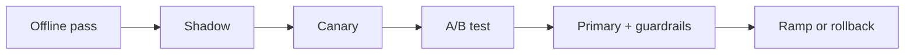

# Online Evaluation (A/B, live feedback)

> Topic package — Domain 6 · Roadmap Week 17.
> Depth goal: build production-grade LLM evaluation habits: clear datasets, trustworthy metrics, statistical guardrails, and shipping decisions that survive contact with real users.

## Source
- Track: LLM Engineering (self-directed, FDE roadmap)
- Slide deck: `07 Resources Library/LLM Engineering/Slides/Lesson_34_Online_Evaluation.pptx`
- Hands-on notebook: `07 Resources Library/LLM Engineering/Notebooks/34_Online_Evaluation.ipynb` (runs offline)
- Reference reading: Ron Kohavi controlled experiments; experimentation platform best practices; product analytics guardrails
- Builds on: [[02 Literature Notes/LLM Engineering/Eval Fundamentals]] · [[02 Literature Notes/LLM Engineering/Retrieval Evaluation]]
- Date: 2026-07-18

---

## 1. Mental Model

**Online evaluation measures what happens when real users meet the system, but it must be instrumented like an experiment, not watched like a dashboard.** A/B tests estimate causal impact; canaries limit blast radius; feedback channels reveal failures offline labels missed.

Online eval confirms candidates after offline regression, safety, and quality gates.

> Key intuition: **ship evidence gradually: shadow, canary, A/B, then ramp.**



---

## 2. How It Actually Works

### 6.1 A/B basics
Randomly assign users or sessions, define primary metric, guardrails, duration, and exclusions before launch. LLM products need explicit and implicit signals.

### 6.2 Canary and shadow
Shadow mode runs invisibly; canary exposes a small percentage. These stages catch latency, cost, tool, safety, and logging failures.

### 6.3 Feedback signals
Thumbs, retries, edits, copy events, abandonment, escalation, and comments are noisy labels that need bias-aware interpretation.

### 6.4 Guardrail metrics
Track latency, cost, safety triggers, refusal rate, support contacts, retrieval failures, and complaints. A win that breaks safety is not a win.

### 6.5 Sample-ratio mismatch
SRM means observed allocation differs from expected allocation, often due to logging, eligibility, bot, or bucketing bugs; pause interpretation.

---

## 3. Implementation

Assumed stack: stdlib + numpy. The snippets are offline and deterministic so they can run in CI before API-backed evaluation. Snippets:
- [[04 Code Snippets/LLM/AB Test Mean Difference CI]]
- [[04 Code Snippets/LLM/Sample Ratio Mismatch Check]]

### AB Test Mean Difference CI
Compute treatment-control lift with a confidence interval.
```python
import math

def mean_ci(control, treatment, z=1.96):
    nc, nt = len(control), len(treatment)
    mc, mt = sum(control)/nc, sum(treatment)/nt
    vc = sum((x-mc)**2 for x in control)/(nc-1)
    vt = sum((x-mt)**2 for x in treatment)/(nt-1)
    se = math.sqrt(vc/nc + vt/nt)
    diff = mt - mc
    return diff, (diff - z*se, diff + z*se)
print(mean_ci([0,1,1,0,1], [1,1,1,0,1]))
```

### Sample Ratio Mismatch Check
Chi-square SRM check for expected assignment proportions.
```python
def srm_chi_square(observed, expected_props):
    total = sum(observed)
    exp = [total * p for p in expected_props]
    return sum((o-e)**2/e for o,e in zip(observed, exp))
print(srm_chi_square([5010,4990], [0.5,0.5]))
print(srm_chi_square([5600,4400], [0.5,0.5]))
```

---

## 4. Design Decisions & Tradeoffs

| Decision | Guidance |
|---|---|
| **Dataset boundary** | Write down exactly which population the eval represents and which it excludes. |
| **Metric choice** | Prefer deterministic metrics for mechanical properties; use judges only for semantic qualities that require judgment. |
| **Slicing** | Always inspect business-critical, safety-critical, and historically weak slices. |
| **Calibration** | Compare automated scores against human labels before using them as gates. |
| **Thresholds** | Set pass/block/investigate thresholds before looking at the result. |
| **Artifacts** | Persist inputs, outputs, prompts, model versions, scores, and traces for reproducibility. |

---

## 5. Failure Modes & Gotchas

- Treating a polished demo as evidence of reliability.
- Optimizing a proxy metric after it stops matching user value.
- Reporting only an aggregate score while a critical slice fails.
- Changing prompt, model, data, and scorer at once, making regressions uninterpretable.
- Using a judge without bias audits or human calibration.
- Failing to save per-case artifacts, so failures cannot be debugged.

---

## 6. FDE Angle

- A production eval is a client-facing trust artifact, not internal trivia.
- A clear scorecard lets stakeholders decide whether to ship, hold, or rollback.
- Automated evals reduce manual QA and accelerate iteration.
- Deliverable: versioned dataset, runner, metrics, report, and CI gate.

---

## 7. Self-Check

1. Define the behavior being measured and the evidence required.
2. Explain how the dataset, scorer, baseline, and threshold interact.
3. Name slices that could hide severe regressions behind a good average.
4. Describe how you would calibrate the metric against human judgment.
5. State what artifacts are needed to reproduce a run.
6. Translate a score into a shipping decision.

## 8. Links
- Domain MOC: [[06 Maps of Content/LLM Engineering Concepts]]
- Code: [[04 Code Snippets/LLM/AB Test Mean Difference CI]], [[04 Code Snippets/LLM/Sample Ratio Mismatch Check]]
- Distilled: [[03 Permanent Notes/Online Eval Needs Causal Design Not Dashboard Watching]], [[03 Permanent Notes/Guardrail Metrics Define Safe Experimentation]]
- Upstream: [[02 Literature Notes/LLM Engineering/Eval Fundamentals]] · Downstream: [[02 Literature Notes/LLM Engineering/Statistical Rigor in Eval]]
