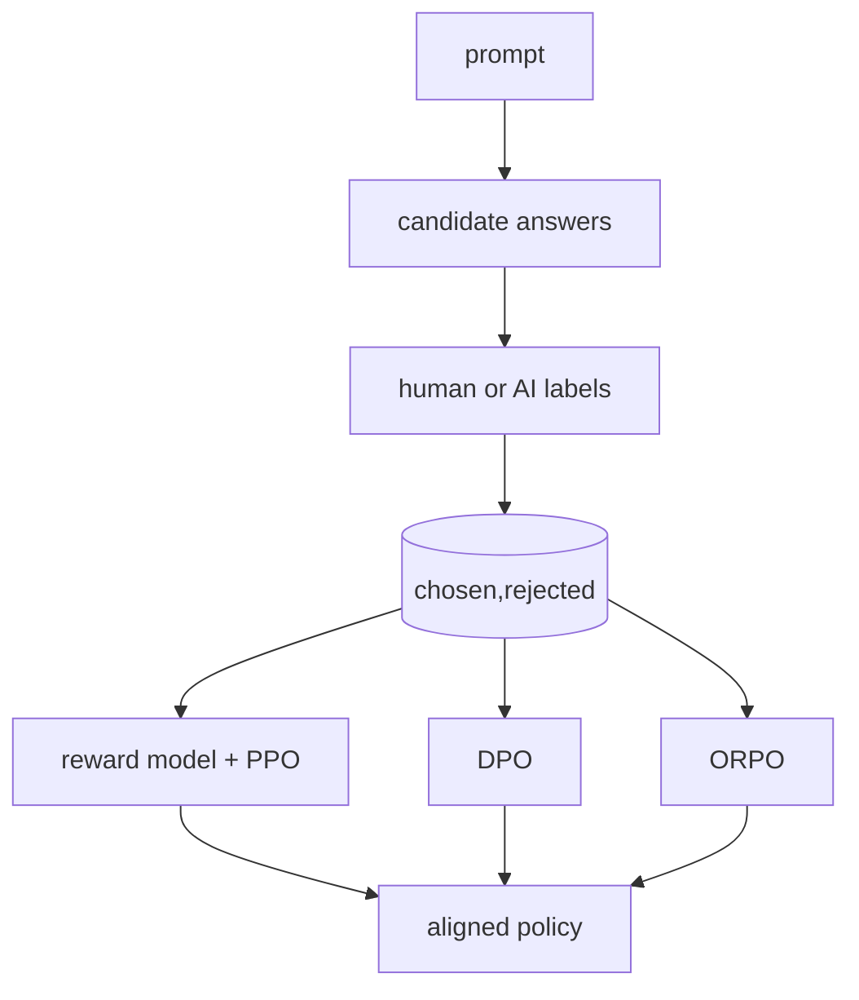

# Preference Optimization (RLHF, RLAIF, DPO, ORPO)

> Topic package — Domain 7 · Roadmap Week 18.
> Depth goal: compare RLHF, RLAIF, DPO, and ORPO; implement DPO loss; collect preference data; and avoid reward hacking.

## Source
- Track: LLM Engineering (self-directed, FDE roadmap)
- Slide deck: `07 Resources Library/LLM Engineering/Slides/Lesson_41_Preference_Optimization.pptx`
- Hands-on notebook: `07 Resources Library/LLM Engineering/Notebooks/41_Preference_Optimization.ipynb` (runs offline)
- Reference reading: Christiano et al. human preferences; Ouyang et al. InstructGPT (arXiv:2203.02155); Rafailov et al. DPO (arXiv:2305.18290); Hong et al. ORPO (arXiv:2403.07691); Anthropic Constitutional AI and RLAIF
- Builds on: [[02 Literature Notes/LLM Engineering/Supervised Fine-Tuning]] · [[02 Literature Notes/LLM Engineering/LLM-as-Judge]]
- Date: 2026-07-18

---

## 1. Mental Model

**SFT teaches imitation; preference optimization teaches judgment.** Instead of only showing a good answer, you show a chosen answer and a rejected answer for the same prompt.

RLHF routes comparisons through a reward model and PPO. DPO directly increases the policy likelihood margin for chosen over rejected relative to a frozen reference. ORPO combines supervised and preference terms.

> Key intuition: **preferences train taste** — they rank plausible completions.



---

## 2. How It Actually Works

### 7.1 Preference data
The data unit is `(prompt, chosen, rejected)`. Labels must follow a rubric for helpfulness, correctness, safety, style, or task success; otherwise the model learns inconsistent annotator taste.

### 7.2 RLHF
Classic RLHF uses SFT, trains a reward model from comparisons, then optimizes the policy with PPO while penalizing KL divergence from a reference model.

### 7.3 RLAIF
RLAIF replaces or augments human labels with AI judges or constitutional rules. It scales labeling but inherits judge blind spots, so audits and human spot checks remain necessary.

### 7.4 DPO
DPO directly optimizes pairwise preferences without a separate reward model: $$-\log\sigma(β[(\logπ_θ^+-\logπ_θ^-)-(\logπ_ref^+-\logπ_ref^-)])$$.

### 7.5 ORPO and reward hacking
ORPO combines supervised learning on chosen responses with an odds-ratio preference term. All preference methods can reward-hack proxies: verbosity, flattery, evasions, or judge-specific tricks.

---

## 3. Implementation

Assumed stack: numpy. Snippets implement DPO loss and preference pair checks.
- [[04 Code Snippets/LLM/DPO Loss on Toy Log Probabilities]]
- [[04 Code Snippets/LLM/Preference Pair Quality Checks]]

### DPO Loss on Toy Log Probabilities
Compute direct preference optimization loss.
```python
import numpy as np
def dpo_loss(pc,pr,rc,rr,beta=.1):
    z=beta*((pc-pr)-(rc-rr))
    return float(np.logaddexp(0,-z))
print(round(dpo_loss(-8,-9.5,-8.5,-9,.5),3))
```

### Preference Pair Quality Checks
Flag duplicate or low-signal chosen/rejected pairs.
```python
pairs=[("good","good"),("cites policy","invents guarantee")]
for c,r in pairs: print(c==r, abs(len(c)-len(r)))
```

---

## 4. Design Decisions & Tradeoffs

| Decision | Guidance |
|---|---|
| **RLHF vs DPO** | Use DPO for simpler stable pairwise optimization; PPO when rewards are complex or online. |
| **Human vs AI labels** | Use humans for rubrics and audits; RLAIF for scale. |
| **Reference control** | Keep a reference/KL anchor to prevent drift. |
| **Beta/KL** | Higher pressure increases preference movement and hacking risk. |
| **Rubric** | Write explicit preference criteria before labeling. |
| **Metrics** | Track win rate plus correctness, safety, verbosity, and regressions. |

---

## 5. Failure Modes & Gotchas

- Preference labels reward verbosity instead of correctness.
- Ambiguous pairs create noisy gradients.
- No reference/KL control lets the policy exploit proxies.
- AI judges without audits encode blind spots.
- Win rate improves while task success falls.
- Rubric-free labeling creates inconsistent values.

---

## 6. FDE Angle

- Use preference optimization after SFT when answers are plausible but not consistently preferred.
- The artifact is a comparison dataset plus rubric.
- DPO is often the pragmatic default because it avoids PPO complexity.
- Reward hacking is a product risk requiring adversarial evals.

---

## 7. Self-Check

1. What are RLHF stages?
2. How does DPO avoid a reward model?
3. Why keep a reference model?
4. What can go wrong with RLAIF?
5. Name reward hacking examples.
6. How does ORPO differ?

## 8. Links
- Domain MOC: [[06 Maps of Content/LLM Engineering Concepts]]
- Code: [[04 Code Snippets/LLM/DPO Loss on Toy Log Probabilities]], [[04 Code Snippets/LLM/Preference Pair Quality Checks]]
- Distilled: [[03 Permanent Notes/Preference Optimization Teaches Relative Judgment]], [[03 Permanent Notes/Reward Models Are Proxies That Can Be Hacked]]
- Upstream: [[02 Literature Notes/LLM Engineering/Supervised Fine-Tuning]] · Downstream: [[02 Literature Notes/LLM Engineering/Distillation and Small Models]]
