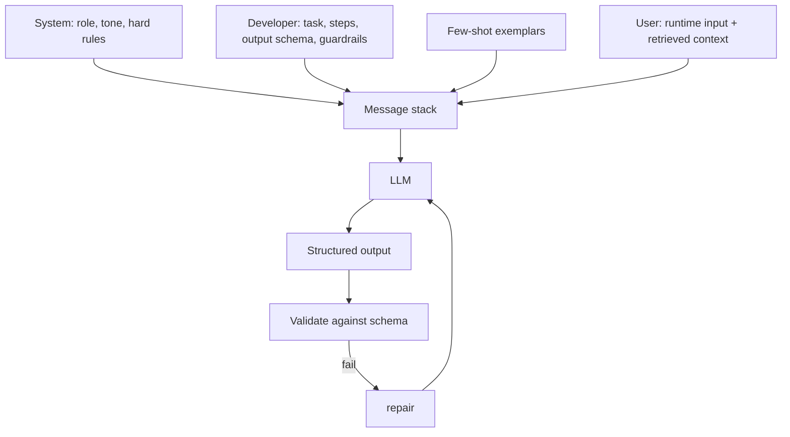

# Prompt Contracts

> Topic package — Domain 3 · Roadmap Week 15.
> Depth goal: design a prompt as a versioned contract — system/developer/user roles, output schema, few-shot examples, and guardrails — that returns predictable structured output.

## Source
- Track: LLM Engineering (self-directed, FDE roadmap)
- Slide deck: `07 Resources Library/LLM Engineering/Slides/Lesson_13_Prompt_Contracts.pptx`
- Hands-on notebook: `07 Resources Library/LLM Engineering/Notebooks/13_Prompt_Contracts.ipynb` (runs offline)
- Reference reading: OpenAI prompt engineering + message-roles docs; Anthropic prompt engineering guide; Google/DeepMind prompting guide; 'The Prompt Report' (Schulhoff et al., arXiv:2406.06608); DSPy (programmatic prompting)
- Builds on: [[02 Literature Notes/LLM Engineering/Structured Generation]]
- Date: 2026-07-18

---

## 1. Mental Model

**A production prompt is not a sentence you tweak — it's a contract between your system and the model, with defined inputs, outputs, and behavior.** Just like an API contract specifies request/response shapes and error handling, a prompt contract specifies: the role/persona (system), the task and rules (developer), the runtime data (user), the exact output schema, few-shot exemplars, and guardrails for edge cases.

The shift is from 'prompt engineering as tinkering' to 'prompt engineering as interface design': the prompt has a stable structure, is versioned, and its behavior is testable. When the contract is explicit, the output is predictable enough to build software on.

> Key intuition: **write prompts like you write API specs.** Separate roles, pin the output schema, show examples, handle the edge cases explicitly — then the model behaves like a component, not a slot machine.



---

## 2. How It Actually Works

### 3.1 The message roles
Modern chat APIs separate concerns into roles, and the contract should use them deliberately:
- **System**: stable identity, tone, and non-negotiable rules ("You are a support triage assistant. Never invent policy.").
- **Developer** (or top of system): the task specification — steps, output schema, constraints.
- **User**: the runtime input plus any retrieved context.
- **Assistant**: prior turns / few-shot completions.
Keeping durable rules in system and volatile data in user is what makes the contract reusable across requests.

### 3.2 Pin the output schema
State the exact output format and make it machine-checkable — ideally JSON matching a schema (ties to Structured Generation). Describe every field, its type, and what to do when data is missing (e.g., `null`, not a guess). A contract whose output you can `json.loads` and validate is worth ten clever prose prompts.

### 3.3 Few-shot exemplars
Examples teach format and edge-case handling better than description. Include 2-5 diverse exemplars covering the tricky cases (empty input, ambiguous input, the 'refuse' case). Order and consistency matter; keep exemplars in sync with the schema. Few-shot is how you encode 'do it like this' without fine-tuning.

### 3.4 Guardrails and refusal paths
A contract must specify behavior for the unhappy path: what to do with out-of-scope requests, missing context, or low confidence. Give the model an explicit escape hatch (`{"answer": null, "reason": "insufficient context"}`) so it doesn't hallucinate to satisfy the format. This is the single biggest lever on groundedness in RAG.

### 3.5 Delimiters, precedence, and injection
Wrap untrusted/retrieved content in clear delimiters and tell the model that content is *data, not instructions*. Establish precedence (system > developer > user) so a user/document can't override your rules. This is the first line of defense against prompt injection (covered fully in Security).

---

## 3. Implementation

Assumed stack: stdlib — a prompt-contract builder + a validation gate that any model call flows through. Snippets:
- [[04 Code Snippets/LLM/A Reusable Prompt Contract Builder]]
- [[04 Code Snippets/LLM/Prompt Contract Validation Gate]]

### A Reusable Prompt Contract Builder
Assemble a role-structured message list from a stable contract + runtime input.
```python
from dataclasses import dataclass, field

@dataclass
class PromptContract:
    system: str
    task: str
    schema: str                      # description of required JSON
    examples: list = field(default_factory=list)   # (input, output) pairs
    refusal: str = 'If context is insufficient, return {"answer": null}.'

    def build(self, user_input, context=""):
        msgs = [{"role": "system", "content": self.system}]
        dev = f"TASK:\n{self.task}\n\nOUTPUT SCHEMA:\n{self.schema}\n\nRULES:\n{self.refusal}"
        msgs.append({"role": "system", "content": dev})
        for ex_in, ex_out in self.examples:                 # few-shot
            msgs.append({"role": "user", "content": ex_in})
            msgs.append({"role": "assistant", "content": ex_out})
        content = user_input if not context else (
            f"<context>\n{context}\n</context>\n\nQUESTION: {user_input}")
        msgs.append({"role": "user", "content": content})
        return msgs

c = PromptContract(
    system="You are a precise invoice extractor. Output only JSON.",
    task="Extract vendor and total from the invoice text.",
    schema='{"vendor": string, "total": number}',
    examples=[("Acme, $12", '{"vendor": "Acme", "total": 12}')])
for m in c.build("BobCo billed $99"): print(m["role"], "->", m["content"][:50])
```

### Prompt Contract Validation Gate
Every model response passes through schema validation; failures trigger repair.
```python
import json

def gate(response: str, required: dict):
    # required: {field: type}; enforces the output half of the contract
    data = json.loads(response)
    for field, typ in required.items():
        if field not in data:
            raise ValueError(f"missing field: {field}")
        if data[field] is not None and not isinstance(data[field], typ):
            raise ValueError(f"{field} must be {typ.__name__}")
    return data

REQUIRED = {"vendor": str, "total": (int, float)}
print(gate('{"vendor": "Acme", "total": 12}', REQUIRED))     # ok
try:
    gate('{"vendor": "Acme"}', REQUIRED)                       # missing total
except ValueError as e:
    print("rejected:", e)
```

---

## 4. Design Decisions & Tradeoffs

| Decision | Guidance |
|---|---|
| **Rules placement** | Durable rules in system; runtime data in user. Never mix — it breaks reuse and invites injection. |
| **Output format** | Pin a JSON schema and validate; prose output only for human-facing final text. |
| **Few-shot count** | 2-5 diverse exemplars covering edge/refusal cases; more isn't always better (cost + overfitting to format). |
| **Refusal path** | Always give an explicit 'insufficient context' output to prevent format-driven hallucination. |
| **Untrusted content** | Delimit and label retrieved/user content as data; assert precedence. |
| **Programmatic prompting** | For complex pipelines consider DSPy-style optimization over hand-tuning. |

---

## 5. Failure Modes & Gotchas

- Cramming rules + data + examples into one giant user string → unmaintainable, injectable, non-reusable.
- No output schema → downstream parsing breaks intermittently.
- No refusal path → the model fabricates to satisfy the format ('answer the question no matter what').
- Few-shot examples that drift from the current schema → contradictory signals.
- Treating retrieved documents as instructions → indirect prompt injection.
- Editing the prompt in production with no version/test → silent regressions.

---

## 6. FDE Angle

- This is Week 15's core: 'prompting should be treated like an API contract.' It's what makes AI output integrable and testable.
- A written contract is a client deliverable — it documents exactly how the AI behaves and where it refuses.
- Roles + refusal path is your first, cheapest lever on hallucination and injection before you add heavier guardrails.
- Deliverable: a versioned prompt contract (system/dev/user + schema + few-shot + refusal) with a validation gate.

---

## 7. Self-Check

1. What goes in system vs user, and why does the split matter?
2. Why pin an output schema, and how do you validate it?
3. What does an explicit refusal path prevent?
4. How do delimiters and precedence defend against injection?
5. How would you version and test a prompt contract?

## 8. Links
- Domain MOC: [[06 Maps of Content/LLM Engineering Concepts]]
- Code: [[04 Code Snippets/LLM/A Reusable Prompt Contract Builder]], [[04 Code Snippets/LLM/Prompt Contract Validation Gate]]
- Distilled: [[03 Permanent Notes/A Prompt Is an API Contract Not a Sentence]], [[03 Permanent Notes/Always Give the Model a Refusal Path]]
- Upstream: [[02 Literature Notes/LLM Engineering/Structured Generation]] · Downstream: [[02 Literature Notes/LLM Engineering/Prompt Versioning]]
