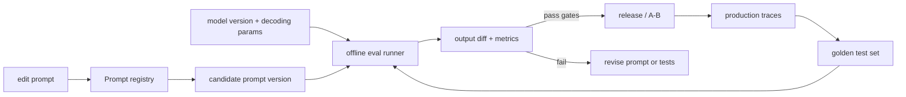

# Prompt Versioning & Regression Testing

> Topic package — Domain 3 · Roadmap Week 15.
> Depth goal: operate prompts like production code — version them semantically, store them in a registry, regression-test them against golden cases, and safely roll prompt/model changes through CI and A/B evaluation.

## Source
- Track: LLM Engineering (self-directed, FDE roadmap)
- Slide deck: `07 Resources Library/LLM Engineering/Slides/Lesson_14_Prompt_Versioning.pptx`
- Hands-on notebook: `07 Resources Library/LLM Engineering/Notebooks/14_Prompt_Versioning.ipynb` (runs offline)
- Reference reading: promptfoo docs (LLM evals and prompt regression testing); LangSmith and Langfuse prompt management; DSPy (programmatic prompt optimization); 'prompts are code' production practices; OpenAI and Anthropic model versioning guidance
- Builds on: [[02 Literature Notes/LLM Engineering/Prompt Contracts]]
- Date: 2026-07-18

---

## 1. Mental Model

**A prompt is a deployable artifact, not a sticky note in the codebase — every production prompt needs a version, test suite, and release process.** Once a prompt controls user-facing behavior, changing a word can be equivalent to changing application logic: it can break JSON, shift tone, leak policy, increase refusals, or silently degrade accuracy.

Versioning turns prompt changes from folklore into engineering. A registry records the prompt text, parameters, model pin, owner, changelog, expected schema, and eval set. Regression tests compare candidate behavior against golden examples before the new prompt is allowed into production.

> Key intuition: **prompt changes are code changes with probabilistic outputs.** Use semantic versions to communicate intent, golden tests to catch regressions, and model+prompt pinning so you can reproduce yesterday's behavior tomorrow.



---

## 2. How It Actually Works

### 3.1 Prompts deserve semantic versions
Semantic versioning is a communication contract for behavior:
- **PATCH** (`1.2.3 -> 1.2.4`): typo, formatting clarification, no intended behavior change.
- **MINOR** (`1.2 -> 1.3`): improved behavior for existing inputs, compatible schema.
- **MAJOR** (`1.x -> 2.0`): output schema, task boundary, refusal policy, or tool contract changes.

Because outputs are probabilistic, semver is about *intended compatibility* plus measured regression risk, not mathematical guarantees.

### 3.2 The prompt registry is the source of truth
A registry should store more than a text blob: prompt id, semver, system/developer/user template, schema, examples, owner, changelog, linked model version, decoding params, eval set id, and rollout state. LangSmith/Langfuse-style prompt management exists because the worst production prompt is the one pasted into three services with no provenance.

### 3.3 Golden tests turn taste into gates
A golden set is a curated suite of inputs with expected properties: exact JSON fields, rubric scores, required citations, forbidden claims, or canonical labels. It should include normal cases, adversarial cases, null-context cases, and prior incidents. The test set is never 'complete'; it is the living memory of what must not break.

### 3.4 Diff outputs, not just prompt text
Text diffs show *what you changed*; output diffs show *what changed in behavior*. For structured tasks, compute exact-match and schema-valid rates. For generated text, compare rubric scores, embedding-free lexical overlap, policy flags, length, refusal rate, and citation coverage. A simple weighted score is often enough for CI:

$$score = 0.45\,accuracy + 0.25\,schema + 0.20\,grounding - 0.10\,cost$$

### 3.5 Pin prompt and model versions together
A prompt is calibrated to a model, tokenizer, decoding profile, and tool surface. Swapping `gpt-4.1` to `gpt-4.1-2026-05-01` or changing temperature can break a formerly stable prompt. Production traces should record `prompt_id@version`, `model`, `temperature`, tool schema version, and retrieval config so regressions are reproducible.

---

## 3. Implementation

Assumed stack: stdlib — a tiny prompt registry plus a deterministic regression harness that simulates CI without calling real models. Snippets:
- [[04 Code Snippets/LLM/Prompt Registry With Semantic Versions]]
- [[04 Code Snippets/LLM/Golden Prompt Regression Harness]]

### Prompt Registry With Semantic Versions
Store prompts as immutable versioned artifacts with model and eval metadata.
```python
from dataclasses import dataclass

@dataclass(frozen=True)
class PromptVersion:
    prompt_id: str
    version: str
    template: str
    model: str
    temperature: float
    schema: str
    eval_set: str
    changelog: str

class PromptRegistry:
    def __init__(self): self._items = {}
    def publish(self, p: PromptVersion):
        key = (p.prompt_id, p.version)
        if key in self._items: raise ValueError(f"already published: {key}")
        self._items[key] = p
    def get(self, prompt_id, version):
        return self._items[(prompt_id, version)]

reg = PromptRegistry()
reg.publish(PromptVersion("support_triage", "1.2.0", "Classify: {ticket}",
                          "fake-model-2026-07", 0.0, "{label,priority}",
                          "triage_gold_v3", "Add billing edge cases"))
print(reg.get("support_triage", "1.2.0"))
```

### Golden Prompt Regression Harness
Compare two prompt versions over a golden set and fail CI on behavior regressions.
```python
def fake_model(prompt_version, case):
    text = case["input"].lower()
    if "refund" in text or "invoice" in text: label = "billing"
    elif "error" in text or "crash" in text: label = "bug"
    else: label = "other"
    if prompt_version.endswith("bad") and "refund" in text: label = "other"
    return {"label": label}

def run_regression(version, golden):
    rows, ok = [], 0
    for case in golden:
        pred = fake_model(version, case)
        passed = pred["label"] == case["expected"]
        ok += int(passed); rows.append((case["id"], passed, pred["label"], case["expected"]))
    return ok / len(golden), rows

golden = [{"id":"g1","input":"Refund my invoice","expected":"billing"},
          {"id":"g2","input":"App crashes with error 500","expected":"bug"}]
score, rows = run_regression("support_triage@1.3.0", golden)
print("score", score, "pass", score >= 0.95, rows)
```

---

## 4. Design Decisions & Tradeoffs

| Decision | Guidance |
|---|---|
| **Version granularity** | Version the prompt contract, not every runtime input. Template, schema, examples, refusal policy, and model pin are release artifacts. |
| **Semver bump** | Patch for wording with no intended behavior change; minor for compatible quality improvements; major for schema/task/refusal/tool changes. |
| **Golden set design** | Use high-signal cases: common paths, edge cases, prior bugs, adversarial examples, and null-context refusals. |
| **Pass gates** | Block release on schema failures, safety regressions, critical case failures, or statistically meaningful score drops. |
| **A/B strategy** | Use offline regression first, then small traffic split with pinned prompt/model versions and production trace labels. |
| **Registry location** | Centralize in a prompt registry or versioned package; never let teams paste divergent prompt strings into services. |

---

## 5. Failure Modes & Gotchas

- Editing a prompt inline in production with no version bump → impossible rollback and no root-cause trail.
- Testing only happy-path examples → the first edge case becomes a production incident.
- Changing the model while keeping the same prompt version → you cannot tell whether the regression was model or prompt.
- Relying on exact text match for long-form answers → false failures; use task-specific rubrics/properties.
- Letting golden tests fossilize bad behavior → review and retire stale expectations.
- A/B testing before offline gates pass → users become your regression suite.

---

## 6. FDE Angle

- Clients trust AI systems more when prompt changes have release notes, owners, and rollback paths.
- A golden set built from real support tickets or analyst tasks is a concrete FDE deliverable.
- Prompt CI gives product teams a safe way to improve behavior without fear of silent regressions.
- Deliverable: a prompt registry entry plus CI report showing old vs new prompt/model performance.

---

## 7. Self-Check

1. What belongs in a prompt registry entry beyond the prompt text?
2. When should a prompt change be major vs minor vs patch?
3. Why must prompt and model versions be pinned together?
4. How would you design a golden set for a support-triage prompt?
5. Why is output diffing more important than prompt-text diffing?
6. What gates should block a prompt release in CI?

## 8. Links
- Domain MOC: [[06 Maps of Content/LLM Engineering Concepts]]
- Code: [[04 Code Snippets/LLM/Prompt Registry With Semantic Versions]], [[04 Code Snippets/LLM/Golden Prompt Regression Harness]]
- Distilled: [[03 Permanent Notes/Prompts Need Semantic Versions]], [[03 Permanent Notes/Prompt Evals Are Regression Tests]]
- Upstream: [[02 Literature Notes/LLM Engineering/Prompt Contracts]] · Downstream: [[02 Literature Notes/LLM Engineering/Reasoning Prompt Patterns]]
