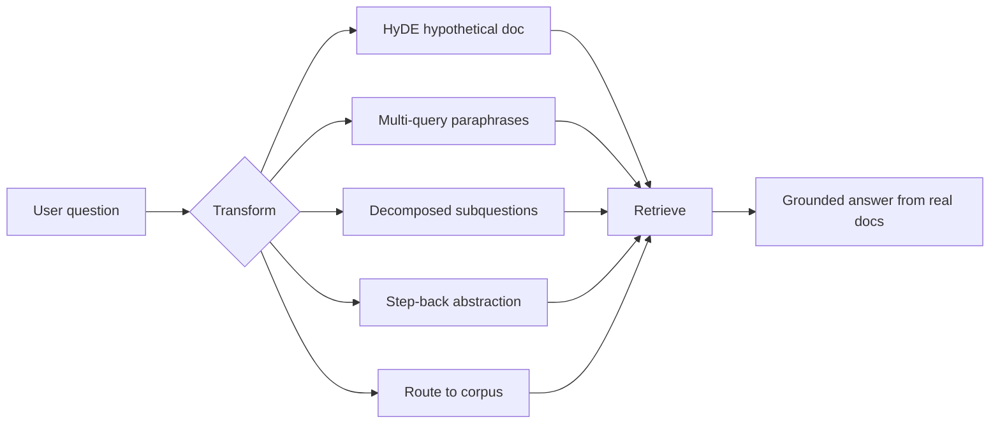

# Query Transformation (HyDE, multi-query, routing)

> Topic package — Domain 4 · Roadmap Week 19.
> Depth goal: implement query transformations that improve retrieval recall and source selection: hypothetical document embeddings, multi-query expansion, decomposition, step-back prompting, and rule/model-based routing.

## Source
- Track: LLM Engineering (self-directed, FDE roadmap)
- Slide deck: `07 Resources Library/LLM Engineering/Slides/Lesson_19_Query_Transformation.pptx`
- Hands-on notebook: `07 Resources Library/LLM Engineering/Notebooks/19_Query_Transformation.ipynb` (runs offline)
- Reference reading: Gao et al. HyDE (arXiv:2212.10496); Zheng et al. Step-Back Prompting (arXiv:2310.06117); LangChain query transformation docs; LlamaIndex query routing and query engine docs
- Builds on: [[02 Literature Notes/LLM Engineering/RAG Pipeline Fundamentals]] · [[02 Literature Notes/LLM Engineering/Advanced Retrieval]] · [[02 Literature Notes/LLM Engineering/Prompt Contracts]]
- Date: 2026-07-18

---

## 1. Mental Model

**Retrieval quality is often limited less by the index than by the query you send to it.** Users ask underspecified, conversational, multi-hop, or vocabulary-mismatched questions; query transformation creates better search probes before hitting the retriever.

Transformations are controlled forms of expansion. HyDE invents a plausible answer document and embeds that; multi-query sends several paraphrases; decomposition turns one hard question into subquestions; step-back asks for the broader principle; routing chooses the right corpus/tool. Each increases recall but can also introduce drift.

> Key intuition: **do not retrieve with the user's raw words when the retrieval problem is really several better search problems.** Transform the query, retrieve broadly, then answer only from real evidence.



---

## 2. How It Actually Works

### 4.1 Why transform queries
Raw user questions are optimized for conversation, not search. They omit nouns from prior context, use synonyms the corpus does not use, pack multiple intents into one sentence, or ask at the wrong abstraction level. Query transformation makes the retrieval request more like the documents you hope to find.

### 4.2 HyDE
Hypothetical Document Embeddings ask an LLM to draft a plausible answer passage, then embed that passage instead of (or alongside) the short query. The generated text may be factually wrong; its purpose is to land near relevant documents in embedding space. The final answer must still be grounded only in retrieved real documents.

### 4.3 Multi-query expansion
Multi-query sends several paraphrases or facet-specific queries and unions/fuses results. It improves recall when corpora use varied terminology. Use deduplication and RRF to merge results; otherwise expansion can flood the reranker with redundant or off-topic candidates.

### 4.4 Decomposition and step-back
Decomposition splits multi-hop questions into answerable subquestions. Step-back prompting asks a more general question first (principles, definitions, policies) and retrieves background context. These are useful when direct retrieval misses because the exact final answer is distributed across documents.

### 4.5 Routing
Routing chooses which source, retriever, or tool to call: policies vs tickets, SQL vs vector, docs vs code, current vs archive. Routing can be rule-based, embedding-based, or LLM-classified, but it must expose confidence and fallback to broad search when uncertain.

---

## 3. Implementation

Assumed stack: stdlib + numpy. Snippets simulate HyDE/multi-query and routing offline. Snippets:
- [[04 Code Snippets/LLM/HyDE and Multi Query Expander]]
- [[04 Code Snippets/LLM/Rule Based Query Router]]

### HyDE and Multi Query Expander
Generate deterministic pseudo-HyDE text and paraphrase probes for broader retrieval.
```python
def hyde(query):
    return f"A technical answer about {query}: definitions, mechanism, tradeoffs, and examples."

def multi_query(query):
    return [query, f"definition and mechanism of {query}", f"failure modes and implementation details for {query}"]

q = "how does MMR improve RAG retrieval"
print("HyDE:", hyde(q))
print("queries:")
for x in multi_query(q): print("-", x)
```

### Rule Based Query Router
Route transformed questions to specialized retrievers with an uncertainty fallback.
```python
ROUTES = {"policy":["refund","compliance","policy"],
          "code":["stacktrace","function","class","api"],
          "metrics":["revenue","count","dashboard","sql"]}

def route(query):
    q = query.lower()
    scores = {name: sum(term in q for term in terms) for name, terms in ROUTES.items()}
    best, score = max(scores.items(), key=lambda x: x[1])
    return best if score else "general"

for q in ["refund policy", "function stacktrace", "monthly revenue", "what is RAG"]:
    print(q, "->", route(q))
```

---

## 4. Design Decisions & Tradeoffs

| Decision | Guidance |
|---|---|
| **Use HyDE** | Good for short/vague semantic queries; avoid when hallucinated details could dominate exact retrieval. |
| **Use multi-query** | Good when terminology varies; fuse and deduplicate aggressively. |
| **Use decomposition** | Use for multi-hop questions where one retrieved chunk cannot answer everything. |
| **Use step-back** | Use when the direct question needs general principles or definitions first. |
| **Routing confidence** | Route only when confident; otherwise search broad or multiple sources. |
| **Answer grounding** | Never answer from generated transformations; only from retrieved real documents. |

---

## 5. Failure Modes & Gotchas

- Letting a HyDE hallucination become evidence in the final answer.
- Generating too many query variants and destroying latency/precision.
- Decomposing simple questions into unnecessary subqueries.
- Routing to one narrow source with no fallback.
- Failing to deduplicate expanded retrieval results.
- Evaluating only final answers and never measuring transformed-query recall.

---

## 6. FDE Angle

- Query transformation is the fastest fix when users and documents use different vocabulary.
- It is also a governance concern: generated search probes must not become cited evidence.
- A good FDE exposes the transformation trace so misses are debuggable.
- Deliverable: a query-planning layer with expansion, routing, fusion, and a fallback policy.

---

## 7. Self-Check

1. Why can HyDE improve embedding retrieval even if its generated text is false?
2. How do multi-query expansion and RRF fit together?
3. When should a question be decomposed?
4. What is step-back prompting retrieving that direct search may miss?
5. How should a router behave when confidence is low?

## 8. Links
- Domain MOC: [[06 Maps of Content/LLM Engineering Concepts]]
- Code: [[04 Code Snippets/LLM/HyDE and Multi Query Expander]], [[04 Code Snippets/LLM/Rule Based Query Router]]
- Distilled: [[03 Permanent Notes/Query Transformation Turns One Bad Search Into Several Better Searches]], [[03 Permanent Notes/Routing Is Retrieval Source Selection Not Answering]]
- Upstream: [[02 Literature Notes/LLM Engineering/Advanced Retrieval]] · Downstream: [[02 Literature Notes/LLM Engineering/GraphRAG]]
