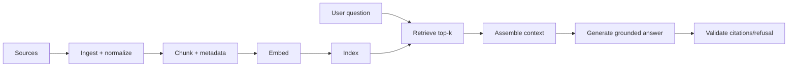

# RAG Pipeline Fundamentals

> Topic package — Domain 4 · Roadmap Weeks 13/17.
> Depth goal: build and reason about a full retrieval-augmented generation pipeline — ingest -> chunk -> embed -> index -> retrieve -> assemble -> generate -> cite — and choose RAG vs fine-tuning vs long-context deliberately.

## Source
- Track: LLM Engineering (self-directed, FDE roadmap)
- Slide deck: `07 Resources Library/LLM Engineering/Slides/Lesson_17_RAG_Pipeline_Fundamentals.pptx`
- Hands-on notebook: `07 Resources Library/LLM Engineering/Notebooks/17_RAG_Pipeline_Fundamentals.ipynb` (runs offline)
- Reference reading: Lewis et al. Retrieval-Augmented Generation (arXiv:2005.11401); Anthropic Contextual Retrieval; Pinecone RAG guide; LlamaIndex RAG docs; LangChain RAG docs
- Builds on: [[02 Literature Notes/LLM Engineering/Vector Search]] · [[02 Literature Notes/LLM Engineering/Embeddings]] · [[02 Literature Notes/LLM Engineering/Prompt Contracts]]
- Date: 2026-07-18

---

## 1. Mental Model

**RAG turns an LLM from a closed-book guesser into an open-book reader with a retrieval system in front of it.** The model still generates language, but the product's knowledge boundary moves from model weights to an external corpus that can be updated, filtered, cited, and evaluated.

A production RAG system is not just 'put top-k chunks in the prompt'. It is a chain of lossy transformations: documents become chunks, chunks become embeddings, indexes approximate nearest neighbors, retrievers select evidence, assemblers spend context budget, and the generator must cite only what it used. Most failures are pipeline failures before they are model failures.

> Key intuition: **retrieve the smallest sufficient evidence set, then make the LLM read it under a citation contract.** RAG quality is bounded by retrieval recall, context assembly, and refusal behavior — not by prompt cleverness alone.



---

## 2. How It Actually Works

### 4.1 The retrieve-then-read pattern
RAG decomposes question answering into two jobs: **retrieval** finds candidate evidence and **reading/generation** synthesizes an answer. This is powerful because the retriever can be cheap, inspectable, and updateable while the LLM handles language and reasoning. The system should refuse when retrieval returns no relevant evidence; otherwise the generator is being asked to answer closed-book.

### 4.2 Ingest, chunk, metadata
Ingestion is where documents are normalized, de-duplicated, permission-tagged, and split into chunks. Chunking is a recall/precision tradeoff: small chunks retrieve precisely but may lack context; large chunks preserve context but dilute embeddings. Metadata (source, date, owner, ACL, section path) is not bookkeeping — it enables filtering, citations, freshness, and deletion.

### 4.3 Embeddings and indexes
Embedding maps text into vectors where semantic neighbors are close. The index (FAISS/HNSW/vector DB) makes nearest-neighbor search fast. Embeddings are not truth detectors: they optimize similarity, not answerability. Store both the vector and enough raw text/metadata to support later citation and re-ranking.

### 4.4 Context assembly and citation contracts
The assembler decides which retrieved chunks fit in the prompt, how to order them, and how to label them. Use stable chunk IDs and source labels; require the answer to cite those IDs. A good contract says: answer only from context, cite every factual claim, and return `insufficient_context` when evidence is missing.

### 4.5 RAG vs fine-tuning vs long-context
Use **RAG** for changing/private/factual knowledge with citations. Use **fine-tuning** for behavior, style, format, or domain skill that should live in weights. Use **long-context** when the working set is small enough to pass directly and retrieval would risk dropping key evidence. These are complements: many systems use RAG plus a tuned model and long-context windows.

---

## 3. Implementation

Assumed stack: stdlib + numpy. Snippets implement a deterministic offline mini-RAG and a citation-aware assembler. Snippets:
- [[04 Code Snippets/LLM/Offline Mini RAG Pipeline]]
- [[04 Code Snippets/LLM/Citation Aware Context Assembler]]

### Offline Mini RAG Pipeline
A tiny deterministic RAG pipeline: chunk, embed, retrieve, assemble, and answer from evidence.
```python
import hashlib, numpy as np

def embed(text, dim=32):
    v = np.zeros(dim)
    for tok in text.lower().split():
        h = int(hashlib.md5(tok.encode()).hexdigest(), 16)
        v[h % dim] += 1.0
    return v / (np.linalg.norm(v) + 1e-9)

docs = {"d1":"RAG retrieves external evidence before generation.",
        "d2":"Fine-tuning changes model behavior and style.",
        "d3":"Citations bind generated claims to retrieved chunks."}
index = [(k, text, embed(text)) for k, text in docs.items()]

def retrieve(question, k=2):
    q = embed(question)
    scored = [(float(q @ vec), doc_id, text) for doc_id, text, vec in index]
    return sorted(scored, reverse=True)[:k]

def answer(question):
    hits = retrieve(question)
    evidence = "\n".join(f"[{doc_id}] {text}" for _, doc_id, text in hits)
    return f"Context:\n{evidence}\n\nAnswer: use retrieved evidence and cite chunk ids."

print(answer("Why use citations in RAG?"))
```

### Citation Aware Context Assembler
Pack retrieved chunks into a bounded context with stable source labels for grounded generation.
```python
def assemble(hits, max_chars=220):
    blocks, used = [], 0
    for score, chunk_id, text in hits:
        block = f"[{chunk_id} score={score:.2f}] {text}"
        if used + len(block) > max_chars:
            continue
        blocks.append(block); used += len(block)
    instructions = "Answer only from context. Cite chunk ids like [d1]. Refuse if missing."
    return instructions + "\n\n<context>\n" + "\n".join(blocks) + "\n</context>"

hits = [(0.91, "policy-7", "Refunds require a receipt within 30 days."),
        (0.63, "policy-2", "Store credit may be issued after 30 days.")]
print(assemble(hits))
```

---

## 4. Design Decisions & Tradeoffs

| Decision | Guidance |
|---|---|
| **Chunk size** | Start around paragraph/section boundaries; tune by recall and answer faithfulness, not aesthetics. |
| **Top-k** | Retrieve generously enough for recall, then compress/rerank; too small hides evidence, too large distracts. |
| **Metadata** | Store source, section, timestamp, ACL, and version; future filtering/citation depends on it. |
| **Generation contract** | Answer only from context, cite chunk IDs, and refuse when evidence is insufficient. |
| **RAG vs fine-tune** | RAG for knowledge; fine-tune for behavior/style; long-context for small bounded corpora. |
| **Freshness** | Plan re-indexing, deletion, and document versioning from day one. |

---

## 5. Failure Modes & Gotchas

- Chunking by fixed characters that splits tables, headings, or code blocks.
- No document IDs in the prompt, making citations impossible to verify.
- Treating top semantic match as proof of answerability.
- Stuffing too many chunks into context until the model ignores the key evidence.
- Skipping ACL/metadata filters and leaking private documents.
- Using RAG when the requirement is behavioral consistency that fine-tuning would solve better.

---

## 6. FDE Angle

- RAG is the default enterprise LLM architecture because knowledge changes faster than model weights.
- The FDE deliverable is a traceable pipeline: question -> retrieved chunks -> cited answer -> logs/eval.
- Stakeholders trust cited answers more than fluent answers; citations are product UX, not decoration.
- Most RAG debugging is data plumbing: chunk boundaries, filters, stale indexes, and missing refusal paths.

---

## 7. Self-Check

1. List every stage from ingest to cited answer.
2. Why does chunking affect both recall and faithfulness?
3. What must be stored in metadata for citations and permissions?
4. When would you choose fine-tuning instead of RAG?
5. What should the generator do when retrieval evidence is weak?

## 8. Links
- Domain MOC: [[06 Maps of Content/LLM Engineering Concepts]]
- Code: [[04 Code Snippets/LLM/Offline Mini RAG Pipeline]], [[04 Code Snippets/LLM/Citation Aware Context Assembler]]
- Distilled: [[03 Permanent Notes/RAG Is Retrieve Then Read With a Citation Contract]], [[03 Permanent Notes/RAG Fine Tuning and Long Context Solve Different Problems]]
- Upstream: [[02 Literature Notes/LLM Engineering/Vector Search]] · Downstream: [[02 Literature Notes/LLM Engineering/Advanced Retrieval]]
