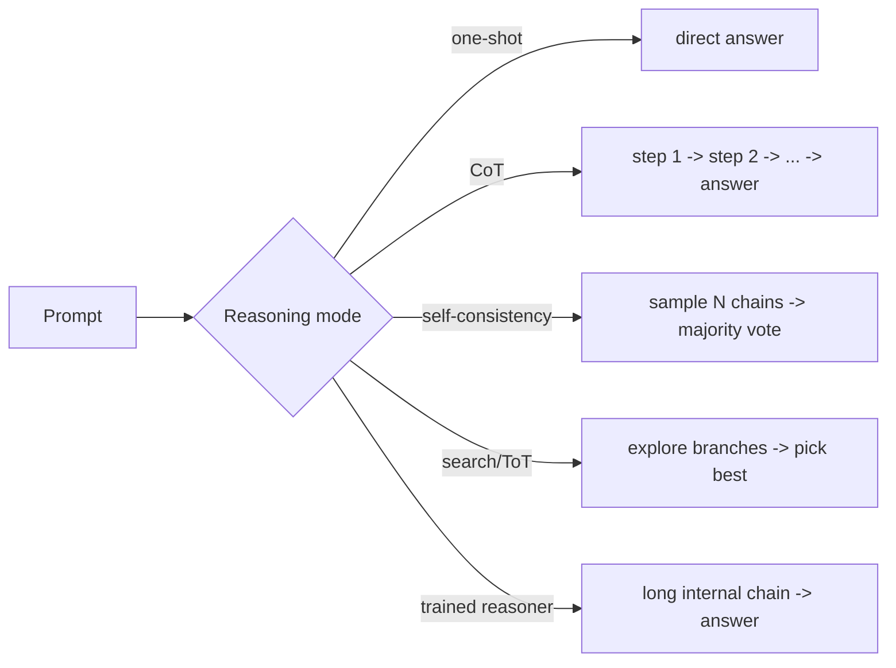

# Reasoning Models & Test-Time Compute

> Topic package — Domain 2 · Roadmap Weeks 11/16.
> Depth goal: understand what 'reasoning models' actually are, how test-time compute (CoT, self-consistency, search) buys accuracy, and when it's worth the cost.

## Source
- Track: LLM Engineering (self-directed, FDE roadmap)
- Slide deck: `07 Resources Library/LLM Engineering/Slides/Lesson_12_Reasoning_Models.pptx`
- Hands-on notebook: `07 Resources Library/LLM Engineering/Notebooks/12_Reasoning_Models.ipynb` (runs offline)
- Reference reading: Wei et al. 'Chain-of-Thought Prompting' (arXiv:2201.11903); Wang et al. 'Self-Consistency' (arXiv:2203.11171); OpenAI o1/o3 system cards; DeepSeek-R1 (arXiv:2501.12948); Snell et al. 'Scaling test-time compute'; Yao 'Tree of Thoughts'
- Builds on: [[02 Literature Notes/LLM Engineering/Decoding and Sampling]]
- Date: 2026-07-18

---

## 1. Mental Model

**Reasoning models trade inference-time compute for accuracy: instead of answering in one shot, they 'think' — generating intermediate steps — before committing.** A standard LLM maps prompt → answer in a single forward pass budget. A reasoning approach spends *more tokens/compute at inference* to search over or unfold a solution, which reliably improves hard, multi-step tasks (math, code, planning).

Two ways to get it:
1. **Prompted reasoning** — chain-of-thought, self-consistency, tree-of-thoughts on a normal model. Cheap to adopt, works today.
2. **Trained reasoners** — models RL-trained to produce long internal chains before answering (o1/o3, DeepSeek-R1). The 'thinking' is learned, often hidden, and much stronger.

> Key intuition: **more thinking time = more accuracy, up to a point.** Test-time compute is a *dial* you can trade against latency and cost — the newest scaling axis beyond just bigger models.



---

## 2. How It Actually Works

### 2.1 Chain-of-thought (CoT)
Prompting the model to 'think step by step' makes it emit intermediate reasoning before the final answer. This dramatically improves multi-step arithmetic/logic because each step conditions the next (the model can offload working memory into the token stream). Zero-shot CoT ('Let's think step by step') and few-shot CoT (worked examples) are the base techniques.

### 2.2 Self-consistency
Instead of one greedy chain, **sample many CoT chains** (temperature>0) and take the **majority-vote answer**. Different reasoning paths that converge on the same answer are more likely correct. It trades N× compute for a solid accuracy bump on reasoning benchmarks — a clean example of spending test-time compute.

### 2.3 Search: tree-of-thoughts & beam over reasoning
Generalize CoT from a single chain to a **tree**: generate multiple candidate next-steps, score/evaluate them (self-eval or a verifier), and expand the promising branches (BFS/DFS/beam). More expensive, but strong on puzzles/planning where you must backtrack. This is explicit search over reasoning states.

### 2.4 Trained reasoning models (o1/R1)
The frontier shift: **RL-train the model to reason**. Using outcome rewards (did it get the right answer?) and long CoT, models learn to plan, check, and backtrack internally, producing very long 'thinking' traces before a concise answer. o1/o3 and DeepSeek-R1 show large gains on math/code. The reasoning tokens are compute you pay for (and often can't see), and quality scales with how long the model is allowed to think.

### 2.5 Test-time compute scaling & when it's worth it
Recent results: for a fixed model, *spending more inference compute* (longer chains, more samples, search+verifier) can beat using a much larger model. But it's not free — latency and token cost rise, and easy tasks get no benefit (sometimes worse). The skill is **matching compute to difficulty**: cheap one-shot for easy calls, reasoning for the hard minority.

---

## 3. Implementation

Assumed stack: `numpy`/stdlib to simulate self-consistency and a compute-vs-accuracy tradeoff. Snippets:
- [[04 Code Snippets/LLM/Self-Consistency Majority Vote]]
- [[04 Code Snippets/LLM/Match Test-Time Compute to Difficulty]]

### Self-Consistency Majority Vote
Sample N reasoning chains and majority-vote the final answer.
```python
from collections import Counter

def self_consistency(reason_once, prompt, n=5):
    # reason_once(prompt) -> (chain_text, final_answer)
    answers = []
    for _ in range(n):
        _, ans = reason_once(prompt)
        answers.append(ans)
    vote = Counter(answers).most_common(1)[0]
    return vote[0], vote[1] / n            # answer, agreement fraction

# demo: a noisy 'reasoner' right 60% of the time
import random; random.seed(0)
def noisy_reasoner(prompt):
    ans = 42 if random.random() < 0.6 else random.choice([41, 43, 44])
    return "...steps...", ans

ans, agree = self_consistency(noisy_reasoner, "what is 6*7?", n=15)
print(f"majority answer={ans}  agreement={agree:.0%}")   # majority recovers 42
```

### Match Test-Time Compute to Difficulty
Route easy queries to one-shot, hard queries to expensive reasoning — a cost gate.
```python
def solve(query, difficulty_fn, cheap_solve, reason_solve, threshold=0.5):
    d = difficulty_fn(query)               # 0..1 estimated difficulty
    if d < threshold:
        return cheap_solve(query), "cheap-1shot", 1
    return reason_solve(query), "reasoning", 10   # ~10x tokens

def difficulty(q):    # toy: longer / has 'prove'/'why' -> harder
    hard = any(w in q.lower() for w in ("prove", "why", "derive", "plan"))
    return 0.9 if hard else 0.2

cheap = lambda q: "quick answer"
reason = lambda q: "answer after long chain-of-thought"
for q in ["What is the capital of France?", "Prove sqrt(2) is irrational"]:
    ans, mode, cost = solve(q, difficulty, cheap, reason)
    print(f"[{mode:>10} cost~{cost:>2}x] {q}")
```

---

## 4. Design Decisions & Tradeoffs

| Decision | Guidance |
|---|---|
| **Easy / factual queries** | One-shot, temperature=0. Reasoning adds cost and can hurt. |
| **Hard multi-step (math, code, planning)** | CoT at minimum; self-consistency or a trained reasoner for the hardest. |
| **Need verifiable answers** | Search + a verifier/self-eval, or self-consistency voting. |
| **Prompted vs trained reasoner** | Prompted CoT works on any model today; trained reasoners (o1/R1) are stronger but pricier/slower. |
| **Budget-bound** | Route by estimated difficulty; don't pay reasoning cost on the easy majority. |
| **Latency-sensitive UX** | Reasoning traces add seconds; stream or pre-compute, or cap thinking length. |

---

## 5. Failure Modes & Gotchas

- Using a reasoning model for everything → high latency and token bills on trivial calls.
- Trusting a fluent CoT as proof of correctness → the chain can be plausible but wrong (unfaithful reasoning).
- Self-consistency with temperature=0 → all chains identical, no benefit; you need diverse samples.
- Exposing hidden reasoning tokens to users or logs when the provider forbids it.
- Assuming more thinking always helps → easy tasks plateau or regress; match compute to difficulty.
- Ignoring that reasoning tokens count as (often billed) output.

---

## 6. FDE Angle

- Test-time compute is a cost/accuracy dial you can present to clients: 'we can be 8% more accurate on hard tickets for 10× the tokens on that 5% of traffic.'
- Difficulty-routing (cheap model for easy, reasoner for hard) is a concrete cost-architecture pattern.
- You can explain why an o1-style model is slow/expensive and when it's justified vs a RAG+CoT pipeline.
- Deliverable: a routing policy that reserves expensive reasoning for queries that actually need it, with measured accuracy/cost.

---

## 7. Self-Check

1. Why does chain-of-thought help multi-step tasks?
2. How does self-consistency turn compute into accuracy, and why does it need temperature>0?
3. What's the difference between prompted reasoning and a trained reasoning model?
4. When does spending more test-time compute NOT help?
5. Design a difficulty-routing policy; what do you measure to tune the threshold?

## 8. Links
- Domain MOC: [[06 Maps of Content/LLM Engineering Concepts]]
- Code: [[04 Code Snippets/LLM/Self-Consistency Majority Vote]], [[04 Code Snippets/LLM/Match Test-Time Compute to Difficulty]]
- Distilled: [[03 Permanent Notes/Test-Time Compute Is a New Scaling Axis]], [[03 Permanent Notes/Match Compute to Difficulty]]
- Upstream: [[02 Literature Notes/LLM Engineering/Decoding and Sampling]] · Related: [[02 Literature Notes/LLM Engineering/Reasoning Prompt Patterns]]
