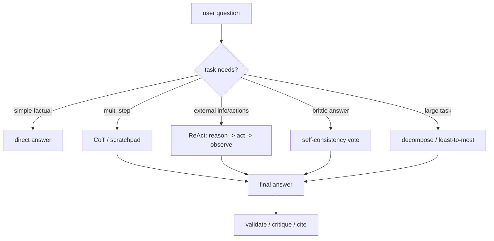

# Reasoning Prompt Patterns (CoT, ReAct, self-consistency)

> Topic package — Domain 3 · Roadmap Week 15.
> Depth goal: choose and implement reasoning prompt patterns deliberately: zero/few-shot CoT, ReAct, self-consistency, self-refine/reflexion, least-to-most, decomposition, and plan-then-execute, with clear tradeoffs around cost, latency, tool use, and faithfulness.

## Source
- Track: LLM Engineering (self-directed, FDE roadmap)
- Slide deck: `07 Resources Library/LLM Engineering/Slides/Lesson_15_Reasoning_Prompt_Patterns.pptx`
- Hands-on notebook: `07 Resources Library/LLM Engineering/Notebooks/15_Reasoning_Prompt_Patterns.ipynb` (runs offline)
- Reference reading: Wei et al. Chain-of-Thought Prompting (arXiv:2201.11903); Yao et al. ReAct (arXiv:2210.03629); Wang et al. Self-Consistency (arXiv:2203.11171); Shinn et al. Reflexion; Zhou et al. Least-to-Most Prompting; Anthropic and OpenAI reasoning prompt guidance
- Builds on: [[02 Literature Notes/LLM Engineering/Prompt Versioning]]
- Date: 2026-07-18

---

## 1. Mental Model

**Reasoning prompt patterns are control-flow templates for spending more computation on harder tasks.** A plain prompt asks for an answer in one pass; a reasoning pattern structures intermediate work: think step-by-step, decompose the problem, call tools, sample multiple paths, critique the result, or execute a plan.

The patterns are not magic. They trade tokens, latency, and sometimes privacy for better search through the model's latent solution space. They help most when the task requires multi-step inference, tool grounding, or brittle arithmetic/logical decisions; they help least when the model already knows a direct answer or when hidden reasoning becomes unfaithful post-hoc rationalization.

> Key intuition: **reasoning prompts are compute-allocation strategies.** Use CoT for multi-step inference, ReAct when the model must inspect the world with tools, self-consistency when one path is unreliable, and decomposition when the task is too large for one pass.



---

## 2. How It Actually Works

### 3.1 Chain-of-thought and scratchpads
Chain-of-thought (CoT) prompts encourage intermediate reasoning, often improving arithmetic, symbolic, and multi-hop tasks. In production, prefer a **private scratchpad + concise final answer** pattern rather than exposing raw reasoning. Few-shot CoT examples can teach the style; zero-shot phrases like 'think step by step' are weaker but cheap. The caveat: the displayed rationale can be unfaithful — a plausible explanation does not prove the model actually used it.

### 3.2 ReAct interleaves reasoning and tools
ReAct structures an agent loop: **Thought → Action → Observation → Thought → ... → Final**. It is useful when the answer depends on external state: retrieval, calculators, databases, browsers, or application tools. The prompt pattern must constrain tool names, arguments, stopping rules, and observation handling; otherwise ReAct becomes an expensive hallucination loop.

### 3.3 Self-consistency samples multiple paths
Self-consistency (Wang et al.) samples multiple reasoning traces and chooses the majority or highest-scoring final answer. It improves tasks where one greedy chain is brittle, but cost scales roughly linearly with samples:

$$cost pprox n_{samples} 	imes (prompt\ tokens + reasoning\ tokens + answer\ tokens)$$

Use it for high-value decisions, not every chat turn.

### 3.4 Decomposition: least-to-most and plan-then-execute
Least-to-most prompting decomposes a hard problem into easier subproblems and solves them sequentially. Plan-then-execute separates strategy from execution: first create a plan, then run each step, then synthesize. This helps with long tasks, code generation, data analysis, and workflows where a single pass forgets constraints. The risk is plan lock-in: a bad early decomposition can steer every later step wrong.

### 3.5 Reflection, refinement, and verifier loops
Self-refine/reflexion patterns ask the model to critique an answer and revise it, often using explicit feedback from tests, validators, or tool outcomes. They work best when the critique has ground truth (unit test failure, schema error, retrieved evidence). Pure 'criticize yourself' can produce verbose churn without improving correctness. Prefer verifier-grounded reflection over vibes.

---

## 3. Implementation

Assumed stack: stdlib — deterministic fake reasoning, fake tools, voting, and ReAct loops that demonstrate the control flow offline. Snippets:
- [[04 Code Snippets/LLM/Self Consistency Voting Simulator]]
- [[04 Code Snippets/LLM/ReAct Loop With Fake Tools]]

### Self Consistency Voting Simulator
Sample several deterministic pseudo-reasoning paths and vote on the final answer.
```python
from collections import Counter

def fake_reasoning_path(question, seed):
    # Simulates noisy reasoning: two paths get it right, one path makes an arithmetic slip.
    numbers = [int(x) for x in question.split() if x.isdigit()]
    answer = sum(numbers)
    if seed % 3 == 0: answer += 1
    return {"trace": f"add {numbers}", "answer": answer}

def self_consistency(question, samples=7):
    paths = [fake_reasoning_path(question, s) for s in range(samples)]
    vote = Counter(p["answer"] for p in paths).most_common(1)[0]
    return vote[0], paths

answer, paths = self_consistency("What is 12 plus 30 plus 5?", samples=7)
print("voted answer:", answer)
print("all answers:", [p["answer"] for p in paths])
```

### ReAct Loop With Fake Tools
A minimal Thought/Action/Observation loop using local deterministic tools.
```python
def calculator(expr):
    allowed = set("0123456789+-*/() ")
    if not set(expr) <= allowed: raise ValueError("unsafe expression")
    return eval(expr, {"__builtins__": {}}, {})

def fake_react(question):
    transcript = []
    transcript.append(("Thought", "Need exact arithmetic, use calculator."))
    expr = question.replace("What is", "").replace("?", "")
    transcript.append(("Action", f"calculator({expr!r})"))
    obs = calculator(expr)
    transcript.append(("Observation", str(obs)))
    transcript.append(("Final", f"The answer is {obs}."))
    return transcript

for kind, text in fake_react("What is 18 * (7 + 5)?"):
    print(f"{kind}: {text}")
```

---

## 4. Design Decisions & Tradeoffs

| Decision | Guidance |
|---|---|
| **Direct vs reasoning** | Use direct prompts for simple factual/formatting tasks; add reasoning only when errors show multi-step difficulty. |
| **Visible vs private reasoning** | For production UX, keep scratchpads private and return concise answers, citations, or checked summaries. |
| **ReAct boundary** | Use ReAct only when tools or external observations are required; otherwise it adds latency and failure modes. |
| **Self-consistency budget** | Reserve voting for high-value/brittle tasks; choose sample count by marginal accuracy per dollar. |
| **Decomposition** | Use least-to-most or plan-then-execute for long tasks; validate the plan before execution. |
| **Reflection** | Prefer verifier/test/evidence-grounded critique over generic self-critique. |

---

## 5. Failure Modes & Gotchas

- Adding 'think step by step' to every prompt → needless cost, latency, and sometimes worse answers.
- Exposing raw chain-of-thought to users → confusing UX and potential leakage; return concise rationale instead.
- Using ReAct without strict tool schemas and stop rules → tool hallucinations and infinite loops.
- Self-consistency with identical deterministic settings → no diversity, just repeated cost.
- Treating model rationales as proof of faithfulness → plausible reasoning can be post-hoc.
- Reflection loops without external signal → verbose self-confirmation rather than correction.

---

## 6. FDE Angle

- Reasoning patterns are a cost/quality lever you can expose as tiers: fast, careful, verified.
- In client workflows, ReAct is often the bridge from chatbot to useful agent because it lets the model inspect systems of record.
- A good FDE turns vague 'make it reason better' feedback into pattern selection plus eval evidence.
- Deliverable: a routing matrix that maps task classes to direct, CoT, ReAct, self-consistency, or decomposition prompts.

---

## 7. Self-Check

1. When does CoT help, and what is the faithfulness caveat?
2. What are the steps in a ReAct loop, and why are tool schemas necessary?
3. Why does self-consistency improve brittle tasks, and what is the cost model?
4. How do least-to-most and plan-then-execute differ from a single long prompt?
5. When is reflection useful vs performative?
6. Design a routing rule for direct vs careful vs tool-using prompts.

## 8. Links
- Domain MOC: [[06 Maps of Content/LLM Engineering Concepts]]
- Code: [[04 Code Snippets/LLM/Self Consistency Voting Simulator]], [[04 Code Snippets/LLM/ReAct Loop With Fake Tools]]
- Distilled: [[03 Permanent Notes/Reasoning Patterns Are Compute Allocation Strategies]], [[03 Permanent Notes/ReAct Turns Reasoning Into Tool Grounded Control Flow]]
- Upstream: [[02 Literature Notes/LLM Engineering/Prompt Versioning]] · Downstream: [[02 Literature Notes/LLM Engineering/Context Engineering]]
